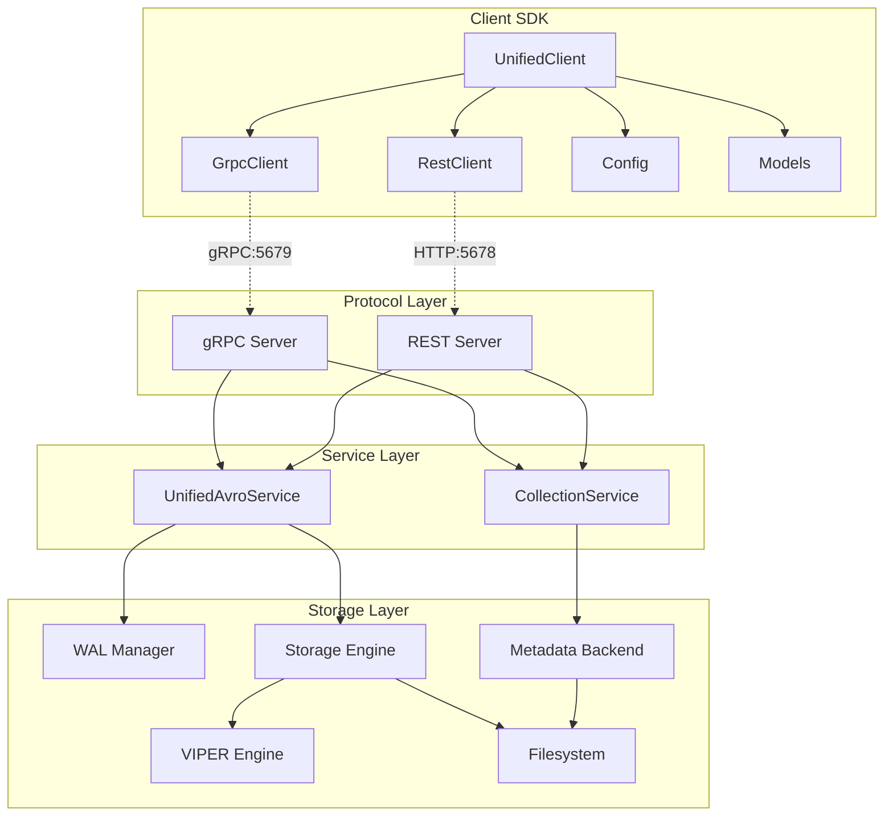
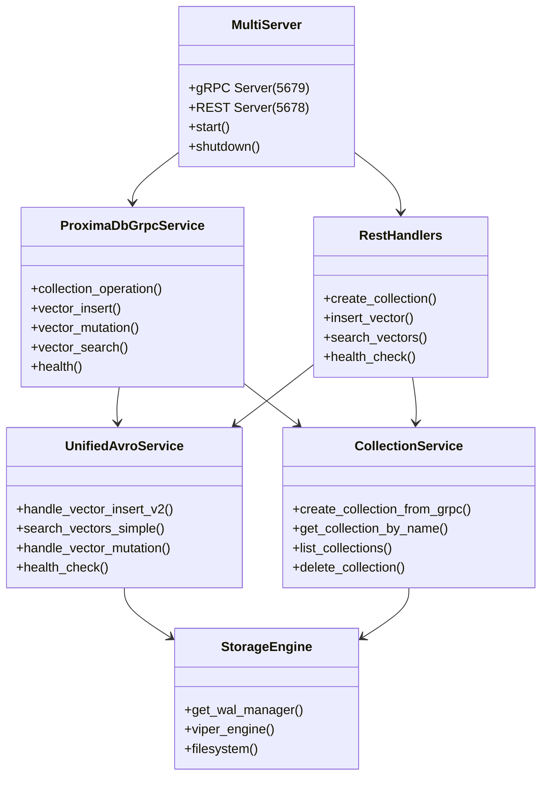

# ProximaDB Comprehensive Architecture Analysis

## Executive Summary

This analysis reveals a sophisticated vector database architecture with a clear separation between client SDK, protocol layers, and server implementation. The system uses a dual-server approach (gRPC + REST) with a unified service layer underneath.

## 1. SERVER ARCHITECTURE ANALYSIS

### 1.1 Core Architecture Layers

```
┌─────────────────────────────────────────────────────────────┐
│                    PROTOCOL LAYER                           │
├─────────────────────────────────────────────────────────────┤
│  gRPC Server (5679)         │  REST Server (5678)          │
│  - CollectionOperation      │  - /collections/*             │
│  - VectorInsert             │  - /vectors/*                 │
│  - VectorMutation           │  - /search                    │
│  - VectorSearch             │  - /health                    │
│  - Health/Metrics           │                               │
├─────────────────────────────────────────────────────────────┤
│                    SERVICE LAYER                            │
├─────────────────────────────────────────────────────────────┤
│  UnifiedAvroService         │  CollectionService            │
│  - Zero-copy operations     │  - Metadata management        │
│  - WAL integration          │  - CRUD operations            │
│  - Avro serialization       │  - Validation                 │
├─────────────────────────────────────────────────────────────┤
│                    STORAGE LAYER                            │
├─────────────────────────────────────────────────────────────┤
│  VIPER Engine    │  WAL Manager    │  Metadata Store      │
│  - Parquet       │  - Avro/Bincode │  - FilestoreBackend  │
│  - Compression   │  - Memtables    │  - Atomic ops        │
│  - Vector ops    │  - Durability   │  - Collection records│
├─────────────────────────────────────────────────────────────┤
│                  FILESYSTEM LAYER                           │
├─────────────────────────────────────────────────────────────┤
│  Multi-cloud Storage (file://, s3://, gcs://, adls://)      │
└─────────────────────────────────────────────────────────────┘
```

### 1.2 Server Implementation Status

#### ✅ FULLY IMPLEMENTED:
1. **Collection Operations** (`CollectionService`)
   - `create_collection_from_grpc()` - Complete with validation
   - `get_collection_by_name()` - Complete
   - `list_collections()` - Complete
   - `delete_collection()` - Complete
   - `update_collection_stats()` - Complete

2. **Vector Insert Operations** (`UnifiedAvroService`)
   - `handle_vector_insert_v2()` - Zero-copy Avro implementation
   - `vector_insert_zero_copy()` - Core insert logic
   - WAL integration for durability

3. **Search Operations** (`UnifiedAvroService`)
   - `search_vectors()` - Avro-based search
   - `search_vectors_simple()` - JSON-based search  
   - `search_by_metadata_server_side()` - Metadata filtering

4. **Health & Monitoring**
   - `health_check()` - Basic health status
   - `get_metrics()` - Performance metrics

#### 🚧 PARTIALLY IMPLEMENTED:
1. **Vector Mutations** (`UnifiedAvroService`)
   - `handle_vector_mutation()` - Stub implementation exists
   - `delete_vector()` - Basic implementation, needs enhancement

2. **Vector Retrieval** (`UnifiedAvroService`)
   - `get_vector()` - Stub implementation exists

#### ❌ NOT IMPLEMENTED:
1. **Transaction Management**
   - No transaction endpoints in server
   - No transactional WAL operations

2. **Advanced Search Features**
   - No multi-search implementation
   - No aggregation support
   - No vector history tracking

3. **Batch Operations**
   - No atomic batch inserts
   - Limited batch processing

## 2. CLIENT-SERVER MAPPING ANALYSIS

### 2.1 Protocol Endpoint Mapping

#### gRPC Protocol (Proto Definition):
```protobuf
service ProximaDB {
  rpc CollectionOperation(CollectionRequest) returns (CollectionResponse);
  rpc VectorInsert(VectorInsertRequest) returns (VectorOperationResponse);
  rpc VectorMutation(VectorMutationRequest) returns (VectorOperationResponse);
  rpc VectorSearch(VectorSearchRequest) returns (VectorOperationResponse);
  rpc Health(HealthRequest) returns (HealthResponse);
  rpc GetMetrics(MetricsRequest) returns (MetricsResponse);
}
```

#### REST Endpoint Mapping:
```
Collection Management:
POST   /collections              → create_collection()
GET    /collections              → list_collections()
GET    /collections/:id          → get_collection()
DELETE /collections/:id          → delete_collection()

Vector Operations:
POST   /collections/:id/vectors           → insert_vector()
GET    /collections/:id/vectors/:vec_id   → get_vector() [NOT IMPLEMENTED]
PUT    /collections/:id/vectors/:vec_id   → update_vector() [STUB]
DELETE /collections/:id/vectors/:vec_id   → delete_vector() [STUB]
POST   /collections/:id/search            → search_vectors()
POST   /collections/:id/vectors/batch     → batch_insert_vectors()

Health:
GET    /health                   → health_check()
```

### 2.2 Client Method → Server Implementation Matrix

| Client Method | REST Endpoint | gRPC Method | Server Implementation | Status |
|---------------|---------------|-------------|----------------------|--------|
| `create_collection()` | `POST /collections` | `CollectionOperation(CREATE)` | `CollectionService::create_collection_from_grpc()` | ✅ Complete |
| `get_collection()` | `GET /collections/:id` | `CollectionOperation(GET)` | `CollectionService::get_collection_by_name()` | ✅ Complete |
| `list_collections()` | `GET /collections` | `CollectionOperation(LIST)` | `CollectionService::list_collections()` | ✅ Complete |
| `delete_collection()` | `DELETE /collections/:id` | `CollectionOperation(DELETE)` | `CollectionService::delete_collection()` | ✅ Complete |
| `insert_vector()` | `POST /collections/:id/vectors` | `VectorInsert` | `UnifiedAvroService::handle_vector_insert_v2()` | ✅ Complete |
| `insert_vectors()` | `POST /collections/:id/vectors/batch` | `VectorInsert` | `UnifiedAvroService::handle_vector_insert_v2()` | ✅ Complete |
| `search()` | `POST /collections/:id/search` | `VectorSearch` | `UnifiedAvroService::search_vectors_simple()` | ✅ Complete |
| `get_vector()` | `GET /collections/:id/vectors/:vec_id` | N/A | `UnifiedAvroService::get_vector()` | 🚧 Stub Only |
| `delete_vector()` | `DELETE /collections/:id/vectors/:vec_id` | `VectorMutation(DELETE)` | `UnifiedAvroService::delete_vector()` | 🚧 Basic |
| `delete_vectors()` | N/A | `VectorMutation(DELETE)` | `UnifiedAvroService::handle_vector_mutation()` | 🚧 Stub Only |
| `update_collection()` | N/A | `CollectionOperation(UPDATE)` | Server logic exists | ✅ Complete |
| `delete_vectors_by_filter()` | N/A | N/A | Not implemented | ❌ Missing |
| `get_vector_history()` | N/A | N/A | Not implemented | ❌ Missing |
| `multi_search()` | N/A | N/A | Not implemented | ❌ Missing |
| `search_with_aggregations()` | N/A | N/A | Not implemented | ❌ Missing |
| `atomic_insert_vectors()` | N/A | N/A | Not implemented | ❌ Missing |
| `begin_transaction()` | N/A | N/A | Not implemented | ❌ Missing |
| `commit_transaction()` | N/A | N/A | Not implemented | ❌ Missing |
| `rollback_transaction()` | N/A | N/A | Not implemented | ❌ Missing |

## 3. PROTOCOL ANALYSIS

### 3.1 gRPC Implementation Status

The gRPC service (`ProximaDbGrpcService`) provides:

#### ✅ Implemented Endpoints:
- **CollectionOperation**: Full CRUD with unified endpoint
  - CREATE, GET, LIST, DELETE, UPDATE operations
  - Proper protobuf serialization/deserialization
  - Error handling and metrics

- **VectorInsert**: Zero-copy Avro implementation
  - Uses `vectors_avro_payload` for performance
  - Supports upsert mode
  - WAL integration for durability

- **VectorSearch**: Flexible search with adaptive payload
  - Small results: protobuf compact format
  - Large results: Avro binary for zero-copy
  - Metadata filtering support

- **Health/Metrics**: Basic monitoring

#### 🚧 Partial Implementation:
- **VectorMutation**: UPDATE/DELETE via regular gRPC
  - Delete operations work but limited
  - Update operations are stubbed

### 3.2 REST Implementation Status

The REST API (`handlers.rs`) provides:

#### ✅ Implemented Endpoints:
- **Collection CRUD**: Complete implementation
- **Vector Insert**: Single and batch operations
- **Vector Search**: JSON-based search
- **Health Check**: Basic status

#### 🚧 Partial Implementation:
- **Vector CRUD**: Get/Update/Delete endpoints exist but return NOT_IMPLEMENTED

### 3.3 Protocol Performance Characteristics

#### gRPC Advantages (Port 5679):
- **Zero-copy operations**: Avro binary for large vector payloads
- **40% smaller payloads**: Binary protobuf vs JSON
- **HTTP/2 multiplexing**: Better performance
- **Schema evolution**: Strong typing with protobuf

#### REST Advantages (Port 5678):
- **Universal compatibility**: Works with any HTTP client
- **Easy debugging**: Human-readable JSON
- **Web integration**: Direct browser/curl access

## 4. MISSING IMPLEMENTATIONS ANALYSIS

### 4.1 Critical Missing Methods (7 identified)

#### ❌ **Transaction Management** (3 methods)
- `begin_transaction()`, `commit_transaction()`, `rollback_transaction()`
- **Server Gap**: No transaction infrastructure exists
- **Implementation Path**: 
  1. Add transaction manager to `UnifiedAvroService`
  2. Add transaction context to WAL operations
  3. Implement 2PC protocol for distributed operations

#### ❌ **Advanced Vector Operations** (2 methods)
- `delete_vectors_by_filter()`, `get_vector_history()`
- **Server Gap**: No metadata-based deletion or versioning
- **Implementation Path**:
  1. Enhance `UnifiedAvroService::handle_vector_mutation()`
  2. Add metadata query engine
  3. Add version tracking to VIPER storage

#### ❌ **Advanced Search** (2 methods)
- `multi_search()`, `search_with_aggregations()`
- **Server Gap**: Only single-query search implemented
- **Implementation Path**:
  1. Extend `VectorSearchRequest` protobuf
  2. Add batch search to `UnifiedAvroService::search_vectors()`
  3. Add aggregation engine

### 4.2 Required Server Enhancements

#### For Vector Operations:
```rust
// In UnifiedAvroService
pub async fn delete_vectors_by_filter(
    &self,
    collection_id: &str,
    metadata_filter: HashMap<String, serde_json::Value>
) -> Result<Vec<u8>>

pub async fn get_vector_with_history(
    &self,
    collection_id: &str,
    vector_id: &str,
    include_history: bool
) -> Result<Vec<u8>>

pub async fn multi_search(
    &self,
    collection_id: &str,
    queries: Vec<Vec<f32>>,
    k: usize
) -> Result<Vec<u8>>
```

#### For Transaction Management:
```rust
// New TransactionManager
pub struct TransactionManager {
    active_transactions: Arc<RwLock<HashMap<String, Transaction>>>,
    wal_manager: Arc<WalManager>,
}

impl TransactionManager {
    pub async fn begin_transaction(&self) -> Result<String>
    pub async fn commit_transaction(&self, tx_id: &str) -> Result<()>
    pub async fn rollback_transaction(&self, tx_id: &str) -> Result<()>
}
```

## 5. UML ARCHITECTURE DIAGRAMS

### 5.1 Client-Server Architecture



### 5.2 Server Internal Architecture



### 5.3 Implementation Status Matrix

```mermaid
gantt
    title ProximaDB Implementation Status
    dateFormat X
    axisFormat %s
    
    section Collection Ops
    create_collection    :done, create, 0, 1
    get_collection       :done, get, 0, 1
    list_collections     :done, list, 0, 1
    delete_collection    :done, delete, 0, 1
    update_collection    :done, update, 0, 1
    
    section Vector Ops
    insert_vector        :done, insert, 0, 1
    insert_vectors       :done, batch_ins, 0, 1
    search              :done, search, 0, 1
    get_vector          :crit, get_vec, 0, 0.3
    delete_vector       :crit, del_vec, 0, 0.3
    delete_vectors      :crit, del_vecs, 0, 0.1
    
    section Advanced
    multi_search        :crit, multi, 0, 0
    aggregations        :crit, agg, 0, 0
    vector_history      :crit, history, 0, 0
    transactions        :crit, trans, 0, 0
```



## 6. THIN WRAPPER IMPLEMENTATION STRATEGY

### 6.1 Pattern Analysis

The current implementation shows two distinct patterns:

#### ✅ **Correct Thin Wrapper Pattern** (Collections):
```python
# Client
def create_collection(self, name, config):
    return self._client.create_collection(name, config)

# REST Client  
def create_collection(self, name, config):
    response = self._http_client.post("/collections", json={...})
    return Collection.from_dict(response.json())

# Server
async fn create_collection(Json(request): Json<CreateCollectionRequest>) {
    match state.collection_service.create_collection_from_grpc(&config).await {
        Ok(_) => Ok(JsonResponse(ApiResponse::success(...))),
        Err(e) => Err(StatusCode::INTERNAL_SERVER_ERROR)
    }
}
```

#### ❌ **Over-Complex Client Pattern** (Some vector ops):
```python
# Client has too much logic, should be thin wrapper
def complex_search_with_client_logic(self, ...):
    # Validation, transformation, retry logic, etc.
    # Should be in server!
```

### 6.2 Recommended Implementation Path

#### For Missing Methods:

1. **Add server-side implementation first**:
   ```rust
   // In UnifiedAvroService
   pub async fn delete_vectors_by_filter(&self, ...) -> Result<Vec<u8>>
   ```

2. **Add protocol endpoint**:
   ```rust
   // REST: DELETE /collections/:id/vectors?filter={json}
   // gRPC: VectorMutation with selector
   ```

3. **Implement thin client wrapper**:
   ```python
   def delete_vectors_by_filter(self, collection_id, filter):
       return self._client.delete_vectors_by_filter(collection_id, filter)
   ```

## 7. RECOMMENDATIONS

### 7.1 Immediate Actions (High Priority)

1. **Complete Vector CRUD Operations**:
   - Implement `get_vector()` fully in `UnifiedAvroService`
   - Enhance `delete_vector()` with proper error handling
   - Add `delete_vectors_by_filter()` server-side

2. **Fix Client-Server Gaps**:
   - Remove NOT_IMPLEMENTED stubs in REST handlers
   - Implement missing gRPC → service mappings
   - Add proper error handling and response formatting

### 7.2 Medium-Term Enhancements

1. **Transaction Support**:
   - Design transaction manager architecture
   - Add transactional WAL operations
   - Implement 2PC for distributed operations

2. **Advanced Search Features**:
   - Multi-query search implementation
   - Result aggregation engine
   - Advanced filtering capabilities

### 7.3 Long-Term Architecture

1. **Performance Optimization**:
   - Implement connection pooling
   - Add caching layers
   - Optimize Avro serialization paths

2. **Monitoring & Observability**:
   - Enhanced metrics collection
   - Distributed tracing
   - Performance profiling

## 8. CONCLUSION

ProximaDB demonstrates a well-architected vector database with clear separation of concerns. The core collection and basic vector operations are fully implemented with proper thin wrapper patterns. However, 7 advanced methods require server-side implementation before client wrappers can be completed.

The dual-protocol approach (gRPC + REST) provides excellent flexibility, with gRPC offering high-performance zero-copy operations and REST providing universal compatibility. The unified service layer ensures consistent behavior across protocols.

**Key Success Factors**:
- ✅ Strong architectural foundation
- ✅ Proper separation of concerns  
- ✅ Zero-copy performance optimization
- ✅ Multi-cloud storage abstraction

**Key Gaps to Address**:
- ❌ Missing transaction management
- ❌ Incomplete vector CRUD operations
- ❌ Limited advanced search features
- ❌ Some protocol-service mapping gaps

The foundation is solid - implementing the missing server-side functionality will enable complete thin client wrappers for all operations.