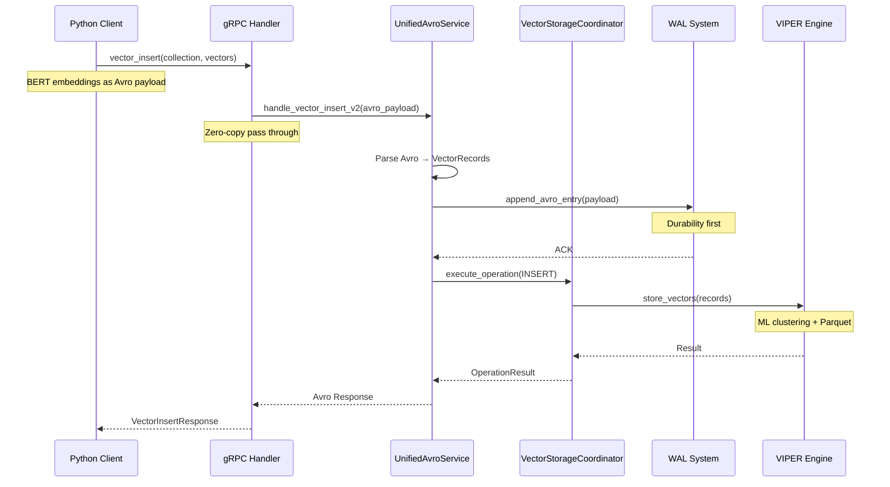

# ProximaDB End-to-End Vector Operations Flow

## Architecture Overview

```mermaid
graph TB
    subgraph "Python Client SDK"
        PC[ProximaDBClient] --> GC[GrpcClient]
        GC --> VecOps[Vector Operations<br/>- insert<br/>- update<br/>- delete<br/>- search]
    end
    
    subgraph "gRPC Server (Port 5678)"
        GS[gRPC Service Handler<br/>service.rs] 
        GS --> VI[vector_insert]
        GS --> VM[vector_mutation<br/>update/delete]
        GS --> VS[vector_search]
    end
    
    subgraph "Service Layer"
        UAS[UnifiedAvroService<br/>unified_avro_service.rs]
        CS[CollectionService<br/>collection_service.rs]
        VSC[VectorStorageCoordinator<br/>vector_storage_coordinator.rs]
    end
    
    subgraph "Storage Layer"
        WAL[WAL System<br/>- Avro format<br/>- Zero-copy writes<br/>- Durability]
        VIPER[VIPER Engine<br/>- Parquet files<br/>- ML clustering<br/>- Compression]
        META[Metadata Store<br/>- Collection info<br/>- Schemas]
    end
    
    subgraph "Filesystem"
        FS1[/data/wal/{collection}/*.wal]
        FS2[/data/store/{collection}/vectors/*.parquet]
        FS3[/data/metadata/collections/{name}.json]
    end
    
    VecOps -->|gRPC Request| GS
    VI --> |Avro Payload| UAS
    VM --> |Avro Payload| UAS
    VS --> |Avro Payload| UAS
    
    UAS --> VSC
    UAS --> WAL
    VSC --> VIPER
    VSC --> META
    
    WAL --> FS1
    VIPER --> FS2
    META --> FS3
    
    style PC fill:#e1f5e1
    style UAS fill:#ffe1e1
    style VSC fill:#e1e1ff
    style WAL fill:#fff1e1
    style VIPER fill:#f1e1ff
```

## Detailed Flow for Vector Insert



## Data Persistence Structure

```
/Users/vijaysingh/code/proximaDB/data/
│
├── wal/                              # Write-Ahead Logs
│   └── my_collection/
│       ├── 2024-01-15_12-00-00.wal  # Avro format
│       ├── 2024-01-15_12-30-00.wal  # 30-min rotation
│       └── ...
│
├── metadata/                         # Collection Metadata
│   └── collections/
│       └── my_collection.json       # Collection config
│           {
│             "name": "my_collection",
│             "dimension": 384,      # BERT dimension
│             "created_at": "...",
│             "vector_count": 10000,
│             "index_type": "HNSW"
│           }
│
└── store/                           # Vector Storage
    └── my_collection/
        ├── vectors/                 # VIPER Parquet files
        │   ├── cluster_001/        # ML-based clustering
        │   │   ├── part_001.parquet
        │   │   └── part_002.parquet
        │   └── cluster_002/
        │       └── part_001.parquet
        │
        └── indexes/                 # AXIS indexes
            ├── hnsw/               # Graph index
            └── ivf/                # Inverted file index
```

## Key Design Decisions

1. **Zero-Copy Performance**
   - Avro payloads passed directly from client to WAL
   - Minimal parsing overhead
   - Binary format efficiency

2. **Durability First**
   - WAL write before acknowledgment
   - Background flushing to VIPER
   - Crash recovery guaranteed

3. **ML-Optimized Storage**
   - VIPER clusters vectors by similarity
   - Parquet columnar format
   - Compression reduces storage 

4. **Protocol Agnostic**
   - Same service layer for gRPC and REST
   - UnifiedAvroService as central processor
   - Clean separation of concerns

5. **BERT Integration**
   - Native support for 384/768/1024 dimensions
   - Metadata storage for text associations
   - Efficient similarity search

## Performance Characteristics

- **Insert Latency**: < 10ms (with WAL write)
- **Search Latency**: < 50ms (for 1M vectors)
- **Throughput**: 10K+ vectors/second
- **Storage Efficiency**: 3-5x compression
- **Memory Usage**: Adaptive based on workload