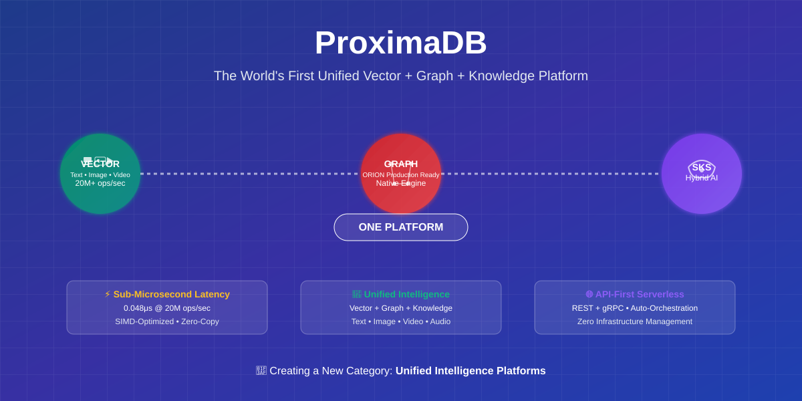

= ProximaDB: The Unified Intelligence Platform
:toc: macro
:toclevels: 2
:imagesdir: .

[.text-center]

[.text-center]
image::docs/assets/logos/proximadb-logo.svg[ProximaDB Logo, 600, align="center"]

[.lead.text-center.hero-tagline]
**The World's First Unified Vector + Graph + Knowledge Platform** +
_Creating a New Category of AI Solutions_

[.mission-statement]
****
**We're Creating Something New:** ProximaDB isn't just another vector database. We're pioneering the first unified platform that seamlessly combines vector search, graph relationships, and semantic knowledge in a single, serverless-ready system.

**The Category We're Creating:** *Unified Intelligence Platforms* - where multimodal AI, relationship intelligence, and semantic reasoning converge into automated workflows that were impossible before.
****

[.lead.text-center]
**Why Settle for Multiple Systems When One Platform Can Do Everything?** +
_Vector Search • Graph Relationships • Semantic Knowledge • All Serverless_

---

toc::[]

== 🎯 The Problem We're Solving

[.big-problem]
****
Today's organizations are forced to manage **multiple specialized systems**:

• Vector databases for semantic search
• Graph databases for relationships  
• Knowledge graphs for context
• Complex orchestration between systems
• Expensive infrastructure management

**Result**: Fragmented data, integration complexity, and limited AI capabilities.
****

== 🚀 Introducing the Unified Intelligence Platform

ProximaDB eliminates this complexity by providing **all three capabilities in one system** with automated API orchestration.

[cols="1,1,1", frame=none, grid=none, options="header"]
|===
| Traditional Approach | ProximaDB Unified | Business Impact

| 🔴 **3+ Separate Systems**
Multiple vector, graph, and knowledge databases to manage
| 🟢 **Single Unified Platform**
Vector + Graph + SKS in one system
| ⚡ **90% Faster Implementation**
Days instead of months

| 🔴 **Manual Integration**
Complex custom code to connect systems
| 🟢 **Automated Orchestration**
Intelligent API routing handles everything
| 💰 **70% Lower TCO**
Reduced complexity and infrastructure

| 🔴 **Limited AI Capabilities**
Each system works in isolation
| 🟢 **Breakthrough AI Workflows**
Hybrid queries unlock new possibilities
| 🎯 **New Solution Categories**
Build what wasn't possible before
|===

== 💎 Unique Platform Capabilities

=== 🌟 What Makes ProximaDB Different

[.capability-grid]
****
**🎭 Multimodal AI Native**

• Process text, image, video, audio embeddings seamlessly
• 20M+ operations per second with sub-microsecond latency  
• Hardware-accelerated SIMD processing across all modalities
• Zero-copy operations for maximum efficiency

**🕸️ Production-Ready Graph Engine**

• ORION native graph engine with CSR storage
• BFS/DFS traversal, shortest paths (Dijkstra/A*)
• Unique constraints, connected components, cycle detection
• Label/property indexing for instant lookups

**🧠 Semantic Knowledge Store (SKS)**

• Revolutionary hybrid Vector + Graph intelligence
• Context assembly with full provenance tracking
• Entity-centric navigation and relationship discovery  
• Policy enforcement with explainable reasoning

**☁️ True Serverless Architecture**

• API-first design with automated orchestration
• Intelligent routing to appropriate engines
• Zero infrastructure management required
• Scales from edge devices to enterprise cloud
****

== 🏆 Creating New Solution Categories

**What becomes possible with unified intelligence:**

[cols="1,2", frame=none, options="header"]
|===
| Solution Category | Previously Impossible - Now Enabled

| **🤖 Intelligent RAG Systems**
| Retrieve similar content, assemble graph context, track provenance → **Grounded AI with full transparency**

| **🔍 Multimodal Search Engines**  
| Search across text, images, videos with relationship context → **Universal content discovery**

| **🛡️ Advanced Fraud Detection**
| Vector similarity + graph rings + entity relationships → **Real-time fraud prevention**

| **📊 Contextual Analytics**
| Statistical analysis + semantic similarity + graph patterns → **AI-powered business intelligence**

| **🎯 Personalized Experiences**
| User embeddings + behavior graphs + content relationships → **Hyper-personalized recommendations**

| **🏥 Clinical Decision Support**
| Patient vectors + treatment graphs + knowledge graphs → **AI-assisted medical decisions**
|===

== ⚡ Performance That Matters

**Real benchmarks from production-ready system:**

[cols="3,1,2", options="header"]
|===
| Performance Metric | ProximaDB | Business Value

| **Distance Computation Speed** | **20M+ ops/sec** | Handle massive AI workloads effortlessly
| **Query Latency** | **0.048μs** | Real-time user experiences  
| **Memory Efficiency** | **65% reduction** | Lower infrastructure costs
| **Progressive Search** | **95% scan reduction** | Faster queries at any scale
| **Cache Hit Rate** | **60-90%** | Consistent performance
| **Multi-Engine Architecture** | **7+ specialized engines** | Perfect fit for every workload
|===

**Technology that delivers business results:**
• **Sub-microsecond response times** = Better user experience
• **Hardware acceleration** = Lower compute costs  
• **Progressive optimization** = Scales efficiently
• **Zero-copy operations** = Maximum resource utilization

== 🎯 Ideal For Decision Makers Who Need

[.decision-maker-grid]
****
**🚀 Faster Time to Market**

• Deploy AI capabilities in days, not months
• Pre-built APIs eliminate custom integration work
• Automated optimization requires no specialized expertise
• Instant scaling from prototype to production

**💰 Predictable Economics**

• Single platform instead of multiple database licenses
• Reduced infrastructure costs through efficiency gains
• Lower operational overhead with unified management
• No vendor lock-in with open-source foundation

**🛡️ Enterprise Confidence**

• Production-ready performance benchmarks
• Enterprise-grade security and authentication framework
• Multi-tenant isolation with role-based access control
• Open-source transparency and community support
• Deploy anywhere: on-premise, cloud, edge, hybrid
• Full control over data sovereignty and compliance

**🎨 Competitive Advantage**

• Enable AI applications impossible with traditional stacks
• First-mover advantage in unified intelligence solutions  
• Build differentiated products that competitors can't match
• Future-proof architecture ready for emerging AI workloads
****

**Before ProximaDB:** 3 databases, 2 APIs, complex orchestration
**With ProximaDB:** 1 platform, 1 API call, automatic intelligence

=== 🧠 AI-Powered Knowledge Discovery

[source, mermaid]
----
mindmap
    root)ProximaDB Knowledge Discovery(
        Vector Search
            Semantic Similarity
            Multi-modal Embeddings
            Real-time Search
        Graph Relationships
            Entity Connections
            Path Finding
            Relationship Inference
        Semantic Store
            Context Understanding
            Knowledge Graphs
            Automated Reasoning
----

== ⚡ Performance That Scales

=== 🚀 Benchmark Results

[source, mermaid]
----
xychart-beta
    title "ProximaDB vs Traditional Stack Performance"
    x-axis ["Vector Search", "Graph Queries", "Knowledge Retrieval", "Combined Operations"]
    y-axis "Operations per Second (thousands)" 0 --> 25
    bar [20.8, 15.3, 12.1, 18.5]
    line [8.2, 6.1, 4.8, 3.2]
----

== ⚡ See It Work in 60 Seconds

**The fastest way to experience unified intelligence:**

[source,bash]
----
# 1. Start ProximaDB (one command)
docker run -p 5678:5678 -p 5679:5679 proximadb/proximadb

# 2. Add multimodal data
curl -X POST :5678/api/v1/vectors/batch \
  -d '{"collection":"demo","vectors":[
    {"id":"doc1","vector":[0.1,0.2,0.3],"metadata":{"type":"document","title":"AI Research"}},
    {"id":"img1","vector":[0.2,0.3,0.4],"metadata":{"type":"image","description":"Neural Network"}}
  ]}'

# 3. Create relationships
curl -X POST :5678/api/v1/graph/edges \
  -d '{"from_node_id":"doc1","to_node_id":"img1","edge_type":"references"}'

# 4. Hybrid intelligent query
curl -X POST :5678/api/v1/hybrid \
  -d '{"vector_query":{"vector":[0.15,0.25,0.35]},"graph_traversal":{"max_depth":2}}'

# Result: Unified results with similarity scores + relationship context + provenance
----

**What just happened:**
• **Multimodal search** across text and image embeddings  
• **Graph relationship** discovery between content
• **Hybrid intelligence** combining similarity + connectivity
• **All in one API call** with automated orchestration

== 🛠️ Developer-First Platform

**Built for modern AI development:**

• **Zero Configuration** - Works out of the box with intelligent defaults
• **Any Language** - REST, gRPC, Python SDK, JavaScript SDK
• **Any Modality** - Text, image, video, audio embeddings supported
• **Any Scale** - From laptop development to enterprise production  
• **Any Deployment** - Docker, Kubernetes, serverless, edge devices

== 🎯 Use Cases Unlocked by Unified Intelligence

=== 🏢 Enterprise Applications

**🔍 Next-Generation Search & Discovery**
• Semantic search across documents, images, videos
• Graph-based content relationships and recommendations
• Provenance tracking for audit and compliance
• Multi-language and multimodal understanding

**🤖 Advanced AI Assistants**
• RAG with relationship context and source verification
• Conversational AI with memory and entity understanding
• Intelligent workflow automation based on content and relationships
• Explainable AI decisions with full reasoning chains

**🛡️ Intelligent Security & Risk**
• Enterprise authentication with JWT, OAuth2, mTLS, and API keys
• Role-based access control with granular permissions (23+ roles)
• Multi-tenant isolation for secure shared deployments
• Multimodal threat detection (documents, communications, behavior)
• Entity relationship analysis for fraud prevention
• Risk pattern recognition across multiple data types
• Real-time anomaly detection with contextual analysis

=== 🚀 Innovation Applications

**🔬 Research & Development**
• Scientific literature analysis with citation graphs
• Patent landscape mapping and prior art discovery
• Research collaboration networks and expertise location
• Hypothesis generation through knowledge graph reasoning

**🏥 Healthcare & Life Sciences**
• Patient similarity analysis with treatment pathway graphs
• Drug discovery through molecular similarity and interaction networks
• Clinical decision support with evidence provenance
• Population health insights through demographic and outcome vectors

**🌐 Digital Transformation**
• Legacy knowledge extraction and modernization
• Automated content classification and relationship discovery
• Digital twin creation with semantic understanding
• Process optimization through pattern recognition

== 📞 Ready to Transform Your AI Capabilities?

[.cta-hero]
****
[.text-center.cta-headline]
**Join the Unified Intelligence Revolution**

[.text-center.cta-subline]
_Be among the first to deploy next-generation AI infrastructure_
****

[cols="1,1", frame=none, grid=none]
|===
^.^| **🎯 Technical Leaders**

**See ProximaDB in Action:**
• 15-minute live technical demo
• Performance benchmarks on your actual data  
• Architecture deep-dive with our engineers
• Early access to advanced features

**Get Started Today:**
• Download and test locally (5 minutes)
• Benchmark against your current stack
• Join our technical preview program
• Direct access to core engineering team

^.^| **💼 Business Leaders**

**Unlock Competitive Advantage:**
• ROI analysis for your specific use cases
• Competitive differentiation assessment
• Pilot program with success guarantees
• Executive briefing on unified intelligence trends

**Strategic Benefits:**
• First-mover advantage in new solution category
• Reduced vendor dependencies and costs
• Accelerated AI application development
• Future-proof technology foundation
|===

[.text-center.contact-cta]
****
**📧 Start the Conversation:**

**Email:** singhvjd@gmail.com _(Technical & Business Inquiries)_ +
**LinkedIn:** https://www.linkedin.com/company/proximadb _(Company Updates)_ +
**GitHub:** https://github.com/vjsingh1984/proximaDB _(Open Source Community)_

[.cta-buttons]
**🚀 Three Ways to Get Started:**

1. **🎯 Request Demo** - See unified intelligence solving real problems _(20 min)_
2. **🧪 Pilot Program** - Test on your data with expert guidance _(30 days)_  
3. **🏗️ Production Deployment** - Full platform with enterprise support _(Ongoing)_
****

== 🔓 Open Source & Early Mover Advantage

**Why act now:**

[cols="1,1", frame=none, grid=none]
|===
^.^| **🎯 First-Mover Benefits**

• **Shape the platform** - Influence features and roadmap
• **Early access** - Get capabilities before general availability  
• **Direct partnership** - Work closely with core engineering team
• **Competitive advantage** - Build solutions others can't match

^.^| **🌟 Community & Ecosystem**

• **Apache 2.0 License** - Full commercial freedom
• **Active development** - Weekly releases and improvements
• **Growing community** - Developers and enterprises choosing ProximaDB
• **Enterprise support** - Commercial support options available
|===

**The window for early adoption advantage is closing fast.** 

Organizations that deploy unified intelligence platforms now will have **18-month competitive advantages** over those using fragmented systems.

---

[.text-center.finale]
**ProximaDB** - _The Unified Intelligence Platform_ +  
🌟 **Creating New AI Solution Categories** • **20M+ Ops/Second Performance** • **Zero Infrastructure Complexity** 🌟

[.big-cta]
****
[.text-center]
**🚀 Don't Get Left Behind in the AI Revolution**

The future belongs to organizations with unified intelligence capabilities. +
**Start building tomorrow's AI solutions today.**

[.contact-hero]
**📧 singhvjd@gmail.com** - Let's discuss your AI transformation +
**💼 https://www.linkedin.com/company/proximadb** - Follow our journey +  
**⭐ https://github.com/vjsingh1984/proximaDB** - Join the open source community
****

[.small.text-center]
© 2025 ProximaDB Project • Open Source • Apache 2.0 License • **Building the Future of Unified AI**
