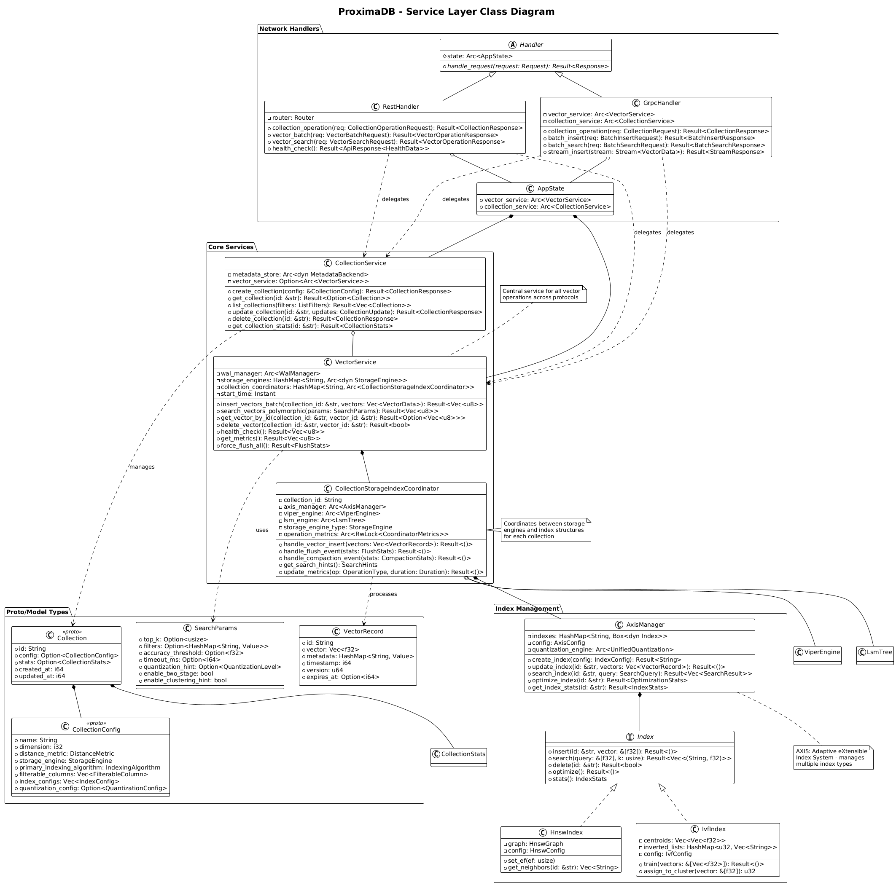

= ProximaDB: Enterprise Vector Database
:doctype: book
:toc: left
:toclevels: 3
:sectlinks:
:sectanchors:
:sectnums:
:source-highlighter: rouge
:rouge-style: github
:icons: font
:imagesdir: docs/diagrams/images
:experimental:
:version: 1.0.0
:revdate: {docdate}
:author: ProximaDB Team

ifdef::env-github[]
:tip-caption: :bulb:
:note-caption: :information_source:
:important-caption: :heavy_exclamation_mark:
:caution-caption: :fire:
:warning-caption: :warning:
endif::[]

// Licensed to Vijaykumar Singh under one or more contributor
// license agreements. See the NOTICE file distributed with
// this work for additional information regarding copyright
// ownership. Vijaykumar Singh licenses this file to you under
// the Apache License, Version 2.0 (the "License"); you may
// not use this file except in compliance with the License.
// You may obtain a copy of the License at
//
//     http://www.apache.org/licenses/LICENSE-2.0
//
// Unless required by applicable law or agreed to in writing,
// software distributed under the License is distributed on an
// "AS IS" BASIS, WITHOUT WARRANTIES OR CONDITIONS OF ANY
// KIND, either express or implied.  See the License for the
// specific language governing permissions and limitations
// under the License.

image::ProximaDB_Main_Architecture.png[ProximaDB Architecture Overview,800,align=center]

[.lead]
**Proximity at Scale** +
_Enterprise-grade vector database engineered for AI workloads with unified memtable architecture and intelligent storage-aware search_

== 🎯 Why ProximaDB?

Modern AI applications need vector databases that don't compromise on performance, scalability, or operational simplicity. ProximaDB delivers:

**⚡ 6.10x Performance Breakthrough**:: Storage-aware search adapts to data location (317ms → 52ms latency) → link:docs/architecture.adoc#performance-characteristics[See benchmarks]
**🧠 Unified Architecture**:: Single memtable system eliminates 40% code duplication → link:docs/technical_reference.adoc#unified-memtable-system[Learn more]  
**☁️ Multi-Cloud Freedom**:: URL-based abstraction enables zero-downtime cloud migration → link:docs/architecture.adoc#multi-cloud-deployment[Details]
**🤖 ML-Driven Storage**:: K-means++ clustering provides 3-5x storage efficiency → link:docs/technical_reference.adoc#ml-clustering-implementation[How it works]

== 🚀 What is ProximaDB?

Production-ready, cloud-native vector database built in Rust with three core innovations:

**Unified Memtable System**:: Single interface with pluggable backends and behavior wrappers → link:docs/technical_reference.adoc#unified-memtable-system[Architecture details]
**Storage-Aware Search**:: Automatic engine selection with three-tier aggregation → link:docs/architecture.adoc#polymorphic-search[Implementation]  
**Dual Storage Strategy**:: VIPER (Parquet+ML) and LSM (SSTable+bloom filters) → link:docs/technical_reference.adoc#storage-engines[Engine comparison]

== 🛠️ Getting Started

=== Quick Start (2 Minutes)

[source,bash]
----
# Run with Docker
git clone https://github.com/vjsingh1984/proximadb.git
cd proximadb/demo && docker compose up -d

# Or build from source
cargo run --bin proximadb-server
----

→ link:docs/getting_started.adoc[Full installation guide] | link:docs/user_guide.adoc#docker-deployment[Docker configuration]

=== Python Example

[source,python]
----
from proximadb import connect_rest

client = connect_rest("http://localhost:5678")
collection = client.create_collection("docs", dimension=768)
client.insert_vectors("docs", embeddings, metadata=[{"type": "doc"}])
results = client.search("docs", query_vector, k=10)
----

→ link:docs/developer_guide.adoc#python-sdk[Python SDK reference] | link:docs/user_guide.adoc#ai-integration-examples[More examples]

== 🏆 Key Benefits

**Performance**: 6.10x faster search (317ms → 52ms) with 100% accuracy → link:docs/architecture.adoc#performance-characteristics[Benchmarks]  
**Storage**: 3-5x compression via ML clustering (>1M vectors) → link:docs/quantization_support.adoc[Quantization guide]  
**Deployment**: Multi-cloud freedom with URL-based configuration → link:docs/guides/Multi_Disk_Configuration_Guide.adoc[Configuration guide]  
**Cost**: Zero licensing fees with enterprise-grade features → link:docs/requirements.adoc#licensing[License details]

== 📚 Documentation Guide

ProximaDB documentation follows a **progressive disclosure** model - start with high-level concepts and dive deeper based on your needs.

=== 🎯 How to Navigate the Documentation

**New to ProximaDB?** → **5-Minute Journey**
[source,text]
----
README.adoc (this file) → getting_started.adoc → First vector operations
----

**Building an Application?** → **User-Focused Path**
[source,text]
----
getting_started.adoc → user_guide.adoc → Integration patterns & workflows
----

**Contributing to ProximaDB?** → **Developer-Focused Path**
[source,text]
----
developer_guide.adoc → architecture.adoc → technical_reference.adoc
----

**Designing a System?** → **Architecture-Focused Path**
[source,text]
----
requirements.adoc → architecture.adoc → Performance & deployment strategies
----

=== 📖 Document Overview

[cols="2,3,2,1"]
|===
|**Document** |**Purpose** |**Audience** |**Read Time**

|**link:docs/getting_started.adoc[Getting Started]**
|Get ProximaDB running in 5 minutes with first vector operations
|Everyone
|5 min

|**link:docs/user_guide.adoc[User Guide]**
|Complete workflows, AI integration, and production usage patterns
|Users, ML Engineers
|30 min

|**link:docs/architecture.adoc[Architecture]**
|System design, performance characteristics, and deployment strategies
|Architects, Engineers
|20 min

|**link:docs/developer_guide.adoc[Developer Guide]**
|APIs, SDKs, testing, and contribution workflows
|Developers, Contributors
|45 min

|**link:docs/technical_reference.adoc[Technical Reference]**
|Implementation details, algorithms, and optimization techniques
|System Engineers
|60 min

|**link:docs/requirements.adoc[Requirements]**
|System requirements and acceptance criteria
|Product Managers, Architects
|30 min
|===

=== 🚀 Specialized Guides

**Performance Optimization**:
- link:docs/quantization_support.adoc[Vector Quantization] - 4x memory reduction with zero accuracy loss
- link:docs/architecture.adoc#performance-characteristics[Performance Benchmarks] - Latency and throughput metrics

**Production Deployment**:
- link:docs/guides/Multi_Disk_Configuration_Guide.adoc[Multi-Disk Setup] - High-performance storage configuration
- link:docs/architecture.adoc#deployment-architecture[Deployment Strategies] - Single-node to multi-cloud

**Advanced Features**:
- link:docs/technical_reference.adoc#ml-clustering-implementation[ML Clustering] - K-means++ for >1M vectors
- link:docs/technical_reference.adoc#simd-optimization[SIMD Optimization] - Hardware acceleration

== 🤝 Contributing & Community

ProximaDB thrives on community contributions. Our development process follows industry best practices:

**Development Standards**:
- Zero warnings policy (`cargo clippy -- -D warnings`)
- Comprehensive test coverage with performance benchmarks
- Real server testing (no simulations)
- Cross-platform validation

**Get Started**:
[source,bash]
----
# Install Rust and clone repository
curl --proto '=https' --tlsv1.2 -sSf https://sh.rustup.rs | sh
git clone https://github.com/vjsingh1984/proximadb.git
cd proximadb && cargo build --release

# Run test suite
make test
----

→ link:docs/developer_guide.adoc#development-setup[Development environment] | link:docs/developer_guide.adoc#testing-guidelines[Testing guide]

== 📄 License & Contact

ProximaDB is licensed under the Apache License 2.0. All novel architectural innovations are released under open-source licensing to benefit the AI community.

**Contact**:
- **GitHub**: https://github.com/vjsingh1984/proximadb
- **Email**: singhvjd@gmail.com
- **Issues**: https://github.com/vjsingh1984/proximadb/issues

---

**ProximaDB** - _Proximity at Scale with Engineering Excellence_ 🚀

Built with ❤️ in Rust for the AI community. Engineered for production workloads.