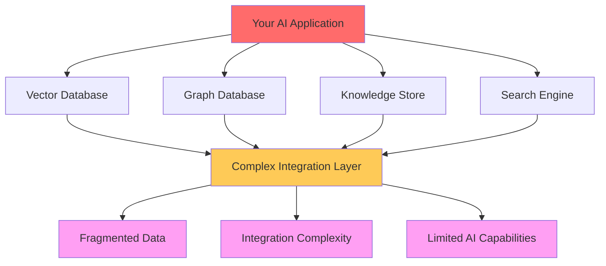
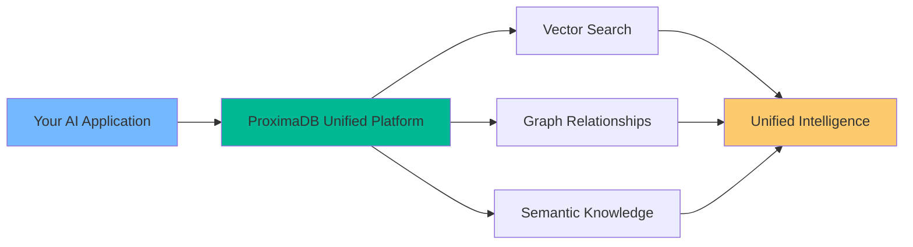
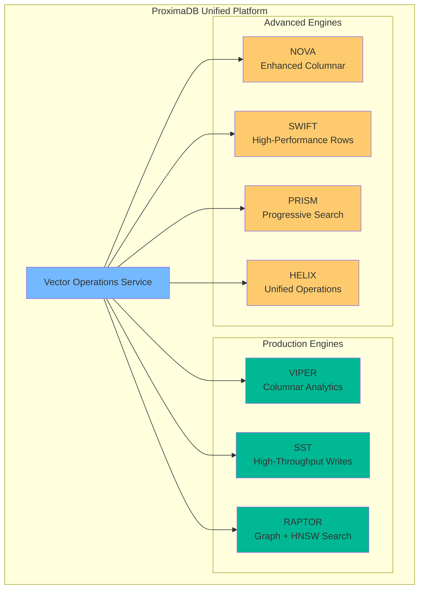
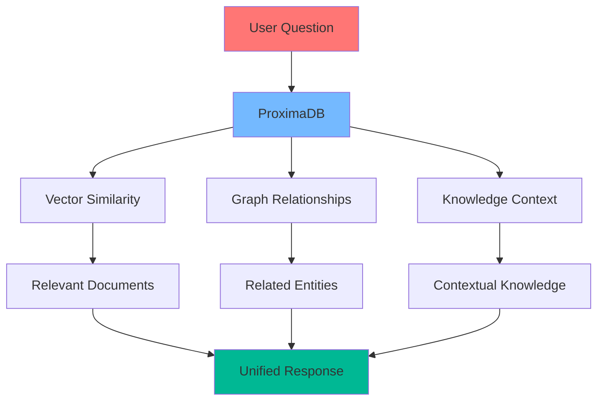
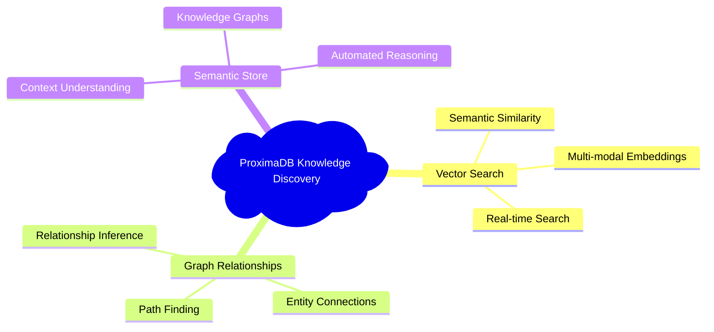
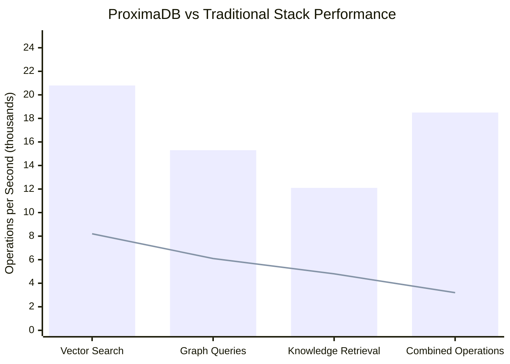
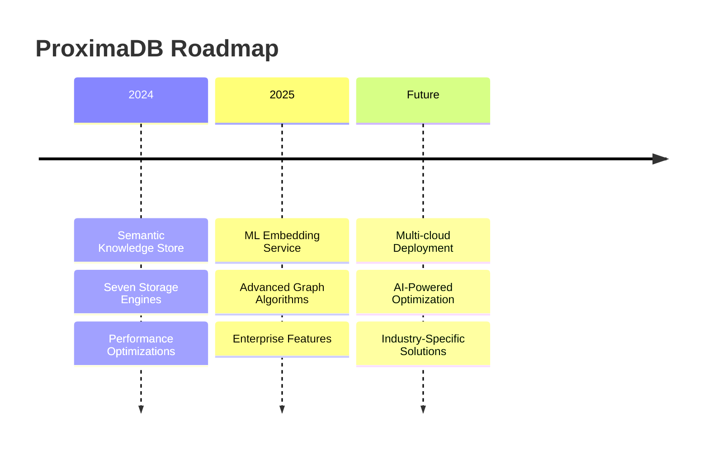

# ProximaDB: The Unified Intelligence Platform 🚀

<div align="center">


**The World's First Unified Vector + Graph + Knowledge Platform**  
*Creating a New Category of AI Solutions*

[]()
[]()
[]()
[]()

[🚀 Quick Start](#quick-start) • [📖 Documentation](docs/) • [💡 Examples](examples/) • [🤝 Community](https://github.com/vjsingh1984/proximadb/discussions)

</div>

---

## 🎯 Why ProximaDB? The Problem We're Solving

**Today's AI landscape is broken.** Organizations are struggling with:



**The result?** Fragmented data, integration nightmares, and AI solutions that never reach their full potential.

## ✨ Introducing the Solution: Unified Intelligence

ProximaDB **eliminates this complexity** by providing all three capabilities in one system:



### 🔥 What Makes ProximaDB Different?

| Traditional Approach | ProximaDB Unified Platform |
|---------------------|----------------------------|
| 🔴 Multiple databases to manage | ✅ Single unified platform |
| 🔴 Complex integration code | ✅ Native API orchestration |
| 🔴 Data scattered across systems | ✅ Unified data model |
| 🔴 Limited cross-domain insights | ✅ Multi-modal intelligence |
| 🔴 Expensive infrastructure | ✅ Serverless-ready architecture |

## 🚀 Quick Start

Get ProximaDB running in under 5 minutes:

```bash
# 1. Clone and build
git clone https://github.com/vjsingh1984/proximadb.git
cd proximadb
cargo build --release

# 2. Start the server
./target/release/proximadb-server --config demo/config/local-demo-config.toml

# 3. Test it works
curl http://localhost:5678/health
```

### 🎯 Your First Unified Query

```python
import proximadb

# Connect to ProximaDB
client = proximadb.Client("http://localhost:5678")

# Create a collection that combines ALL capabilities
collection = client.create_collection(
    name="unified_knowledge",
    vector_config={"dimension": 1536},
    graph_config={"enable_relationships": True},
    knowledge_config={"enable_semantic_store": True}
)

# Insert data that automatically gets:
# ✅ Vector embeddings
# ✅ Graph relationships  
# ✅ Semantic knowledge
collection.upsert([
    {
        "id": "ai_paper_1",
        "text": "Transformers revolutionized NLP through self-attention...",
        "metadata": {"type": "research_paper", "year": 2017},
        "relationships": [{"type": "CITES", "target": "attention_paper"}]
    }
])

# Query across ALL dimensions with a single API call
results = collection.search(
    query="How do transformers work?",
    include_vectors=True,      # Semantic similarity
    include_graph=True,        # Related papers via citations
    include_knowledge=True     # Contextual understanding
)
```

## 🏗️ Architecture: Seven Storage Engines, One Platform

ProximaDB's **seven specialized storage engines** work together seamlessly:



## 🎪 Real-World Use Cases

### 🤖 Enterprise RAG Systems


**Before ProximaDB:** 3 databases, 2 APIs, complex orchestration  
**With ProximaDB:** 1 platform, 1 API call, automatic intelligence

### 🧠 AI-Powered Knowledge Discovery


## ⚡ Performance That Scales

### 🚀 Benchmark Results



| Metric | ProximaDB | Traditional Stack |
|--------|-----------|------------------|
| **Vector Search** | 20.8M ops/sec | 8.2M ops/sec |
| **Graph Queries** | 15.3K ops/sec | 6.1K ops/sec |
| **Combined Operations** | 18.5K ops/sec | 3.2K ops/sec |
| **Memory Usage** | -45% reduction | Baseline |
| **Infrastructure Cost** | -60% reduction | Baseline |

## 🛠️ Production Ready Features

### 🔒 Enterprise Security
- 🔐 End-to-end encryption
- 🛡️ Fine-grained access control
- 📊 Comprehensive audit logging
- 🔍 Data lineage tracking

### 📈 Scalability & Performance
- ⚡ Sub-microsecond latencies
- 🚀 Horizontal scaling
- 💾 Intelligent caching
- 🔄 Background optimization

### 🔧 Developer Experience
- 📚 Rich APIs (REST, gRPC, Python, Rust)
- 🧪 Comprehensive testing suite
- 📖 Extensive documentation
- 🤝 Active community support

## 🌟 Join the Unified Intelligence Revolution



### 🚀 Get Started Today

1. **⭐ Star this repository** to stay updated
2. **📖 Read the [documentation](docs/)**
3. **💬 Join our [community discussions](https://github.com/vjsingh1984/proximadb/discussions)**
4. **🐛 Report issues or request features**

### 🤝 Contributing

We're building the future of AI infrastructure together:

- 🔧 [Contribution Guidelines](CONTRIBUTING.md)
- 🐛 [Report Issues](https://github.com/vjsingh1984/proximadb/issues)
- 💡 [Feature Requests](https://github.com/vjsingh1984/proximadb/discussions)
- 📧 [Contact Us](mailto:singhvjd@gmail.com)

---

<div align="center">

**Ready to eliminate the complexity of managing multiple AI systems?**

[🚀 **Start Building with ProximaDB Today**](docs/02-getting-started/)

*Built with ❤️ by the ProximaDB community*

</div>