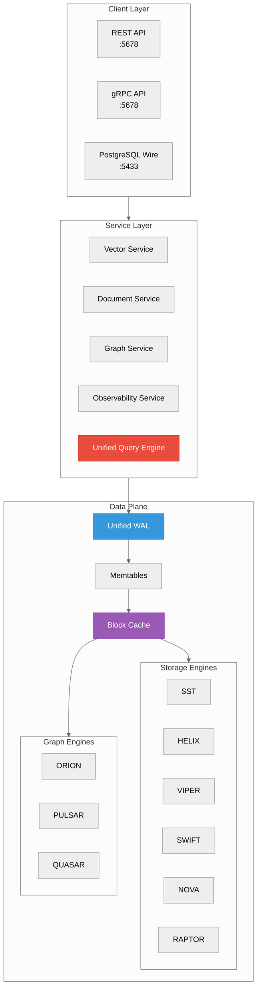
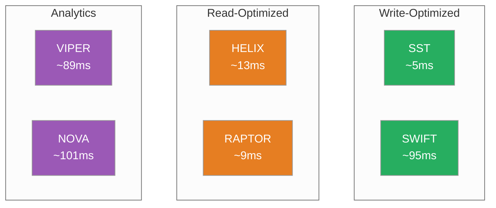
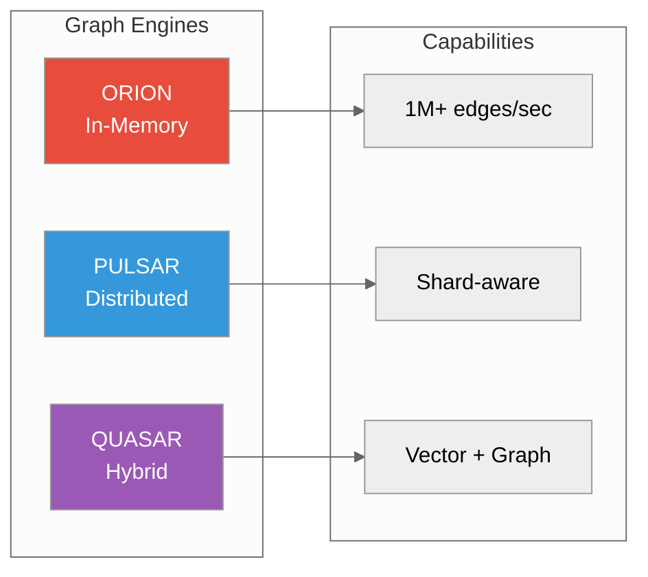
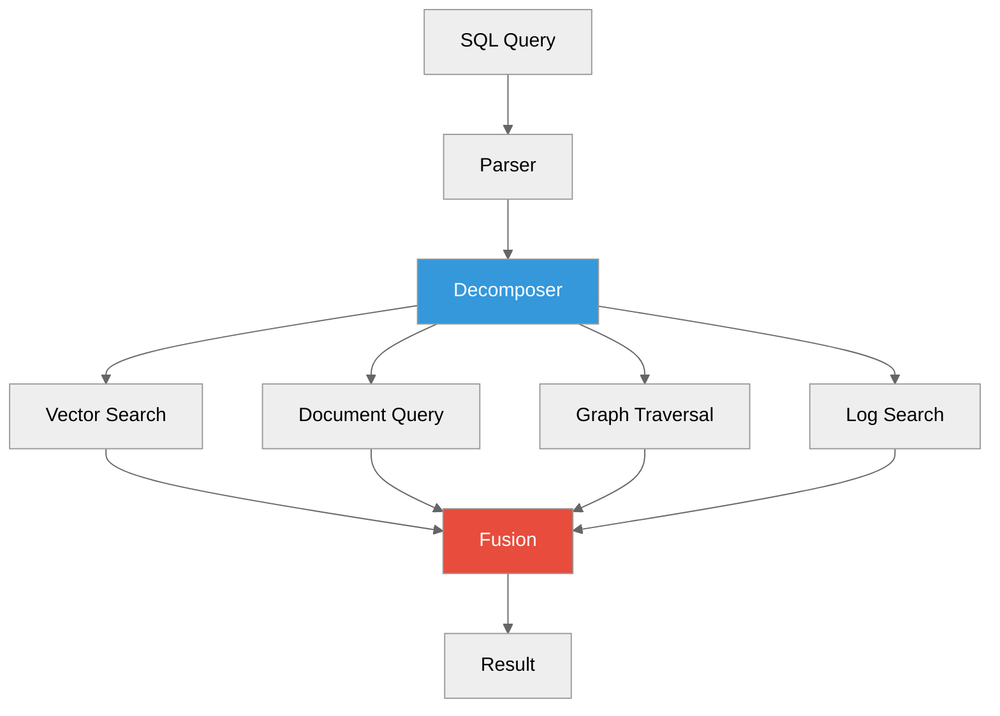
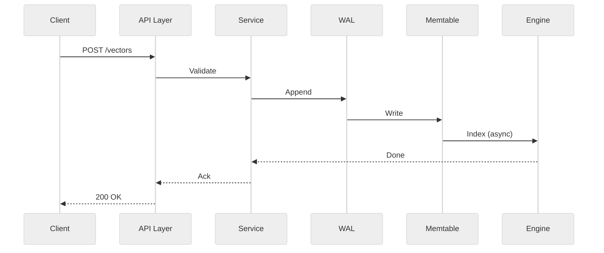
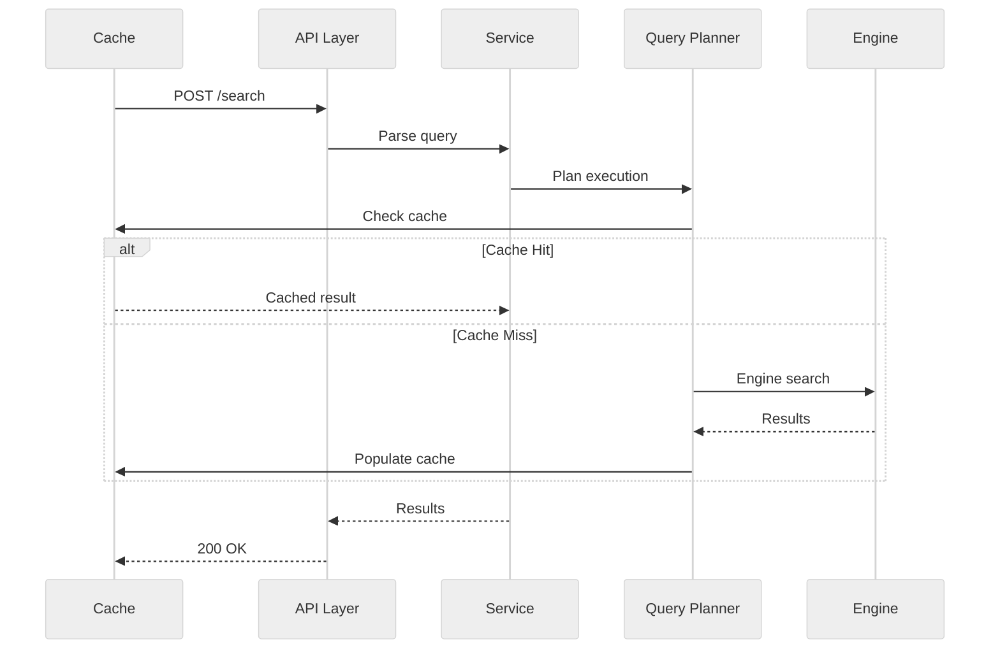
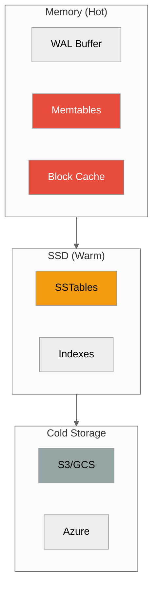

# Architecture Basics

**How ProximaDB works under the hood**



---

## Core Concepts

### 1. Unified API Layer

Single port (`5678`) for multiple protocols:

| Protocol | Use Case | Example |
|----------|----------|---------|
| **REST** | Web apps, curl | `POST /api/v1/collections` |
| **gRPC** | High-performance services | `proto/CollectionService` |
| **Arrow Flight** | Data analytics, BI tools | `do_put()` streaming |

Plus PostgreSQL wire protocol on port `5433` for SQL clients.

**Why it matters:** One connection, any protocol. No need to run multiple services.

---

### 2. Unified WAL (Write-Ahead Log)


All writes (vectors, documents, graphs, logs) go through a single WAL:

- **Durability**: Writes are acknowledged only after WAL flush
- **Consistency**: Single ordering for all data types
- **Recovery**: Replay WAL on restart

**Why it matters:** No partial failures. All your data is consistent.

---

### 3. Storage Engines



6 specialized engines for different workloads:

| Engine | Best For | Performance |
|--------|----------|-------------|
| **SST** | Real-time, write-heavy | Fastest writes |
| **SWIFT** | Ultra-low latency (<5K vectors) | Small datasets |
| **HELIX** | Locality-optimized reads | Spatial queries |
| **RAPTOR** | Adaptive, dynamic workloads | Auto-tuning |
| **VIPER** | Columnar analytics | Aggregations |
| **NOVA** | Mixed workloads | Balanced |

**Why it matters:** Pick the right engine for your workload. Don't use analytics engine for real-time writes.

---

### 4. Graph Engines



| Engine | Scale | Features |
|--------|-------|----------|
| **ORION** | Single node | Fastest, in-memory CSR |
| **PULSAR** | Distributed | Shard-aware, scalable |
| **QUASAR** | Hybrid | Vector + graph unified |

**Why it matters:** Graph relationships without a separate graph database.

---

### 5. Multi-Model Query Engine



SQL extensions for multi-model queries:

```sql
-- Vector search
SELECT * FROM VECTOR_SEARCH('collection', vector, 10)

-- Graph traversal
SELECT * FROM GRAPH_QUERY('graph', 'MATCH (a)-[:KNOWS]->(b)')

-- Document query
SELECT * FROM DOCUMENT_QUERY('docs', 'category = "tech"')

-- Cross-model join
SELECT v.id, d.content
FROM VECTOR_SEARCH('vectors', query, 10) v
JOIN DOCUMENT_QUERY('docs', 'id = "' || v.id || '"') d
```

**Why it matters:** Query across data models without ETL or joins between systems.

---

## Data Flow

### Write Path



1. Client writes to API layer
2. Service validates request
3. WAL appends write (durable)
4. Memtable updates (in-memory)
5. Engine indexes asynchronously

### Read Path



1. Client sends search request
2. Query planner optimizes
3. Check cache (block cache)
4. On miss: query storage engine
5. Populate cache for next request

---

## Storage Hierarchy



| Tier | Latency | Purpose |
|------|----------|---------|
| **Memory** | <1ms | Active data, hot cache |
| **SSD** | 1-10ms | Persistent storage |
| **Cloud** | 100ms+ | Archive, backup |

---

## Key Design Decisions

### Unified Port vs Multi-Port

**Unified (default, port 5678):**
- ✅ Simpler deployment
- ✅ Single firewall rule
- ✅ HTTP/2 multiplexing

**Multi-Port (legacy):**
- ❌ Multiple ports to manage
- ❌ Separate connections

### WAL Per Model vs Unified WAL

**Unified WAL (current):**
- ✅ Single ordering across models
- ✅ Cross-model transactions
- ✅ Simpler recovery

**Per-Model WAL (alternative):**
- ❌ Complex coordination
- ❌ No cross-model ACID

### Engine Selection

**Manual (current):**
- ✅ Full control
- �:: Must know workload

**Auto (future):**
- ✅ Engine auto-selection
- �:: Less predictable

---

## Next Steps

- [Storage Engines Guide](../05-concepts/storage-engines.adoc) - Deep dive on each engine
- [Graph Engines Guide](../05-concepts/graph-engines.adoc) - Graph internals
- [Query Planner](../05-concepts/query-planner.md) - How queries are optimized
- [Configuration](../03-api-reference/configuration.adoc) - Tuning parameters

---

*Need help?* [GitHub Issues](https://github.com/vjsingh1984/proximadb/issues)
