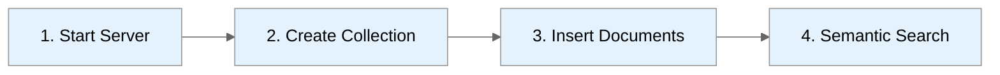

# First Query Tutorial

**Build a semantic search application in 10 minutes**



---

## Scenario: Product Search

We'll build a simple product search that finds similar items using embeddings.

### Prerequisites

- ProximaDB running (see [Installation](./install.md))
- Python 3.11+

---

## Step 1: Install Python SDK

```bash
pip install proximadb
```

---

## Step 2: Start ProximaDB

```bash
# If using platform package
sudo systemctl start proximadb

# If using Docker
docker start proximadb

# If from source
./target/release/proximadb-server --config config/config.toml
```

Verify:
```bash
curl http://localhost:5678/health
```

---

## Step 3: Create Collection

```python
from proximadb import ProximaDB
import numpy as np

# Connect
client = ProximaDB("http://localhost:5678")

# Create collection for products
collection = client.create_collection(
    name="products",
    dimension=384,  # Sentence transformer dimension
    metric="cosine"
)

print(f"Created collection: {collection.name}")
```

---

## Step 4: Insert Products

```python
# Generate embeddings (using sentence-transformers)
from sentence_transformers import SentenceTransformer

encoder = SentenceTransformer('all-MiniLM-L6-v2')

products = [
    {"id": 1, "name": "Wireless Headphones", "price": 79.99, "category": "Electronics"},
    {"id": 2, "name": "USB-C Charging Cable", "price": 12.99, "category": "Electronics"},
    {"id": 3, "name": "Running Shoes", "price": 89.99, "category": "Footwear"},
    {"id": 4, "name": "Coffee Maker", "price": 49.99, "category": "Kitchen"},
    {"id": 5, "name": "Bluetooth Earbuds", "price": 59.99, "category": "Electronics"},
]

# Encode product names
texts = [p["name"] for p in products]
embeddings = encoder.encode(texts)

# Insert into ProximaDB
collection.insert(
    vectors=embeddings.tolist(),
    ids=[p["id"] for p in products],
    metadata=products
)

print(f"Inserted {len(products)} products")
```

---

## Step 5: Semantic Search

```python
# Search for similar products
query = "audio accessories"
query_embedding = encoder.encode([query])[0]

results = collection.search(
    query_vector=query_embedding.tolist(),
    k=3,
    filter={"category": "Electronics"}  # Optional: filter by category
)

print(f"\nQuery: '{query}'")
print("Top results:")
for i, result in enumerate(results, 1):
    print(f"{i}. {result.metadata['name']}")
    print(f"   Score: {result.score:.4f}")
    print(f"   Price: ${result.metadata['price']}")
    print()
```

**Output:**
```
Query: 'audio accessories'
Top results:
1. Wireless Headphones
   Score: 0.8234
   Price: $79.99

2. Bluetooth Earbuds
   Score: 0.7891
   Price: $59.99

3. USB-C Charging Cable
   Score: 0.6543
   Price: $12.99
```

---

## Step 6: Multi-Model Query

```python
# Combine vector search with document lookup
from proximadb import unified_query

results = unified_query("""
    SELECT p.name, p.price, p.category
    FROM products p
    VECTOR_SEARCH(p.name, 'audio accessories', 3) AS v
    WHERE p.price < 100
    ORDER BY v.score DESC
""")

for row in results:
    print(f"{row.name}: ${row.price} ({row.category})")
```

---

## Complete Example

```python
from proximadb import ProximaDB
from sentence_transformers import SentenceTransformer
import numpy as np

# Setup
client = ProximaDB("http://localhost:5678")
encoder = SentenceTransformer('all-MiniLM-L6-v2')

# Create collection
collection = client.create_collection("products", dimension=384, metric="cosine")

# Sample data
products = [
    {"id": 1, "name": "Wireless Headphones", "price": 79.99},
    {"id": 2, "name": "Running Shoes", "price": 89.99},
    {"id": 3, "name": "Coffee Maker", "price": 49.99},
]

# Insert
texts = [p["name"] for p in products]
embeddings = encoder.encode(texts)
collection.insert(
    vectors=embeddings.tolist(),
    ids=[p["id"] for p in products],
    metadata=products
)

# Search
query = "audio equipment"
query_emb = encoder.encode([query])[0]
results = collection.search(query_emb.tolist(), k=2)

for r in results:
    print(f"{r.metadata['name']}: ${r.metadata['price']} (score: {r.score:.3f})")
```

---

## REST API Version

```bash
# Create collection
curl -X POST http://localhost:5678/api/v1/collections \
  -H "Content-Type: application/json" \
  -d '{
    "name": "products",
    "dimension": 384,
    "metric": "cosine"
  }'

# Insert vectors (get embeddings from Python first)
curl -X POST http://localhost:5678/api/v1/collections/products/vectors \
  -H "Content-Type: application/json" \
  -d '{
    "vectors": [[0.1, 0.2, ...], [0.3, 0.4, ...]],
    "ids": [1, 2],
    "metadata": [
      {"name": "Headphones", "price": 79.99},
      {"name": "Shoes", "price": 89.99}
    ]
  }'

# Search
curl -X POST http://localhost:5678/api/v1/collections/products/vectors/search \
  -H "Content-Type: application/json" \
  -d '{
    "vector": [0.1, 0.2, ...],
    "k": 5,
    "include_metadata": true
  }'
```

---

## SQL Interface

```sql
-- Connect via psql
psql -h localhost -p 5433 -U postgres

-- Create table
CREATE TABLE products (
    id SERIAL PRIMARY KEY,
    name TEXT,
    embedding VECTOR(384),
    price NUMERIC
);

-- Insert
INSERT INTO products (name, embedding, price)
VALUES ('Wireless Headphones', '[0.1, 0.2, ...]', 79.99);

-- Search
SELECT name, price,
       embedding <-> '[0.1, 0.2, ...]' AS distance
FROM products
ORDER BY distance
LIMIT 5;
```

---

## Next Steps

- [Vector Search Guide](../02-guides/vector-search.md) - Advanced filtering, hybrid search
- [Graph Queries](../02-guides/graph-queries.md) - Add relationships to your data
- [Multi-Model Joins](../02-guides/multi-model-joins.md) - Combine vectors, documents, graphs
- [API Reference](../03-api-reference/) - Complete API documentation

---

## Common Issues

**Connection refused:**
```bash
# Check if server is running
curl http://localhost:5678/health
```

**Dimension mismatch:**
```python
# Ensure embedding dimension matches collection dimension
print(f"Model dimension: {len(encoder.encode('test'))}")
print(f"Collection dimension: {collection.dimension}")
```

**Import error:**
```bash
# Install sentence-transformers
pip install sentence-transformers
```

---

*Need help?* [GitHub Issues](https://github.com/vjsingh1984/proximadb/issues)
