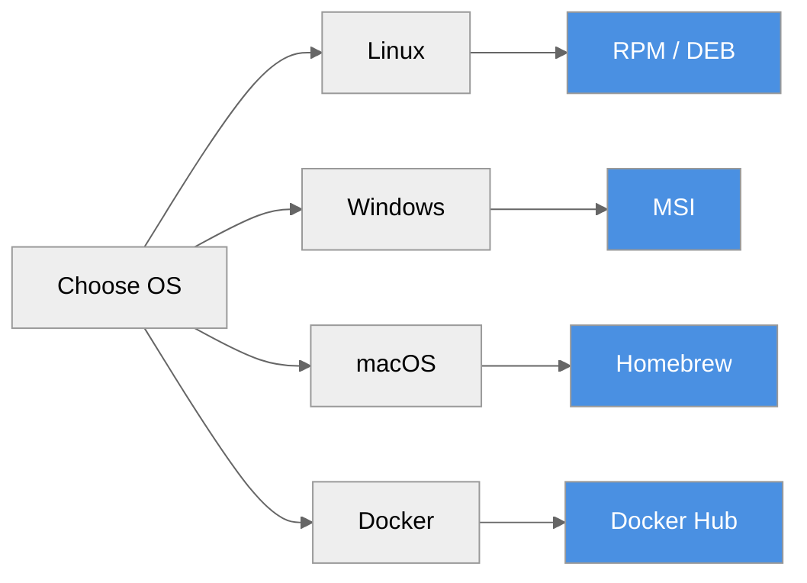

# Installation Guide

**Install ProximaDB on your platform**



---

## Platform Packages

### Linux (RPM - RHEL/CentOS/Fedora)

```bash
# Download
wget https://github.com/vjsingh1984/proximadb/releases/download/v0.2.0/proximadb-0.2.0-1.el8.x86_64.rpm

# Install
sudo rpm -ivh proximadb-0.2.0-1.el8.x86_64.rpm

# Start service
sudo systemctl start proximadb
sudo systemctl enable proximadb

# Verify
curl http://localhost:5678/health
```

**What gets installed:**
- Binaries: `/usr/bin/` (proximadb-server, proximadb-bench, proximadb-migrate)
- Config: `/etc/proximadb/config.toml`
- Service: `/usr/lib/systemd/system/proximadb.service`
- Data: `/var/lib/proximadb/`
- Logs: `/var/log/proximadb/`

### Linux (DEB - Debian/Ubuntu)

```bash
# Download
wget https://github.com/vjsingh1984/proximadb/releases/download/v0.2.0/proximadb_0.2.0_amd64.deb

# Install
sudo dpkg -i proximadb_0.2.0_amd64.deb

# Start service
sudo systemctl start proximadb
sudo systemctl enable proximadb

# Verify
curl http://localhost:5678/health
```

### Windows (MSI)

```powershell
# Download from GitHub Releases
# https://github.com/vjsingh1984/proximadb/releases/tag/v0.2.0

# Double-click proximadb-0.2.0-x64.msi
# Or install via command line:
msiexec /i proximadb-0.2.0-x64.msi

# Start service (optional)
Start-Service proximadb
```

**What gets installed:**
- Program Files: `C:\Program Files\ProximaDB\`
- Config: `C:\ProgramData\ProximaDB\config.toml`
- Data: `C:\ProgramData\ProximaDB\data\`

### macOS (Homebrew)

```bash
# Install
brew install proximadb

# Start service
brew services start proximadb

# Verify
curl http://localhost:5678/health
```

---

## Docker

### Docker Hub

```bash
# Pull and run
docker run -d \
  --name proximadb \
  -p 5678:5678 \
  -p 5433:5433 \
  -v proximadb-data:/var/lib/proximadb \
  proximadb/proximadb:latest

# Check logs
docker logs -f proximadb

# Verify
curl http://localhost:5678/health
```

### Docker Compose

```yaml
# docker-compose.yml
version: '3.8'
services:
  proximadb:
    image: proximadb/proximadb:latest
    ports:
      - "5678:5678"  # Unified API
      - "5433:5433"  # PostgreSQL wire
    volumes:
      - proximadb-data:/var/lib/proximadb
    environment:
      - RUST_LOG=info
    restart: unless-stopped

volumes:
  proximadb-data:
```

```bash
docker-compose up -d
```

---

## From Source

### Prerequisites

- Rust 1.88+ and Cargo
- OpenSSL development libraries
- Python 3.11+ (for Python SDK)

### Linux

```bash
# Install dependencies
sudo apt-get update
sudo apt-get install -y pkg-config libssl-dev build-essential

# Clone repository
git clone https://github.com/vjsingh1984/proximadb.git
cd proximadb

# Build release
cargo build --release

# Run
./target/release/proximadb-server --config config/config.toml
```

### macOS

```bash
# Install dependencies
brew install openssl@3 pkg-config

# Clone and build
git clone https://github.com/vjsingh1984/proximadb.git
cd proximadb

# Set OpenSSL environment variables
export OPENSSL_DIR=$(brew --prefix openssl@3)
export OPENSSL_LIB_DIR=$(brew --prefix openssl@3)/lib
export PKG_CONFIG_PATH=$(brew --prefix openssl@3)/lib/pkgconfig

# Build
cargo build --release

# Run
./target/release/proximadb-server --config config/config.toml
```

### Windows

```powershell
# Install Rust from https://rustup.rs/
# Install Visual Studio Build Tools

# Clone and build
git clone https://github.com/vjsingh1984/proximadb.git
cd proximadb

# Build
cargo build --release

# Run
.\target\release\proximadb-server.exe --config config\config.toml
```

---

## Configuration

### Default Configuration

The default config file is installed at:
- **Linux**: `/etc/proximadb/config.toml`
- **Windows**: `C:\ProgramData\ProximaDB\config.toml`
- **macOS**: `/usr/local/etc/proximadb/config.toml`

### Default Ports

| Port | Protocol | Purpose |
|------|----------|---------|
| **5678** | HTTP/2 | Unified REST + gRPC + Arrow Flight |
| **5433** | PostgreSQL | SQL wire protocol |

### Minimal Config

```toml
[server]
port = 5678

[storage]
default_engine = "sst"  # Options: sst, helix, viper, swift, nova, raptor

[api]
unified_mode = true  # Single port for all protocols
```

---

## Verification

### Health Check

```bash
curl http://localhost:5678/health
```

**Response:**
```json
{
  "status": "healthy",
  "version": "0.2.0",
  "uptime_seconds": 123.45
}
```

### Test Collection

```bash
# Create a collection
curl -X POST http://localhost:5678/api/v1/collections \
  -H "Content-Type: application/json" \
  -d '{
    "name": "test",
    "dimension": 128,
    "metric": "cosine"
  }'

# List collections
curl http://localhost:5678/api/v1/collections
```

---

## Upgrade

### Platform Packages

```bash
# RPM
sudo rpm -Uvh proximadb-0.2.1-1.el8.x86_64.rpm
sudo systemctl restart proximadb

# DEB
sudo dpkg -i proximadb_0.2.1_amd64.deb
sudo systemctl restart proximadb

# MSI
msiexec /x proximadb-0.2.0-x64.msi
msiexec /i proximadb-0.2.1-x64.msi
```

### Docker

```bash
docker pull proximadb/proximadb:latest
docker stop proximadb
docker rm proximadb
docker run -d ... proximadb/proximadb:latest
```

### From Source

```bash
git pull origin main
cargo build --release
./target/release/proximadb-server --config config/config.toml
```

---

## Uninstall

### Linux (RPM)

```bash
sudo systemctl stop proximadb
sudo systemctl disable proximadb
sudo rpm -e proximadb
sudo rm -rf /var/lib/proximadb
```

### Linux (DEB)

```bash
sudo systemctl stop proximadb
sudo systemctl disable proximadb
sudo dpkg -r proximadb
sudo rm -rf /var/lib/proximadb
```

### Windows

```powershell
Stop-Service proximadb
msiexec /x proximadb-0.2.0-x64.msi
```

### macOS

```bash
brew services stop proximadb
brew uninstall proximadb
rm -rf /usr/local/var/proximadb
```

---

## Next Steps

- [Quick Start](./index.md) - 5-minute overview
- [First Query](./first-query.md) - Tutorial
- [Configuration](../03-api-reference/configuration.adoc) - Full config reference
- [Deployment](../04-operations/deployment.adoc) - Production setup

---

*Need help?* [GitHub Issues](https://github.com/vjsingh1984/proximadb/issues)
