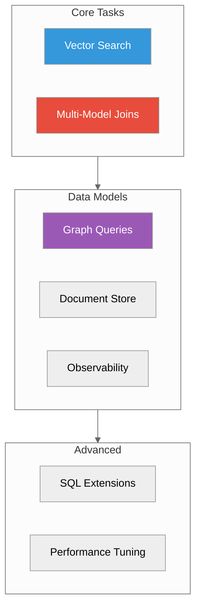

# Guides

**Practical guides for common tasks**

---

## Core Guides

| Guide | Description | Time |
|-------|-------------|------|
| [Vector Search](./vector-search.md) | Semantic search, filtering, hybrid search | 15 min |
| [Multi-Model Joins](./multi-model-joins.md) | Cross-model SQL queries | 20 min |

## Data Model Guides

| Guide | Description | Time |
|-------|-------------|------|
| [Graph API](../03-api-reference/graph.adoc) | Traversals, patterns, algorithms | 15 min |
| [REST API](../03-api-reference/rest.adoc) | JSON/document operations and API patterns | 10 min |
| [Observability Operations](../04-operations/monitoring.adoc) | Logs, metrics, traces, and monitoring | 15 min |

## Advanced Guides

| Guide | Description | Time |
|-------|-------------|------|
| [API Surface Performance](./api-surface-performance-guide.md) | Which SDK, query, and protocol path to choose | 15 min |

## Quick Links

- [Platform Packages](./platform-packages.md) - RPM/DEB/MSI installation
- [Unified Port Migration](./unified-port-migration.adoc) - Migrate from multi-port
- [Python SDK](./sdk-python-guide.adoc) - Python client library
- [API Surface Performance](./api-surface-performance-guide.md) - Choose embedded, SQL, UQL, Cypher, REST/gRPC, pgwire, or Arrow Flight

---

## New Here?

Start with:
1. [Quick Start](../01-quick-start/) - Get running in 5 minutes
2. [Vector Search](./vector-search.md) - Most common use case
3. [Multi-Model Joins](./multi-model-joins.md) - What makes ProximaDB unique

---

## Guides by Use Case

### E-commerce
- [Vector Search](./vector-search.md) - Product recommendations
- [Multi-Model Joins](./multi-model-joins.md) - Reviews + products

### Social Apps
- [Graph API](../03-api-reference/graph.adoc) - Friends, followers, connections
- [Vector Search](./vector-search.md) - Content recommendations

### Observability
- [Observability Operations](../04-operations/monitoring.adoc) - Log aggregation
- [Multi-Model Joins](./multi-model-joins.md) - Logs + metrics correlation

### Search
- [REST API](../03-api-reference/rest.adoc) - Document and full-text APIs
- [Vector Search](./vector-search.md) - Semantic search
- [Hybrid Search](./vector-search.md#hybrid-search) - Combined

---

*Looking for API docs?* See [API Reference](../03-api-reference/)
