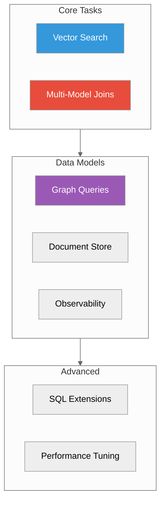

# Guides

**Practical guides for common tasks**

---

## Core Guides

| Guide | Description | Time |
|-------|-------------|------|
| [Vector Search](./vector-search.md) | Semantic search, filtering, hybrid search | 15 min |
| [Multi-Model Joins](./multi-model-joins.md) | Cross-model SQL queries | 20 min |

## Data Model Guides

| Guide | Description | Time |
|-------|-------------|------|
| [Graph Queries](./graph-queries.md) | Traversals, patterns, algorithms | 15 min |
| [Document Store](./document-store.md) | JSON storage, full-text search | 10 min |
| [Observability](./observability.md) | Logs, metrics, traces ingest | 15 min |

## Advanced Guides

| Guide | Description | Time |
|-------|-------------|------|
| [SQL Extensions](./sql-extensions.md) | Custom SQL functions reference | 20 min |
| [Performance Tuning](./performance-tuning.md) | Engine selection, indexing, caching | 30 min |

## Quick Links

- [Platform Packages](./platform-packages.md) - RPM/DEB/MSI installation
- [Unified Port Migration](./unified-port-migration.md) - Migrate from multi-port
- [Python SDK](./sdk-python-guide.md) - Python client library

---

## New Here?

Start with:
1. [Quick Start](../01-quick-start/) - Get running in 5 minutes
2. [Vector Search](./vector-search.md) - Most common use case
3. [Multi-Model Joins](./multi-model-joins.md) - What makes ProximaDB unique

---

## Guides by Use Case

### E-commerce
- [Vector Search](./vector-search.md) - Product recommendations
- [Multi-Model Joins](./multi-model-joins.md) - Reviews + products

### Social Apps
- [Graph Queries](./graph-queries.md) - Friends, followers, connections
- [Vector Search](./vector-search.md) - Content recommendations

### Observability
- [Observability](./observability.md) - Log aggregation
- [Multi-Model Joins](./multi-model-joins.md) - Logs + metrics correlation

### Search
- [Document Store](./document-store.md) - Full-text search
- [Vector Search](./vector-search.md) - Semantic search
- [Hybrid Search](./vector-search.md#hybrid-search) - Combined

---

*Looking for API docs?* See [API Reference](../03-api-reference/)
