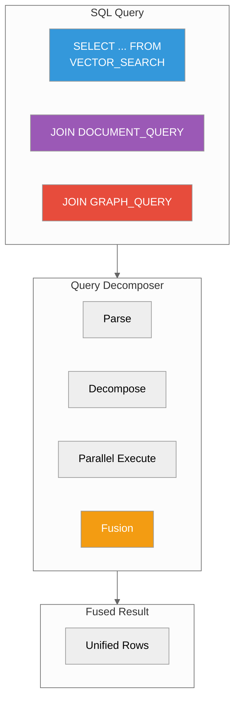
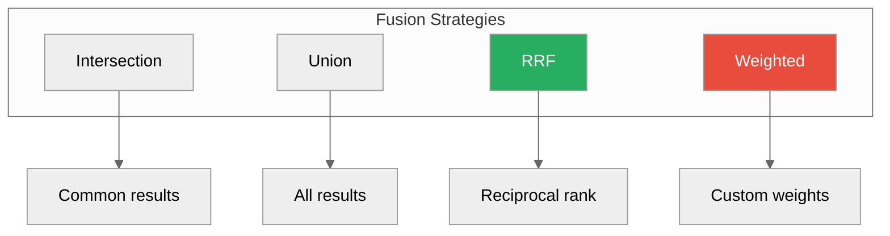

# Multi-Model Joins

**Query vectors, documents, graphs, and logs together**



---

## Overview

ProximaDB supports cross-model queries in a single SQL statement:

| Model | SQL Function | Use Case |
|-------|--------------|----------|
| **Vector** | `VECTOR_SEARCH()` | Semantic search |
| **Document** | `DOCUMENT_QUERY()` | JSON queries |
| **Graph** | `GRAPH_QUERY()` | Traversals |
| **Observability** | `LOGS()`, `METRICS()` | Telemetry |

---

## Quick Examples

### Vector + Document Join

Find similar products, then fetch their reviews:

```sql
SELECT
    v.product_id,
    v.score AS similarity,
    d.review_text,
    d.rating
FROM VECTOR_SEARCH(
    'products',
    '[0.1, 0.2, ...]',
    10
) AS v
JOIN LATERAL DOCUMENT_QUERY(
    'reviews',
    'product_id = "' || v.product_id || '"'
) AS d ON true
ORDER BY v.score DESC
LIMIT 20;
```

### Graph + Vector Join

Find friends-of-friends, then rank by similarity:

```sql
SELECT
    g2.friend_id,
    g2.name,
    v.score AS similarity
FROM GRAPH_QUERY(
    'social',
    'MATCH (me:User {id: 123})-[:FRIEND]->(friend:User)-[:FRIEND]->(fof:User)'
) AS g2
JOIN LATERAL VECTOR_SEARCH(
    'users',
    '[0.1, 0.2, ...]',
    5
) AS v ON v.user_id = g2.fof_id
ORDER BY v.score DESC;
```

### Logs + Metrics Join

Find errors with high CPU:

```sql
SELECT
    l.timestamp,
    l.error_message,
    m.cpu_usage
FROM LOGS('app-logs', 'level = "ERROR"') AS l
JOIN METRICS('app-metrics', 'cpu_usage > 80') AS m
  ON m.timestamp BETWEEN l.timestamp - INTERVAL '1 minute'
                     AND l.timestamp + INTERVAL '1 minute';
```

---

## Python SDK

```python
from proximadb_sdk import ProximaDBClient

client = ProximaDBClient(url="http://localhost:5678")

# Multi-model query
results = client.unified_query("""
    SELECT v.product_id, v.score, d.content
    FROM VECTOR_SEARCH('products', ?1, 10) AS v
    JOIN DOCUMENT_QUERY('docs', 'id = "' || v.product_id || '"') AS d
""", params=[my_vector])

for row in results:
    print(f"Product {row.product_id}: {row.content} (score: {row.score})")
```

---

## Fusion Strategies

When joining results from multiple models, choose a fusion strategy:



### Intersection (AND)

```sql
-- Results must appear in BOTH searches
SELECT *
FROM VECTOR_SEARCH('items', ?1, 10) AS v
INTERSECT
SELECT * FROM DOCUMENT_QUERY('items', 'price < 100');
```

### Union (OR)

```sql
-- Results from EITHER search
SELECT * FROM VECTOR_SEARCH('items', ?1, 10)
UNION
SELECT * FROM DOCUMENT_QUERY('items', 'category = "sale"');
```

### Reciprocal Rank Fusion (RRF)

```python
# Combine rankings from multiple sources
results = client.fusion_search(
    queries=[
        {"type": "vector", "collection": "items", "vector": vec, "k": 10},
        {"type": "document", "collection": "items", "query": "sale"}
    ],
    strategy="rrf",  # Reciprocal Rank Fusion
    k=20
)
```

### Weighted Fusion

```python
# Custom weights per source
results = client.fusion_search(
    queries=[
        {"type": "vector", "collection": "items", "vector": vec, "weight": 0.7},
        {"type": "graph", "collection": "items", "query": "...", "weight": 0.3}
    ],
    strategy="weighted",
    k=20
)
```

---

## Performance Tips

### 1. Push Filters Down

```sql
-- Good: Filter at source
SELECT *
FROM VECTOR_SEARCH('items', ?1, 100, filter={'price': {'$lt': 50}}) AS v
JOIN DOCUMENT_QUERY('docs', 'category = "tech"') AS d

-- Avoid: Filter after join
SELECT * FROM (
    SELECT * FROM VECTOR_SEARCH('items', ?1, 100)
    JOIN DOCUMENT_QUERY('docs', 'true')
) WHERE v.price < 50 AND d.category = 'tech'
```

### 2. Limit Subquery Results

```sql
-- Good: Limit each subquery
SELECT *
FROM VECTOR_SEARCH('items', ?1, 10) AS v
JOIN DOCUMENT_QUERY('docs', 'true', 10) AS d

-- Avoid: Unbounded joins
SELECT *
FROM VECTOR_SEARCH('items', ?1, 1000) AS v
JOIN DOCUMENT_QUERY('docs', 'true') AS d  -- Could be 1M rows!
```

### 3. Use LATERAL Joins

```sql
-- Good: LATERAL for correlated subqueries
SELECT v.item_id, d.content
FROM VECTOR_SEARCH('items', ?1, 10) AS v
JOIN LATERAL DOCUMENT_QUERY('docs', 'id = "' || v.item_id || '"') AS d

-- Better than: Cross join then filter
```

---

## Common Patterns

### RAG (Retrieval-Augmented Generation)

```sql
-- Find relevant docs, then fetch full content
SELECT
    doc_id,
    content,
    score
FROM VECTOR_SEARCH('doc_chunks', ?1, 5) AS v
JOIN LATERAL DOCUMENT_QUERY(
    'documents',
    'id = "' || v.doc_id || '"'
) AS d ON true;
```

### Social Recommendations

```sql
-- Friends' purchases + semantic similarity
SELECT DISTINCT
    p.product_id,
    p.name,
    v.score
FROM GRAPH_QUERY(
    'social',
    'MATCH (me:User {id: 123})-[:FRIEND]->(f:User)-[:BOUGHT]->(p:Product)'
) AS p
JOIN LATERAL VECTOR_SEARCH('products', ?1, 10) AS v
  ON v.product_id = p.product_id;
```

### Anomaly Detection

```sql
-- Unusual log patterns + high metrics
SELECT
    l.error_message,
    m.metric_value
FROM LOGS('logs', 'level = "ERROR"') AS l
JOIN METRICS('metrics', 'value > 99') AS m
  ON m.timestamp = l.timestamp
WHERE l.error_message LIKE '%timeout%';
```

### Knowledge Graph + Semantic Search

```sql
-- Find related entities by structure + meaning
SELECT
    e1.name AS entity1,
    e2.name AS entity2,
    rel.relation_type,
    v.score AS semantic_similarity
FROM GRAPH_QUERY(
    'kg',
    'MATCH (e1:Entity)-[rel:RELATED_TO]->(e2:Entity)'
) AS rel
JOIN LATERAL VECTOR_SEARCH('entities', ?1, 5) AS v
  ON (v.entity_id = rel.e1_id OR v.entity_id = rel.e2_id);
```

---

## SQL Extensions Reference

### VECTOR_SEARCH()

```sql
VECTOR_SEARCH(
    collection_name,  -- Text
    query_vector,      -- Array or string representation
    k,                 -- Integer
    filter             -- Optional: JSON filter
)
```

**Returns**: `table (id, score, metadata)`

### DOCUMENT_QUERY()

```sql
DOCUMENT_QUERY(
    collection_name,  -- Text
    query             -- JSON path expression
)
```

**Returns**: `table (id, content, metadata)`

### GRAPH_QUERY()

```sql
GRAPH_QUERY(
    graph_name,  -- Text
    pattern      -- Cypher-like pattern
)
```

**Returns**: `table (nodes, edges, paths)`

### LOGS()

```sql
LOGS(
    log_stream,  -- Text
    filter       -- Optional: filter expression
)
```

**Returns**: `table (timestamp, level, message, metadata)`

### METRICS()

```sql
METRICS(
    metric_name,  -- Text
    filter        -- Optional: filter expression
)
```

**Returns**: `table (timestamp, value, labels)`

---

## Best Practices

1. **Start simple**: Single-model query first, add joins later
2. **Push filters down**: Filter at source, not after join
3. **Limit results**: Always use `LIMIT` on subqueries
4. **Use LATERAL**: For correlated subqueries
5. **Monitor performance**: Check query plan with `EXPLAIN`

---

## Next Steps

- [Vector Search](./vector-search.md) - Vector search deep dive
- [Graph API](../03-api-reference/graph.adoc) - Graph patterns
- [REST API](../03-api-reference/rest.adoc) - Document and JSON APIs
- [API Reference](../03-api-reference/) - Full reference

---

*Need help?* [GitHub Issues](https://github.com/vjsingh1984/proximadb/issues)
