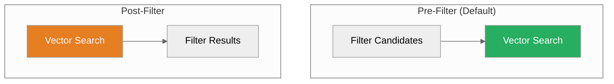

# Vector Search Guide

**Semantic search in milliseconds**


---

## Overview

Vector search finds similar items using embedding distance:

| Metric | Formula | Use Case |
|--------|---------|----------|
| **Cosine** | `1 - (A·B / ‖A‖‖B‖)` | Semantic similarity |
| **L2** | `sqrt(Σ(A-B)²)` | Euclidean distance |
| **Dot Product** | `A·B` | Normalized vectors |

---

## Quick Example

### Python SDK

```python
from proximadb import ProximaDB

client = ProximaDB("http://localhost:5678")
collection = client.get_collection("products")

# Simple search
results = collection.search(
    query_vector=[0.1, 0.2, ...],
    k=10
)

# With filter
results = collection.search(
    query_vector=[0.1, 0.2, ...],
    k=10,
    filter={"category": "Electronics", "price": {"$lt": 100}}
)
```

### REST API

```bash
curl -X POST http://localhost:5678/api/v1/collections/products/vectors/search \
  -H "Content-Type: application/json" \
  -d '{
    "vector": [0.1, 0.2, ...],
    "k": 10,
    "filter": {
      "category": "Electronics"
    }
  }'
```

---

## Advanced Filtering

### Metadata Filters

```python
# Exact match
results = collection.search(
    query_vector=[...],
    filter={"status": "active"}
)

# Range queries
results = collection.search(
    query_vector=[...],
    filter={
        "price": {"$gte": 10, "$lte": 100},
        "rating": {"$gt": 4.0}
    }
)

# Logical operators
results = collection.search(
    query_vector=[...],
    filter={
        "$or": [
            {"category": "Electronics"},
            {"category": "Computers"}
        ],
        "stock": {"$gt": 0}
    }
)
```

### Pre-filter vs Post-filter



**Pre-filter** (default): Filter before search
- ✅ Faster for selective filters
- ✅ Lower compute cost
- ❌ May miss results if filter removes nearest neighbors

**Post-filter**: Search then filter
- ✅ Guaranteed recall
- ❌ Slower for non-selective filters
- ❌ May return fewer than k results

```python
# Pre-filter (default)
results = collection.search(query_vector, k=10, filter={"status": "active"})

# Post-filter
results = collection.search(
    query_vector,
    k=100,  # Search more, filter after
    filter={"status": "active"},
    filter_mode="post"
)
```

---

## Hybrid Search

### Vector + Keyword

```python
# Combine semantic and keyword search
results = collection.hybrid_search(
    query_vector=[...],
    query_text="wireless headphones",
    alpha=0.7,  # 0.7 vector, 0.3 keyword
    k=10
)
```

### Weighted Scoring

```python
# Custom scoring function
results = collection.search(
    query_vector=[...],
    k=10,
    score_function=lambda score, metadata: (
        score * 0.8 + metadata.get("popularity", 0) * 0.2
    )
)
```

---

## Batch Operations

### Bulk Insert

```python
# Efficient bulk insert
collection.insert(
    vectors=[v1, v2, v3, ...],  # Up to 100K vectors
    ids=[1, 2, 3, ...],
    metadata=[{"name": "A"}, {"name": "B"}, ...]
)
```

### Bulk Search

```python
# Search multiple queries at once
results = collection.batch_search(
    query_vectors=[[...], [...], ...],
    k=10
)
```

---

## Performance Tuning

### Engine Selection

```python
# SST: Write-heavy, real-time
collection = client.create_collection("events", engine="sst")

# HELIX: Read-optimized, spatial
collection = client.create_collection("locations", engine="helix")

# VIPER: Analytics workloads
collection = client.create_collection("analytics", engine="viper")
```

### Index Parameters

```python
collection = client.create_collection(
    name="products",
    dimension=384,
    metric="cosine",
    index_params={
        "M": 16,      # HNSW connectivity
        "ef_construction": 200  # Build-time accuracy
    }
)

# Search-time accuracy
results = collection.search(
    query_vector,
    k=10,
    search_params={"ef": 100}  # Higher = more accurate, slower
)
```

### Quantization

```python
# Reduce memory with quantization
collection = client.create_collection(
    name="products",
    dimension=384,
    quantization={
        "type": "product",  # PQ quantization
        "bits": 8  # 8 bits per dimension
    }
)
```

---

## Monitoring

### Search Latency

```python
import time

start = time.time()
results = collection.search(query_vector, k=10)
latency = (time.time() - start) * 1000
print(f"Search latency: {latency:.2f}ms")
```

### Metrics Endpoint

```bash
curl http://localhost:5678/metrics | grep vector_search
```

---

## Best Practices

### 1. Choose the Right Metric

| Metric | When to Use |
|--------|-------------|
| **Cosine** | Text embeddings, normalized vectors |
| **L2** | Image embeddings, unnormalized |
| **Dot Product** | Pre-normalized vectors (fastest) |

### 2. Filter Before Search

```python
# Good: Pre-filter selective condition
results = collection.search(
    query_vector,
    filter={"category": "Electronics"},  # Reduces search space
    k=10
)

# Avoid: Post-filter non-selective
results = collection.search(
    query_vector,
    filter={"status": "active"},  # 99% of data
    filter_mode="post",
    k=10
)
```

### 3. Batch When Possible

```python
# Good: Bulk insert
collection.insert(vectors=large_list, ids=ids, metadata=metadata)

# Avoid: Loop insert
for v, id in zip(vectors, ids):
    collection.insert(vectors=[v], ids=[id])  # Slow!
```

### 4. Use Right Engine

| Workload | Engine |
|----------|--------|
| Real-time ingest | SST |
| Spatial queries | HELIX |
| Analytics | VIPER |
| Small dataset | SWIFT |
| Unknown/RVarying | RAPTOR |

---

## Common Patterns

### Recommendation Engine

```python
# User-based collaborative filtering
user_vector = get_user_embedding(user_id)
results = collection.search(
    user_vector,
    k=20,
    filter={"category": {"$ne": "purchased"}}
)
```

### Deduplication

```python
# Find near-duplicates
results = collection.search(
    document_vector,
    k=10,
    filter={"checksum": {"$ne": doc_checksum}}
)
# If score > 0.95, likely duplicate
```

### Face Recognition

```python
# Find similar faces
results = collection.search(
    face_embedding,
    k=5,
    filter={"verified": True}
)
if results[0].score > 0.8:
    return results[0].metadata["user_id"]
```

---

## Next Steps

- [Storage Engines](../05-concepts/storage-engines.adoc) - Engine internals
- [Multi-Model Joins](./multi-model-joins.md) - Combine vectors + documents
- [Graph API](../03-api-reference/graph.adoc) - Add relationships
- [API Reference](../03-api-reference/) - Complete API docs

---

*Need help?* [GitHub Issues](https://github.com/vjsingh1984/proximadb/issues)
