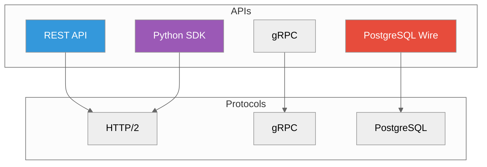

# API Reference

**Complete API documentation**



---

## REST API

**Base URL**: `http://localhost:5678`

| Endpoint | Method | Description |
|----------|--------|-------------|
| `/api/v1/collections` | GET | List collections |
| `/api/v1/collections` | POST | Create collection |
| `/api/v1/collections/{id}` | GET | Get collection |
| `/api/v1/collections/{id}` | DELETE | Delete collection |
| `/api/v1/collections/{id}/vectors` | POST | Insert vectors |
| `/api/v1/collections/{id}/vectors/search` | POST | Search vectors |
| `/api/v1/graph/graphs` | POST | Create graph |
| `/api/v1/graph/graphs/{id}/nodes` | POST | Add nodes |
| `/api/v1/graph/graphs/{id}/traverse` | POST | Traverse graph |
| `/health` | GET | Health check |

### Example: Create Collection

```bash
curl -X POST http://localhost:5678/api/v1/collections \
  -H "Content-Type: application/json" \
  -d '{
    "name": "products",
    "dimension": 384,
    "metric": "cosine",
    "engine": "sst"
  }'
```

### Example: Search

```bash
curl -X POST http://localhost:5678/api/v1/collections/products/vectors/search \
  -H "Content-Type: application/json" \
  -d '{
    "vector": [0.1, 0.2, ...],
    "k": 10,
    "filter": {"category": "Electronics"}
  }'
```

**Full docs**: [REST API Reference](./rest.adoc)

---

## gRPC API

**Default port**: `5678` (via HTTP/2)

Services:
- `CollectionService` - Collections and vectors
- `GraphService` - Graph operations
- `DocumentService` - Document storage
- `ObservabilityService` - Logs and metrics

### Example (Python)

```python
import grpc
from proximadb.proto import collection_pb2, collection_pb2_grpc

channel = grpc.insecure_channel('localhost:5678')
stub = collection_pb2_grpc.CollectionServiceStub(channel)

# Create collection
request = collection_pb2.CreateCollectionRequest(
    name="products",
    dimension=384,
    metric=collection_pb2.COSINE
)
response = stub.CreateCollection(request)
```

**Full docs**: gRPC API details are generated from `proto/`.

---

## PostgreSQL Wire Protocol

**Port**: `5433`

Connect using any PostgreSQL client:

```bash
psql -h localhost -p 5433 -U postgres
```

### SQL Extensions

```sql
-- Vector search with <-> operator
SELECT * FROM products
ORDER BY embedding <-> '[0.1, 0.2, ...]'
LIMIT 10;

-- Create table with vector column
CREATE TABLE items (
    id SERIAL PRIMARY KEY,
    embedding VECTOR(384)
);
```

**Full docs**: SQL and PostgreSQL wire coverage is tracked in [Supported Surface](../SUPPORTED_SURFACE.adoc).

---

## Python SDK

```bash
pip install proximadb
```

### Quick Start

```python
from proximadb import ProximaDB

# Connect
client = ProximaDB("http://localhost:5678")

# Create collection
collection = client.create_collection(
    name="products",
    dimension=384,
    metric="cosine"
)

# Insert
collection.insert(
    vectors=[[0.1, ...], [0.2, ...]],
    ids=[1, 2],
    metadata=[{"name": "A"}, {"name": "B"}]
)

# Search
results = collection.search(
    query_vector=[0.1, ...],
    k=10
)
```

**Full docs**: [Python SDK Guide](../02-guides/sdk-python-guide.adoc)

---

## Configuration API

### Environment Variables

| Variable | Default | Description |
|----------|---------|-------------|
| `PROXIMADB_PORT` | `5678` | Unified API port |
| `PROXIMADB_DATA_DIR` | `/var/lib/proximadb` | Data directory |
| `RUST_LOG` | `info` | Log level |
| `PROXIMADB_ENGINE` | `sst` | Default storage engine |

### Config File

```toml
[server]
port = 5678
host = "0.0.0.0"

[storage]
default_engine = "sst"
data_dir = "/var/lib/proximadb"

[api]
unified_mode = true
enable_postgres_wire = true
postgres_port = 5433

[monitoring]
metrics_enabled = true
prometheus_port = 9090
```

**Full docs**: [Configuration Reference](./configuration.adoc)

---

## Response Formats

### Success Response

```json
{
  "status": "success",
  "data": { ... }
}
```

### Error Response

```json
{
  "status": "error",
  "error": {
    "code": "INVALID_COLLECTION",
    "message": "Collection not found"
  }
}
```

### Health Check

```json
{
  "status": "healthy",
  "version": "0.2.0",
  "uptime_seconds": 1234.56
}
```

---

## Rate Limiting

| Tier | Requests/sec | Burst |
|------|--------------|-------|
| Default | 100 | 200 |
| Pro | 1000 | 2000 |

Headers:
```
X-RateLimit-Limit: 100
X-RateLimit-Remaining: 95
X-RateLimit-Reset: 1640000000
```

---

## Authentication

```bash
# Bearer token
curl -H "Authorization: Bearer $TOKEN" \
  http://localhost:5678/api/v1/collections
```

```python
# Python SDK
client = ProximaDB(
    "http://localhost:5678",
    api_key="your-api-key"
)
```

---

## Next Steps

- [REST API](./rest.adoc) - Complete REST reference
- [Python SDK](../02-guides/sdk-python-guide.adoc) - Python client guide
- [Configuration](./configuration.adoc) - All config options

---

*Need help?* [GitHub Issues](https://github.com/vjsingh1984/proximadb/issues)
