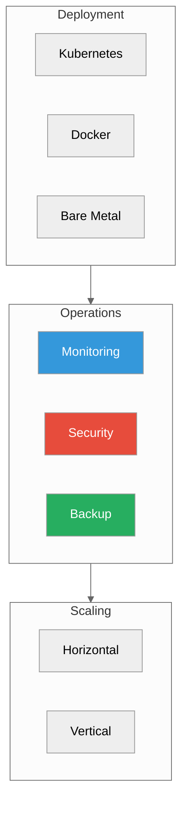

# Operations

**Running ProximaDB in production**



---

## Deployment

| Platform | Guide | Complexity |
|----------|-------|------------|
| **Kubernetes** | [Deployment Guide](./deployment.adoc) | Medium |
| **Docker Compose** | [Docker Guide](./deployment.adoc#docker) | Low |
| **Platform Packages** | [Platform Packages](../02-guides/platform-packages.md) | Low |
| **Bare Metal** | [Bare Metal](./deployment.adoc#bare-metal) | Medium |

### Quick Start (Docker)

```yaml
# docker-compose.yml
version: '3.8'
services:
  proximadb:
    image: proximadb/proximadb:latest
    ports:
      - "5678:5678"
      - "5433:5433"
    volumes:
      - proximadb-data:/var/lib/proximadb
    environment:
      - RUST_LOG=info
    restart: unless-stopped
    deploy:
      resources:
        limits:
          memory: 4G
        reservations:
          memory: 2G

volumes:
  proximadb-data:
```

---

## Monitoring

### Health Check

```bash
curl http://localhost:5678/health
```

**Response:**
```json
{
  "status": "healthy",
  "version": "0.2.0",
  "uptime_seconds": 123456,
  "collections": 10,
  "total_vectors": 1000000
}
```

### Metrics Endpoint

```bash
curl http://localhost:5678/metrics
```

**Key Metrics:**
```
# Request latency
proximadb_request_duration_seconds{endpoint="search"}

# Throughput
proximadb_requests_total{method="POST"}

# Storage
proximadb_storage_bytes{engine="sst"}

# Cache hit rate
proximadb_cache_hit_ratio
```

### Prometheus + Grafana

```yaml
# prometheus.yml
scrape_configs:
  - job_name: 'proximadb'
    static_configs:
      - targets: ['proximadb:5678']
    metrics_path: '/metrics'
```

Import Grafana dashboard from `deploy/grafana/`.

### Log Monitoring

```bash
# Systemd
sudo journalctl -u proximadb -f

# Docker
docker logs -f proximadb

# Kubernetes
kubectl logs -f deployment/proximadb
```

---

## Security

### Authentication

```toml
# config.toml
[security]
enabled = true
method = "bearer_token"
jwt_secret = "your-secret-key"

# API keys
[security.api_keys]
admin = "admin-key-hash"
readonly = "readonly-key-hash"
```

### TLS/SSL

```toml
[security.tls]
enabled = true
cert_file = "/etc/proximadb/certs/server.crt"
key_file = "/etc/proximadb/certs/server.key"
ca_file = "/etc/proximadb/certs/ca.crt"
```

```bash
# With TLS
curl -k https://localhost:5678/health
```

### Network Security

```bash
# Firewall (Linux)
sudo firewall-cmd --add-port=5678/tcp --permanent
sudo firewall-cmd --add-port=5433/tcp --permanent
sudo firewall-cmd --reload

# Only allow local connections
sudo firewall-cmd --add-rich-rule='rule family="ipv4" source address="127.0.0.1" port protocol="tcp" port="5678" accept'
```

### RBAC

```toml
[security.rbac]
enabled = true

[[security.rbac.roles]]
name = "admin"
permissions = ["read", "write", "delete", "admin"]

[[security.rbac.roles]]
name = "readonly"
permissions = ["read"]
```

---

## Backup & Restore

### Backup

```bash
# Stop writes
curl -X POST http://localhost:5678/api/v1/admin/freeze

# Backup data directory
tar -czf proximadb-backup-$(date +%Y%m%d).tar.gz /var/lib/proximadb

# Resume writes
curl -X POST http://localhost:5678/api/v1/admin/unfreeze
```

### Restore

```bash
# Stop server
sudo systemctl stop proximadb

# Restore data
tar -xzf proximadb-backup-20260222.tar.gz -C /

# Start server
sudo systemctl start proximadb
```

### Automated Backup

```bash
#!/bin/bash
# /etc/cron.daily/proximadb-backup
BACKUP_DIR="/backup/proximadb"
DATE=$(date +%Y%m%d)

curl -s -X POST http://localhost:5678/api/v1/admin/freeze
tar -czf "$BACKUP_DIR/proximadb-$DATE.tar.gz" /var/lib/proximadb
curl -s -X POST http://localhost:5678/api/v1/admin/unfreeze

# Keep last 7 days
find "$BACKUP_DIR" -name "proximadb-*.tar.gz" -mtime +7 -delete
```

---

## Performance Tuning

### Memory

```toml
[storage.cache]
size_mb = 2048  # Increase for better cache hit rate

[storage]
memtable_size_mb = 256  # Larger = fewer flushes
```

### Concurrency

```toml
[server]
max_concurrent_requests = 100
worker_threads = 8  # Set to CPU cores
```

### Engine Selection

| Workload | Engine | Config |
|----------|--------|--------|
| Real-time | SST | `memtable_size_mb = 512` |
| Analytics | VIPER | `parquet_row_group_size = 10000` |
| Mixed | RAPTOR | Auto-tuning enabled |

---

## High Availability

### Replication (Future)

```toml
[cluster]
mode = "replicated"
replication_factor = 3

[[cluster.nodes]]
id = 1
address = "node1:5678"

[[cluster.nodes]]
id = 2
address = "node2:5678"
```

### Load Balancing

```nginx
# nginx.conf
upstream proximadb {
    least_conn;
    server proximadb1:5678;
    server proximadb2:5678;
    server proximadb3:5678;
}

server {
    listen 80;
    location / {
        proxy_pass http://proximadb;
    }
}
```

---

## Troubleshooting

### High Memory Usage

```bash
# Check memory
curl http://localhost:5678/metrics | grep memory

# Reduce cache size
# config.toml
[storage.cache]
size_mb = 512  # Reduce from 2048
```

### Slow Queries

```bash
# Enable query logging
RUST_LOG=proximadb::query=debug

# Check slow query log
tail -f /var/log/proximadb/slow.log
```

### Disk Space

```bash
# Check WAL size
du -sh /var/lib/proximadb/wal

# Force compaction
curl -X POST http://localhost:5678/api/v1/admin/compact
```

### Connection Issues

```bash
# Check if port is open
sudo lsof -i :5678

# Check firewall
sudo firewall-cmd --list-ports

# Check logs
sudo journalctl -u proximadb -n 50
```

---

## Best Practices

1. **Monitor**: Set up Prometheus + Grafana dashboards
2. **Backup**: Daily automated backups
3. **Security**: Enable TLS + authentication in production
4. **Resources**: Set memory limits on containers
5. **Logging**: Centralize logs with ELK/Loki
6. **Updates**: Test upgrades in staging first

---

## Next Steps

- [Deployment Guide](./deployment.adoc) - Detailed deployment options
- [Monitoring](./monitoring.adoc) - Monitoring deep dive
- [Security](./security.adoc) - Security hardening
- [API Surface and Performance](../02-guides/api-surface-performance-guide.md) - Optimization guide

---

*Need help?* [GitHub Issues](https://github.com/vjsingh1984/proximadb/issues)
