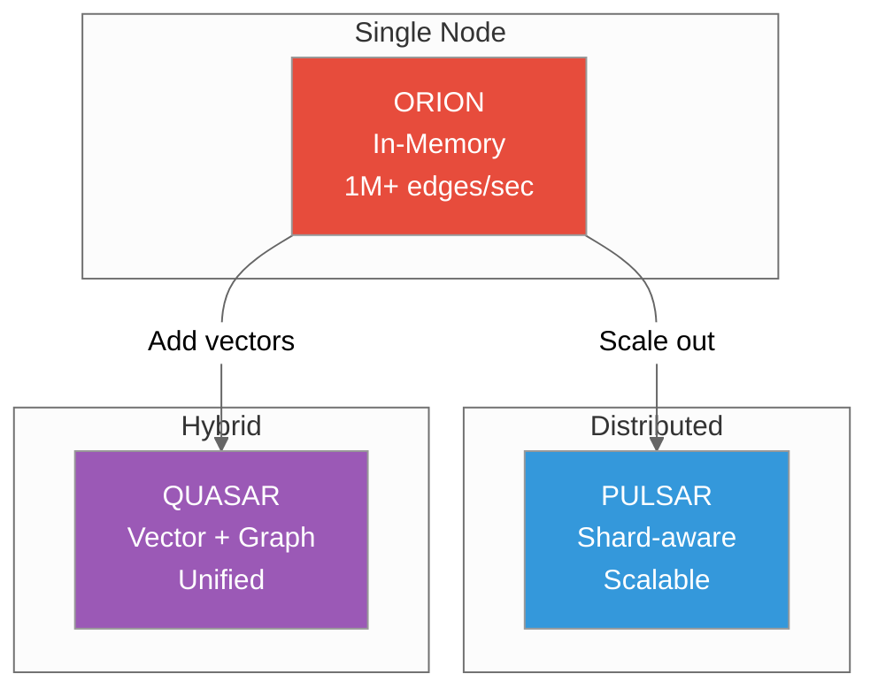
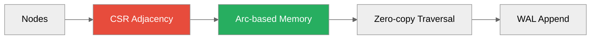
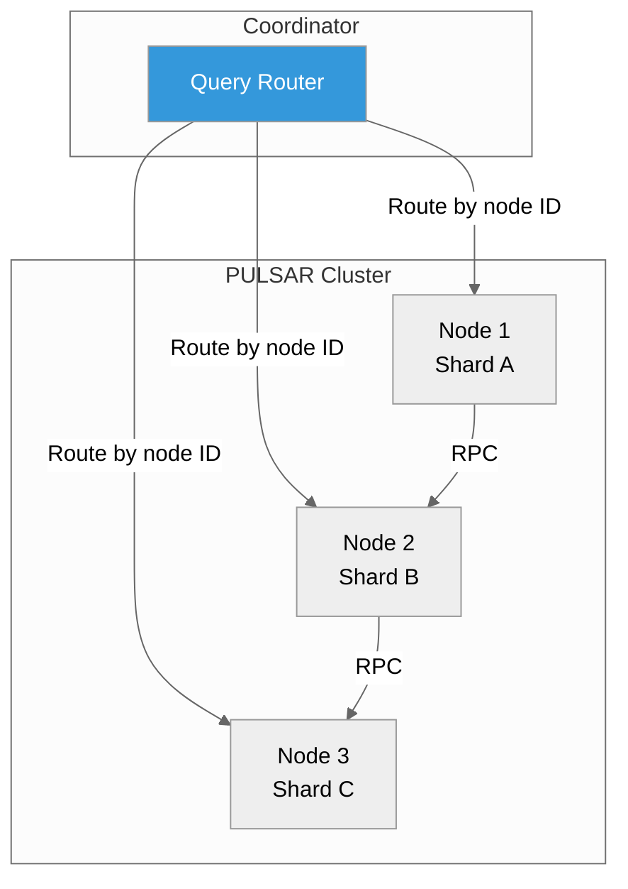
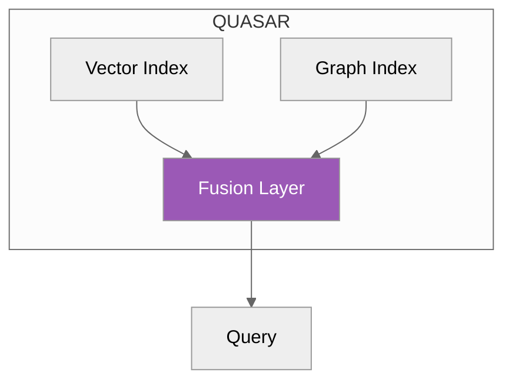
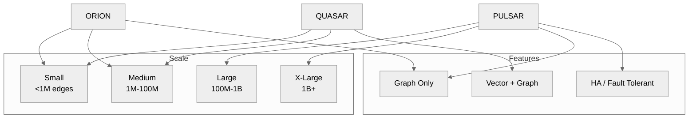

# Graph Engines

**ORION, PULSAR, QUASAR: Native graph databases**



---

## Overview

ProximaDB includes 3 graph engines for different scales and use cases:

| Engine | Scale | Features | Traversal Speed |
|--------|-------|----------|-----------------|
| **ORION** | Single node | In-memory CSR, WAL persistence | 1M+ edges/sec |
| **PULSAR** | Distributed | Shard-aware, fault-tolerant | Linear scalability |
| **QUASAR** | Hybrid | Vector + graph unified | Fast + semantic |

---

## ORION Engine

**In-memory graph with CSR format and WAL persistence**



### Architecture

**Compressed Sparse Row (CSR) Format:**
```rust
// CSR representation
struct CSRGraph {
    offsets: Vec<usize>,    // Where each node's edges start
    targets: Vec<NodeID>,   // Target node IDs
    edge_data: Vec<Edge>,   // Edge properties
}
```

**Benefits:**
- Memory efficient: O(V + E) storage
- Cache-friendly: Sequential access
- Zero-copy: Arc-based sharing

### Features

| Feature | Description |
|---------|-------------|
| **In-Memory** | All data in RAM for fast access |
| **WAL Persistence** | Every write logged to disk |
| **Arc-based** | Zero-copy reads across threads |
| **Parallel Traversal** | Rayon-based parallel BFS/DFS |

### Performance

| Operation | Speed |
|-----------|-------|
| Single-hop traversal | <1ms |
| Multi-hop (3 hops) | ~3ms |
| BFS (1000 nodes) | ~10ms |
| Path finding | ~5ms |
| Throughput | 1M+ edges/sec |

### Usage

```python
# Create graph
graph = client.create_graph(
    name="social",
    engine="orion"
)

# Add nodes
graph.add_nodes([
    {"id": 1, "type": "User", "name": "Alice"},
    {"id": 2, "type": "User", "name": "Bob"}
])

# Add edges
graph.add_edges([
    {"source": 1, "target": 2, "relation": "FRIEND"}
])

# Traverse
results = graph.traverse(
    start_node=1,
    pattern="FRIEND>",
    max_depth=2
)
```

### Best For

- Social networks
- Knowledge graphs
- Dependency graphs
- Real-time recommendations

---

## PULSAR Engine

**Distributed graph with shard-aware routing**



### Architecture

**Sharding Strategy:**
- Consistent hashing by node ID
- Each node owns a shard of the graph
- Cross-shard traversals via RPC

**Fault Tolerance:**
- Replicated shards (configurable)
- Automatic re-replication on failure
- Raft consensus for metadata

### Features

| Feature | Description |
|---------|-------------|
| **Shard-aware** | Queries routed to relevant shards |
| **Cross-shard traversal** | RPC-based communication |
| **Replication** | Configurable replication factor |
| **Rebalancing** | Automatic shard redistribution |

### Performance

| Metric | Value |
|--------|-------|
| Single-shard traversal | Same as ORION |
| Cross-shard traversal | +5-10ms latency |
| Scale | Linear with nodes |
| Max graph size | 1B+ edges (cluster) |

### Usage

```python
# Configure cluster
graph = client.create_graph(
    name="global_social",
    engine="pulsar",
    config={
        "replication_factor": 3,
        "shard_count": 10
    }
)

# Queries are automatically routed
results = graph.traverse(
    start_node=12345,  # Automatically routed to correct shard
    pattern="FRIEND>*",  # Cross-shard traversal
    max_depth=3
)
```

### Best For

- Large social networks (100M+ edges)
- Global knowledge graphs
- Multi-datacenter deployments
- High availability requirements

---

## QUASAR Engine

**Hybrid vector + graph engine**



### Architecture

**Dual Index:**
- Nodes have vector embeddings
- Edges have graph structure
- Fusion layer combines both

**Unified Query:**
```cypher
// Find friends who are also semantically similar
MATCH (me:User {id: 123})-[:FRIEND]->(friend:User)
WHERE friend.embedding VECTOR_NEAR([0.1, 0.2, ...], 0.8)
RETURN friend
```

### Features

| Feature | Description |
|---------|-------------|
| **Vector + Graph** | Nodes have embeddings + edges |
| **Hybrid search** | Traversal + similarity |
| **Fusion strategies** | Combine graph and vector scores |
| **Single storage** | No separate vector DB |

### Performance

| Operation | Speed |
|-----------|-------|
| Graph-only traversal | Same as ORION |
| Vector-only search | Same as SST |
| Hybrid query | ~20ms (fusion overhead) |
| Re-ranking | ~5ms additional |

### Usage

```python
# Create hybrid graph
graph = client.create_graph(
    name="semantic_graph",
    engine="quasar",
    vector_dimension=384
)

# Add nodes with embeddings
graph.add_nodes([
    {
        "id": 1,
        "embedding": [0.1, 0.2, ...],
        "metadata": {"name": "Alice", "type": "User"}
    }
])

# Add edges
graph.add_edges([
    {"source": 1, "target": 2, "relation": "KNOWS"}
])

# Hybrid search: friends + similar
results = graph.hybrid_search(
    start_node=1,
    pattern="KNOWS>*",
    query_vector=[0.1, 0.2, ...],
    alpha=0.7  # 70% graph, 30% vector
)
```

### Best For

- Semantic search over knowledge graphs
- Recommendation systems with social proof
- Content discovery with relationships
- Fraud detection (connections + patterns)

---

## Engine Comparison



### Decision Matrix

| Requirement | Best Engine |
|-------------|-------------|
| Start simple, scale later | ORION → PULSAR |
| Need vectors + graphs | QUASAR |
| Single server, max performance | ORION |
| Multi-datacenter, HA | PULSAR |
| Recommendations with social graph | QUASAR |
| Global knowledge graph | PULSAR |

---

## Query Patterns

### Traversal Patterns

```cypher
-- 1-hop: Direct friends
MATCH (a:User)-[:FRIEND]->(b:User)
WHERE a.id = 123
RETURN b

-- 2-hop: Friends of friends
MATCH (a:User)-[:FRIEND]->(b:User)-[:FRIEND]->(c:User)
WHERE a.id = 123
RETURN c

-- Variable depth: All reachable
MATCH (a:User)-[:FRIEND*1..3]->(b:User)
WHERE a.id = 123
RETURN b, length(path) as distance
```

### Shortest Path

```python
# Find shortest connection
path = graph.shortest_path(
    start_node=123,
    end_node=456,
    max_depth=6
)
# Returns: [123, 234, 345, 456]
```

### PageRank

```python
# Compute centrality
ranks = graph.pagerank(
    alpha=0.85,
    iterations=100
)
# Returns: {node_id: score}
```

### Community Detection

```python
# Find clusters
communities = graph.louvain_communities()
# Returns: {community_id: [node_ids]}
```

---

## Configuration

### Select Engine

```python
# ORION (default)
graph = client.create_graph("social", engine="orion")

# PULSAR (distributed)
graph = client.create_graph("global", engine="pulsar",
    config={"shard_count": 10, "replication_factor": 3}
)

# QUASAR (hybrid)
graph = client.create_graph("semantic", engine="quasar",
    config={"vector_dimension": 384}
)
```

### Graph Schema

```python
# Define node types
graph.create_node_type("User", {
    "name": "string",
    "age": "integer",
    "embedding": "vector(384)"
})

# Define edge types
graph.create_edge_type("FRIEND", {
    "since": "date",
    "strength": "float"
})
```

---

## Internals

### CSR Memory Layout

```rust
// ORION's in-memory representation
pub struct CSRGraph {
    // For each node, where do its edges start?
    pub offsets: Vec<usize>,

    // Target node IDs
    pub targets: Vec<NodeID>,

    // Edge properties
    pub edges: Vec<EdgeData>,

    // Node properties
    pub nodes: Vec<NodeData>,
}
```

### Arc-based Zero-Copy

```rust
// Multiple traversals, no data copy
pub struct GraphView {
    pub graph: Arc<CSRGraph>,  // Shared reference
}

// Rayon parallel traversal
graph.par_bfs(|node| {
    // Process node, zero-copy access
    let neighbors = &graph.graph.neighbors[node];
});
```

---

## Next Steps

- [Storage Engines](./storage-engines.md) - Vector storage
- [Multi-Model Joins](../02-guides/multi-model-joins.md) - Graph + vector queries
- [Graph Queries](../02-guides/graph-queries.md) - Query patterns
- [Internals](../06-internals/) - Implementation details

---

*Need help?* [GitHub Issues](https://github.com/vjsingh1984/proximadb/issues)
