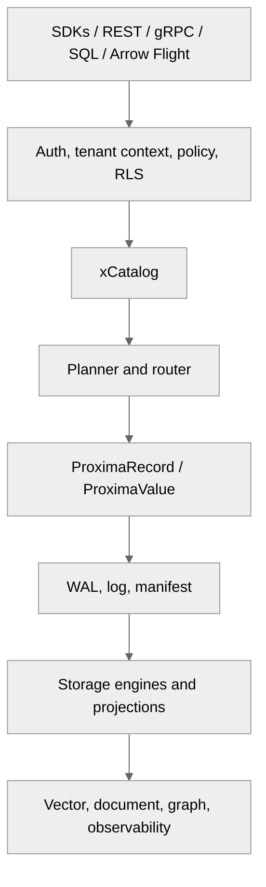

# Concepts

Stable conceptual documentation for ProximaDB users and contributors.

Current architecture blueprints live in [Architecture and Design](../12-design/README.adoc).
Historical or superseded concept docs live under [Archive](../_archive/README.md).

## Core Concepts

| Concept | Description | Status |
|---------|-------------|--------|
| [Architecture](./architecture.adoc) | Multi-model data-plane overview and high-level flow | Current |
| [Storage Engines](./storage-engines.adoc) | Engine selection and storage tradeoffs | Current |
| [Graph Runtime](./graph-engines.adoc) | ORION runtime and relational/storage substrate layering | Current |
| [Unified WAL](./unified-wal.md) | Shared durability path for data models | Current |
| [Query Planner](./query-planner.md) | Query optimization and execution concepts | Current |
| [Quantization](./quantization.md) | Vector compression and recall tradeoffs | Current |
| [Hybrid Fusion](./hybrid-fusion.adoc) | Score fusion across query modes | Current |

## How To Read This Section

1. Start with [Architecture](./architecture.adoc) for the shared data plane.
2. Use [Storage Engines](./storage-engines.adoc) and [Graph Engines](./graph-engines.adoc) to choose execution/storage paths.
3. Read [Unified WAL](./unified-wal.md) before changing durability or recovery behavior.
4. Read [Query Planner](./query-planner.md) before changing SQL, UQL, fusion, or multimodel planning.
5. Use [Architecture and Design](../12-design/README.adoc) for active LLDs, ADRs, and implementation trackers.

## Current Architecture Links

| Need | Start Here |
|------|------------|
| Top-down workspace and SaaS/core map | [Architecture Atlas](../12-design/ARCHITECTURE_ATLAS_2026_05_22.adoc) |
| Module-level LLD ownership | [Module Component LLD Map](../12-design/MODULE_COMPONENT_LLD_2026_05_22.adoc) |
| Documentation ownership and archive rules | [Documentation Consolidation Plan](../12-design/DOCUMENTATION_CONSOLIDATION_AND_ARCHIVE_PLAN_2026_05_22.adoc) |
| Supported feature claims | [Supported Surface](../SUPPORTED_SURFACE.adoc) |
| API and protocol references | [API Reference](../03-api-reference/) |

## Design Principles

### Unified Authority

Durable truth flows through xCatalog, WAL/log/manifest state, canonical records, policy/RLS,
versioning, and provenance. Protocols and modality-specific APIs are adapters over that authority.

### Explicit Route Decisions

Storage specialization, compute routing, freshness, policy boundaries, and authority mode should be
cataloged and explainable. User-visible routing choices belong in EXPLAIN-style metadata.

### Projections Are Not Hidden Truth

ANN indexes, graph topology, JSON indexes, observability rollups, caches, and open-format files are
derived state unless xCatalog explicitly declares an external-authoritative mode.

### Consolidate Before Expanding

When a feature overlaps an existing planner, handler, catalog, storage, or modality path, update the
canonical owner instead of adding a parallel path. Use the design docs above to decide ownership.

## Related Guides

- [Vector Search](../02-guides/vector-search.md) - Builder-facing vector search workflow
- [Multi-Model Joins](../02-guides/multi-model-joins.md) - Cross-model SQL query patterns
- [API Surface and Performance](../02-guides/api-surface-performance-guide.md) - Choosing SDK, SQL, UQL, REST/gRPC, pgwire, or Arrow Flight
- [Configuration](../03-api-reference/configuration.adoc) - Runtime and deployment settings
- [Internals](../06-internals/) - Contributor workflows and implementation details
