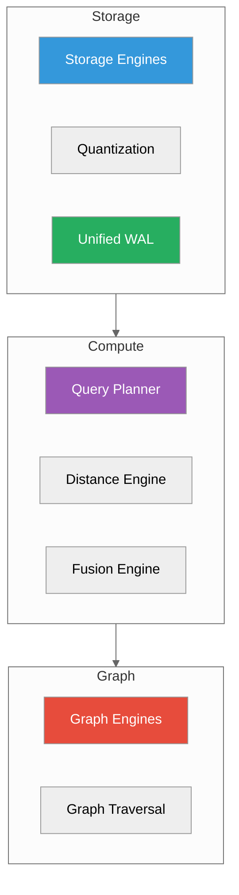
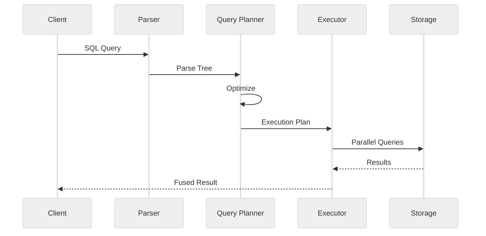

# Concepts

**Understanding how ProximaDB works**

---

## Core Concepts

| Concept | Description | Time |
|---------|-------------|------|
| [Storage Engines](./storage-engines.md) | 6 specialized engines for different workloads | 15 min |
| [Graph Engines](./graph-engines.md) | ORION, PULSAR, QUASAR graph databases | 10 min |
| [Unified WAL](./unified-wal.md) | Single write-ahead log for all data models | 10 min |
| [Query Planner](./query-planner.md) | How queries are optimized and executed | 15 min |
| [Quantization](./quantization.md) | Vector compression techniques | 10 min |

---

## Quick Reference

### Storage Engines

| Engine | Best For | Latency |
|--------|----------|---------|
| **SST** | Real-time writes | ~5ms |
| **HELIX** | Locality queries | ~13ms |
| **VIPER** | Analytics | ~89ms |
| **SWIFT** | Small datasets | ~95ms |
| **NOVA** | Mixed workloads | ~101ms |
| **RAPTOR** | Adaptive | ~9ms |

### Graph Engines

| Engine | Scale | Feature |
|--------|-------|---------|
| **ORION** | Single node | Fastest traversal |
| **PULSAR** | Distributed | Scalable |
| **QUASAR** | Hybrid | Vector + graph |

### Query Flow

---

## Learning Path

### New Users
1. Start with [Storage Engines](./storage-engines.md) to understand data storage
2. Read [Query Planner](./query-planner.md) to understand query execution
3. Browse [Quantization](./quantization.md) for performance optimization

### Advanced Users
1. Deep dive into [Unified WAL](./unified-wal.md) for durability guarantees
2. Study [Graph Engines](./graph-engines.md) for graph use cases
3. Review [Architecture](../01-quick-start/architecture-basics.md) for system design

### Contributors
1. Understand all storage engines
2. Learn query planner internals
3. Study graph engine implementations
4. Read [Internals](../06-internals/) for contribution guide

---

## Key Design Principles

### 1. Unified Data Plane

All data models (vectors, documents, graphs, observability) share:
- Single WAL for durability
- Unified memtable layer
- Cross-model query engine

### 2. Engine Specialization

Different workloads need different storage:
- Real-time → SST
- Analytics → VIPER
- Adaptive → RAPTOR

### 3. Zero-Copy Operations

Arc-based memory sharing for:
- Graph traversal (no data copy)
- Multi-model joins (direct reference)
- Caching (shared memory)

### 4. Hardware Acceleration

Runtime CPU feature detection:
- AVX2/AVX512 for distance calculations
- SIMD for quantization
- GPU support (future)

---

## Performance Characteristics

### Throughput

| Operation | QPS |
|-----------|-----|
| Vector search (10K) | ~10K |
| Document query | ~50K |
| Graph traversal | ~1M edges/sec |
| WAL append | ~100K writes/sec |

### Latency

| Operation | P50 | P99 |
|-----------|-----|-----|
| Vector search | 5ms | 20ms |
| Document write | 1ms | 5ms |
| Graph hop | <1ms | 5ms |

### Scalability

| Dimension | Limit |
|-----------|-------|
| Vectors per collection | 1B+ |
| Collection size | 10TB+ |
| Graph edges | 1B+ |
| Concurrent clients | 10K+ |

---

## Related Topics

- [Architecture Basics](../01-quick-start/architecture-basics.md) - System overview
- [Performance Tuning](../02-guides/performance-tuning.md) - Optimization guide
- [Internals](../06-internals/) - Implementation details

---

*Need help?* [GitHub Issues](https://github.com/vjsingh1984/proximadb/issues)
