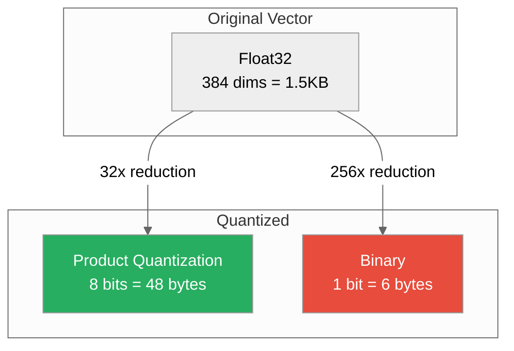
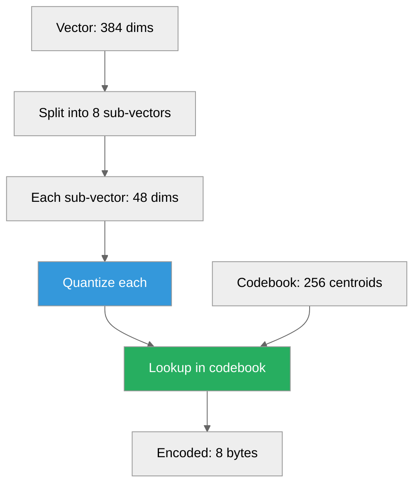
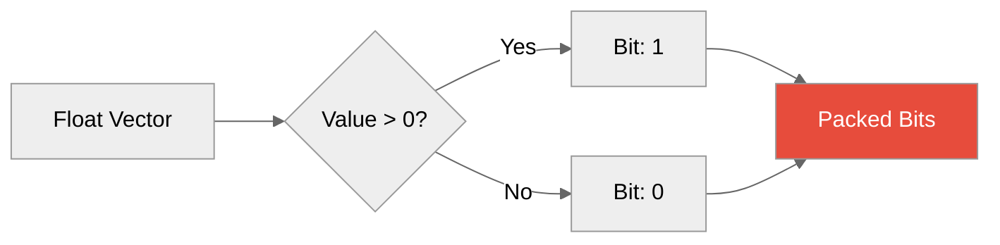
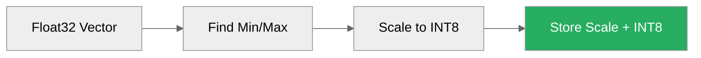
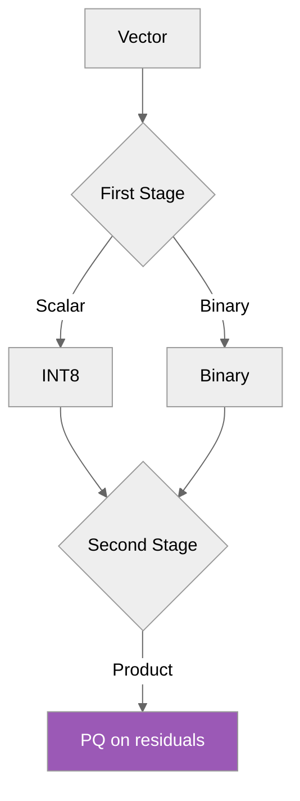
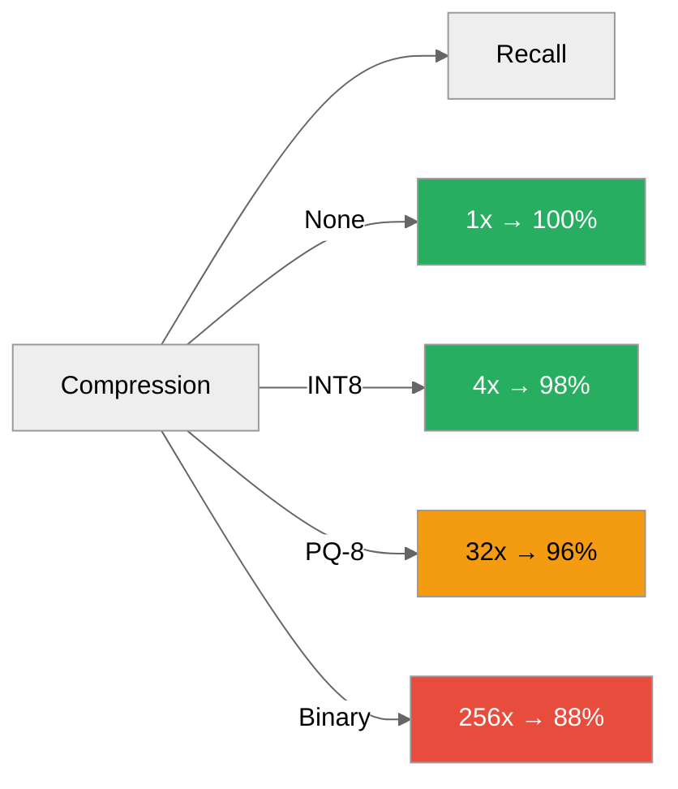
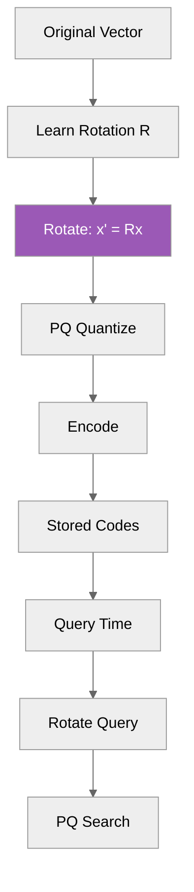

# Quantization

**Vector compression for memory efficiency**



---

## Overview

Quantization reduces vector memory footprint with minimal accuracy loss:

| Method | Compression | Accuracy | Use Case |
|--------|-------------|----------|----------|
| **None (F32)** | 1x | 100% | Highest quality needed |
| **Product (PQ)** | 32x | 95-98% | General purpose |
| **Binary** | 256x | 85-90% | Extremely large datasets |
| **Scalar (INT8)** | 4x | 98-99% | Balanced |

---

## Product Quantization (PQ)

### How It Works



### Algorithm

1. **Training Phase** (one-time):
   ```python
   # Split vectors into M sub-vectors
   # For each sub-vector, run k-means to find K centroids
   codebooks = train_pq(vectors, M=8, K=256)
   ```

2. **Encoding**:
   ```python
   # Encode vector to codes
   codes = pq_encode(vector, codebooks)
   # Result: [45, 128, 23, ...]  # 8 bytes
   ```

3. **Decoding** (for search):
   ```python
   # Reconstruct from codes
   reconstructed = pq_decode(codes, codebooks)
   ```

### Configuration

```python
collection = client.create_collection(
    name="products",
    dimension=384,
    quantization={
        "type": "product",
        "bits": 8,          # 256 centroids per sub-vector
        "subvectors": 8     # Split into 8 parts
    }
)
```

### Performance

| Metric | F32 | PQ-8 |
|--------|-----|------|
| Memory | 1.5KB/vector | 48B/vector |
| Recall @10 | 100% | 95-98% |
| Encode time | - | ~0.1ms |
| Query time | 5ms | 6ms (+20%) |

---

## Binary Quantization

### How It Works



### Algorithm

```python
def binary_quantize(vector):
    # Convert to bits
    bits = (vector > 0).astype(np.uint8)
    # Pack into bytes
    packed = np.packbits(bits)
    return packed  # 48 bytes for 384 dims
```

### Distance Computation

```python
# Hamming distance for binary vectors
def hamming_distance(a, b):
    return np.count_nonzero(a != b)

# Or use XOR + popcount
def fast_hamming(a, b):
    return np.unpackbits(a ^ b).sum()
```

### Configuration

```python
collection = client.create_collection(
    name="products",
    dimension=384,
    quantization={
        "type": "binary"
    }
)
```

### Performance

| Metric | F32 | Binary |
|--------|-----|--------|
| Memory | 1.5KB/vector | 6B/vector |
| Recall @10 | 100% | 85-90% |
| Query time | 5ms | 2ms (fast!) |

**Best for:**
- Extremely large datasets (>100M vectors)
- Approximate search is acceptable
- Memory-constrained environments

---

## Scalar Quantization (INT8)

### How It Works



### Algorithm

```python
def scalar_quantize(vector):
    # Find range
    min_val, max_val = vector.min(), vector.max()
    scale = (max_val - min_val) / 255

    # Quantize
    quantized = ((vector - min_val) / scale).astype(np.int8)

    # Return with metadata
    return {
        "data": quantized,
        "min": min_val,
        "scale": scale
    }
```

### Configuration

```python
collection = client.create_collection(
    name="products",
    dimension=384,
    quantization={
        "type": "scalar",
        "bits": 8
    }
)
```

### Performance

| Metric | F32 | INT8 |
|--------|-----|------|
| Memory | 1.5KB/vector | 384B/vector |
| Recall @10 | 100% | 98-99% |
| Query time | 5ms | 5.5ms (+10%) |

**Best for:**
- Balanced compression and accuracy
- General-purpose use
- SIMD acceleration (fast!)

---

## Hybrid Quantization



### Example: Scalar + Product

```python
# First: Scalar quantization
int8_vector = scalar_quantize(vector)

# Second: PQ on residuals
residuals = vector - int8_vector.decode()
pq_codes = pq_encode(residuals)

# Total: 4x + 32x = 128x compression with good accuracy
```

---

## SIMD Acceleration

### AVX2 INT8 Distance

```rust
#[cfg(target_arch = "x86_64")]
use std::arch::x86_64::*;

pub unsafe fn int8_dot_product_avx2(a: &[i8], b: &[i8]) -> i32 {
    let mut sum = _mm256_setzero_si256();
    let chunks = a.chunks_exact(32);
    let remainder = chunks.remainder();

    for (chunk_a, chunk_b) in chunks.zip(b.chunks_exact(32)) {
        let va = _mm256_loadu_si256(chunk_a.as_ptr() as *const __m256i);
        let vb = _mm256_loadu_si256(chunk_b.as_ptr() as *const __m256i);
        let prod = _mm256_madd_epi16(va, vb);
        sum = _mm256_add_epi32(sum, prod);
    }

    let mut result = [0i32; 8];
    _mm256_storeu_si256(result.as_mut_ptr() as *mut __m256i, sum);
    result.iter().sum() + remainder_dot(remainder, b)
}
```

**Performance:** ~10x faster than scalar!

---

## Quantization vs Accuracy

### Recall Trade-offs



### Choosing the Right Method

| Requirement | Method |
|-------------|--------|
| Highest accuracy | None (F32) |
| Balanced | INT8 |
| Memory-constrained | PQ-8 |
| Extreme compression | Binary |
| Best recall/memory ratio | PQ-8 + OPQ |

---

## Optimized Product Quantization (OPQ)

### Rotation Before Quantization



### Algorithm

1. **Learn rotation** (one-time, on sample data):
   ```python
   # Find rotation that minimizes PQ error
   R = learn_opq_rotation(sample_vectors, M=8, K=256)
   ```

2. **Encode with rotation**:
   ```python
   rotated = R @ vector
   codes = pq_encode(rotated, codebooks)
   ```

### Performance

| Method | Recall @10 | Memory |
|--------|------------|--------|
| F32 | 100% | 1x |
| PQ | 96% | 32x |
| OPQ | 98% | 32x |

**OPQ gives +2% recall for same compression!**

---

## Configuration Examples

### Memory-Constrained

```python
collection = client.create_collection(
    name="products",
    dimension=384,
    quantization={
        "type": "product",
        "bits": 8,
        "subvectors": 16  # More compression
    }
)
# Memory: 32 bytes/vector (48x compression)
```

### Accuracy-Critical

```python
collection = client.create_collection(
    name="products",
    dimension=384,
    quantization={
        "type": "scalar",
        "bits": 8
    }
)
# Memory: 384 bytes/vector (4x compression)
# Recall: 98-99%
```

### Speed-Critical

```python
collection = client.create_collection(
    name="products",
    dimension=384,
    quantization={
        "type": "binary"
    }
)
# Memory: 6 bytes/vector (256x compression)
# Query: 2ms (fastest!)
```

---

## Monitoring

### Quantization Metrics

```bash
curl http://localhost:5678/metrics | grep quantization
```

**Metrics:**
```
proximadb_quantization_encode_duration_seconds{type="pq"} 0.0001
proximadb_quantization_query_error{type="pq"} 0.02
proximadb_quantization_compression_ratio{type="pq"} 32.0
```

---

## Best Practices

1. **Start with INT8**: Good balance, easy to tune
2. **Use PQ for large datasets**: 32x compression with good recall
3. **Binary for extreme scale**: When you have 100M+ vectors
4. **OPQ for better recall**: If PQ accuracy isn't enough
5. **Profile before choosing**: Measure recall on your data

---

## Next Steps

- [Storage Engines](./storage-engines.md) - How quantization fits with engines
- [Performance Tuning](../02-guides/performance-tuning.md) - Optimization guide
- [Vector Search](../02-guides/vector-search.md) - Search with quantization

---

*Need help?* [GitHub Issues](https://github.com/vjsingh1984/proximadb/issues)
