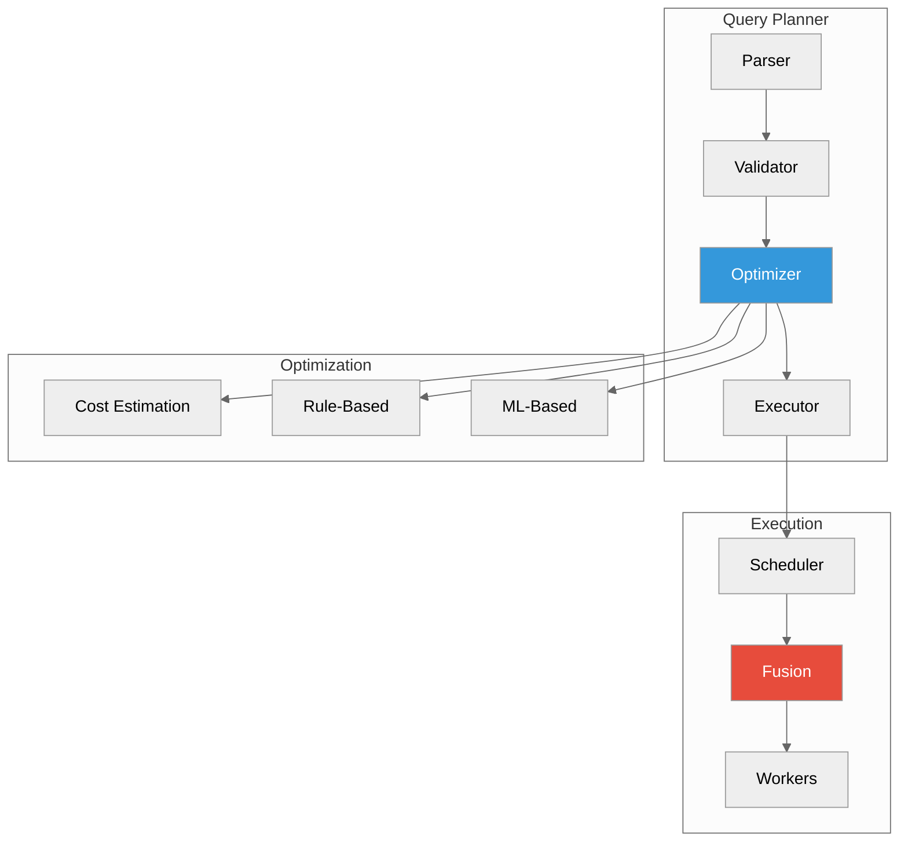
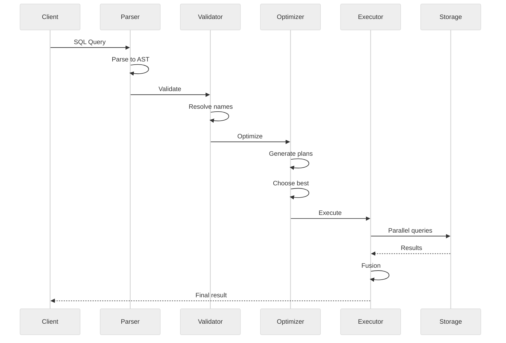
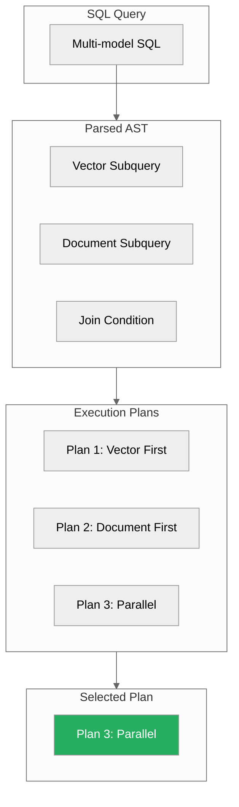
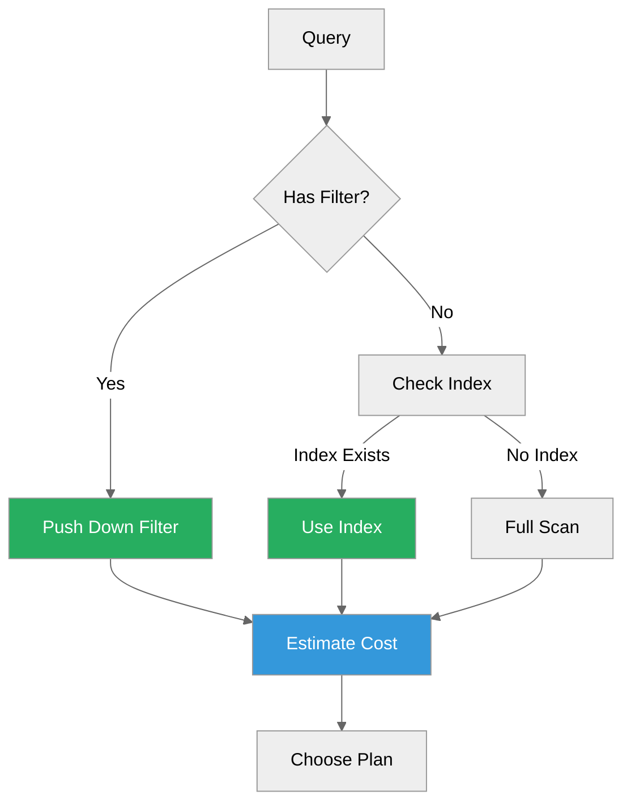
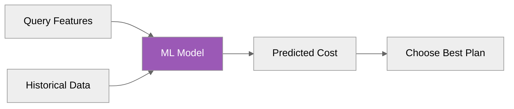
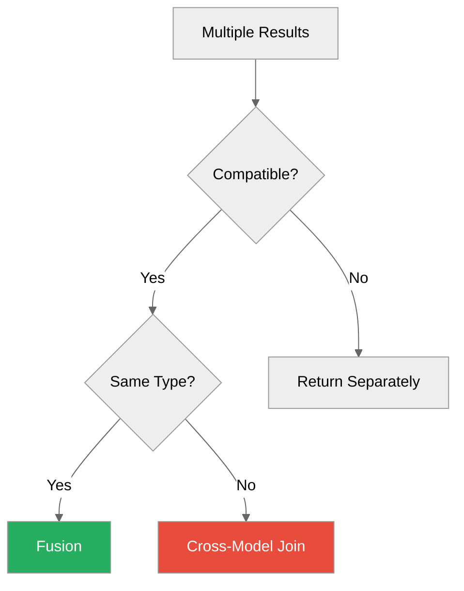
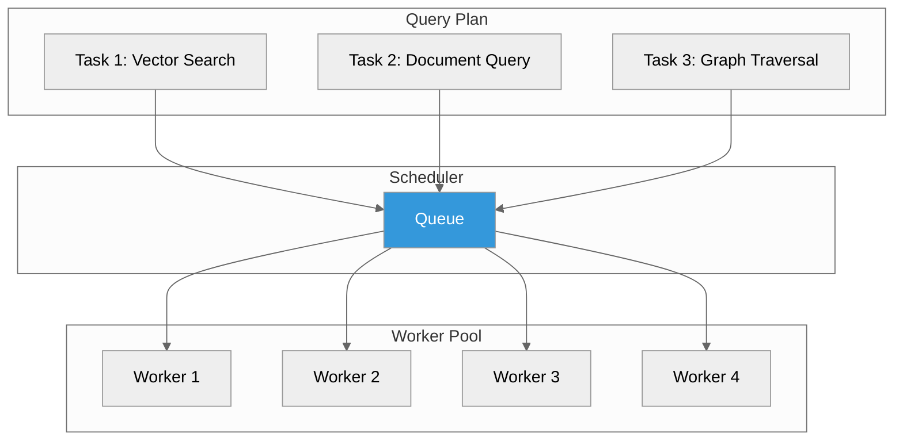
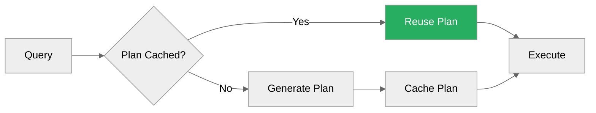

# Query Planner

**How ProximaDB optimizes and executes queries**



---

## Overview

The query planner transforms SQL queries into optimized execution plans:

| Stage | Description |
|-------|-------------|
| **Parser** | Parse SQL into AST |
| **Validator** | Check semantics, resolve names |
| **Optimizer** | Choose best execution plan |
| **Executor** | Run plan, fuse results |

---

## Query Processing Pipeline



---

## Multi-Model Query Decomposition

### Input Query

```sql
SELECT v.id, d.content
FROM VECTOR_SEARCH('items', ?1, 10) AS v
JOIN DOCUMENT_QUERY('docs', 'id = "' || v.id || '"') AS d
```

### Decomposition



### Execution Plans

**Plan 1: Sequential (Vector first)**
```
1. Execute VECTOR_SEARCH -> 10 results (5ms)
2. For each result, execute DOCUMENT_QUERY (5 * 2ms = 10ms)
3. Join results
Total: 15ms
```

**Plan 2: Sequential (Document first)**
```
1. Execute DOCUMENT_QUERY -> 100 results (50ms)
2. For each, check vector score
3. Filter top 10
Total: 100ms (worse)
```

**Plan 3: Parallel (chosen)**
```
1. Execute VECTOR_SEARCH (5ms)
2. Execute DOCUMENT_QUERY in parallel (50ms, but async)
3. Stream join as results arrive
Total: 10ms (best!)
```

---

## Optimization Strategies

### 1. Rule-Based Optimization



**Rules:**
1. Push filters to storage engine
2. Use indexes when available
3. Reorder joins (small table first)
4. Parallelize independent subqueries

### 2. Cost Estimation

```rust
// Cost model
pub struct CostModel {
    pub scan_cost: f64,      // Per row
    pub seek_cost: f64,      // Per lookup
    pub cpu_cost: f64,       // Per operation
    pub network_cost: f64,   // Per RPC (distributed)
}

// Estimate plan cost
pub fn estimate_cost(plan: &Plan, stats: &Statistics) -> Cost {
    let rows = plan.estimate_rows(stats);
    Cost {
        cpu: rows * cpu_cost,
        io: rows * scan_cost,
        network: plan.rpc_calls() * network_cost,
    }
}
```

**Statistics Used:**
- Collection cardinality
- Index selectivity
- Data distribution (histograms)
- Recent query performance

### 3. ML-Based Optimization (Future)



**Features:**
- Query pattern hash
- Collection sizes
- Filter selectivity
- Recent performance

---

## Fusion Strategies

### When to Fuse



### Fusion Algorithms

**1. Intersect Fusion**
```python
# Common results across searches
def intersect_fusion(results_list):
    return set(results_list[0]).intersection(*results_list[1:])
```

**2. Union Fusion**
```python
# All results
def union_fusion(results_list):
    return set().union(*results_list)
```

**3. RRF (Reciprocal Rank Fusion)**
```python
def rrf_fusion(results_list, k=60):
    scores = {}
    for results in results_list:
        for rank, item in enumerate(results):
            scores[item] = scores.get(item, 0) + 1 / (k + rank)
    return sorted(scores.items(), key=lambda x: -x[1])
```

**4. Weighted Fusion**
```python
def weighted_fusion(results_with_weights):
    scores = {}
    for results, weight in results_with_weights:
        for item, score in results:
            scores[item] = scores.get(item, 0) + score * weight
    return sorted(scores.items(), key=lambda x: -x[1])
```

---

## Parallel Execution

### Task Scheduling



### Concurrency Control

```toml
[query.execution]
max_parallel_tasks = 8
worker_threads = 4
max_concurrent_queries = 100
```

---

## Query Hints

### Force Plan

```sql
-- Force parallel execution
SELECT /*+ PARALLEL */ * FROM ...

-- Force index usage
SELECT /*+ USE_INDEX(my_idx) */ * FROM ...

-- Force sequential
SELECT /*+ SEQUENTIAL */ * FROM ...
```

### Set Fusion Strategy

```sql
-- Use RRF fusion
SELECT /*+ FUSION(RRF) */ *
FROM VECTOR_SEARCH(...)
UNION
SELECT * FROM DOCUMENT_QUERY(...);
```

---

## Caching

### Plan Cache



**Configuration:**
```toml
[query.cache]
enabled = true
max_plans = 1000
ttl_seconds = 3600
```

### Result Cache

```python
# Cache results for identical queries
results = client.query(
    "SELECT * FROM VECTOR_SEARCH(...)",
    use_cache=True,
    cache_ttl=60  # seconds
)
```

---

## Monitoring

### Query Profiling

```sql
-- Enable profiling
SET profiling = true;

-- Run query
SELECT * FROM VECTOR_SEARCH(...);

-- View profile
SHOW PROFILE;
```

**Output:**
```
+----------------------+----------+----------+
| Stage                | Time     | Rows     |
+----------------------+----------+----------+
| Parse                | 0.1ms    | -        |
| Validate             | 0.5ms    | -        |
| Optimize             | 2.0ms    | -        |
| Vector Search        | 5.2ms    | 10       |
| Document Query       | 8.1ms    | 10       |
| Fusion               | 0.3ms    | 10       |
| Total                | 16.2ms   | 10       |
+----------------------+----------+----------+
```

### Slow Query Log

```toml
[query.slow_query_log]
enabled = true
threshold_ms = 1000
log_file = "/var/log/proximadb/slow.log"
```

---

## Performance Tuning

### Optimize for Latency

```toml
[query]
max_parallel_tasks = 2  # Reduce overhead
worker_threads = 2
plan_cache.enabled = true
result_cache.enabled = true
```

### Optimize for Throughput

```toml
[query]
max_parallel_tasks = 16  # More parallelism
worker_threads = 8
plan_cache.enabled = true
result_cache.enabled = false  # Don't cache, just execute
```

---

## Best Practices

1. **Use filters at source:**
   ```sql
   -- Good: Filter in vector search
   VECTOR_SEARCH('items', vec, 10, filter='category="A"')

   -- Bad: Filter after search
   SELECT * FROM VECTOR_SEARCH('items', vec, 100) WHERE category="A"
   ```

2. **Limit subquery results:**
   ```sql
   -- Good: Limit each subquery
   (SELECT * FROM VECTOR_SEARCH(...) LIMIT 10)
   UNION
   (SELECT * FROM DOCUMENT_QUERY(...) LIMIT 10)

   -- Bad: Unbounded
   SELECT * FROM VECTOR_SEARCH(...) UNION SELECT * FROM DOCUMENT_QUERY(...)
   ```

3. **Use appropriate fusion:**
   - `INTERSECT` for common results
   - `RRF` for ranked fusion
   - `WEIGHTED` for custom scoring

---

## Next Steps

- [Multi-Model Joins](../02-guides/multi-model-joins.md) - Query patterns
- [API Reference](../03-api-reference/) - SQL and protocol reference
- [API Surface and Performance](../02-guides/api-surface-performance-guide.md) - Optimization guide

---

*Need help?* [GitHub Issues](https://github.com/vjsingh1984/proximadb/issues)
