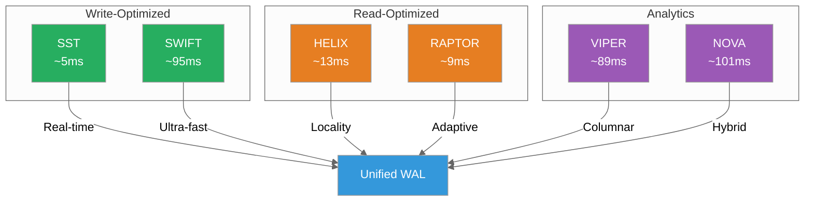
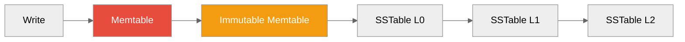
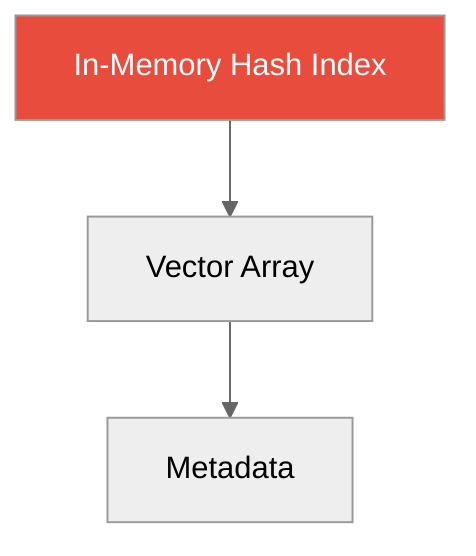
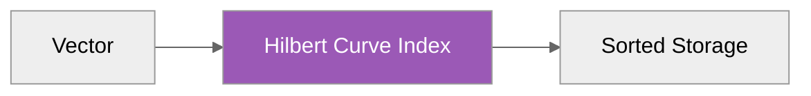
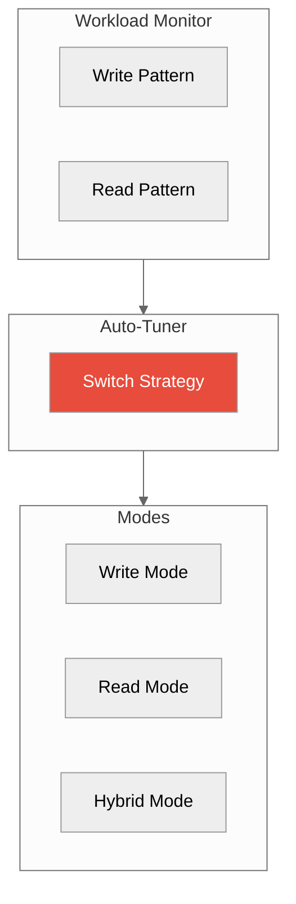
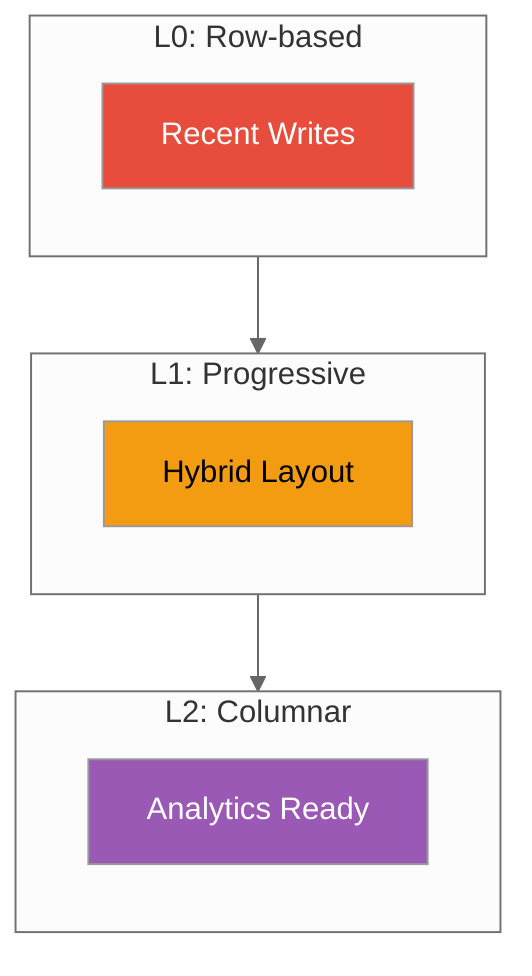
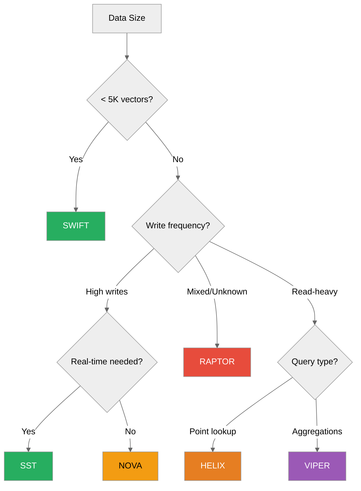

# Storage Engines

**6 specialized engines for different workloads**



---

## Overview

ProximaDB offers 6 storage engines, each optimized for specific workloads:

| Engine | Best For | Write Speed | Query Speed | Memory |
|--------|----------|-------------|-------------|--------|
| **SST** | Real-time, high-velocity | 🟢 Fastest | 🟡 Medium | Low |
| **SWIFT** | Ultra-low latency (<5K vectors) | 🟢 Fastest | 🟢 Fastest | Very Low |
| **HELIX** | Locality-optimized queries | 🟡 Medium | 🟢 Fast | Medium |
| **RAPTOR** | Adaptive, dynamic workloads | 🟢 Fast | 🟢 Fast | Adaptive |
| **VIPER** | Columnar analytics | 🟡 Medium | 🟡 Medium | High |
| **NOVA** | Mixed workloads | 🟡 Medium | 🟡 Medium | Medium |

---

## SST Engine

**Write-optimized LSM-tree with real-time compaction**



**Characteristics:**
- Log-Structured Merge (LSM) tree design
- LZ4 compression for SSTables
- Tiered compaction strategy
- Bloom filters for fast lookups

**Best for:**
- Real-time data ingestion
- Time-series data
- High write throughput scenarios

**Performance:**
- Writes: ~5ms (P99)
- Queries: ~10-20ms (depends on level)

**Configuration:**
```toml
[storage.engines.sst]
memtable_size_mb = 256
sstable_size_mb = 64
compression = "lz4"
bloom_filter_bits_per_key = 10
```

---

## SWIFT Engine

**Ultra-low latency for small datasets**



**Characteristics:**
- Everything in memory
- No disk I/O for queries
- Simple hash index
- Lock-free reads (Arc-based)

**Best for:**
- Small datasets (<5K vectors)
- Caching layer
- Prototyping and testing

**Performance:**
- Writes: ~1ms (memory only)
- Queries: <1ms (no disk)

**Limitations:**
- Max ~5K vectors
- Data lost on crash (no WAL)
- Not for production use

---

## HELIX Engine

**Locality-optimized using Hilbert curve space-filling**



**Characteristics:**
- Hilbert curve Z-ordering
- Spatial locality preserved
- Range queries optimized
- LSM-tree base with spatial index

**Best for:**
- Spatial queries (find neighbors in region)
- Geographic data
- Time-series with spatial correlation

**Performance:**
- Writes: ~20ms (index computation overhead)
- Queries: ~13ms (excellent for range queries)

**Configuration:**
```toml
[storage.engines.helix]
hilbert_order = 16  # Precision
enable_spatial_index = true
```

---

## RAPTOR Engine

**Adaptive engine with auto-tuning**



**Characteristics:**
- Monitors access patterns
- Switches between write/read modes
- Automatic cache sizing
- Predictive pre-fetching

**Best for:**
- Unknown or varying workloads
- Multi-tenant environments
- "Set and forget" scenarios

**Performance:**
- Writes: ~5-20ms (adaptive)
- Queries: ~9ms (adaptive)
- Auto-tuning overhead: <5%

**Configuration:**
```toml
[storage.engines.raptor]
auto_tune = true
adaptation_interval_sec = 60
prefetch_enabled = true
```

---

## VIPER Engine

**Columnar Parquet storage for analytics**


**Characteristics:**
- Apache Parquet format
- Column-level compression (Snappy/ZSTD)
- Row-group sized for queries
- Statistics for push-down filters

**Best for:**
- Analytics workloads
- Aggregation queries
- Large scans (filter + aggregate)

**Performance:**
- Writes: ~50ms (column conversion overhead)
- Queries: ~89ms (but excellent for aggregations)
- Scans: ~100MB/sec

**Configuration:**
```toml
[storage.engines.viper]
row_group_size = 10000
compression = "zstd"
statistics_enabled = true
```

---

## NOVA Engine

**Progressive columnar with hybrid design**



**Characteristics:**
- Progressive columnarization
- L0: Row-based (fast writes)
- L1: Hybrid (balanced)
- L2: Full columnar (analytics)

**Best for:**
- Mixed workloads
- Recent data + historical analytics
- Evolving access patterns

**Performance:**
- Writes: ~20ms (L0 row-based)
- Recent queries: ~15ms (L0/L1)
- Historical queries: ~100ms (L2 columnar)

**Configuration:**
```toml
[storage.engines.nova]
l0_max_size_mb = 256
l1_threshold_hours = 1
promote_to_columnar_after = "24h"
```

---

## Engine Selection Guide

### Decision Tree



### Quick Reference

| If you need... | Use... |
|---------------|--------|
| Fastest writes | SST |
| Lowest latency queries | SWIFT |
| Spatial queries | HELIX |
| Auto-tuning | RAPTOR |
| Analytics | VIPER |
| Mixed workloads | NOVA |

---

## Engine Comparison

### Write Performance

```
SWIFT (1ms) < SST (5ms) < RAPTOR (5-20ms) < HELIX (20ms) < NOVA (20ms) < VIPER (50ms)
```

### Query Performance

```
SWIFT (<1ms) < RAPTOR (9ms) < HELIX (13ms) < SST (15ms) < NOVA (15-100ms) < VIPER (89ms)
```

### Memory Usage

```
SWIFT (100%) < RAPTOR (adaptive) < HELIX (medium) < NOVA (medium) < SST (low) < VIPER (high)
```

---

## Configuration

### Select Engine at Collection Creation

```python
# Python SDK
collection = client.create_collection(
    name="products",
    dimension=384,
    engine="sst"  # sst, helix, viper, swift, nova, raptor
)
```

```bash
# REST API
curl -X POST http://localhost:5678/api/v1/collections \
  -d '{
    "name": "products",
    "engine": "sst"
  }'
```

### Change Engine (Migration Required)

```python
# Export from old engine
old_collection = client.get_collection("products", engine="sst")
vectors = old_collection.export()

# Import to new engine
new_collection = client.create_collection("products_v2", engine="viper")
new_collection.import(vectors)
```

---

## Internals

### Shared Components

All engines share:
- **Unified WAL**: Single write-ahead log
- **Block Cache**: Unified caching layer
- **Metrics Collection**: Consistent observability
- **Arc-based Memory**: Zero-copy operations

### Engine Plugin System

Engines implement `UnifiedStorageEngine` trait:

```rust
pub trait UnifiedStorageEngine: Send + Sync {
    async fn insert(&self, vectors: Vec<VectorRecord>) -> Result<()>;
    async fn search(&self, query: SearchRequest) -> Result<SearchResult>;
    async fn delete(&self, ids: Vec<ID>) -> Result<()>;
    fn engine_type(&self) -> EngineType;
}
```

---

## Next Steps

- [Graph Engines](./graph-engines.md) - Graph storage internals
- [Unified WAL](./unified-wal.md) - Durability layer
- [Query Planner](./query-planner.md) - Query optimization
- [Performance Tuning](../02-guides/performance-tuning.md) - Production tuning

---

*Need help?* [GitHub Issues](https://github.com/vjsingh1984/proximadb/issues)
