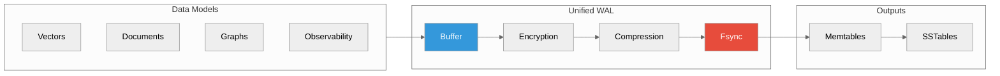
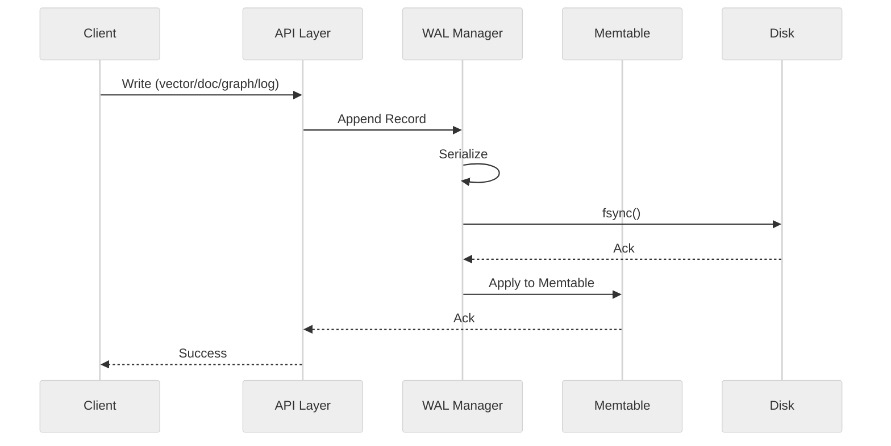
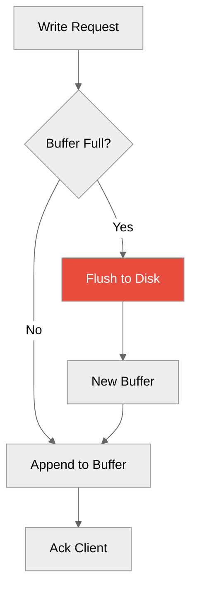
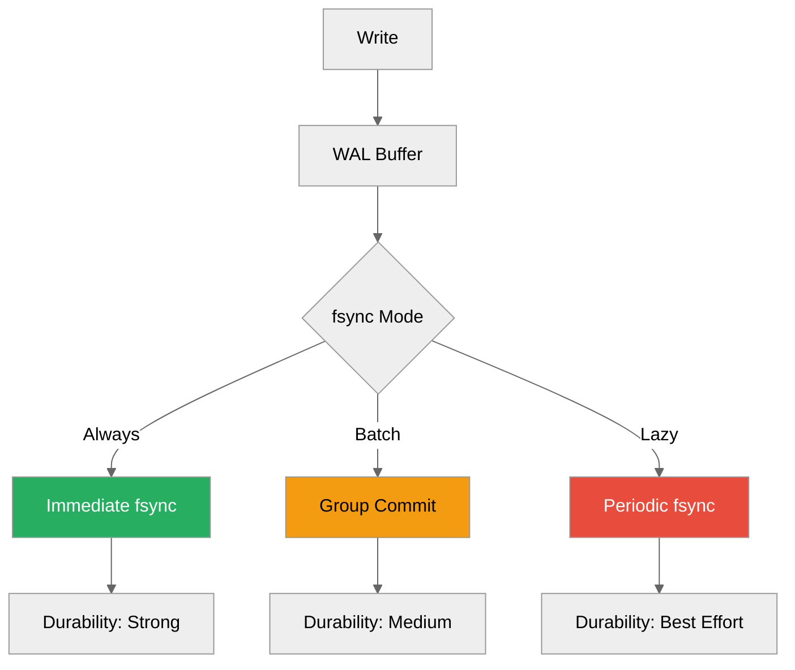
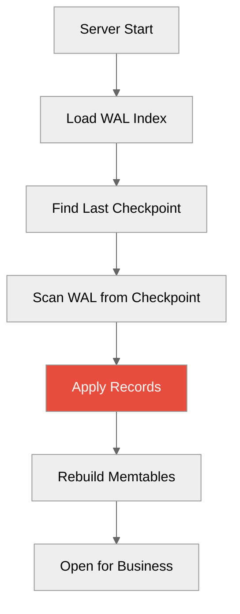
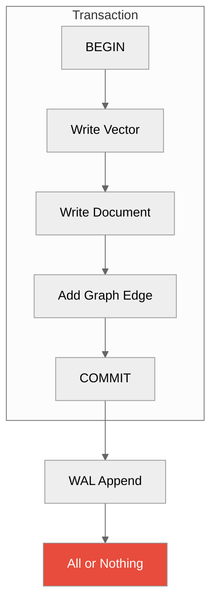
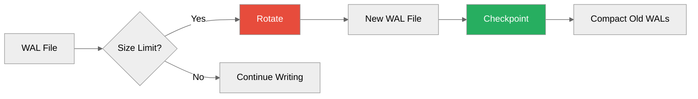
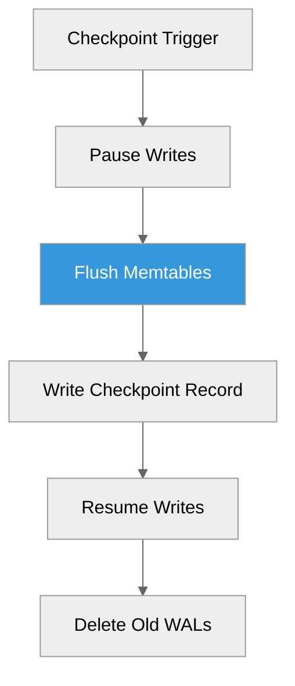
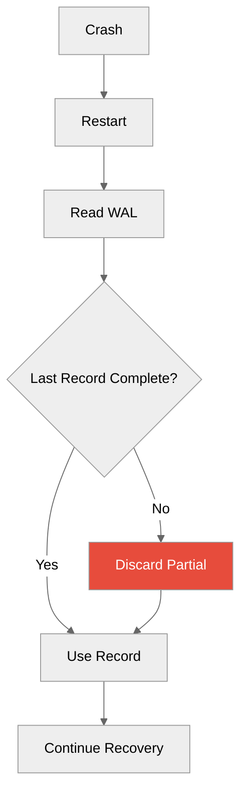
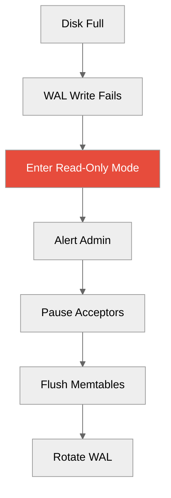

# Unified WAL

**Single write-ahead log for all data models**



---

## Overview

The Unified WAL is ProximaDB's single durability layer for all data models:

| Feature | Benefit |
|---------|---------|
| **Single ordering** | Global consistency across models |
| **Cross-model transactions** | ACID across vectors + documents |
| **Fast recovery** | Single log to replay |
| **Simplified operations** | One backup target |

---

## Architecture

### Write Path



### WAL Record Format

```rust
// Unified WAL record
pub struct WALRecord {
    pub lsn: LSN,              // Log Sequence Number
    pub timestamp: u64,
    pub model: ModelType,      // Vector, Document, Graph, Observability
    pub operation: OpType,     // Insert, Update, Delete
    pub data: Vec<u8>,         // Serialized payload
    pub checksum: u64,         // Integrity check
}
```

**Example Records:**
```
LSN 0001: VECTOR|INSERT|collection="products"|id=1|vector=[0.1,...]
LSN 0002: DOCUMENT|INSERT|collection="logs"|level="INFO"|msg="..."
LSN 0003: GRAPH|INSERT|graph="social"|edge=1->2|type="FRIEND"
LSN 0004: VECTOR|DELETE|collection="products"|id=1
```

---

## Components

### 1. WAL Manager

Coordinates all WAL operations:

```rust
pub struct WALManager {
    writer: WALWriter,
    buffer: CircularBuffer,
    config: WALConfig,
}
```

**Responsibilities:**
- Serialize records
- Manage buffer flushes
- Coordinate fsync
- Handle rotation

### 2. Buffer Management



**Tuning:**
```toml
[storage.wal]
buffer_size_mb = 64
flush_interval_ms = 10  # Max time before flush
flush_threshold = 0.8   # Flush at 80% capacity
```

### 3. Compression

Optional compression for WAL records:

```toml
[storage.wal.compression]
enabled = true
algorithm = "zstd"  # or "lz4", "snappy"
level = 3
```

**Trade-offs:**
| Algorithm | Ratio | Speed |
|-----------|-------|-------|
| **LZ4** | 2:1 | Fastest |
| **ZSTD** | 3:1 | Balanced |
| **Snappy** | 2.5:1 | Medium |

### 4. Encryption

At-rest encryption for WAL:

```toml
[storage.wal.encryption]
enabled = true
key_file = "/etc/proximadb/wal.key"
algorithm = "aes-256-gcm"
```

---

## Durability Guarantees

### Write Durability



**Configuration:**
```toml
[storage.wal]
fsync_mode = "always"  # always, batch, lazy
```

### Recovery Process



**Replay Performance:**
- ~100K records/sec
- Parallel replay by model type
- Checkpoint reduces replay time

---

## Cross-Model Transactions



### Example

```python
# Cross-model transaction
with client.transaction():
    # All these succeed or fail together
    collection.insert(vectors=[...], ids=[1])
    document_store.insert(docs=[{"id": "doc1", ...}])
    graph.add_edges([(1, 2, "RELATES_TO")])
    # Commit on exit
```

### ACID Guarantees

| Property | Implementation |
|----------|----------------|
| **Atomicity** | Single WAL transaction |
| **Consistency** | Validation before WAL |
| **Isolation** | MVCC + LSN ordering |
| **Durability** | fsync before ack |

---

## WAL Rotation

### Rotation Strategy



**Configuration:**
```toml
[storage.wal.rotation]
max_size_mb = 1024  # Rotate at 1GB
max_files = 10      # Keep 10 files
checkpoint_interval = "5m"
```

### Checkpointing

Background process to flush memtables:



---

## Monitoring

### WAL Metrics

```bash
# WAL write latency
curl http://localhost:5678/metrics | grep wal_write

# WAL size
curl http://localhost:5678/metrics | grep wal_size

# Checkpoint lag
curl http://localhost:5678/metrics | grep wal_checkpoint_lag
```

**Key Metrics:**
```
proximadb_wal_write_duration_seconds{quantile="p99"} 0.005
proximadb_wal_size_bytes 1073741824
proximadb_wal_records_total 1000000
proximadb_wal_checkpoint_lag_seconds 30
```

### WAL Statistics

```python
# Get WAL stats
stats = client.get_wal_stats()
print(f"LSN: {stats.current_lsn}")
print(f"WAL files: {stats.file_count}")
print(f"Size: {stats.size_mb}MB")
print(f"Write rate: {stats.writes_per_sec}/sec")
```

---

## Performance Tuning

### Throughput Optimization

```toml
[storage.wal]
# Larger buffer = fewer fsync calls
buffer_size_mb = 128

# Batch fsync for throughput
fsync_mode = "batch"

# Faster compression (less CPU)
compression.algorithm = "lz4"
```

**Result:** ~200K writes/sec

### Latency Optimization

```toml
[storage.wal]
# Smaller buffer = faster ack
buffer_size_mb = 16

# Immediate fsync for durability
fsync_mode = "always"

# No compression (less CPU)
compression.enabled = false
```

**Result:** ~1ms p99 write latency

---

## Failure Scenarios

### Crash During Write



### Corrupted WAL

```bash
# Detect corruption
proximadb-server --wal-check

# Repair from last checkpoint
proximadb-server --wal-repair
```

### Disk Full



---

## Best Practices

1. **Use appropriate fsync mode:**
   - `always` for critical data
   - `batch` for balanced
   - `lazy` for analytics (with backups)

2. **Monitor WAL growth:**
   - Set up alerts for WAL size
   - Regular checkpoints

3. **Backup WAL directory:**
   - Snapshot before upgrades
   - Archive for disaster recovery

4. **Tune buffer size:**
   - Larger for throughput
   - Smaller for latency

---

## Next Steps

- [Storage Engines](./storage-engines.md) - How WAL feeds engines
- [Query Planner](./query-planner.md) - Read path
- [Backup & Restore](../04-operations/) - WAL in backups

---

*Need help?* [GitHub Issues](https://github.com/vjsingh1984/proximadb/issues)
