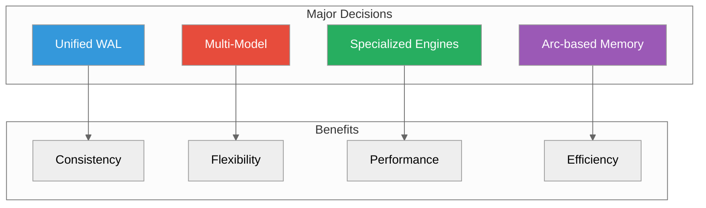

# Architecture Decisions

**Key design choices and their rationale**



---

## Decision Records

### ADR-001: Unified WAL for All Data Models

**Status**: Accepted

**Context**: ProximaDB supports vectors, documents, graphs, and observability data.

**Decision**: Use a single write-ahead log (WAL) for all data models.

**Rationale**:
- **Global ordering**: Single LSN provides global consistency
- **Cross-model transactions**: ACID guarantees across models
- **Simpler recovery**: One log to replay
- **Operational simplicity**: One backup target

**Trade-offs**:
- ✅ Simpler architecture
- ✅ Cross-model transactions
- ✅ Easier operations
- ❌ Single WAL could be bottleneck (mitigated with async flushing)
- ❌ WAL failure affects all models (mitigated with replication)

**Implementation**: `src/storage/persistence/write_ahead_log/`

---

### ADR-002: Specialized Storage Engines

**Status**: Accepted

**Context**: Different workloads have different access patterns.

**Decision**: Provide 6 specialized storage engines instead of one-size-fits-all.

**Rationale**:
- Real-time workloads need fast writes → SST
- Analytics need columnar scans → VIPER
- Small datasets need ultra-low latency → SWIFT

**Trade-offs**:
- ✅ Optimal performance per workload
- ✅ User choice and control
- ❌ More complex to maintain
- ❌ Users must choose correctly

**Engines**:
- **SST**: Write-optimized LSM-tree
- **HELIX**: Locality-optimized (Hilbert curve)
- **VIPER**: Columnar Parquet (analytics)
- **SWIFT**: In-memory (small datasets)
- **NOVA**: Progressive columnar (mixed)
- **RAPTOR**: Adaptive (auto-tuning)

**Implementation**: `src/storage/engines/impls/`

---

### ADR-003: Arc-based Zero-Copy Memory

**Status**: Accepted

**Context**: Graph traversals and multi-model joins need efficient data sharing.

**Decision**: Use `Arc<T>` for zero-copy shared ownership.

**Rationale**:
- **No data copies**: Multiple readers access same memory
- **Thread-safe**: Atomic reference counting
- **Automatic cleanup**: Drop when last reference released

**Trade-offs**:
- ✅ Zero-copy reads
- ✅ Thread-safe by default
- ✅ No manual memory management
- ❌ Atomic overhead (minimal)
- ❌ Reference cycles possible (rare in practice)

**Example**:
```rust
pub struct GraphView {
    pub graph: Arc<CSRGraph>,  // Shared reference
}

// Multiple traversals, no copies
let view1 = GraphView { graph: Arc::clone(&graph) };
let view2 = GraphView { graph: Arc::clone(&graph) };
```

**Implementation**: `src/graph/engines/orion/`

---

### ADR-004: Multi-Model Query Engine

**Status**: Accepted

**Context**: Users need to query across vectors, documents, and graphs together.

**Decision**: SQL-based query language with custom extensions.

**Rationale**:
- **Familiar**: SQL is well-known
- **Composable**: Easy to combine subqueries
- **Extensible**: Custom functions for each model

**Trade-offs**:
- ✅ SQL familiarity
- ✅ Tool ecosystem (clients, ORMs)
- ✅ Expressive joins
- ❌ SQL limitations (workaround with extensions)
- ❌ Learning curve for custom functions

**Extensions**:
- `VECTOR_SEARCH(collection, vector, k)`
- `DOCUMENT_QUERY(collection, filter)`
- `GRAPH_QUERY(graph, pattern)`
- `LOGS(stream, filter)`
- `METRICS(name, filter)`

**Implementation**: `src/query/`

---

### ADR-005: CSR Format for Graph Storage

**Status**: Accepted

**Context**: Need efficient graph traversal and storage.

**Decision**: Compressed Sparse Row (CSR) format for in-memory graphs.

**Rationale**:
- **Memory efficient**: O(V + E) storage
- **Cache friendly**: Sequential edge access
- **Fast traversal**: Pointer arithmetic

**Trade-offs**:
- ✅ Memory efficient
- ✅ Fast for traversals
- ✅ Immutable after construction
- ❌ Slow edge updates (rebuild CSR)
- ❌ Not suitable for write-heavy graphs

**Implementation**: `src/graph/engines/orion/`

---

### ADR-006: Product Quantization for Vectors

**Status**: Accepted

**Context**: Large vector datasets need memory reduction.

**Decision**: Product Quantization (PQ) as default compression.

**Rationale**:
- **High compression**: 32x reduction
- **Good accuracy**: 95-98% recall
- **Fast encode/decode**: Table lookup

**Trade-offs**:
- ✅ Significant memory savings
- ✅ Good accuracy retention
- ✅ Fast operations
- ❌ One-time training overhead
- ❌ Slight accuracy loss

**Implementation**: `src/compute/quantization/`

---

### ADR-007: Unified Port Architecture

**Status**: Accepted (v0.2.0)

**Context**: Managing multiple ports (REST: 5678, gRPC: 5679, Arrow Flight: 5680) is complex.

**Decision**: Single port (5678) for REST, gRPC, and Arrow Flight via HTTP/2 ALPN.

**Rationale**:
- **Simpler deployment**: One firewall rule
- **Simpler client**: One connection
- **HTTP/2 multiplexing**: Multiple streams over one TCP

**Trade-offs**:
- ✅ Operational simplicity
- ✅ Single connection
- ✅ HTTP/2 benefits
- ❌ All protocols share failure domain
- ❌ Protocol detection overhead

**Implementation**: `src/network/multi_server.rs`

---

### ADR-008: Rust as Implementation Language

**Status**: Accepted

**Context**: Need systems language with memory safety and performance.

**Decision**: Rust for core, language bindings for clients.

**Rationale**:
- **Memory safety**: No segfaults, no GC
- **Performance**: C/C++ speed
- **Concurrency**: Fearless concurrency with async
- **FFI**: Easy bindings to Python, Node, etc.

**Trade-offs**:
- ✅ Memory safety
- ✅ Performance
- ✅ Modern tooling
- ❌ Compile time (improving)
- ❌ Learning curve

---

### ADR-009: PostgreSQL Wire Protocol

**Status**: Accepted

**Context**: Users want SQL client compatibility.

**Decision**: Implement PostgreSQL wire protocol (port 5433).

**Rationale**:
- **Ecosystem**: Existing psql clients, ORMs
- **Familiarity**: SQL is well-known
- **Compatibility**: pgvector operator `<->`

**Trade-offs**:
- ✅ Tool compatibility
- ✅ No custom client needed
- ✅ pgvector migration path
- ❌ Protocol complexity
- ❌ Subset of PostgreSQL features

**Implementation**: `src/api_handlers/postgres_wire.rs`

---

### ADR-010: Separated Python SDK

**Status**: Accepted

**Context**: Python is primary user-facing language.

**Decision**: Separate Python package with REST + native bindings.

**Rationale**:
- **PyPI distribution**: pip install proximadb
- **Type hints**: Modern Python development
- **Async support**: asyncio integration

**Trade-offs**:
- ✅ Easy installation
- ✅ Pythonic API
- ✅ Type safety
- ❌ Maintenance overhead
- ❌ Need to sync versions

**Implementation**: `clients/python/`

---

## Decision Template

For new ADRs, use this template:

```markdown
### ADR-XXX: [Title]

**Status**: Proposed / Accepted / Deprecated / Superseded

**Context**:
[What is the issue we're facing?]

**Decision**:
[What did we decide?]

**Rationale**:
[Why this decision?]

**Trade-offs**:
- ✅ Benefits
- ❌ Drawbacks

**Implementation**:
[Where is it implemented?]

**Related**:
- ADR-XXX
- Issue #XXX
```

---

## Challenging Decisions

To propose a change:

1. **Start a Discussion** on GitHub
2. **Draft an ADR** using template
3. **Get consensus** from maintainers
4. **Update this document**
5. **Implement** the decision
6. **Archive** the discussion

---

## Related Resources

- [Architecture Overview](../05-concepts/)
- [Design Patterns](../12-design/DESIGN_PATTERNS.adoc)
- [Technical Discussions](https://github.com/vjsingh1984/proximadb/discussions)

---

*Last updated: 2026-02-22*
