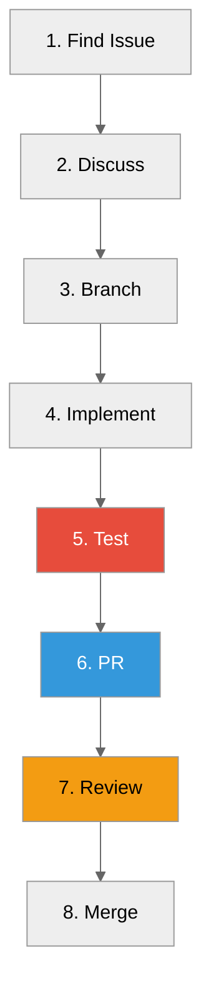

# Contributing Guide

**How to contribute to ProximaDB**



---

## Getting Started

### Prerequisites

- **Rust**: 1.88+ (`rustup --version`)
- **Python**: 3.11+ (for SDK tests)
- **Docker** (optional): For containerized testing
- **Git**: For version control

### Initial Setup

```bash
# 1. Fork and clone
git clone https://github.com/YOUR_USERNAME/proximadb.git
cd proximadb

# 2. Add upstream remote
git remote add upstream https://github.com/vjsingh1984/proximadb.git

# 3. Install development tools
cargo install cargo-watch cargo-nextest
cargo install cargo-tarpaulin
cargo install cargo-edit

# 4. Verify setup
cargo build
cargo test
```

---

## Development Workflow

### 1. Find an Issue

Check [GitHub Issues](https://github.com/vjsingh1984/proximadb/issues) for:
- `good first issue` - Beginner-friendly
- `help wanted` - Community contributions welcome
- `enhancement` - New features

### 2. Discuss (Optional)

For significant changes:
- Comment on the issue
- Start a [Discussion](https://github.com/vjsingh1984/proximadb/discussions)
- Draft an RFC for major features

### 3. Create Branch

```bash
# Sync with upstream
git fetch upstream
git checkout main
git merge upstream/main

# Create feature branch
git checkout -b feature/your-feature-name

# Or fix branch
git checkout -b fix/issue-123
```

### 4. Implement

```bash
# Watch for changes (auto-build)
cargo watch -x build

# Run specific tests
cargo test test_name

# Format as you go
cargo fmt
```

### 5. Test

```bash
# Unit tests
cargo test --lib

# Integration tests
cargo test --test integration

# Full suite
cargo test --features test-full

# Python SDK tests
cd clients/python
pytest tests/ -v
```

### 6. Create PR

```bash
# Push to your fork
git push origin feature/your-feature-name

# Create PR on GitHub
# Include:
# - Description of changes
# - Related issue numbers
# - Testing performed
```

### 7. Code Review

- Address review comments
- Update tests/docs as needed
- Request re-review when ready

### 8. Merge

Maintainer will merge after:
- All reviews approved
- CI passes
- No merge conflicts

---

## Coding Standards

### Style

```bash
# Format code
cargo fmt --all

# Check format
cargo fmt --all -- --check
```

**Style Guidelines:**
- 4 spaces (no tabs)
- Max 100 characters per line
- Trailing commas in multi-line arrays
- Meaningful variable names

### Linting

```bash
# Run clippy
cargo clippy -- -D warnings

# Fix automatically
cargo clippy --fix --allow-dirty --allow-staged
```

**Common Warnings to Fix:**
- Unused variables
- Dead code
- `unwrap()` in production code
- Missing error handling

### Documentation

```rust
/// Public function documentation.
///
/// More detailed explanation here.
///
/// # Arguments
///
/// * `arg1` - Description
/// * `arg2` - Description
///
/// # Returns
///
/// Description of return value
///
/// # Examples
///
/// ```
/// use proximadb::function;
/// let result = function(arg1, arg2);
/// assert_eq!(result, expected);
/// ```
///
/// # Errors
///
/// Returns error if...
pub fn function(arg1: Type1, arg2: Type2) -> Result<Output, Error> {
    // ...
}
```

---

## Testing Standards

### Test Organization

```rust
// In src/module.rs
#[cfg(test)]
mod tests {
    use super::*;

    #[test]
    fn test_basic_case() {
        // Arrange
        let input = ...;

        // Act
        let result = function(input);

        // Assert
        assert_eq!(result, expected);
    }

    #[test]
    fn test_error_case() {
        let result = function(bad_input);
        assert!(result.is_err());
    }
}
```

### Test Coverage

```bash
# Generate coverage
cargo llvm-cov --lib --html --output-dir coverage

# Check percentage
cargo llvm-cov --lib --summary
```

**Target:** 60%+ coverage for new code

### Integration Tests

```rust
// tests/integration_test.rs
use proximadb::ProximaDB;

#[tokio::test]
async fn test_collection_crud() {
    let server = ProximaDB::start_test().await.unwrap();
    let client = server.client();

    // Test create
    let collection = client.create_collection("test", 128).await.unwrap();
    assert_eq!(collection.name(), "test");

    // Test insert
    collection.insert(...).await.unwrap();

    // Test search
    let results = collection.search(...).await.unwrap();
    assert!(!results.is_empty());
}
```

---

## Common Tasks

### Adding a New Storage Engine

1. Create `src/storage/engines/impls/myengine/mod.rs`
2. Implement `UnifiedStorageEngine` trait
3. Register in `src/storage/engines/factory.rs`
4. Add tests in `tests/myengine_integration_test.rs`
5. Update documentation

### Adding a New API Endpoint

1. Update `proto/proximadb.proto`
2. Run `cargo build` (regenerates types)
3. Implement handler in `src/api_handlers/`
4. Add tests
5. Update API documentation

### Adding a New Graph Engine

1. Create `src/graph/engines/myengine/mod.rs`
2. Implement graph traits
3. Register in graph factory
4. Add integration tests
5. Update docs

---

## Pull Request Checklist

Before submitting PR, verify:

- [ ] Code follows style guidelines (`cargo fmt`)
- [ ] No clippy warnings (`cargo clippy`)
- [ ] Tests added/updated
- [ ] All tests pass (`cargo test --features test-full`)
- [ ] Documentation updated
- [ ] Commit messages are clear
- [ ] PR description references issues

### PR Description Template

```markdown
## Description
Brief description of the change

## Type
- [ ] Bug fix
- [ ] Feature
- [ ] Performance improvement
- [ ] Refactoring
- [ ] Documentation

## Changes Made
- Bullet point 1
- Bullet point 2

## Testing
- [ ] Unit tests added
- [ ] Integration tests added
- [ ] Manual testing completed
- [ ] Test commands: `cargo test ...`

## Breaking Changes
- [ ] None
- [ ] Yes (describe)

## Checklist
- [ ] Documentation updated
- [ ] Tests pass
- [ ] No merge conflicts

## Related Issues
Fixes #123
Related to #456
```

---

## Troubleshooting

### Build Errors

**Rust version mismatch:**
```bash
rustup update stable
rustup default stable
```

**Dependency conflicts:**
```bash
cargo clean
cargo update
cargo build
```

### Test Failures

**Port already in use:**
```bash
lsof -i :5678
kill -9 <PID>
```

**Test isolation issues:**
```bash
# Run tests sequentially
cargo test -- --test-threads=1
```

### CI Failures

**Check CI logs:**
- Compare with local output
- Check environment differences
- Verify Rust version

---

## Community Guidelines

### Be Respectful

- Use inclusive language
- Assume good intentions
- Give constructive feedback

### Communication

- Ask questions in Discussions
- Report bugs in Issues
- Join design conversations

### Recognition

Contributors recognized in:
- Release notes
- CONTRIBUTORS file
- GitHub contribution graph

---

## Resources

### Documentation

- [CLAUDE.md](../CLAUDE.md) - Project instructions
- [Architecture](../05-concepts/) - Technical concepts
- [Design Patterns](../12-design/DESIGN_PATTERNS.adoc) - Code patterns

### Tools

- [Rust Book](https://doc.rust-lang.org/book/)
- [Cargo Guide](https://doc.rust-lang.org/cargo/)
- [Tokio Guide](https://tokio.rs/tokio/tutorial)

### Community

- [GitHub Issues](https://github.com/vjsingh1984/proximadb/issues)
- [GitHub Discussions](https://github.com/vjsingh1984/proximadb/discussions)

---

## Need Help?

1. **Quick questions**: Ask in Discussions
2. **Bug reports**: Open an Issue
3. **Feature requests**: Open an Issue with RFC label

---

*Ready to contribute?* Start with [good first issue](https://github.com/vjsingh1984/proximadb/labels/good%20first%20issue)

*Thanks for contributing!* 🎉
