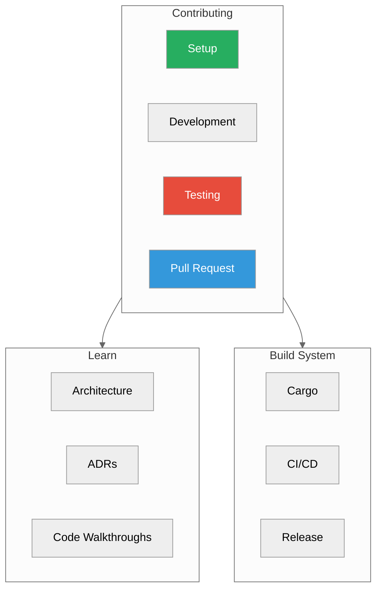

# Internals

**Contributor guide and implementation details**



---

## For Contributors

| Guide | Description | Time |
|-------|-------------|------|
| [Contributing](./contributing.md) | Setup, development workflow, PRs | 15 min |
| [Testing](./testing.md) | Test strategy, running tests, TDD | 10 min |
| [Architecture Decisions](./architecture-decisions.md) | Key design choices and rationale | 20 min |

---

## Quick Start for Contributors

### 1. Fork and Clone

```bash
# Fork https://github.com/vjsingh1984/proximadb
git clone https://github.com/YOUR_USERNAME/proximadb.git
cd proximadb
git remote add upstream https://github.com/vjsingh1984/proximadb.git
```

### 2. Development Setup

```bash
# Install Rust
curl --proto '=https' --tlsv1.2 -sSf https://sh.rustup.rs | sh

# Install development tools
cargo install cargo-watch
cargo install cargo-nextest
cargo install cargo-tarpaulin

# Build
cargo build

# Run tests
cargo test

# Format check
cargo fmt --all -- --check

# Lint
cargo clippy -- -D warnings
```

### 3. Make Changes

```bash
# Create branch
git checkout -b feature/my-feature

# Watch for changes (auto-build)
cargo watch -x build

# Run specific test
cargo test test_name

# Format code
cargo fmt
```

### 4. Submit PR

```bash
# Push to fork
git push origin feature/my-feature

# Create PR on GitHub
# Link to any related issues
```

---

## Code Organization

### Directory Structure

```
proximadb/
├── src/
│   ├── api_handlers/       # REST/gRPC endpoints
│   ├── storage/           # Storage engines
│   │   └── engines/
│   │       └── impls/     # SST, HELIX, VIPER, etc.
│   ├── graph/             # Graph engines
│   ├── query/             # Query planner
│   ├── compute/           # Quantization, distance
│   └── lib.rs             # Main entry point
├── clients/
│   ├── python/            # Python SDK
│   └── rust/              # Rust SDK
├── proto/                 # Protobuf definitions
└── tests/                 # Integration tests
```

### Key Modules

| Module | Purpose |
|--------|---------|
| `api_handlers` | REST/gRPC request handling |
| `storage` | Storage engine abstraction |
| `graph` | Graph database implementation |
| `query` | SQL parsing and planning |
| `compute` | Distance calculations |
| `services` | Business logic layer |

---

## Development Workflow

### Making Changes

1. **Check existing issues** for the feature/bug
2. **Create branch** from `main`
3. **Write tests first** (TDD)
4. **Implement feature**
5. **Run full test suite**
6. **Format and lint**
7. **Submit PR**

### Code Review Checklist

- [ ] Tests added/updated
- [ ] Documentation updated
- [ ] `cargo fmt` run
- [ ] `cargo clippy` passes
- [ ] All tests pass
- [ ] No `unwrap()` in production code
- [ ] Error handling with `Result<T, E>`

### PR Template

```markdown
## Description
Brief description of changes

## Type
- [ ] Bug fix
- [ ] Feature
- [ ] Refactoring
- [ ] Documentation

## Testing
- [ ] Unit tests added
- [ ] Integration tests added
- [ ] Manual testing completed

## Checklist
- [ ] Documentation updated
- [ ] `cargo fmt` run
- [ ] `cargo clippy` passes
- [ ] All tests pass

## Related Issues
Closes #123
```

---

## Build System

### Cargo Profiles

```toml
# Cargo.toml
[profile.dev]
opt-level = 0          # Fast compilation
[profile.test]
opt-level = 0          # Same as dev (artifact reuse)
[profile.bench]
opt-level = 3          # Max optimization
[profile.release]
opt-level = 3          # Max optimization
lto = true             # Link-time optimization
```

### Feature Flags

```bash
# Build with specific features
cargo build --features "rocksdb,gpu"

# Build all features
cargo build --all-features

# Test specific feature set
cargo test --features test-quick
```

### Benchmarks

```bash
# Run all benchmarks
cargo bench

# Run specific benchmark
cargo bench --bench vector_search

# Compare with baseline
cargo bench -- --baseline main
```

---

## Testing Strategy

### Test Organization

| Location | Type | Command |
|----------|------|---------|
| `src/**/mod.rs` | Unit tests | `cargo test --lib` |
| `tests/*.rs` | Integration | `cargo test --test integration` |
| `benches/*.rs` | Benchmarks | `cargo bench` |

### Test Categories

```bash
# Quick tests (CI)
cargo test --features test-quick

# Standard tests
cargo test --features test-standard

# Full test suite
cargo test --features test-full
```

### TDD Workflow

```bash
# Watch mode
cargo watch -x 'test --features test-quick'

# Nextest (faster)
cargo nextest run

# With coverage
cargo llvm-cov --lib --html
```

---

## Continuous Integration

### GitHub Actions

- **`ci.yml`**: Main CI on push/PR
  - Format, clippy, security audit
  - Build, test (unit + integration + graph)
  - Coverage, Python SDK, Docker

- **`tdd.yml`**: TDD-focused
  - Nextest, flaky detection
  - Coverage thresholds, benchmark regression

### CI Commands

```bash
# Run CI locally
cargo fmt --all -- --check
cargo clippy -- -D warnings
cargo test --features test-full
cargo llvm-cov --lcov
```

---

## Release Process

### Version Bump

```bash
# Update version
bash scripts/version-sync.sh set 0.2.1

# Verify consistency
bash scripts/version-sync.sh check
```

### Release

```bash
# Create tag
git tag -a v0.2.1 -m "Release v0.2.1"
git push origin v0.2.1

# CI builds and publishes automatically
```

---

## Architecture Decisions

See [Architecture Decisions](./architecture-decisions.md) for:
- Storage engine abstraction
- Unified WAL design
- Multi-model query architecture
- Graph engine CSR format

---

## Performance Profiling

### Flamegraphs

```bash
# Install flamegraph
cargo install flamegraph

# Generate flamegraph
cargo flamegraph --bin proximadb-server

# View
open flamegraph.svg
```

### Memory Profiling

```bash
# Use valgrind
valgrind --leak-check=full ./target/release/proximadb-server

# Use heaptrack
heaptrack ./target/release/proximadb-server
```

### Benchmarking

```bash
# Criterion benchmarks
cargo bench -- --save-baseline main

# Compare after changes
cargo bench -- --baseline main
```

---

## Documentation

### Writing Documentation

1. **AsciiDoc format** (`.adoc`)
2. **Mermaid diagrams** with neutral theme
3. **Code examples** must be tested
4. **3-second summary** at top of each doc

### Doc Comments

```rust
/// Brief description.
///
/// More detailed explanation.
///
/// # Examples
///
/// ```
/// use proximadb::Vector;
/// let v = Vector::new(vec![1.0, 2.0]);
/// ```
///
/// # Errors
///
/// Returns error if dimension is invalid.
///
/// # Panics
///
/// Never (use Result instead)
pub fn new(data: Vec<f32>) -> Result<Self, Error> {
    // ...
}
```

---

## Getting Help

### Resources

- **CLAUDE.md**: Project instructions
- **Architecture**: `docs/concepts/architecture.adoc`
- **Design Patterns**: `docs/12-design/DESIGN_PATTERNS.adoc`

### Communication

- **Issues**: Bug reports, feature requests
- **Discussions**: Design questions, RFCs
- **Discord/Slack**: (if available)

---

## Code Quality Standards

### Error Handling

```rust
// ❌ BAD
let value = map.get("key").unwrap();

// ✅ GOOD
let value = map.get("key")
    .ok_or(Error::KeyNotFound("key".to_string()))?;
```

### Logging

```rust
use tracing::{info, warn, error};

info!("Collection created: name={}", name);
warn!("High memory usage: {}MB", usage_mb);
error!("Failed to write WAL: {}", error);
```

### Testing

```rust
#[cfg(test)]
mod tests {
    use super::*;

    #[test]
    fn test_vector_creation() {
        let v = Vector::new(vec![1.0, 2.0]).unwrap();
        assert_eq!(v.dimension(), 2);
    }
}
```

---

## Next Steps

- [Contributing Guide](./contributing.md) - Full contribution workflow
- [Testing Guide](./testing.md) - Test strategy and TDD
- [Architecture Decisions](./architecture-decisions.md) - Design rationale

---

*Ready to contribute?* Start with [Contributing](./contributing.md)

*Need help?* [GitHub Issues](https://github.com/vjsingh1984/proximadb/issues) or [Discussions](https://github.com/vjsingh1984/proximadb/discussions)
