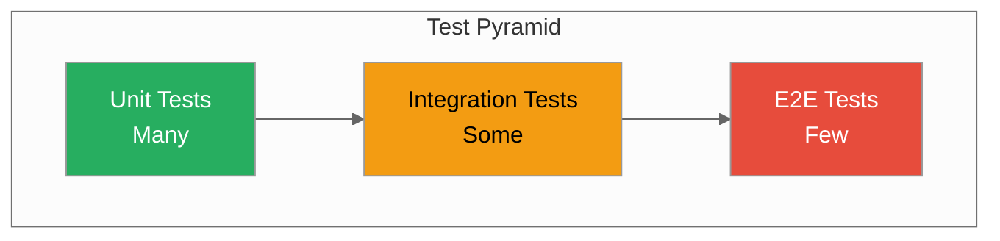

# Testing Guide

**Test strategy, running tests, and TDD**



---

## Test Organization

### Directory Structure

```
proximadb/
├── src/
│   ├── storage/
│   │   └── engines/impls/sst/
│   │       └── mod.rs          # Unit tests here
│   └── graph/
│       └── engines/orion/
│           └── mod.rs          # Unit tests here
├── tests/
│   ├── integration_test.rs     # Integration entry
│   ├── sst_integration_test.rs # Engine-specific
│   └── graph_integration_test.rs
└── clients/python/tests/        # SDK tests
```

### Test Categories

| Category | Location | Command | Purpose |
|----------|----------|---------|---------|
| **Unit** | `src/**/mod.rs` | `cargo test --lib` | Test functions in isolation |
| **Integration** | `tests/*.rs` | `cargo test --test <name>` | Test component interaction |
| **SDK** | `clients/*/tests/` | `pytest` | Test client libraries |
| **E2E** | `tests/e2e/` | `cargo test --test e2e` | Full system tests |

---

## Running Tests

### Quick Tests (CI)

```bash
# Unit tests only
cargo test --lib

# With feature flag
cargo test --features test-quick
```

### Standard Tests

```bash
# Unit + integration
cargo test --features test-standard

# Include graph tests
cargo test --features test-full
```

### Specific Tests

```bash
# By name
cargo test test_vector_search

# By module
cargo test --package proximadb storage

# Integration test
cargo test --test integration_test

# Graph integration
cargo test --test graph_integration_test
```

### With Output

```bash
# Show test output
cargo test -- --nocapture

# Show test output for specific test
cargo test test_name -- --nocapture --test-threads=1
```

### Parallel vs Sequential

```bash
# Parallel (default)
cargo test

# Sequential (for tests needing ports)
cargo test -- --test-threads=1
```

---

## Test Feature Flags

```toml
# Cargo.toml
[features]
test-quick = ["test-unit"]
test-standard = ["test-unit", "test-integration"]
test-full = ["test-unit", "test-integration", "test-graph", "test-storage", "test-query"]
```

```bash
# Use feature flags
cargo test --features test-quick
cargo test --features test-standard
cargo test --features test-full
```

---

## Unit Testing

### Structure

```rust
#[cfg(test)]
mod tests {
    use super::*;

    #[test]
    fn test_basic_functionality() {
        // Arrange
        let input = 42;

        // Act
        let result = function(input);

        // Assert
        assert_eq!(result, expected);
    }

    #[test]
    fn test_error_handling() {
        let result = dangerous_function();
        assert!(result.is_err());
    }

    #[tokio::test]
    async fn test_async_function() {
        let result = async_function().await.unwrap();
        assert_eq!(result, expected);
    }
}
```

### Common Patterns

**Testing Result:**
```rust
#[test]
fn test_result_ok() {
    let result = may_fail();
    assert!(result.is_ok());
}

#[test]
fn test_result_err() {
    let result = may_fail();
    assert!(result.is_err());
    assert_eq!(result.unwrap_err(), Error::InvalidInput);
}
```

**Testing Option:**
```rust
#[test]
fn test_option_some() {
    let result = get_value();
    assert!(result.is_some());
    assert_eq!(result.unwrap(), expected);
}
```

**Testing Panic:**
```rust
#[test]
#[should_panic(expected = "Invalid value")]
fn test_panic() {
    panic_if_invalid(bad_value);
}
```

---

## Integration Testing

### Test Server

```rust
use proximadb::ProximaDB;

#[tokio::test]
async fn test_collection_crud() {
    // Start test server
    let server = ProximaDB::test_config()
        .start()
        .await
        .unwrap();

    // Get client
    let client = server.client();

    // Test operations
    let collection = client.create_collection("test", 128)
        .await
        .unwrap();

    assert_eq!(collection.name(), "test");

    // Cleanup
    server.stop().await.unwrap();
}
```

### Test Utilities

```rust
// Helper to create test vectors
fn test_vector(dim: usize) -> Vec<f32> {
    (0..dim).map(|i| i as f32).collect()
}

// Helper to generate random data
fn random_vector(dim: usize) -> Vec<f32> {
    (0..dim).map(|_| rand::random()).collect()
}
```

---

## TDD Workflow

### Red-Green-Refactor

```bash
# Watch mode
cargo watch -x 'test --features test-quick'

# 1. Red: Write failing test
# 2. Green: Write minimal code to pass
# 3. Refactor: Improve code
# 4. Repeat
```

### Example

**Step 1: Write failing test**
```rust
#[test]
fn test_vector_dot_product() {
    let a = vec![1.0, 2.0, 3.0];
    let b = vec![4.0, 5.0, 6.0];
    let result = dot_product(&a, &b);
    assert_eq!(result, 32.0);  // 1*4 + 2*5 + 3*6
}
```

**Step 2: Make it pass**
```rust
pub fn dot_product(a: &[f32], b: &[f32]) -> f32 {
    a.iter().zip(b.iter()).map(|(x, y)| x * y).sum()
}
```

**Step 3: Refactor**
```rust
pub fn dot_product(a: &[f32], b: &[f32]) -> f32 {
    assert_eq!(a.len(), b.len());
    a.iter()
        .zip(b.iter())
        .map(|(x, y)| x * y)
        .sum()
}
```

---

## Property-Based Testing

### Using proptest

```toml
[dev-dependencies]
proptest = "1.0"
```

```rust
#[cfg(test)]
mod proptests {
    use super::*;
    use proptest::prelude::*;

    proptest! {
        #[test]
        fn test_dot_product_commutative(a in vec(any::<f32>(), 1..100),
                                        b in vec(any::<f32>(), 1..100)) {
            let ab = dot_product(&a, &b);
            let ba = dot_product(&b, &a);
            prop_assert!((ab - ba).abs() < 0.001);
        }
    }
}
```

---

## Benchmark Testing

### Criterion Benchmarks

```rust
// benches/vector_search.rs
use criterion::{black_box, criterion_group, criterion_main, Criterion};
use proximadb::storage::Engine;

fn bench_vector_search(c: &mut Criterion) {
    let mut engine = Engine::new_test();
    let query = test_vector(128);

    c.bench_function("vector_search_10k", |b| {
        b.iter(|| {
            engine.search(black_box(query.clone()), 10)
        })
    });
}

criterion_group!(benches, bench_vector_search);
criterion_main!(benches);
```

```bash
# Run benchmarks
cargo bench

# Compare baselines
cargo bench -- --save-baseline main
# Make changes
cargo bench -- --baseline main
```

---

## Coverage

### LLVM Coverage

```bash
# Install
cargo install cargo-llvm-cov

# Generate coverage
cargo llvm-cov --lib --html --output-dir coverage

# View
open coverage/index.html

# LCOV for CI
cargo llvm-cov --lib --lcov --output-path lcov.info
```

### Coverage Thresholds

```bash
# Check percentage
cargo llvm-cov --lib --summary

# Expected: 60%+ for new code
```

---

## CI Testing

### GitHub Actions

```yaml
# .github/workflows/ci.yml
- name: Run tests
  run: cargo test --features test-full

- name: Generate coverage
  run: cargo llvm-cov --lcov

- name: Check coverage threshold
  run: |
    COVERAGE=$(cargo llvm-cov --lib --summary | grep Lines | awk '{print $4}' | sed 's/%//')
    if (( $(echo "$COVERAGE < 60" | bc -l) )); then
      echo "Coverage $COVERAGE% is below 60%"
      exit 1
    fi
```

---

## Mocking

### Mock Dependencies

```rust
#[cfg(test)]
mod mock_tests {
    use super::*;

    struct MockStorage {
        data: Vec<Vector>,
    }

    impl MockStorage {
        fn new() -> Self {
            Self { data: Vec::new() }
        }

        fn insert(&mut self, vector: Vector) {
            self.data.push(vector);
        }

        fn search(&self, query: &[f32]) -> Vec<&Vector> {
            self.data.iter().filter(|v| v.matches(query)).collect()
        }
    }

    #[test]
    fn test_with_mock_storage() {
        let mut storage = MockStorage::new();
        storage.insert(test_vector());

        let results = storage.search(&[1.0, 2.0]);
        assert_eq!(results.len(), 1);
    }
}
```

---

## Flaky Test Detection

### TDD Workflow

```yaml
# .github/workflows/tdd.yml
- name: Run tests 3x
  run: |
    for i in {1..3}; do
      cargo test --features test-full || exit 1
    done
```

---

## Performance Regression Testing

### Benchmarks in CI

```bash
# Run benchmarks
cargo bench -- --save-baseline main

# Store results
git push origin main

# Next PR: compare
cargo bench -- --baseline main
# Fails if >10% regression
```

---

## Best Practices

### 1. Test Isolation

```rust
#[test]
fn test_isolated() {
    // Don't depend on other tests
    // Don't use shared state
    // Clean up after yourself
}
```

### 2. Test Names

```rust
#[test]
fn test_vector_search_returns_top_k_results() {
    // Descriptive names
    // test_<function>_<expected_behavior>
}
```

### 3. Assert Messages

```rust
#[test]
fn test_with_messages() {
    let result = calculate();
    assert_eq!(result, expected, "Result should be {}, got {}", expected, result);
}
```

### 4. Setup/Teardown

```rust
#[tokio::test]
async fn test_with_setup() {
    // Setup
    let server = start_test_server().await.unwrap();
    let client = server.client();

    // Test
    let result = client.get_collection("test").await;

    // Assert
    assert!(result.is_ok());

    // Teardown (implicit via Drop)
    drop(server);
}
```

---

## Troubleshooting

### Port Conflicts

```bash
# Tests need unique ports
export TEST_PORT_BASE=12000
cargo test -- --test-threads=1
```

### Slow Tests

```bash
# Profile test
cargo test --release -- --nocapture

# Use mocks instead of real resources
```

### Flaky Tests

```bash
# Run with logging
RUST_LOG=debug cargo test -- --test-threads=1 --nocapture

# Look for timing issues, race conditions
```

---

## Next Steps

- [Contributing](./contributing.md) - Full contribution workflow
- [Architecture](../05-concepts/) - Understand system design
- [CI/CD](../04-operations/) - Continuous integration

---

*Need help?* [GitHub Issues](https://github.com/vjsingh1984/proximadb/issues)
