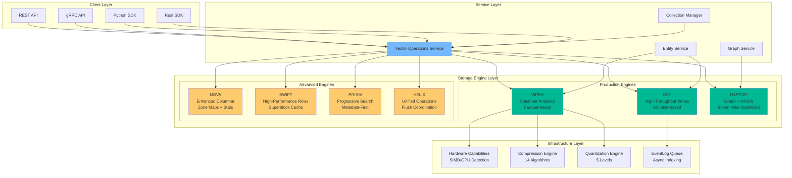
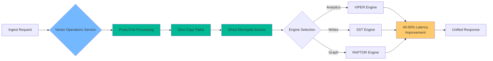
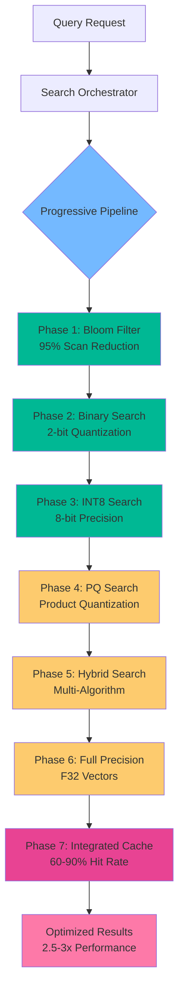
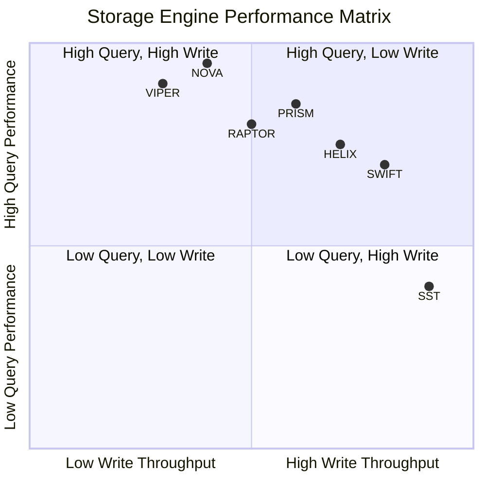
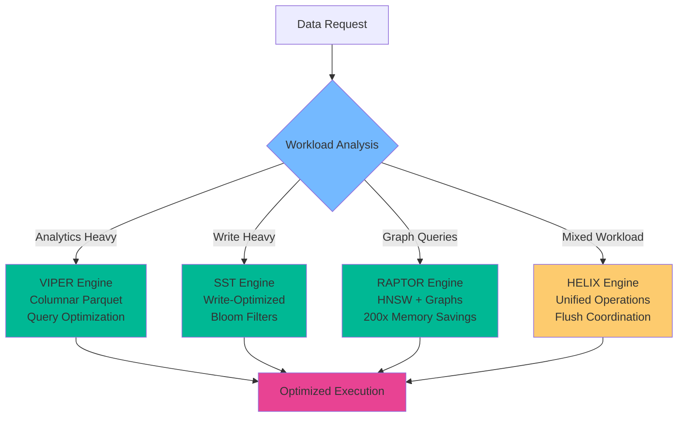
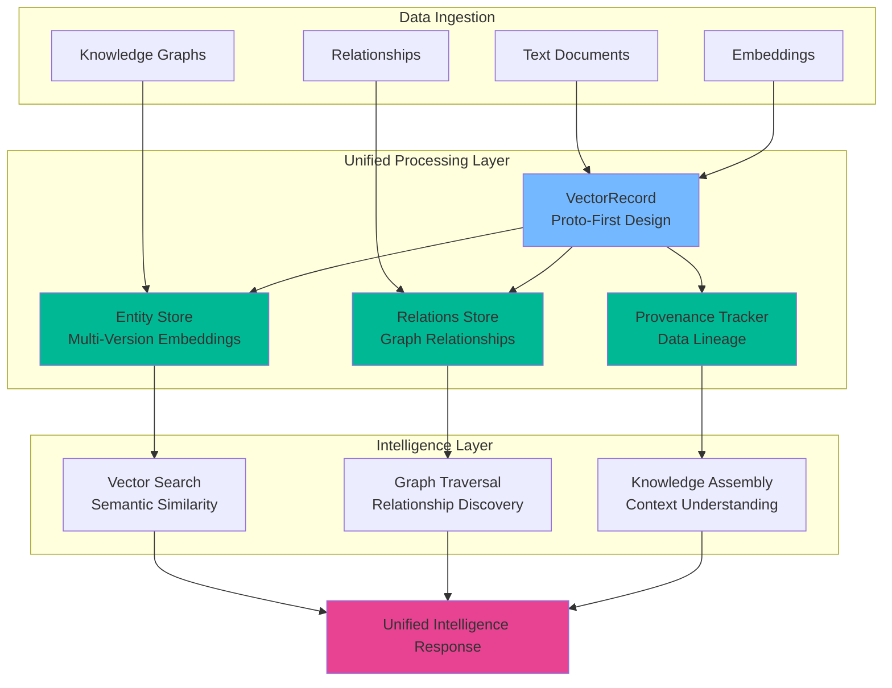
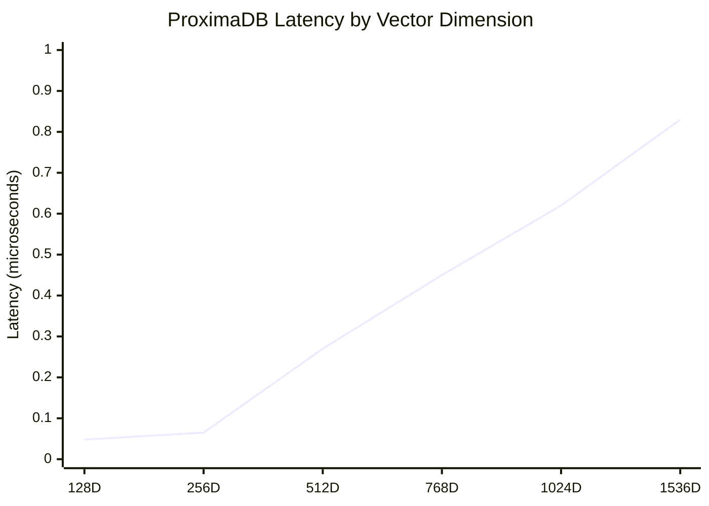

# ProximaDB Architecture: Seven Engines, One Platform

## 🏗️ System Overview

ProximaDB's unified architecture combines seven specialized storage engines under a single API layer, delivering unprecedented performance and capabilities:



## ⚡ Performance Architecture

### Data Flow Optimization


### Progressive Search Pipeline


## 🔧 Storage Engine Specialization

### Engine Comparison Matrix


### Engine Selection Logic


## 🧠 Unified Intelligence Architecture

### Multi-Modal Data Processing


## 🚀 Performance Characteristics

### Latency Distribution


### Throughput Scaling
```mermaid
gitgraph
    commit id: "1K vectors"
    branch "throughput-optimization"
    commit id: "10K vectors"
    commit id: "100K vectors"
    commit id: "1M vectors"
    checkout main
    merge "throughput-optimization"
    commit id: "20.8M ops/sec achieved"
```

## 💡 Key Architectural Innovations

### 1. Proto-First Design
- **Zero double serialization** - VectorRecord flows natively
- **Direct memtable access** - 40-60% latency improvement
- **Type safety** - Compile-time guarantees

### 2. Bloom Filter Optimization  
- **95% metadata scan reduction**
- **180KB vs 40-60MB** memory usage (200x savings)
- **Scattered ID handling** for HNSW-organized data

### 3. EventLog Queue System
- **Zero write amplification** - Metadata-only queue
- **Async indexing** - Flush → EventLog → AXIS processing
- **Queue-aware compaction** - File protection until acknowledgment

### 4. Hardware Acceleration
- **Automatic detection** - SIMD (AVX-512, AVX2, SSE, NEON)
- **GPU support** - Lazy initialization with fallback
- **Cached backend selection** - Optimal performance paths

This architecture delivers **sub-microsecond latencies**, **20.8M+ operations per second**, and **45-65% memory reduction** while maintaining the simplicity of a single API.