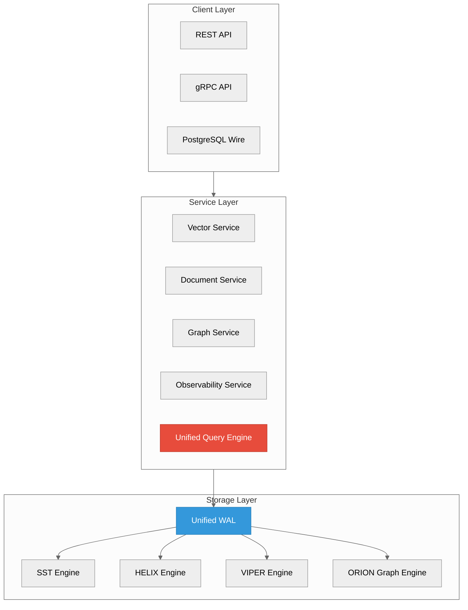

# ProximaDB Documentation

**The context database** — Vectors, documents, graphs, and observability in one system.

> **Support contract:** Code presence is broader than the supported product surface. Use
> [`SUPPORTED_SURFACE.adoc`](./SUPPORTED_SURFACE.adoc) for supported/beta/experimental status and
> [`12-design/SYSTEM_MAP_2026_05_30.adoc`](./12-design/SYSTEM_MAP_2026_05_30.adoc) for the current
> solution architecture.

```mermaid
%%{init: {"theme": "neutral"}}%%
flowchart LR
  subgraph Input["Data You Have"]
    V[["🔢 Vectors<br/>Embeddings"]]
    D[["📄 Documents<br/>JSON, Logs"]]
    G[["🕸️ Graphs<br/>Relationships"]]
    O[["📊 Observability<br/>Metrics, Traces"]]
  end

  subgraph ProximaDB["ProximaDB"]
    API["Unified API<br/>REST + gRPC + SQL"]
    WAL["Unified WAL<br/>Single durability layer"]
    ENGS["6 Storage Engines<br/>Tuned for workload"]
  end

  subgraph Output["Queries You Run"]
    VS["Vector Search"]
    MM["Multi-Model Joins"]
    GQ["Graph Traversal"]
    AQ["Analytics"]
  end

  Input --> API --> WAL --> ENGS
  ENGS --> Output

  style API fill:#4a90e2,stroke:#2e5c8a,color:#fff
  style WAL fill:#4a90e2,stroke:#2e5c8a,color:#fff
  style ENGS fill:#4a90e2,stroke:#2e5c8a,color:#fff
```



---

## 5-Minute Quick Start

### Install (Linux)

```bash
# RPM (RHEL/CentOS/Fedora)
sudo rpm -ivh proximadb-0.2.0-1.el8.x86_64.rpm
sudo systemctl start proximadb

# DEB (Debian/Ubuntu)
sudo dpkg -i proximadb_0.2.0_amd64.deb
sudo systemctl start proximadb
```

### Install (Windows)

```powershell
msiexec /i proximadb-0.2.0-x64.msi
```

### Install (macOS)

```bash
brew install proximadb
brew services start proximadb
```

### Install (Docker)

```bash
docker run -d -p 5678:5678 proximadb/proximadb:latest
```

### Verify

```bash
curl http://localhost:5678/health
# {"status":"healthy","version":"0.2.0"}
```

---

## Core Concepts

### Multi-Model Architecture

One database for all your data:

| Model | Use Case | Example |
|-------|----------|---------|
| **Vectors** | Semantic search, RAG, recommendations | Find similar products |
| **Documents** | JSON storage, full-text search | Store and search logs |
| **Graphs** | Relationships, traversals | Social networks, dependencies |
| **Observability** | Logs, metrics, traces | Application monitoring |

### Cross-Model Queries

```sql
-- Vector search + document lookup in one query
SELECT u.name, v.product_id, d.review_text
FROM users u
JOIN LATERAL VECTOR_SEARCH('products', u.preference_vector, 10) v ON true
JOIN LATERAL DOCUMENT_QUERY('reviews', 'product_id = "' || v.product_id || '"') d ON true;
```

### Storage Engines

6 specialized engines tuned for your workload:

| Engine | Best For | Performance |
|--------|----------|-------------|
| **SST** | Real-time, write-heavy | ~5ms |
| **HELIX** | Locality-optimized | ~13ms |
| **VIPER** | Columnar analytics | ~89ms |
| **SWIFT** | Ultra-low latency (<5K vectors) | ~95ms |
| **NOVA** | Mixed workloads | ~101ms |
| **RAPTOR** | Adaptive, dynamic workloads | ~9ms |

---

## Navigation

| Section | For | Time |
|---------|-----|------|
| [Quick Start](./01-quick-start/) | New users getting started | 5 min |
| [Guides](./02-guides/) | Common tasks and patterns | 15-60 min |
| [API Reference](./03-api-reference/) | Endpoint signatures | Lookup |
| [Operations](./04-operations/) | Production deployment | Setup |
| [Concepts](./05-concepts/) | Deep dives | Learning |
| [Internals](./06-internals/) | Contributors | Development |
| [Architecture & Design](./12-design/README.adoc) | Current architecture blueprints and ADRs | Planning |

---

## Layout

Release-facing documentation lives in the numbered tree above. Current architecture blueprints live in `docs/12-design/`; supporting images and logos live in `docs/assets/`; internal planning lives in `docs/_internal/`; retained historical reports live in `docs/_archive/`.

Do not add new one-off reports to the repository root or directly under `docs/`. Put current docs in the matching numbered section and move historical status reports into `docs/_archive/`.

For future-shaping architecture work, start with `docs/12-design/README.adoc`.

---

## Key Features

### Supported: Vector Record API
- Canonical REST v2 and gRPC v2 record CRUD/search path
- v1 vector-shaped APIs remain compatibility facades
- Single-node scope for the v0.2 support contract

### Beta: Unified API
- Single port (5678) for REST, gRPC, and Arrow Flight
- PostgreSQL wire protocol (5433) for SQL clients
- Python SDK with async support

### Beta: Cross-Model Queries
- Join vectors with documents, graphs, and logs
- SQL with extensions: `VECTOR_SEARCH()`, `GRAPH_QUERY()`, `DOCUMENT_QUERY()`

### Release Packaging
- Platform packages: RPM, DEB, MSI
- Systemd service integration
- Prometheus metrics + Grafana dashboards

### ✅ Developer First
- Open source (Apache 2.0)
- Rust-based performance
- Comprehensive Python SDK

---

## Architecture Overview

The diagram below is a compact overview only. The authoritative architecture map is
[`12-design/SYSTEM_MAP_2026_05_30.adoc`](./12-design/SYSTEM_MAP_2026_05_30.adoc).



---

## Next Steps

1. **New here?** Start with [Quick Start](./01-quick-start/)
2. **Running in production?** See [Operations](./04-operations/)
3. **Building an app?** Check the [Guides](./02-guides/)
4. **Contributing?** Read [Internals](./06-internals/)

---

## Version

**Pre-release (in development)**: v0.2.0 — narrow single-node cut targeting May 2026. See
[`SUPPORTED_SURFACE.adoc`](./SUPPORTED_SURFACE.adoc) for the supported/beta/experimental split
and [`release-notes/v0.2.0.adoc`](./release-notes/v0.2.0.adoc) for the release contract.

- Platform packages (RPM, DEB, MSI)
- Unified port architecture (5678)
- Multi-model query engine
- PostgreSQL wire protocol

**Release Notes**: [GitHub Releases](https://github.com/vjsingh1984/proximadb/releases)

---

## Community

- **Issues**: [GitHub Issues](https://github.com/vjsingh1984/proximadb/issues)
- **Discussions**: [GitHub Discussions](https://github.com/vjsingh1984/proximadb/discussions)
- **Documentation**: [docs/](./)

---

*Last updated: 2026-02-22*
