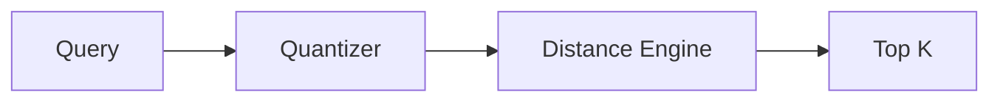

# ProximaDB Documentation Restructure Plan

## Executive Summary

**Current State**: 201 documentation files, inconsistent structure, mix of Markdown and AsciiDoc, significant drift from codebase.

**Target**: Succinct, visual, intuitive documentation organized by user journey with infographic-style Mermaid diagrams.

---

## 1. Audit Findings

### 1.1 Structure Issues

| Issue | Impact | Files Affected |
|-------|--------|----------------|
| Duplicate content (archive + active) | Confusion, maintenance burden | 100+ files in `_internal/archive/` |
| Mixed formats (.md + .adoc) | Inconsistent rendering | ~80% |
| Missing v0.2.0 features | Platform packages, unified port not documented | INDEX.adoc |
| Outdated code references | Dead links, wrong module paths | Multiple |
| Deep directory nesting | Poor navigation | `_internal/roadmap/implementation/archive/...` |

### 1.2 Codebase vs Docs Alignment

**Actual Code Structure** (src/):
```
ai/, api_handlers/, audit/, auth/, automl/, bin/, catalog/, cdc/,
cluster/, compute/, config/, connectors/, core/, datafusion/,
deployment/, embedded/, errors/, executive/, graph/, index/,
deploy/infrastructure/, licensing/, llm/, metrics/, monitoring/, network/,
observability/, prompts/, proto/, query/, revenue/, sales_enablement/,
schema/, search/, security/, server/, services/, storage/, streaming/,
utils/, vector/, version.rs
```

**Docs Structure Issues**:
- No docs for: `ai/`, `audit/`, `licensing/`, `revenue/`, `sales_enablement/`
- Old structure references: `01-getting-started`, `03-reference` (archived)
- Platform packages not in INDEX.adoc despite being v0.2.0 key feature

### 1.3 User Journey Gaps

**Missing "Happy Path"**:
1. Install (RPM/DEB/MSI)
2. Start server
3. Create collection
4. Insert data
5. Query
6. Deploy to production

Current docs assume developer building from source.

---

## 2. Target Structure

### 2.1 New Directory Layout

```
docs/
├── README.md (landing page)
│
├── 01-quick-start/
│   ├── index.md (5-minute setup)
│   ├── install.md (platform packages + docker + source)
│   ├── first-query.md (hello world)
│   └── architecture-basics.md (visual overview)
│
├── 02-guides/
│   ├── vector-search.md
│   ├── graph-queries.md
│   ├── document-store.md
│   ├── observability.md
│   ├── sql-extensions.md
│   └── multi-model-joins.md
│
├── 03-api-reference/
│   ├── rest.md
│   ├── graphql.md (if exists)
│   ├── postgres-wire.md
│   └── python-sdk.md
│
├── 04-operations/
│   ├── deployment.md (k8s, docker, bare metal)
│   ├── monitoring.md (prometheus, grafana)
│   ├── security.md (auth, tls, rbac)
│   ├── backup-restore.md
│   └── performance-tuning.md
│
├── 05-concepts/
│   ├── storage-engines.md (SST, HELIX, VIPER, SWIFT, NOVA, RAPTOR)
│   ├── graph-engines.md (ORION, PULSAR, QUASAR)
│   ├── unified-wal.md
│   └── query-planner.md
│
├── 06-internals/
│   ├── contributing.md
│   ├── architecture-decisions.md
│   ├── storage-internals.md
│   └── testing.md
│
└── assets/
    ├── diagrams/ (mermaid source files)
    └── images/ (screenshots, photos)
```

### 2.2 Delete/Archive

**Move to `docs/_legacy/`** (keep for reference, remove from navigation):
- `_internal/archive/` (entire directory)
- Duplicate markdown files in root (`HYBRID_SEARCH_*.md`, `TECHNICAL_DEBT.md`)
- Old structure: `01-getting-started/`, `03-reference/`, `04-operations/` (archived versions)

**Delete Completely** (outdated, superseded):
- `docs/concepts/vision.adoc` (superseded by `00-product/VISION.adoc`)
- Any `.md` files with exact `.adoc` counterpart

---

## 3. Content Strategy

### 3.1 Infographic Documentation

Every page gets:
1. **Hero diagram** (Mermaid, top of page)
2. **3-second summary** (one sentence)
3. **Code example** (real, tested)
4. **Next steps** (link to related guide)

**Example Pattern**:

```markdown
# Vector Search

[Search 1M vectors in <10ms with 6 specialized storage engines]

## Architecture


## Quick Example
\`\`\`python
client = ProximaDB("http://localhost:5678")
results = client.vector_search("my_collection", query_vector, k=10)
\`\`\`

## Next: [Storage Engine Selection](../concepts/storage-engines.md)
```

### 3.2 Visual Templates

**For Storage Engines**:
```
┌─────────────────────────────────────────┐
│  ENGINE NAME     Use Case    Perf       │
│  ───────────     ────────    ─────      │
│  [Icon]          Real-time   5.32ms     │
│                  writes                  │
│                                          │
│  Best for: High-velocity ingest         │
│  Avoid:  Analytics workloads            │
└─────────────────────────────────────────┘
```

**For APIs**:
```
POST /api/v1/collections/{id}/vectors/search
├── Headers
│   └── Content-Type: application/json
├── Body
│   ├── vector: [float]
│   ├── k: int
│   └── filter: dict (optional)
└── Response
    ├── results: []
    └── latency_ms: int
```

### 3.3 Navigation UX

**Sidebar Order** (priority):
1. Quick Start (get them running)
2. Guides (common tasks)
3. API Reference (look up endpoint)
4. Operations (production)
5. Concepts (learn more)
6. Internals (contribute)

**Breadcrumbs**: `Home > Quick Start > Install > Platform Packages`

**"On this page"**: Auto-generated from H2/H3 headings

---

## 4. Missing Content (to Create)

### 4.1 Critical Gaps

| Doc | Priority | Est. Effort |
|-----|----------|-------------|
| Platform packages install | P0 | 2h |
| v0.2.0 release notes (public) | P0 | 1h |
| Multi-model query examples | P0 | 3h |
| SQL extensions reference | P1 | 4h |
| Observability ingest guide | P1 | 3h |
| Python SDK v0.2.0 API | P1 | 2h |
| Production deployment patterns | P1 | 4h |
| Migration guide (v0.1.x → v0.2.0) | P2 | 2h |

### 4.2 Code Modules Needing Docs

- `src/ai/` - AI/LLM integration
- `src/audit/` - Audit logging
- `src/embedded/` - In-process embedding
- `src/licensing/` - License management
- `src/revenue/` - Metering/billing (if customer-facing)

---

## 5. Implementation Steps

### Phase 1: Foundation (Week 1)
- [ ] Create new directory structure
- [ ] Write `docs/README.md` landing page
- [ ] Create Mermaid diagram templates
- [ ] Move `PLATFORM_PACKAGES.md` → `02-guides/install.md`
- [ ] Archive `_internal/archive/` to `_legacy/`

### Phase 2: Quick Start (Week 1-2)
- [ ] `01-quick-start/index.md` (5-minute setup)
- [ ] `01-quick-start/install.md` (RPM/DEB/MSI/Docker)
- [ ] `01-quick-start/first-query.md` (copy-paste examples)
- [ ] `01-quick-start/architecture-basics.md` (single diagram)

### Phase 3: Guides (Week 2-3)
- [ ] Migrate/clean `02-guides/*.adoc` → `02-guides/*.md`
- [ ] Add Mermaid diagrams to each guide
- [ ] Test all code examples
- [ ] Add "3-second summary" to each page

### Phase 4: API Reference (Week 3)
- [ ] Auto-generate from OpenAPI/proto if possible
- [ ] Manual cleanup for custom extensions
- [ ] Add request/response examples

### Phase 5: Operations (Week 4)
- [ ] Consolidate deployment docs
- [ ] Add monitoring dashboard screenshots
- [ ] Document v0.2.0 platform package operations

### Phase 6: Polish (Week 4)
- [ ] Generate sitemap.json for nav
- [ ] Add search index (lunr.js or algolia)
- [ ] Link checker pass
- [ ] Spelling/grammar pass

---

## 6. Tools & Automation

### 6.1 Link Checker
```bash
# Run weekly in CI
find docs -name "*.md" -exec markdown-link-check {} \;
```

### 6.2 Example Tester
```bash
# Extract code blocks, test them
grep -A 10 '```python' docs/**/*.md > /tmp/examples.py
python /tmp/examples.py
```

### 6.3 Diagram Validator
```bash
# Validate Mermaid syntax
npm install -g mermaid-cli
find docs -name "*.md" -exec npx mmdc -i {} -o /dev/null \;
```

---

## 7. Success Metrics

| Metric | Current | Target |
|--------|---------|--------|
| Files (non-archived) | ~150 | <80 |
| Avg file length | Unknown | <300 lines |
| Pages with diagrams | ~5% | >80% |
| Dead links | Unknown | 0 |
| Time to "hello world" | Scattered | 5 min |
| Code examples tested | 0% | 100% |

---

## 8. Open Questions

1. **Static site generator**: Hugo, Docusaurus, or VitePress?
2. **API docs**: Auto-generate from proto or manual?
3. **Versioning**: How to handle v0.1.x vs v0.2.0 docs?
4. **Internal docs**: Keep `_internal/` or move to separate repo?

---

## 9. Next Actions (Immediate)

1. **Review and approve** this plan
2. **Create** `docs/README.md` landing page
3. **Move** `PLATFORM_PACKAGES.md` to new structure
4. **Archive** `_internal/archive/` directory
5. **Pick** static site generator

---

*Last updated: 2026-02-22*
*Status: DRAFT - Awaiting approval*
