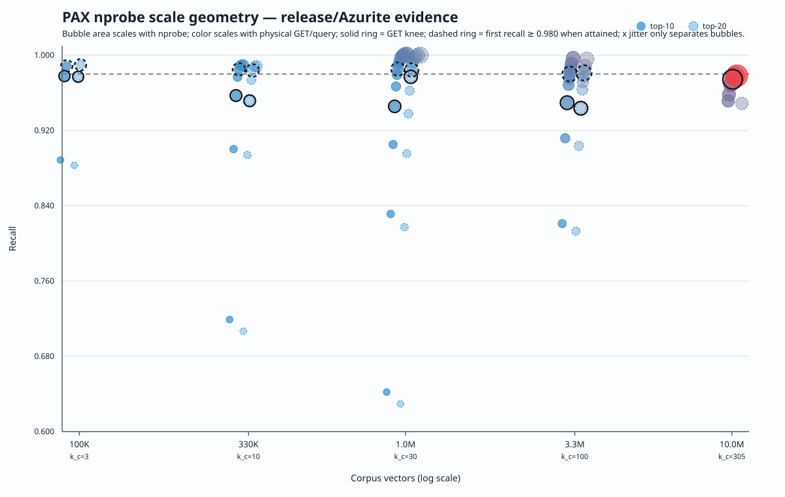
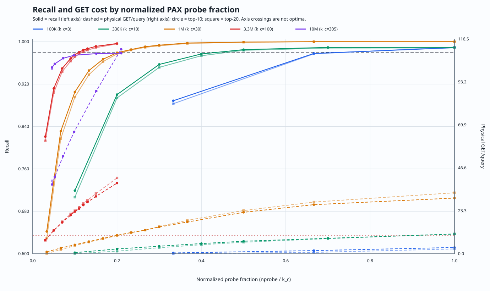
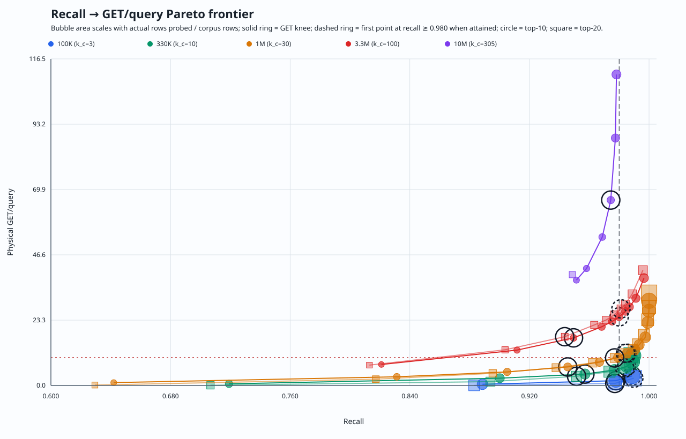

= BIGANN PAX natural nprobe knees: 100K through partial 10M (2026-08-04)
:toc:

This dated artifact separates two questions that the earlier four-scale
analysis combined:

* the *natural economy knee* is the Kneedle bend of recall against a measured
  physical-cost Pareto frontier; and
* the *quality floor* is the least measured `nprobe` attaining the explicit
  recall target, or `unattained` when the sweep does not reach it.

The recall target remains 0.98. An unattained target is evidence about the
curve, not permission to lower the ratchet.

== Evidence status

The 100K, 330K, 1M, and 3.3M matrices are complete. The 10M result is
*partial*: five interruption-safe checkpoints contain 7 of 20 unique planned
`(nprobe, top_k)` points. The analyzer merges same-scale checkpoints only when
their immutable binary, dataset, query slice, storage URL, segment path/ETag,
layout, `k_c`, and seed provenance are equal. Snapshot timestamps are excluded
because rematerializing the same immutable blob changes them.

All five 10M checkpoints use source revision
`955990254988bbf68acbfd616d8b1d7e12aa27c1`, release binary SHA-256
`4c064a7e129acca99ace08e0bd2aad78ac0f805b40efaea7f5e8c2d46e1f8a76`,
bed-config SHA-256
`a139b4189515319b7b92067710f5907e3129f12d104e735a4715c6d410646d85`,
and one 2,757,638,547-byte PAX v3 segment with `k_c=305`.

[cols="1,2,2", options="header"]
|===
| 10M source | Measured points | SHA-256

| Initial matrix | top-10: 14, 16; top-20: 14
| `c1222abd612dd1817d2a048049e78277bc0b343f5452807d56aa856e0fa8206d`

| Probe 22 | top-10: 22
| `35b5a598ef8b95f8b80236546572597f44d1a049bdc9bc871e84e46078815a8d`

| Probe 30 | top-10: 30
| `fece5aae7de8d684f504af99d0b23f7920357dab80a6c4fd81a00a70ed44b676`

| Probe 46 | top-10: 46
| `da39b7e7731bf2cbcb9fb66cf18cef9abaa8732b5bb16bca9a9752b8190ff14e`

| Probe 64 | top-10: 64
| `67985e4cdbbed6eacbb1ee8cc7ebfdaaff7d16a8b9c03ce7e01296b30e1fca10`
|===

The earlier four complete matrix hashes remain recorded in
link:BIGANN_NPROBE_GEOMETRY_100K_3M3_2026_07_31.adoc[the four-scale artifact].
Those lower-scale matrices are cross-revision calibration evidence; this is
not a same-binary canonical five-scale publication.

== Method

* Dataset: BIGANN/SIFT prefixes, 128d L2, independently generated exact
  corpus-matched top-20 ground truth, 1,000 diverse queries per point.
* Layout: one fully materialized PAX v3 segment per scale. Natural cell law:
  `k_c = clamp(floor(rows * dimension / 4 MiB), 2, 4096)`.
* Query isolation: fresh release server and empty process-local caches for each
  point; persistent local tier disabled.
* Storage: production Azure HTTP backend against localhost Azurite. GET counts
  are the primary physical-cost evidence. Latencies are relative local-host
  observations, not Azure WAN SLAs, and are more sensitive to host scheduling
  or sleep than operation counts.
* Knee method: remove any point dominated by a cheaper point with equal or
  higher recall, then maximize normalized `recall - log(cost)` Kneedle distance
  over an interior point. The primary economy objective is physical GET/query;
  nprobe, bytes/query, p50, and p95 knees are also reported independently.

== Natural GET knees

[cols="1,1,1,1,1,1,1", options="header"]
|===
| Corpus | `k_c` | top-k | Knee nprobe | nprobe / `k_c` | Recall | GET/q / p50

| 100K | 3 | 10 | 2 | 66.7% | 0.9778 | 1.701 / 45.04 ms
| 100K | 3 | 20 | 2 | 66.7% | 0.9771 | 0.735 / 18.83 ms
| 330K | 10 | 10 | 3 | 30.0% | 0.9571 | 4.077 / 52.49 ms
| 330K | 10 | 20 | 3 | 30.0% | 0.95155 | 3.270 / 46.62 ms
| 1M | 30 | 10 | 4 | 13.3% | 0.9456 | 6.604 / 110.08 ms
| 1M | 30 | 20 | 6 | 20.0% | 0.9770 | 9.822 / 148.31 ms
| 3.3M | 100 | 10 | 7 | 7.0% | 0.9495 | 16.978 / 174.31 ms
| 3.3M | 100 | 20 | 7 | 7.0% | 0.9436 | 17.398 / 186.36 ms
| 10M (partial) | 305 | 10 | 30 | 9.84% | 0.9744 | 66.119 / 558.37 ms
| 10M (partial) | 305 | 20 | unavailable | unavailable | 0.9487 max | one point only
|===

For 10M top-10, the GET-, byte-, p50-, and p95-normalized knees all select
`nprobe=30`; it reads 163.04 MB/query. This agreement makes 30 a useful
*measured economy candidate*, but the partial matrix makes the five-scale fit
provisional. Missing planned points and the top-20 curve must still be run.

The economy knee is not a deployment default. Several natural knees sit well
below the quality SLA. This is precisely why a natural knee and a quality
floor cannot be represented by one field.

== Quality-floor result

[cols="1,1,2,2", options="header"]
|===
| Corpus | `k_c` | top-10 floor | top-20 floor

| 100K | 3 | 3 / 0.9887 | 3 / 0.9898
| 330K | 10 | 5 / 0.9850 | 5 / 0.98375
| 1M | 30 | 7 / 0.9852 | 7 / 0.98425
| 3.3M | 100 | 11 / 0.9800 | 12 / 0.9812
| 10M (partial) | 305 | unattained; max 0.9782 at 64 | unattained; only 0.9487 at 14
|===

At 10M, increasing top-10 nprobe from 30 to 64 raises recall only from 0.9744
to 0.9782 while GET/query rises from 66.119 to 110.923 and p50 from 558.37 to
926.60 ms. This does not prove that 0.98 is unreachable: the curve stops at 64
of 305 cells. It does prove that the four-scale quality-floor extrapolation
does not supply a validated 10M default.

The complete four-scale quality fits remain:

[cols="1,3,1,1", options="header"]
|===
| Result size | Fit | log R-squared | leave-one-scale-out MAPE

| top-10 | `nprobe = 2.05985 * k_c ^ 0.364786` | 0.9965 | 4.82%
| top-20 | `nprobe = 1.97377 * k_c ^ 0.387382` | 0.9955 | 5.51%
|===

The provisional five-point top-10 natural-knee fit is
`nprobe = 0.860874 * k_c ^ 0.541468`, log R-squared 0.8828 and leave-one-scale-
out MAPE 47.6%. Its poor cross-validation error is evidence against treating a
single global power law as settled. The per-collection decision should remain
measurement-driven until more complete and same-binary curves exist.

== Implications

* There is no constant knee fraction. Absolute nprobe generally rises while
  `nprobe / k_c` falls, and the partial 10M curve is not evidence for a fixed
  23-25% rule.
* Reducing cell size increases `k_c`; without better range coalescing it can
  exchange byte selectivity for more billable GET opportunities. The measured
  objective must include physical reads, not cells alone.
* At 10M, nprobe tuning alone does not reach the `<=20 GET/query` serving goal.
  Coalescing, miss singleflight, warm local-disk tiers, and low segment count
  remain multiplicative requirements.
* Cluster radii remain persisted shape evidence only. Current centroid-distance
  routing does not consume them, so they cannot explain these recall or GET
  changes.
* If the completed 10M curve still plateaus below 0.98, attribution must split
  IVF coverage, RaBitQ survivor retention, and SQ8 rerank recall before changing
  the SLA or layout.

== Analyzer and sweep contract

`scripts/bench/nprobe_sweep.py` now writes measurement failures separately from
quality outcomes. Its default `--quality-policy=require` preserves the 0.98
ratchet. Exploratory natural-knee collection can use
`--quality-policy=report`; this permits a valid matrix to report `unattained`
without claiming a quality pass.

`scripts/bench/analyze_nprobe_geometry.py` accepts complete matrices and
non-empty, internally consistent incomplete checkpoints. It rejects active
checkpoints, measurement failures, duplicate points, truncated terminal
matrices, and same-scale provenance mismatches. Sparse curves report an
unavailable knee rather than failing the entire multi-scale analysis.

The focused contract is covered by
`tests/python/test_nprobe_geometry_analysis.py` and
`tests/python/test_nprobe_sweep.py`.

== Charts and hashes

Analysis JSON SHA-256:
`fed84b56d71b124415a1a694d0e5163ba44ed7f39f07fa8901344a5680601b48`.
This JSON is retained in the local evidence directory; the reviewable SVGs are
checked in below.

* bubble SVG:
  `63271f412f6fc23e6cdf5f1f336b766234f5518aa00bd61c5355a62287e3ce7b`;
* dual-axis SVG:
  `c182835f7bde5aed6c97bb0a2f155eb702e0adf0806fc5b2e23a7f27ad5df6b3`;
* Pareto SVG:
  `7b86bcf02884203d6a734906177d876d88849003a9cb5874d6936dde049fa5e0`.

== Remaining measurement gates

. Complete the missing 10M top-10 points 17-20 and the top-20 sweep.
. Add lower 10M probes if needed to stabilize the left side of the knee.
. Rerun all five scales on one release binary before promoting a global formula.
. Preserve the exact ground-truth/query slice and report prefix checkpoints so
  query-prefix variance cannot masquerade as a geometry effect.
