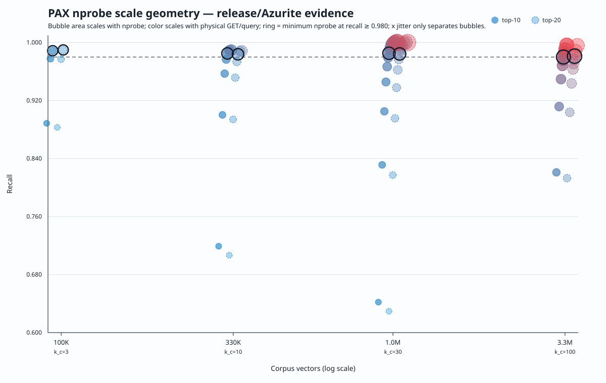
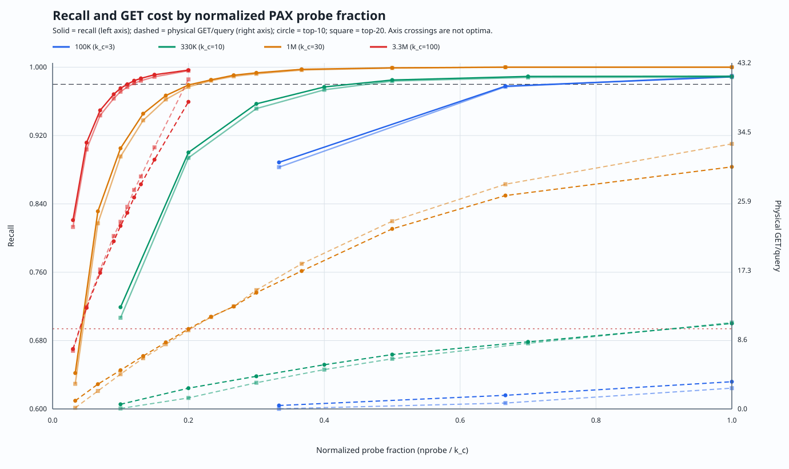
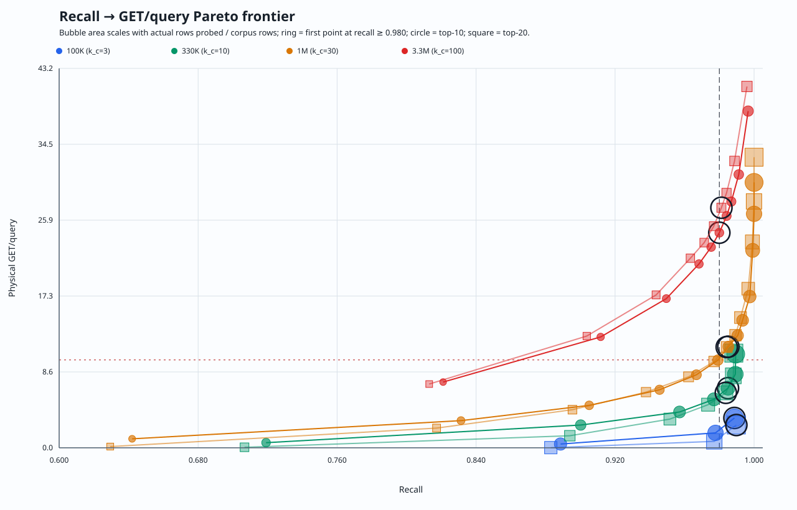

= BIGANN PAX nprobe geometry: 100K through 3.3M (2026-07-31)
:toc:

This is the dated evidence artifact for the natural-cell PAX v3 nprobe sweep.
It measures the minimum absolute nprobe that preserves recall at four corpus
prefixes while reporting the physical object reads and actual rows probed. It
does not treat `nprobe / k_c` as the objective: the serving objective is the
minimum physical cost at the recall ratchet.

== Method

* Dataset: BIGANN/SIFT 10M base (`uint8`, 128 dimensions), with exact L2
  ground truth generated independently against the 100K, 330K, 1M, and 3.3M
  corpus prefixes. Each truth file has 1,000 queries and top-20 neighbors.
* Layout: one fully materialized PAX v3 L1 segment at every scale. Natural
  coarse-cell law:
  `k_c = clamp(floor(rows * dimension / 4 MiB), 2, 4096)`.
* Query path: REST v2, 1,000 diverse queries per `(nprobe, top_k)` point,
  `top_k={10,20}`. Every point starts a fresh release server over the same
  immutable segment with DRAM/result caches empty and persistent local tier
  disabled.
* Storage path: `az://` through the production Azure HTTP backend against
  Azurite on localhost. This is faithful operation-count evidence and a
  relative latency comparison; it is not Azure WAN latency evidence.
* Hardware: Apple Silicon arm64, 64 GiB RAM. Runs were serialized.
* Quality floor: minimum measured nprobe with `recall@k >= 0.98`.

The lower three matrices predate the final harness-only/flush-ownership fixes,
so this is explicitly cross-revision calibration evidence:

[cols="1,2,2,2", options="header"]
|===
| Corpus | Source revision | Matrix SHA-256 | Points

| 100K
| `b160d2107d67f712ea78a3d0779d62763f3dfba4`
| `cda1993776015a631d7254e94c98fb608c1391aa4d9218eef0b6064f1c9515bb`
| 6

| 330K
| `b160d2107d67f712ea78a3d0779d62763f3dfba4`
| `643431f234e7101470db459cd208361f328654decad0707a7f4f39f8e85527ed`
| 14

| 1M
| `504e849a4d2ea84791310540403808a89f3e3fea`
| `48c90a553f6b1a1bd1845545ccc7aa51d56ffeb46605ed82a0ff6368ee37f03e`
| 26

| 3.3M
| `06c9e5678fa7de6a782563bdeb2625e74ba6b37e`
| `5d32b83cf4987956d1bfb71ae93a77e67d76682c6b7b9464f167cea0066e8cc6`
| 20
|===

The search/layout behavior used by the fit is unchanged across those revisions,
but a future canonical five-point publication should rerun all scales on one
binary. The exact 3.3M binary was `release-server` + Azure, 104,420,432 bytes,
SHA-256
`d6b660cf425f4251f841d882d64420a137060668d6cdde150be215849598e431`.
The 3.3M bed result SHA-256 was
`a3055763827147eca6465f70a8b2bc4868ac127de00cd78a5b4c2a19306729c0`.

== Measured quality floors

[cols="1,1,1,4,4", options="header"]
|===
| Corpus | `k_c` | Mean rows/cell | top-10 floor (`nprobe / recall / GET/q / p50`) | top-20 floor (`nprobe / recall / GET/q / p50`)

| 100K | 3 | 33,333 | 3 / 0.9887 / 3.397 / 92.47 ms | 3 / 0.9898 / 2.593 / 72.81 ms
| 330K | 10 | 33,000 | 5 / 0.9850 / 6.787 / 85.23 ms | 5 / 0.98375 / 6.256 / 121.98 ms
| 1M | 30 | 33,333 | 7 / 0.9852 / 11.507 / 172.77 ms | 7 / 0.98425 / 11.463 / 157.20 ms
| 3.3M | 100 | 33,000 | 11 / 0.9800 / 24.478 / 256.04 ms | 12 / 0.9812 / 27.320 / 298.93 ms
|===

This proves, for the controlled same-distribution prefix experiment, that
constant physical cell size does *not* imply constant nprobe. The absolute
quality-floor nprobe rises with corpus size, while the required fraction of all
cells falls: joint top-10/top-20 floors are `3/3 = 100%`, `5/10 = 50%`,
`7/30 = 23.3%`, and `12/100 = 12%`.

=== Full 3.3M curve

[cols="1,2,2,2,2", options="header"]
|===
| nprobe | top-10 recall | top-10 GET/q | top-20 recall | top-20 GET/q

| 3  | 0.8210 | 7.482  | 0.8130  | 7.260
| 5  | 0.9117 | 12.620 | 0.9037  | 12.720
| 7  | 0.9495 | 16.980 | 0.9436  | 17.400
| 9  | 0.9683 | 20.920 | 0.96335 | 21.580
| 10 | 0.9753 | 22.840 | 0.9713  | 23.350
| 11 | 0.9800 | 24.478 | 0.9768  | 25.220
| 12 | 0.9842 | 26.390 | 0.9812  | 27.320
| 13 | 0.9869 | 28.020 | 0.98415 | 29.000
| 15 | 0.9912 | 31.110 | 0.98875 | 32.640
| 20 | 0.9966 | 38.320 | 0.9959  | 41.120
|===

At `k_c=100`, the current `ceil(2 * sqrt(k_c))` policy selects 20 probes.
The measured joint quality floor is 12. For top-20, choosing 12 instead of 20
reduces GET/q 41.12 -> 27.32 (33.6%), p50 452.19 -> 298.93 ms (33.9%), and
probed rows 654,075 -> 395,950 (39.5%) while retaining recall 0.9812. The
quality-floor path still needs a 27% operation reduction to reach 20 GET/q;
that residual belongs to bounded range coalescing, miss deduplication, and warm
tiering, not a lowered recall ratchet.

The invariants cache was healthy in this run: each 1,000-query point recorded
999 hits and one miss. The earlier zero-hit observation is not reproduced.

== Four-scale fit

The minimum passing points fit a sublinear power law:

[cols="1,3,1,1", options="header"]
|===
| Result size | Fit | log R-squared | leave-one-scale-out MAPE

| top-10 | `nprobe = 2.05985 * k_c ^ 0.364786` | 0.9965 | 4.82%
| top-20 | `nprobe = 1.97377 * k_c ^ 0.387382` | 0.9955 | 5.51%
|===

At an expected 10M `k_c` near 305, these fits predict approximately 16.6
probes for top-10 and 18.1 for top-20. This is a probe schedule for validation,
not permission to ship an extrapolated default. The fit is only evidenced for
128d L2 BIGANN prefixes and `k_c` in `[3,100]`.

== Persisted 3.3M shape

The one-segment layout had 100 non-empty cells. Rows/cell were min 21,637,
p50 31,468, p95 47,262, max 62,849; max/mean was 1.905. Radius values were
min 222.37, p50 260.85, p95 292.71, max 314.74. The model trained on 50,000
rows. Radii are persisted and reported as shape evidence, but the current
probe ranks centroid distance only; radii did not select cells and cannot have
caused recall or GET changes in this sweep.

== Charts and reproduction

`scripts/bench/analyze_nprobe_geometry.py` generated three SVG views from the
four matrices:

* corpus-scale recall bubble chart, SHA-256
  `847333bb01c06bbcdb9175399fac1430b10642cf06d982dae3ae20e2a7820110`;
* normalized-probe dual-axis recall/GET chart, SHA-256
  `870edfdbf5fa2b5505a2d12a9fda167099784db268ac97ef34091e438cbede2c`;
* recall-to-GET Pareto bubble chart, SHA-256
  `fb595f5e1c7486c44774ca43937df64472d0dc031f278cde7661c41b32f8ea79`.

The analysis JSON SHA-256 is
`7f7b926867d4b1cd3e621370abe9d8db78da0b38da6f3faa8ae4dec856c8e1bc`.
The analyzer is TDD-covered by
`tests/python/test_nprobe_geometry_analysis.py`; the sweep checkpoint/provenance
contract is covered by `tests/python/test_nprobe_sweep.py`.

=== Rendered views

== Why single-segment 10M is not reported yet

The local host has 64 GiB RAM. The 3.3M flush/training window reached roughly
36 GiB RSS. The active compaction path still holds several corpus-wide
representations (`all_vector_records`, canonical MVCC batches, merge clones,
metadata-sort intermediates, BTreeMap, and writer input), so naive linear
scaling of one 10M morsel exceeds the host memory envelope. Admission control
bounds concurrent jobs; it does not make one job O(1) memory.

A local three/four-segment 10M run would be operationally useful but would
confound segment count with cell geometry and must not be inserted as the fifth
point of this one-segment fit. The honest single-segment 10M gate is either
TD-COMPACT-2 S2's streaming merge or a sufficiently large-memory Azure CPU host.
Until then, the four-scale fit is preliminary and the five-point claim remains
open.
