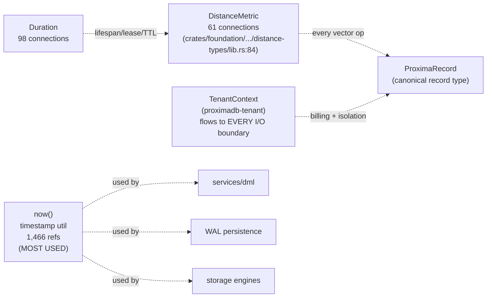
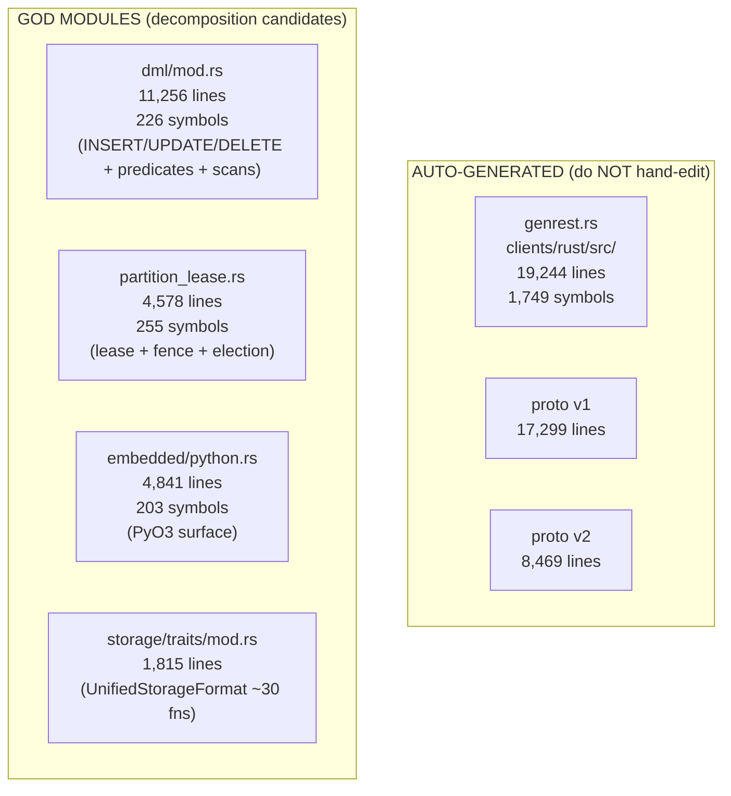
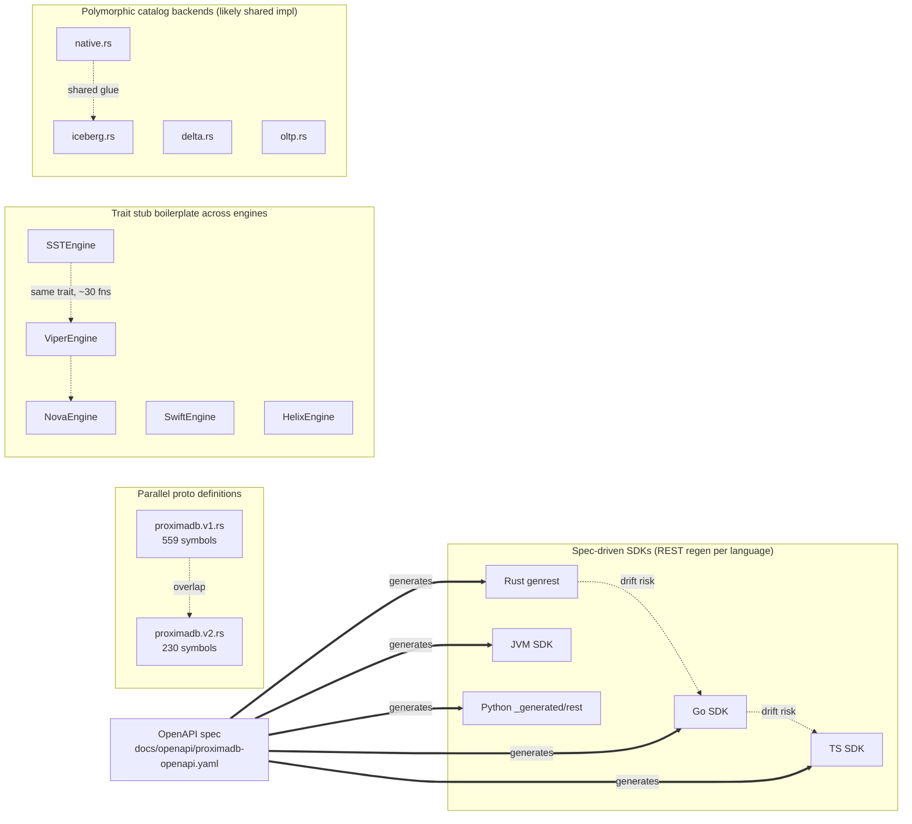

# Coupling Analysis — Hub Types, Hotspots, Duplication Targets

Evidence (file sizes via `wc -l` + `.victor/init.md` architecture stats):

| File | LOC | Notes |
|---|---|---|
| `clients/rust/src/genrest.rs` | 19,244 | AUTO-GENERATED — duplication surface |
| proto `v1` (17,299) + `v2` (8,469) | 25,768 | PARALLEL proto definitions |
| `src/services/dml/mod.rs` | 11,256 | GOD MODULE, 226 symbols |
| `src/cluster/partition_lease.rs` | 4,578 | 255 symbols |
| `src/embedded/python.rs` | 4,841 | 203 symbols |
| `src/storage/traits/mod.rs` | 1,815 | `UnifiedStorageFormat` ~30 fns |
Graph evidence (`.victor/init.md`): `1,049,585` nodes / `3,225,692` edges / `6,573` IMPLEMENTS / `163` INHERITS.
Hubs: `DistanceMetric` (61 conn), `Duration` (98 conn), `now()` (1,466 refs).

**Implication:** `DistanceMetric`, `Duration`, `now()`, and `TenantContext` are the highest-ceiling /
highest-coupling types. Any schema change to these cascades broadly — treat as stable seams.

| Target | Observation | Action |
|---|---|---|
| `proto v1/v2` overlap | Parallel definitions, drift risk | Continue backward-compatible migration toward v2; document v1 shim surface |
| SDK REST transports | Drift-prone hand-rolled risk | Already spec-driven (CLAUDE
| `UnifiedStorageFormat` stubs (~30 fns × 8 engines) | Default-impl boilerplate | Keep trait default methods (lines 796/844…) absorbing shared logic; do not re-implement per engine |
| `dml/mod.rs` (11,256 lines) | God module | Extract `predicates`, `scans`, `changes_since` into submodules (already partly split via `table_write_executor`, `record_store`) |
| Catalog backends (native/iceberg/delta/oltp) | Shared glue across backends | Promote shared logic into `glue.rs` / `schema.rs` (already started) |
| Hub types (DistanceMetric / Duration / now / TenantContext) | High fan-in | Pin as stable seam — change = wide blast radius; gate with SOLID port traits (CLAUDE
- `1,049,585` nodes, `3,225,692` edges
- `6,573` IMPLEMENTS relationships → heavy abstraction/contract surface
- `163` INHERITS relationships → modest inheritance spine (mostly SDK plugin arch: 9 embedding providers, 8 chunking strategies)
- Branching ratio `3.07` → moderately branching control flow
