# ProximaDB Architecture Atlas (GitHub-Native, Mermaid-First)
> Single-page, **natively rendered** view of ProximaDB. Every diagram below is Mermaid, so it
> renders on GitHub with zero install. Each section is a **condensed summary**; the canonical,
> full-detail diagram for every subsystem lives in its layer directory (cataloged in `README.md`).
**Evidence provenance:** every diagram cites real file paths + symbols (see headers). Graph
stats: 1,049,585 nodes / 3,225,692 edges / 6,573 IMPLEMENTS (`.victor/init.md`).
```
docs/architecture-diagrams/
├── atlas.md                  ← you are here (all-Mermaid, GitHub-native)
├── README.md                 ← catalog: every diagram, type, one-line description
├── RENDERING_STRATEGY.md     ← format rules (Mermaid-first; PNG/SVG export)
├── ASCII_ART.md              ← inline, zero-tooling diagrams
├── 00-system-overview/       ← top-level, deployment, 3 use-case views
├── 01-network-layer/         ← protocol multiplex (5678), pgwire (5433), MCP, request flow
├── 02-query-pipeline/        ← ComputeScheduler routing, DataFusion/Volcano, read path
├── 03-storage-layer/         ← engines, WAL, PAX, Iceberg, 2PC, cache, write path
├── 04-index-layer/           ← HNSW internals, index subsystem
├── 04-services-catalog/      ← DML services, RecordStore, catalog, CDC, connectors
├── 05-cluster-distributed/   ← cluster coordination, partition-lease state machine
├── 07-datafusion-integration/← DataFusion OLAP (ADR-052)
├── 07-graph-subsystem/       ← graph component, ORION internals
├── 08-ai-llm/                ← AI/LLM component, embedding pipeline
├── 09-clients-sdk/           ← Python SDK architecture
├── 09-coupling-analysis/     ← god-file coupling hotspots (README + diagram)
├── 09-security-governance/   ← security component, governance detail
├── 10-cross-cutting/         ← observability, infrastructure bootstrap
├── 10-deployment/            ← system deployment
└── 11-crate-dependency-map/  ← workspace crate layering (CI-enforced)
```
Export Mermaid to PNG/SVG: `bash scripts/diagrams/render_atlas.sh`
---
_`src/network/multi_server.rs`, `src/network/postgres/` (5433), `src/network/rest|grpc|arrow_ipc|multiplex` (5678), `src/embedded/`_
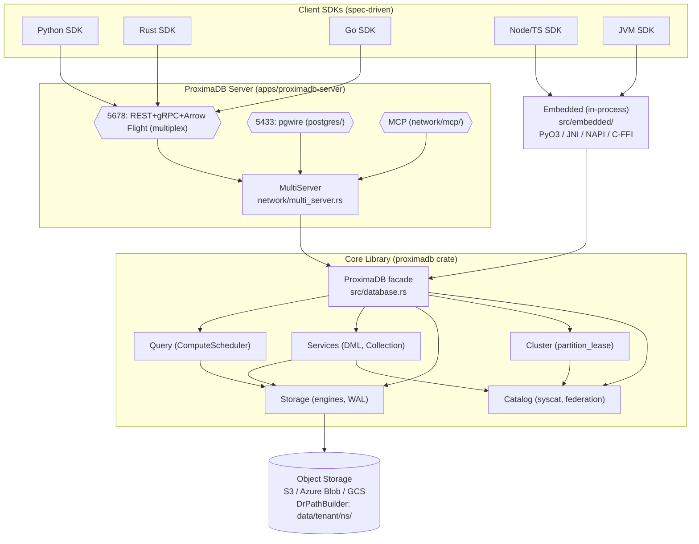

### 0b. Top-Level Component Decomposition
`src/lib.rs` modules + `crates/{foundation,horizontal,storage,query,control,modalities,platform}`_
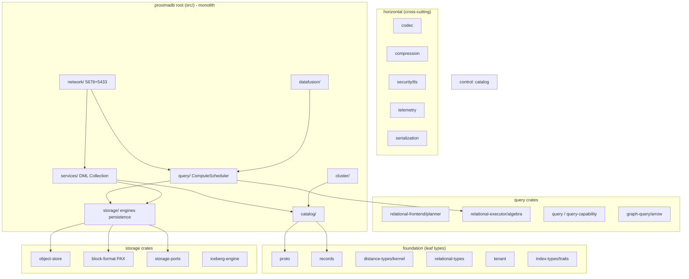
### 0c. Use Cases & Entry Points (Ports)
`rest/v2/{collections,records,query,documents,entities,graphs,schema,timeseries}.rs`, `rest/v1/`, `postgres/` (SQL), `mcp/` (agents)_
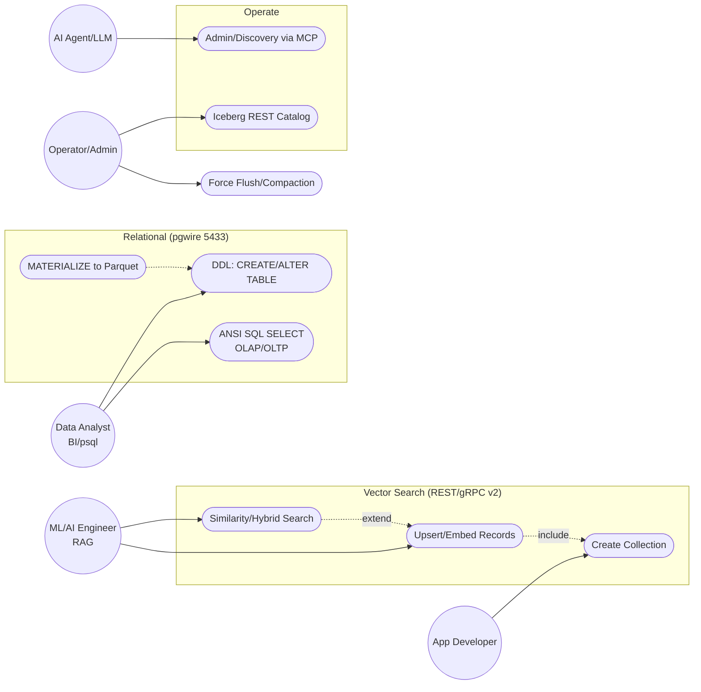
---
## 1. Network / API Layer
`network/multi_server.rs`, `network/multiplex/`, `network/middleware/tenant.rs`, `network/postgres/relational_pipeline.rs`_
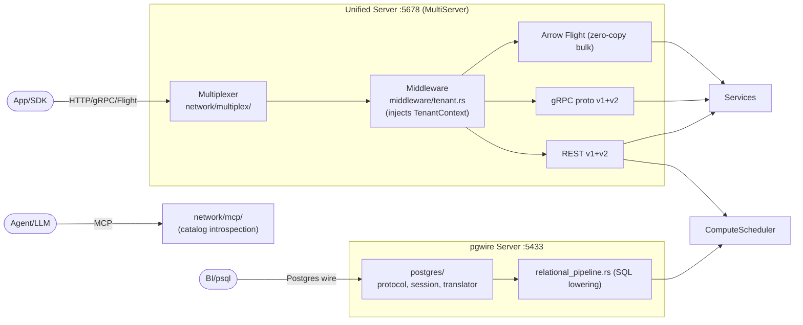
**Key invariant:** Tenant identity enters at `middleware/tenant.rs` and flows as `TenantContext` (`proximadb-tenant`) to **every I/O boundary** (isolation + billing).
---
## 2. Query Routing & ComputeBackend Seam
`query/compute_scheduler.rs:329` `route_select`, `QueryShape(130)`, `SelectRouteDecision(189)`; `datafusion/proxima_table_provider.rs`, `datafusion/proxima_scan_exec.rs`; ADR-052_
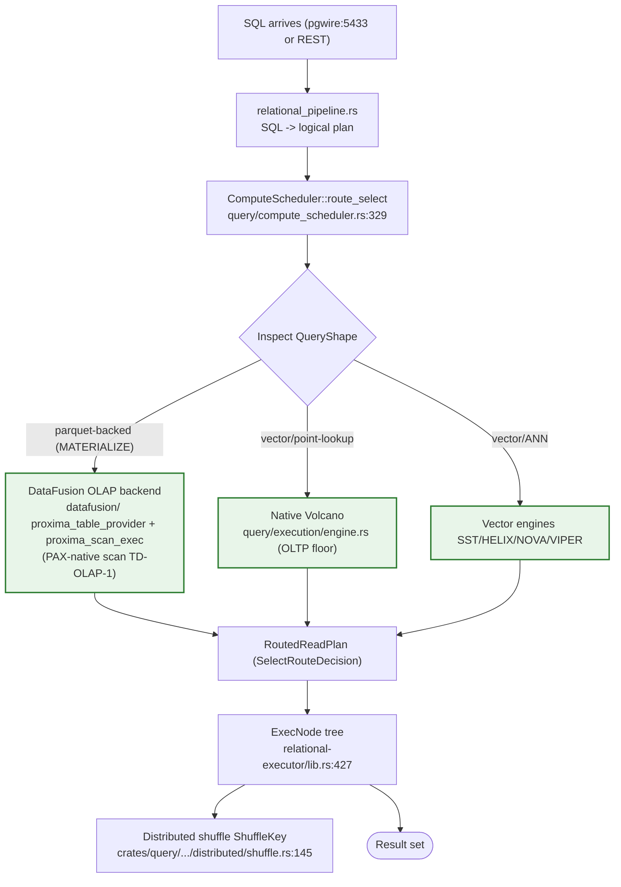
**ComputeBackend seam (ADR-052):** The engine owns selection. DataFusion's vectorized kernels do OLAP; the native investment is the PAX-native **SCAN** (TD-OLAP-1). Do **not** build native HashAgg/HashJoin/Sort. The seam keeps the backend swappable.

---
## 3. Storage Engine Strategy
`storage/traits/mod.rs:532` `UnifiedStorageFormat` (strategy, do_flush, do_compact, search_vectors_unified, create_scan, read_all_records, health_check, rls_record_filter); `storage/engines/factory.rs:312` `create_from_strategy`, `recommend_engine(687)`, `create_for_workload(655)`_
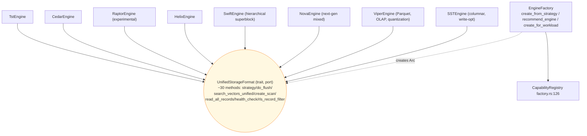
**Primary seam for adding a storage backend:** implement `UnifiedStorageFormat` - no service-layer changes (Strategy Pattern). Default trait methods absorb shared logic across engines.
### 3b. Storage Internal Layers
`src/storage/` subdirs + `crates/storage/*`_
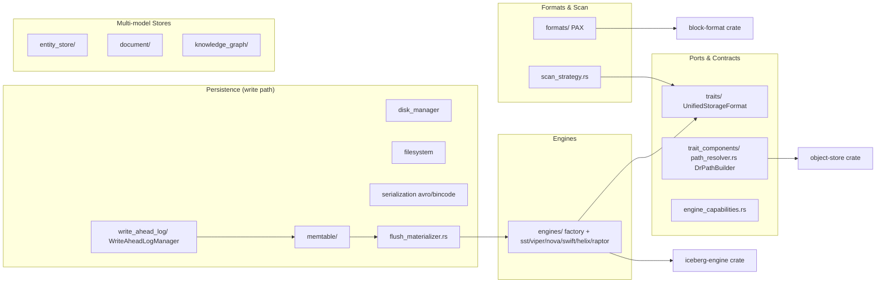
---
## 4. Service Layer
`services/dml/mod.rs:742` `DmlService`, `execute(946)`, `execute_scoped(954)`, `scan_table_records(1111)`; `services/collection/{manager,engine_selector,recall_target,security}.rs`_
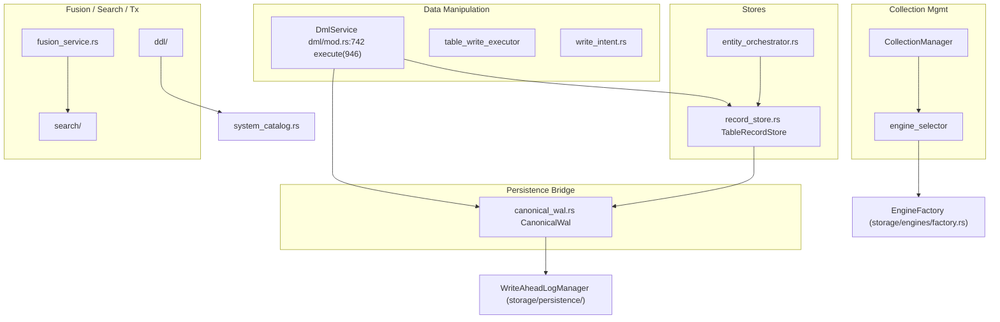
**Invariant 16b:** after `DmlService::execute` commits, it **MUST invalidate** the query/plan cache for (tenant, collection) and route via `TenantContext`.
---
## 5. Write Path (Sequence)
`storage/persistence/write_ahead_log/mod.rs` (`WriteAheadLogManager`, `WALOperation`), `storage/flush_materializer.rs`, `storage/trait_components/path_resolver.rs` (DrPathBuilder), `services/canonical_wal.rs`, `services/dml/mod.rs`_
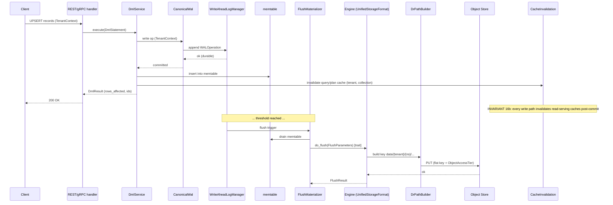

---
## 6. Cluster Coordination
`cluster/partition_lease.rs` (255 symbols - distributed ownership), `cluster/consensus.rs` (Raft, feature: cluster), `cluster/{replication,routing,shard,node_registry,primary_pod_registry}.rs`, `cluster/rpc/grpc_server`_
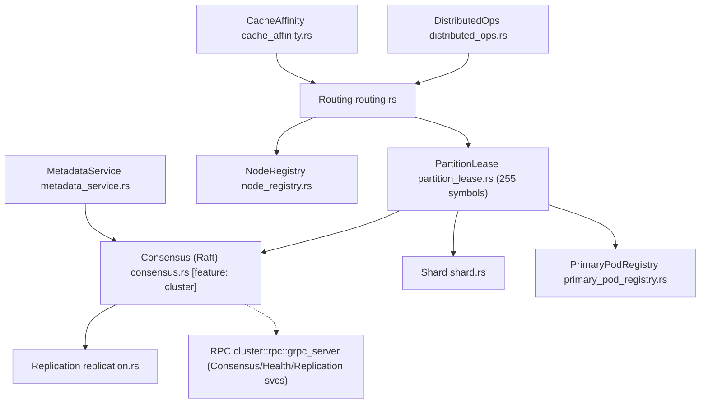
`PartitionLease` is the hub of distributed ownership. Lease fencing prevents split-brain writes; reads route to the partition's owning primary pod.
---
## 7. Catalog: Object Model, Federation & DR
`crates/control/proximadb-catalog/src/` (native, oltp, iceberg, hive, unity, polaris, glue, delta, schema, id_allocator, collection_dr_policy, dr_policy_store, dr_reconciler, dr_restore, corpus_version); `src/catalog/` (syscat_cache, federation, iceberg_rest_service, partition_pruning, segment_registry, index_location_resolver, tenant_tier, budget_guard, recall_probe)_
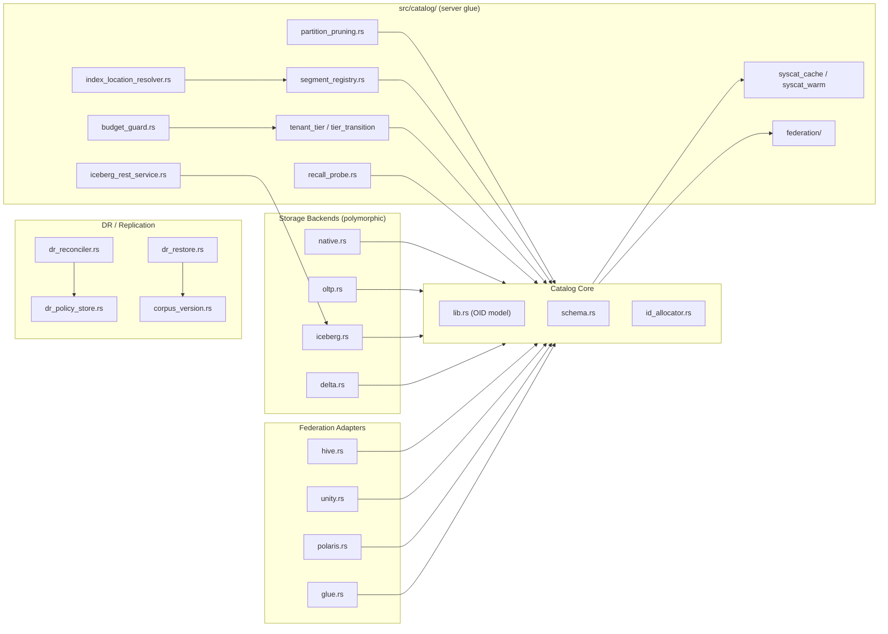
Catalog uses an OID/object model with polymorphic backends (native/iceberg/delta) selected per table; federation adapters expose external catalogs (Hive/Unity/Polaris/Glue).
---
## 8. Embedded Mode & SDK Ecosystem
`src/embedded/` (python.rs PyO3 203 symbols, java.rs, nodejs.rs, c_ffi.rs, python_dataframe.rs); Python SDK: `embedding_providers/core/base.py` BaseEmbeddingProvider (9 impls), `chunking_strategies` ChunkingStrategyInterface (8 impls); SDK REST surfaces spec-driven from `docs/openapi/proximadb-openapi.yaml`_
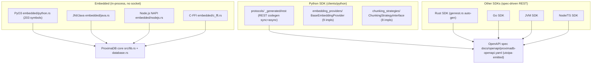
**SDK REST transport is spec-driven (CLAUDE.md §15):** every SDK's REST surface is generated from `docs/openapi/proximadb-openapi.yaml` (utoipa-emitted); the `<lang>-sdk-codegen-drift` gate rejects hand-rolled REST. Full detail: [`09-clients-sdk/01-python-sdk-architecture.mermaid`](./09-clients-sdk/01-python-sdk-architecture.mermaid).
---
## 9. Coupling Analysis (Hub Types, Hotspots, Duplication)
Full analysis: `09-coupling-analysis/README.md` (3 Mermaid diagrams + recommendation table)._
**Hub types (highest blast radius - treat as stable seams):** `now()` (1,466 refs), `Duration` (98 conn), `DistanceMetric` (61 conn), `TenantContext` (all I/O boundaries).
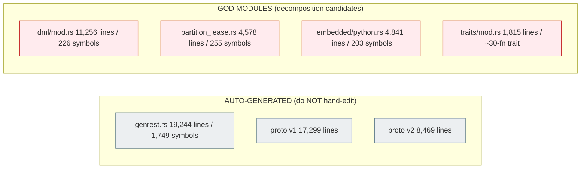
**Duplication targets:** proto v1/v2 overlap (25,768 lines parallel defs); trait-stub boilerplate (~30 fns x 8 engines - absorb in trait default methods); catalog backend glue (native/iceberg/delta - promote shared logic to `glue.rs`). **Graph scale:** 1,049,585 nodes / 3,225,692 edges / 6,573 IMPLEMENTS / 163 INHERITS.

## 10. AI / LLM Subsystem & Embedding Pipeline
`src/ai/` (`llm.rs`, `natural_language_api.rs`, `nlp.rs`, `insights.rs`, `llm_integration/`), `src/automl/`, `src/prompts/`. Full detail: [`08-ai-llm/01-ai-component.mermaid`](./08-ai-llm/01-ai-component.mermaid), [`02-ai-llm-subsystem.mermaid`](./08-ai-llm/02-ai-llm-subsystem.mermaid), [`03-embedding-pipeline.mermaid`](./08-ai-llm/03-embedding-pipeline.mermaid)._
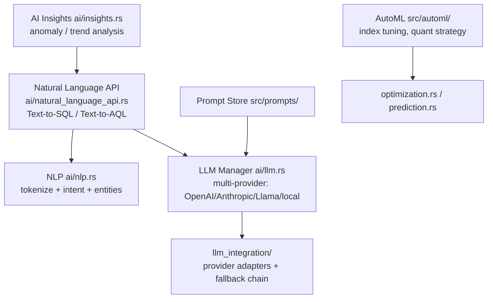
---
## 11. Security, Auth & Governance
`src/security/`, `src/network/middleware/{auth,tenant,rate_limit}.rs`, `crates/foundation/proximadb-tenant`. Full detail: [`09-security-governance/01-security-component.mermaid`](./09-security-governance/01-security-component.mermaid), [`02-security-governance-detail.mermaid`](./09-security-governance/02-security-governance-detail.mermaid)._
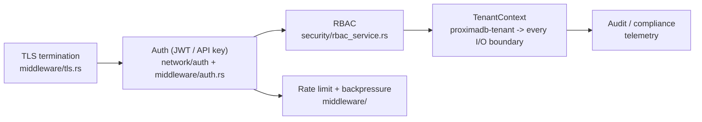
**Key invariant:** `TenantContext` (isolation + billing) flows **fail-closed** to every I/O boundary; all object-storage writes go under `DrPathBuilder` (`data/{tenant}/{ns}/…`).
---
## 12. Observability & Telemetry
`src/telemetry/`, Prometheus billing metrics, distributed tracing. Full detail: [`10-cross-cutting/01-observability-subsystem.mermaid`](./10-cross-cutting/01-observability-subsystem.mermaid)._
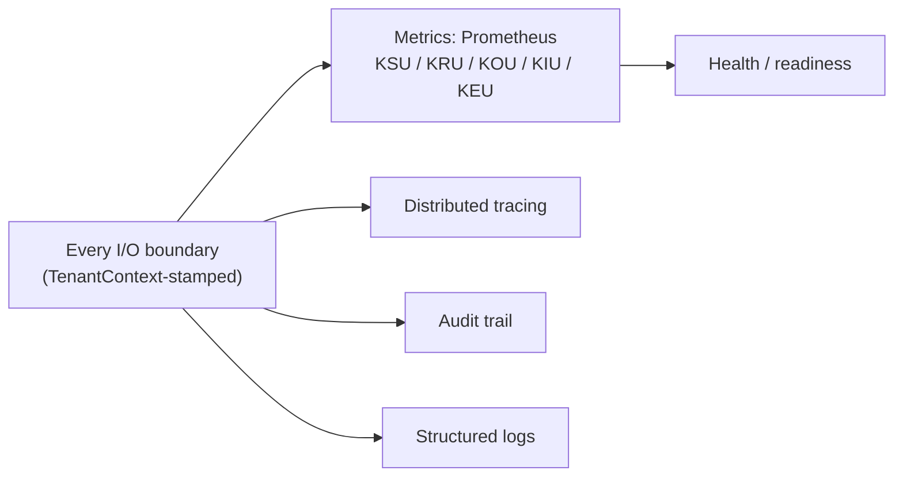
---
## 13. Index Layer (HNSW / Compact / IVF)
`src/storage/engines/.../index/` (AXIS). Full detail: [`04-index-layer/01-index-subsystem.mermaid`](./04-index-layer/01-index-subsystem.mermaid), [`02-hnsw-internals.mermaid`](./04-index-layer/02-hnsw-internals.mermaid)._
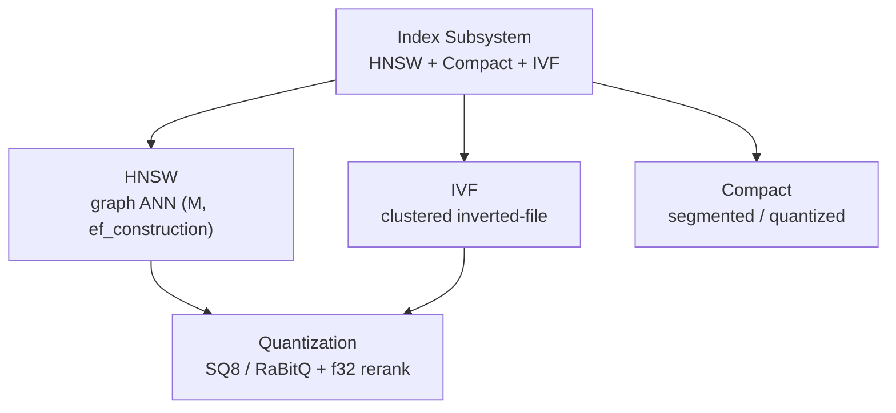
---
- **This file (`atlas.md`)** renders fully on GitHub (Mermaid-native).
- **Per-topic drill-down:** each layer directory holds the authoritative full-detail diagrams — see [`README.md`](./README.md) for the complete catalog (47 diagrams, 16 directories).
- **ASCII art** ([`ASCII_ART.md`](./ASCII_ART.md)) for the simplest one-box/one-liner ideas.
- Rules: [`RENDERING_STRATEGY.md`](./RENDERING_STRATEGY.md).
