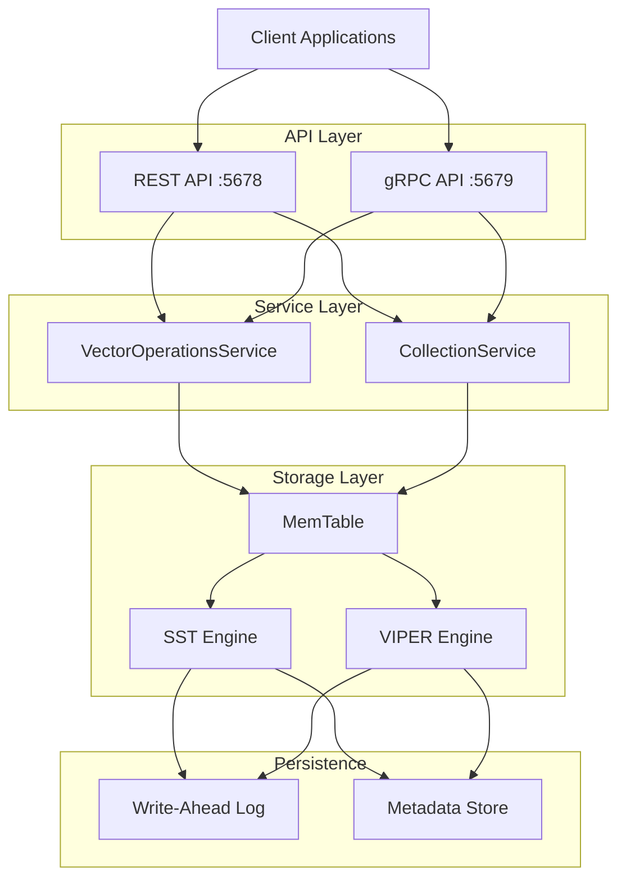

# ProximaDB Architecture

## Overview

ProximaDB is a high-performance vector database with zero infrastructure tax, designed for sub-millisecond search at scale.

## System Architecture



## Core Components

### 1. API Layer
- **REST API** (Port 5678): HTTP/JSON for web clients
- **gRPC API** (Port 5679): Protocol buffers for high performance
- **Unified Handlers**: Single implementation serves both protocols

### 2. Service Layer
- **VectorOperationsService**: CRUD operations, search coordination
- **CollectionService**: Collection lifecycle management
- **EventLogService**: Audit and recovery logging

### 3. Storage Engines

| Engine | Use Case | Storage Format | Optimization |
|--------|----------|----------------|--------------|
| SST | Real-time OLTP | Row-based | Write-optimized |
| VIPER | Analytics | Columnar Parquet | Compression |
| NOVA | Hybrid | Columnar + Quantization | Balance |
| SWIFT | High-throughput | Hierarchical blocks | Speed |
| PRISM | Memory-optimized | LSM-tree | Low memory |
| RAPTOR | Adaptive | Matrix-based | Hardware-aware |

### 4. Index System (AXIS)
- **HNSW**: Graph-based approximate search
- **IVF**: Inverted file with clustering
- **PQ**: Product quantization
- **FLAT**: Brute-force baseline

### 5. Hardware Acceleration
- **SIMD**: AVX2/AVX-512/NEON auto-detection
- **GPU**: CUDA/ROCm/MPS support
- **Quantization**: INT8, PQ8, PQ4 compression

## Data Flow

### Write Path
1. Client sends vector → API layer
2. Proto validation → Service layer
3. Write to MemTable → WAL for durability
4. Background flush → Storage engine
5. Compaction → Optimize storage

### Read Path
1. Search request → API layer
2. Query optimization → Select index/engine
3. Execute search → Hardware acceleration
4. Merge results → Multi-tier deduplication
5. Return top-K → Client

## Key Design Decisions

### Proto-First Architecture
- Native protobuf throughout system
- Zero serialization overhead
- Direct field access

### Dual Storage Engines
- SST for real-time writes
- VIPER for analytical queries
- Automatic selection based on workload

### Hardware Adaptive
- Runtime CPU/GPU detection
- Automatic SIMD optimization
- Cache-aware algorithms

## Performance Characteristics

| Metric | Value | Notes |
|--------|-------|-------|
| Insert Throughput | 17K vectors/sec | Bulk loading |
| Search Latency | < 1ms | 1M vectors, indexed |
| Memory Usage | 30% less | vs. alternatives |
| Compression Ratio | 70% | With quantization |
| Concurrent Queries | 10K+ | Per server |

## Deployment Architecture

### Single Server
```yaml
# docker-compose.yml
services:
  proximadb:
    image: proximadb/proximadb:latest
    ports:
      - "5678:5678"  # REST
      - "5679:5679"  # gRPC
    volumes:
      - data:/data
```

### High Availability
- Active-passive failover
- Shared storage backend (S3/Azure/GCS)
- Metadata replication

### Scaling Strategy
- Vertical: Up to 1TB RAM, 128 cores
- Horizontal: Sharding by collection
- Tiering: Hot/warm/cold data separation

## Configuration

Key configuration in `config/config.toml`:

```toml
[server]
http_port = 5678
grpc_port = 5679

[storage]
default_engine = "sst"  # or "viper"
data_dir = "/data"

[compute]
enable_gpu = true
enable_simd = true

[cache]
total_memory_mb = 4096
```

## Monitoring

- **Metrics**: Prometheus `/metrics` endpoint
- **Health**: `/health` for liveness checks
- **Dashboard**: Built-in web UI on port 8080
- **Logging**: Structured JSON logs

## Security

- **Authentication**: JWT tokens, API keys
- **TLS**: Certificate-based encryption
- **Authorization**: Role-based access control
- **Audit**: Event logging for compliance