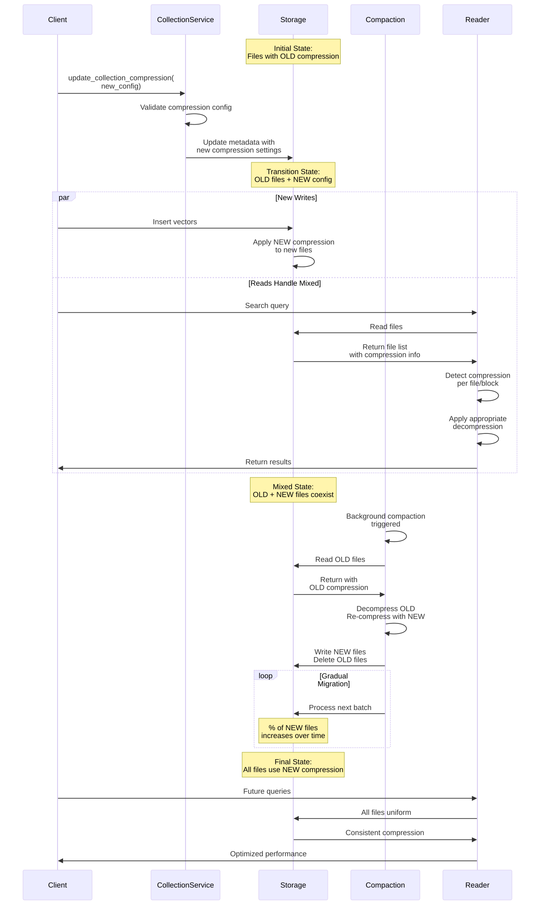
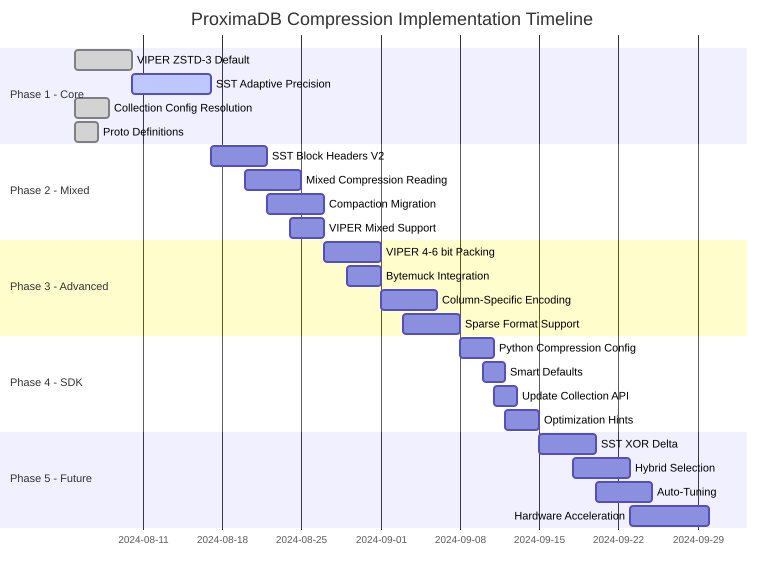

# ProximaDB Compression & Encoding Design - Release 1.0

## Executive Summary
Finalized design for granular per-collection compression control with optimal encoding strategies for SST and VIPER storage engines. This document captures all architectural decisions made for Release 1.0, prioritizing **adaptive precision reduction** for SST and **standard Parquet with transformations** for VIPER.

## Visual Architecture

### Compression Resolution Flow

*[View Mermaid Source](../diagrams/compression-resolution.mmd)*

### VIPER Compression Architecture

*[View Mermaid Source](../diagrams/viper-compression-architecture.mmd)*

### SST Vector Compression Techniques

*[View Mermaid Source](../diagrams/sst-vector-compression.mmd)*

### Mixed Compression Migration

*[View Mermaid Source](../diagrams/mixed-compression-migration.mmd)*

### Compression Decision Tree

*[View Mermaid Source](../diagrams/compression-decision-tree.mmd)*

### Final Architecture Decisions

*[View Mermaid Source](../diagrams/compression-decisions-final.mmd)*

### SST Adaptive Precision Detail

*[View Mermaid Source](../diagrams/sst-adaptive-precision-detail.mmd)*

### Implementation Timeline

*[View Mermaid Source](../diagrams/implementation-phases.mmd)*

## Finalized Design Decisions (Release 1.0 - REVISED)

### Engine-Specific Quantization Strategy

*[View Mermaid Source](../diagrams/engine-quantization-strategy.mmd)*

### SST Compression Levels

*[View Mermaid Source](../diagrams/sst-compression-levels.mmd)*

| Component | Decision | Rationale |
|-----------|----------|-----------|
| **Default Compression** | ZSTD-3 | Balanced performance/compression for initial release |
| **SST Quantization** | **NOT RECOMMENDED** | Row storage requires reading entire record - quantization increases I/O |
| **SST Strategy** | FP32 only + ZSTD block compression | Optimal I/O, 100% accuracy, 20-40% compression |
| **VIPER Quantization** | **STRONGLY RECOMMENDED** | Columnar storage allows reading only quantized column |
| **VIPER Strategy** | Write quantized columns (INT8/PQ) | 24x less I/O, 100x faster search |
| **Migration Strategy** | Support mixed compression reading | Allows gradual migration without downtime |
| **Compression Levels** | User configurable (ZSTD 1-9) | Trade-off between speed and compression ratio |
| **Python SDK** | Smart defaults based on engine | VIPER → quantization, SST → FP32 only |

## Design Goals
1. **Granular Control**: Per-collection compression configuration
2. **Mixed Compression**: Support reading mixed compressed/uncompressed files during migration
3. **Optimal Encoding**: Engine-specific encoding for different data types
4. **Zero Downtime**: Change compression without service interruption
5. **Cost Optimization**: Balance storage cost vs CPU overhead

## 1. Proto-Based Configuration

### 1.1 Compression Configuration
```protobuf
// Core compression configuration
enum CompressionAlgorithm {
  COMPRESSION_NONE = 0;      // No compression
  COMPRESSION_ZSTD = 1;      // Zstandard (levels 1-22)
  COMPRESSION_LZ4 = 2;       // LZ4 fast compression (future)
  COMPRESSION_SNAPPY = 3;    // Snappy balanced (future)
}

message CompressionConfig {
  CompressionAlgorithm algorithm = 1;  // Algorithm to use
  optional int32 level = 2;            // Algorithm-specific level
  bool adaptive = 3;                   // Enable adaptive compression
  optional float min_ratio = 4;        // Min compression ratio threshold
}
```

### 1.2 Column-Specific Encoding (VIPER)
```protobuf
// Column encoding hints for Parquet storage
enum ColumnEncoding {
  ENCODING_AUTO = 0;        // Let Parquet decide
  ENCODING_PLAIN = 1;       // No encoding
  ENCODING_DICTIONARY = 2;  // Dictionary for low cardinality
  ENCODING_RLE = 3;         // Run-length encoding
  ENCODING_DELTA = 4;       // Delta encoding
  ENCODING_BITPACKED = 5;   // Bit-packing for integers
}

message FilterableColumnSpec {
  // ... existing fields ...
  optional ColumnEncoding encoding_hint = 6;  // Column-specific encoding
}
```

### 1.3 Storage Optimization Hints
```protobuf
enum AccessPattern {
  ACCESS_PATTERN_UNKNOWN = 0;
  ACCESS_PATTERN_WRITE_HEAVY = 1;  // High write throughput
  ACCESS_PATTERN_READ_HEAVY = 2;   // High read throughput
  ACCESS_PATTERN_BALANCED = 3;     // Mixed read/write
  ACCESS_PATTERN_ARCHIVE = 4;      // Rarely accessed
}

enum DataDensity {
  DENSITY_UNKNOWN = 0;
  DENSITY_DENSE = 1;    // >80% non-zero values
  DENSITY_SPARSE = 2;   // <20% non-zero values
  DENSITY_MIXED = 3;    // Mixed density
}

message StorageOptimizationHints {
  AccessPattern access_pattern = 1;
  DataDensity data_density = 2;
  bool frequent_updates = 3;
  optional int64 expected_size_gb = 4;
  optional float read_write_ratio = 5;
}
```

## 2. Engine-Specific Implementation

### 2.1 VIPER Engine (Columnar/Parquet)

#### Critical Design Decision: Leverage Standard Arrow/Parquet Infrastructure

```
┌─────────────┐     ┌──────────────┐     ┌──────────────┐     ┌─────────────┐
│   FP32      │────▶│  Transform   │────▶│   Standard   │────▶│   Parquet   │
│  Vectors    │     │   Layer      │     │    Arrow     │     │    File     │
└─────────────┘     └──────────────┘     └──────────────┘     └─────────────┘
                           │                     │                     │
                    ┌──────▼──────┐       ┌─────▼─────┐        ┌──────▼──────┐
                    │ Quantization│       │  List<T>  │        │ Compressed  │
                    │   Packing   │       │  Format   │        │   Storage   │
                    │   Sparse→COO│       │  Native   │        │   ZSTD/LZ4  │
                    └─────────────┘       └───────────┘        └─────────────┘
                                                                       │
                    ┌─────────────┐       ┌───────────┐        ┌──────▼──────┐
                    │   FP32      │◀──────│ Transform │◀───────│    Read     │
                    │  Vectors    │       │   Back    │        │   Parquet   │
                    └─────────────┘       └───────────┘        └─────────────┘
```

**Principle**: Use standard Arrow writers/readers with their supported encodings. Custom transformations (quantization, bit-packing) happen BEFORE writing and AFTER reading, not within the Parquet layer.

**Rationale**:
1. Not all Parquet readers/writers support all encodings
2. Maintains compatibility with ecosystem tools
3. Allows us to benefit from Arrow/Parquet optimizations
4. Simplifies debugging and maintenance
5. Data must be converted back to fp32/quantized format for distance calculations anyway

#### Vector Storage Strategy

| Vector Type | Pre-Write Transform | Parquet Storage | Parquet Encoding | Post-Read Transform |
|------------|-------------------|-----------------|------------------|-------------------|
| **FP32 Vectors** | None | List<Float32> | PLAIN or BYTE_STREAM_SPLIT* | None |
| **Quantized INT8** | None | List<Int8> | PLAIN | None |
| **Quantized INT16** | None | List<Int16> | PLAIN | None |
| **Custom Bit-Width (4-6 bit)** | Pack with bytemuck to INT8 | List<Int8> | PLAIN | Unpack with bytemuck |
| **Sparse Vectors** | Convert to COO format | Struct{indices, values} | PLAIN | Reconstruct dense |

*BYTE_STREAM_SPLIT only if supported by Arrow version

#### Implementation Architecture
```rust
// VIPER flush.rs - Layered approach
impl FlushManager {
    async fn flush_vectors(&self, records: &[VectorRecord]) -> Result<()> {
        // Layer 1: Transform vectors based on quantization config
        let transformed_records = self.transform_vectors_for_storage(records)?;
        
        // Layer 2: Build Arrow RecordBatch with standard types
        let batch = self.build_arrow_batch(&transformed_records)?;
        
        // Layer 3: Configure Parquet writer with SUPPORTED encodings only
        let props = self.build_writer_properties()?;
        
        // Layer 4: Write using standard ArrowWriter
        let mut writer = ArrowWriter::try_new(buffer, batch.schema(), Some(props))?;
        writer.write(&batch)?;
        writer.close()?;
    }
    
    fn transform_vectors_for_storage(&self, records: &[VectorRecord]) -> Result<Vec<TransformedRecord>> {
        // Custom transformations BEFORE Parquet
        match self.quantization_config {
            Some(QuantConfig::CustomBitWidth(bits)) if bits < 8 => {
                // Pack multiple values into INT8 using bytemuck
                records.iter().map(|r| {
                    let packed = pack_vector_custom_bits(&r.vector, bits);
                    TransformedRecord {
                        vector_data: VectorData::PackedInt8(packed),
                        ..r.clone()
                    }
                }).collect()
            }
            Some(QuantConfig::Sparse(threshold)) => {
                // Convert to COO format for sparse vectors
                records.iter().map(|r| {
                    let (indices, values) = to_coo_format(&r.vector, threshold);
                    TransformedRecord {
                        vector_data: VectorData::Sparse { indices, values },
                        ..r.clone()
                    }
                }).collect()
            }
            _ => {
                // No transformation - store as-is
                records.iter().map(|r| TransformedRecord {
                    vector_data: VectorData::Dense(r.vector.clone()),
                    ..r.clone()
                }).collect()
            }
        }
    }
    
    fn build_writer_properties(&self) -> Result<WriterProperties> {
        let mut props = WriterProperties::builder()
            .set_compression(self.get_compression()?)
            .set_max_row_group_size(self.config.row_group_size);
        
        // Only use encodings that are ACTUALLY SUPPORTED by our Arrow version
        // Check Arrow documentation for supported encodings per type
        
        // Safe encodings that are widely supported:
        props = props
            .set_dictionary_enabled(true)  // Dictionary encoding for strings
            .set_statistics_enabled(true); // Column statistics
        
        // Conditionally enable advanced encodings if supported
        if self.arrow_supports_byte_stream_split() {
            // Only for FLOAT/DOUBLE columns in newer Arrow versions
            props = props.set_column_encoding(
                ColumnPath::from("vector"),
                Encoding::BYTE_STREAM_SPLIT
            );
        }
        
        Ok(props.build())
    }
}
```

#### Reading Strategy
```rust
impl VectorReader {
    async fn read_vectors(&self, file: &Path) -> Result<Vec<VectorRecord>> {
        // Layer 1: Read Parquet file with standard ArrowReader
        let file = File::open(file)?;
        let reader = ParquetRecordBatchReaderBuilder::try_new(file)?
            .build()?;
        
        // Layer 2: Process batches
        let mut records = Vec::new();
        for batch in reader {
            let batch = batch?;
            
            // Layer 3: Transform back to VectorRecord format
            let batch_records = self.transform_from_storage(&batch)?;
            records.extend(batch_records);
        }
        
        Ok(records)
    }
    
    fn transform_from_storage(&self, batch: &RecordBatch) -> Result<Vec<VectorRecord>> {
        // Custom transformations AFTER reading from Parquet
        let vector_array = batch.column_by_name("vector")
            .ok_or("Missing vector column")?;
        
        match self.storage_format {
            StorageFormat::PackedCustomBits(bits) => {
                // Unpack custom bit-width vectors
                let packed_array = vector_array.as_any()
                    .downcast_ref::<Int8Array>()
                    .ok_or("Expected Int8Array for packed vectors")?;
                
                (0..batch.num_rows()).map(|i| {
                    let packed = get_packed_vector(packed_array, i);
                    let unpacked = unpack_vector_custom_bits(&packed, bits, self.dimension);
                    // Convert to fp32 for distance calculation
                    let fp32_vector = dequantize_to_fp32(&unpacked, bits);
                    build_vector_record(fp32_vector, batch, i)
                }).collect()
            }
            StorageFormat::Sparse => {
                // Reconstruct dense vectors from COO format
                // ...
            }
            _ => {
                // Standard format - direct conversion
                // ...
            }
        }
    }
}
```

#### Metadata Column Encoding
```rust
// Apply filterable column encoding hints
for column in filterable_columns {
    match column.encoding_hint {
        ENCODING_DICTIONARY => {
            // IDs, categories, low-cardinality strings
            props_builder.set_column_dictionary_enabled(column.name, true)
        }
        ENCODING_RLE => {
            // Boolean flags, repeated values
            props_builder.set_column_encoding(column.name, Encoding::RLE)
        }
        ENCODING_DELTA => {
            // Timestamps, sequential IDs
            props_builder.set_column_encoding(column.name, Encoding::DELTA_BINARY_PACKED)
        }
        _ => {} // Use Parquet auto-detection
    }
}
```

### 2.2 SST Engine (Row-Based/SSTable)

#### SSTable Header v2
```rust
pub struct SstableHeader {
    // ... existing fields ...
    
    // Compression metadata
    pub compression_algorithm: CompressionAlgorithmSst,
    pub compression_level: u8,
    
    // Per-block compression info (for mixed compression)
    pub block_compression_map: Vec<BlockCompressionInfo>,
}

pub struct BlockCompressionInfo {
    pub block_id: u32,
    pub algorithm: CompressionAlgorithmSst,
    pub compressed_size: u32,
    pub uncompressed_size: u32,
}
```

#### Block-Level Compression Architecture
```rust
pub struct DataBlock {
    pub vectors: Vec<VectorRecord>,  // ~1000 vectors
    pub block_id: u32,
    pub vector_type: VectorType,     // FP32, INT16, INT8
}

impl SstableWriter {
    fn write_block(&self, vectors: Vec<VectorRecord>, compression: &CompressionConfig) {
        // Group vectors into blocks for better compression
        let block_size = match vectors[0].vector_type {
            VectorType::Fp32 => 1000,     // 6MB blocks
            VectorType::Int16 => 2000,    // 6MB blocks  
            VectorType::Int8 => 4000,     // 6MB blocks
        };
        
        for chunk in vectors.chunks(block_size) {
            let block = DataBlock {
                vectors: chunk.to_vec(),
                block_id: self.next_block_id(),
                vector_type: chunk[0].vector_type,
            };
            
            // Serialize entire block
            let block_data = self.serialize_block(&block)?;
            
            // Apply compression to ENTIRE block
            let (compressed_data, compression_info) = match block.vector_type {
                VectorType::Fp32 => {
                    // FP32: ZSTD-3 on entire block
                    let compressed = zstd::compress(&block_data, 3)?;
                    let ratio = block_data.len() as f32 / compressed.len() as f32;
                    println!("Block {} compressed: {}MB → {}MB (ratio: {:.1}x)", 
                        block.block_id,
                        block_data.len() / 1_000_000,
                        compressed.len() / 1_000_000,
                        ratio
                    );
                    (compressed, CompressionInfo::Zstd3)
                }
                VectorType::Int16 => {
                    // INT16: First pack to 12-bit, then ZSTD
                    let packed = self.pack_int16_to_12bit(&block)?;
                    let compressed = zstd::compress(&packed, 3)?;
                    (compressed, CompressionInfo::Adaptive12Bit)
                }
                VectorType::Int8 => {
                    // INT8: First pack to 6-bit, then ZSTD
                    let packed = self.pack_int8_to_6bit(&block)?;
                    let compressed = zstd::compress(&packed, 3)?;
                    (compressed, CompressionInfo::Adaptive6Bit)
                }
            };
            
            self.write_compressed_block(compressed_data, compression_info)?;
        }
    }
}
```

## 3. Compression Resolution Strategy

```
                     ┌──────────────────────┐
                     │  SDK Request         │
                     │  compression_config? │
                     └──────────┬───────────┘
                                │
                     ┌──────────▼───────────┐
                     │  Has Config?         │
                     └──────┬───┬───────────┘
                          Yes│   │No
                             │   │
                   ┌─────────▼─┐ ▼─────────────┐
                   │ Validate & │ Server Engine │
                   │  Adjust    │   Defaults    │
                   └─────────┬─┘ └──────┬──────┘
                             │          │
                             ▼          ▼
                     ┌──────────────────────┐
                     │  Apply Compression   │
                     │     Configuration    │
                     └──────────┬───────────┘
                                │
                     ┌──────────▼───────────┐
                     │  Check Access        │
                     │     Pattern          │
                     └──────────┬───────────┘
                                │
                ┌───────────────┼───────────────┐
                ▼               ▼               ▼
         ┌──────────┐    ┌──────────┐   ┌──────────┐
         │ Archive  │    │  Write   │   │  Read    │
         │ ZSTD-9   │    │  Heavy   │   │  Heavy   │
         │ Max Comp │    │   LZ4    │   │  None    │
         └──────────┘    └──────────┘   └──────────┘
```

### 3.1 Collection Service Resolution
```rust
fn resolve_compression_config(
    requested: Option<&CompressionConfig>,
    server_config: &StorageConfig,
    storage_engine: StorageEngine,
) -> CompressionConfig {
    // Priority order:
    // 1. Explicit SDK request (if valid)
    // 2. Server engine-specific defaults
    // 3. No compression
    
    if let Some(config) = requested {
        return validate_and_adjust(config);
    }
    
    // Engine-specific defaults
    match storage_engine {
        StorageEngine::Viper => {
            if server_config.viper.compression_enabled {
                CompressionConfig {
                    algorithm: COMPRESSION_ZSTD,
                    level: Some(3),
                    adaptive: true,
                    min_ratio: Some(1.5),
                }
            } else {
                CompressionConfig::none()
            }
        }
        StorageEngine::Sst => {
            if server_config.sst.compression_enabled {
                CompressionConfig {
                    algorithm: COMPRESSION_ZSTD,
                    level: Some(3),
                    adaptive: false,
                    min_ratio: Some(1.5),
                }
            } else {
                CompressionConfig::none()
            }
        }
    }
}
```

### 3.2 Automatic Compression Selection
```rust
fn auto_select_compression(
    hints: &StorageOptimizationHints,
    data_density: DataDensity,
) -> CompressionConfig {
    match (hints.access_pattern, data_density) {
        // Archive data: Maximum compression
        (ACCESS_PATTERN_ARCHIVE, _) => CompressionConfig {
            algorithm: COMPRESSION_ZSTD,
            level: Some(9),
            adaptive: true,
            min_ratio: Some(1.2),
        },
        
        // Sparse vectors: High compression
        (_, DENSITY_SPARSE) => CompressionConfig {
            algorithm: COMPRESSION_ZSTD,
            level: Some(6),
            adaptive: true,
            min_ratio: Some(1.5),
        },
        
        // Write-heavy: Fast compression
        (ACCESS_PATTERN_WRITE_HEAVY, _) => CompressionConfig {
            algorithm: COMPRESSION_LZ4,
            level: None,
            adaptive: false,
            min_ratio: Some(2.0),
        },
        
        // Read-heavy hot data: No compression
        (ACCESS_PATTERN_READ_HEAVY, DENSITY_DENSE) => CompressionConfig {
            algorithm: COMPRESSION_NONE,
            level: None,
            adaptive: false,
            min_ratio: None,
        },
        
        // Default: Balanced compression
        _ => CompressionConfig {
            algorithm: COMPRESSION_ZSTD,
            level: Some(3),
            adaptive: true,
            min_ratio: Some(1.5),
        },
    }
}
```

## 4. Mixed Compression Support

### 4.1 Block-Level Decompression
```rust
impl SstableReader {
    async fn read_vectors(&self, range: Range<usize>) -> Result<Vec<VectorRecord>> {
        // Determine which blocks contain the requested range
        let start_block = range.start / self.vectors_per_block;
        let end_block = range.end / self.vectors_per_block;
        
        let mut all_vectors = Vec::new();
        
        for block_id in start_block..=end_block {
            // Read and decompress ENTIRE block at once
            let block_vectors = self.read_and_decompress_block(block_id).await?;
            
            // Extract only the vectors we need from this block
            let block_start = block_id * self.vectors_per_block;
            let block_end = block_start + block_vectors.len();
            
            let local_start = range.start.saturating_sub(block_start);
            let local_end = (range.end.min(block_end) - block_start);
            
            all_vectors.extend_from_slice(&block_vectors[local_start..local_end]);
        }
        
        Ok(all_vectors)
    }
    
    async fn read_and_decompress_block(&self, block_id: u32) -> Result<Vec<VectorRecord>> {
        // Read compressed block
        let compressed_data = self.read_raw_block(block_id).await?;
        let block_info = &self.header.block_compression_map[block_id as usize];
        
        // Single decompression for entire block
        let decompressed = match block_info.compression_type {
            CompressionInfo::Zstd3 => {
                // Decompress entire block at once
                let data = zstd::decompress(&compressed_data)?;
                self.deserialize_fp32_block(&data)?
            }
            CompressionInfo::Adaptive12Bit => {
                // Decompress then unpack
                let data = zstd::decompress(&compressed_data)?;
                self.unpack_int16_from_12bit(&data)?
            }
            CompressionInfo::Adaptive6Bit => {
                // Decompress then unpack
                let data = zstd::decompress(&compressed_data)?;
                self.unpack_int8_from_6bit(&data)?
            }
        };
        
        Ok(decompressed)
    }
}
```

### 4.2 Gradual Migration During Compaction
```rust
impl CompactionManager {
    async fn compact_with_compression_change(
        &self,
        input_files: Vec<SstFile>,
        new_compression: &CompressionConfig,
    ) -> Result<SstFile> {
        let mut output_writer = SstableWriter::new();
        
        for input_file in input_files {
            let reader = SstableReader::open(&input_file)?;
            
            // Read blocks with old compression
            for block_id in reader.block_ids() {
                let data = reader.read_block(block_id).await?;
                let records = deserialize_block(&data)?;
                
                // Write with new compression
                output_writer.write_block(&records, new_compression)?;
            }
        }
        
        output_writer.finalize()
    }
}
```

## 5. Trade-offs Analysis

### 5.1 Compression Algorithm Trade-offs

| Algorithm | Compression Ratio | Speed | CPU Usage | Use Case |
|-----------|------------------|-------|-----------|----------|
| **None** | 1:1 | Fastest | None | Hot data, real-time |
| **LZ4** | 2-3:1 | Very Fast | Low | Write-heavy, warm data |
| **Snappy** | 2-3:1 | Fast | Medium | Balanced workloads |
| **ZSTD-1** | 3-4:1 | Fast | Medium | General purpose |
| **ZSTD-3** | 4-5:1 | Moderate | Medium | Default balanced |
| **ZSTD-6** | 5-7:1 | Slow | High | Read-heavy, cold data |
| **ZSTD-9+** | 7-10:1 | Very Slow | Very High | Archive, rarely accessed |

### 5.2 Vector Encoding Trade-offs

| Vector Type | Storage Size | Query Speed | Accuracy | Best For |
|------------|--------------|-------------|----------|----------|
| **FP32 (No Compression)** | 100% | Fastest | 100% | Hot data, high accuracy |
| **FP32 + BYTE_STREAM_SPLIT** | 70-90% | Fast | 100% | General purpose |
| **INT16 Quantized** | 50% | Fast | 99%+ | Balanced |
| **INT8 Quantized** | 25% | Very Fast | 95-99% | Large scale |
| **6-bit Custom** | 19% | Fast* | 90-95% | Very large scale |
| **4-bit Custom** | 12.5% | Fast* | 85-90% | Extreme scale |

*With SIMD optimizations

### 5.3 Metadata Encoding Trade-offs

| Encoding | Best For | Compression | Query Speed | CPU Cost |
|----------|----------|-------------|-------------|----------|
| **Dictionary** | Low cardinality strings (IDs, categories) | High (10:1+) | Very Fast | Low |
| **RLE** | Repeated values (flags, states) | Very High (100:1+) | Very Fast | Very Low |
| **Delta** | Sequential values (timestamps) | High (5:1+) | Fast | Low |
| **Bit-Packed** | Small integers | Moderate (2:1) | Fast | Low |
| **Plain** | Random data | None | Fastest | None |

## 6. Performance Impact

### 6.1 Expected Improvements

**Storage Reduction**:
- Dense vectors: 10-30% with BYTE_STREAM_SPLIT + ZSTD
- Sparse vectors: 60-80% with RLE + ZSTD-9
- Quantized vectors: 75% (INT8) to 87.5% (4-bit)
- Metadata: 50-90% with appropriate encoding

**Query Performance**:
- Hot data (no compression): Baseline
- Warm data (LZ4): -5% to -10% due to decompression
- Cold data (ZSTD-9): -20% to -30% due to decompression
- Quantized (INT8): +20% to +40% due to SIMD and cache efficiency

**Write Performance**:
- No compression: Baseline
- LZ4: -10% to -15%
- ZSTD-3: -20% to -30%
- ZSTD-9: -50% to -70%

### 6.2 Memory Impact

**Page Cache Efficiency**:
- Compressed data stays compressed in page cache
- 2-5x more data fits in same memory
- Decompression happens on-demand per query

**Working Set Size**:
- Quantized vectors: 4x more vectors in memory
- Dictionary encoding: 10x+ reduction for repeated strings
- Overall: 2-3x improvement in data density

## 7. Implementation Phases (Updated for Release 1.0)

### Phase 1: Core Infrastructure (Week 1) - IN PROGRESS
- [x] Proto definitions for compression config
- [x] Collection service compression resolution  
- [x] VIPER ZSTD-3 compression support
- [ ] **SST Adaptive Precision implementation** ← PRIORITY

### Phase 2: Mixed Compression (Week 2)
- [ ] SST block headers v2 with adaptive precision metadata
- [ ] Mixed compression reading support
- [ ] Compaction with compression migration
- [ ] VIPER mixed file support

### Phase 3: Advanced VIPER (Week 3)
- [ ] **4-6 bit packing to INT8 with bytemuck** ← PRIORITY
- [ ] Column-specific encoding hints
- [ ] Sparse vector COO format transformation
- [ ] Pre/post transformation layer

### Phase 4: Python SDK (Week 4)
- [ ] Compression config in create_collection
- [ ] **Smart defaults by dimension/engine** ← PRIORITY
- [ ] Update_collection_compression API
- [ ] Optimization hints support

### Phase 5: Future Optimizations (Post-Release)
- [ ] SST XOR delta encoding (secondary method)
- [ ] SST sparse format optimization
- [ ] Hybrid compression selection
- [ ] Auto-tuning based on workload

## 8. Monitoring & Metrics

### 8.1 Compression Metrics
```rust
struct CompressionMetrics {
    // Per-collection metrics
    compression_ratio: f32,          // Compressed/uncompressed size
    compression_time_ms: u64,        // Time to compress during flush
    decompression_time_ms: u64,      // Average decompression time
    bytes_saved: u64,                // Total bytes saved
    
    // Per-algorithm metrics
    algorithm_usage: HashMap<String, u64>,  // Count by algorithm
    average_ratio_by_algo: HashMap<String, f32>,
    
    // Performance impact
    query_latency_impact_ms: f64,    // Additional latency from decompression
    cpu_overhead_percent: f32,       // CPU usage for compression
}
```

### 8.2 Alerting Thresholds
- Compression ratio < min_ratio: Disable compression
- Decompression time > 100ms: Alert for optimization
- CPU overhead > 20%: Consider lighter compression
- Memory pressure: Switch to more aggressive compression

## 9. Configuration Examples

### 9.1 Real-time Search (Low Latency)
```python
client.create_collection(
    name="realtime_search",
    dimension=768,
    compression=CompressionConfig(
        algorithm=CompressionAlgorithm.NONE,  # No compression
    ),
    optimization_hints=StorageOptimizationHints(
        access_pattern=AccessPattern.READ_HEAVY,
        data_density=DataDensity.DENSE,
    )
)
```

### 9.2 Large Scale Archive
```python
client.create_collection(
    name="historical_data",
    dimension=1536,
    compression=CompressionConfig(
        algorithm=CompressionAlgorithm.ZSTD,
        level=9,  # Maximum compression
        adaptive=True,
        min_ratio=1.2,
    ),
    optimization_hints=StorageOptimizationHints(
        access_pattern=AccessPattern.ARCHIVE,
        data_density=DataDensity.SPARSE,
    )
)
```

### 9.3 Balanced Workload
```python
client.create_collection(
    name="product_embeddings",
    dimension=384,
    compression=CompressionConfig(
        algorithm=CompressionAlgorithm.ZSTD,
        level=3,  # Balanced
        adaptive=True,
        min_ratio=1.5,
    ),
    filterable_columns=[
        FilterableColumnSpec(
            name="category",
            data_type=FilterableDataType.STRING,
            encoding_hint=ColumnEncoding.DICTIONARY,
        ),
        FilterableColumnSpec(
            name="price",
            data_type=FilterableDataType.FLOAT,
            encoding_hint=ColumnEncoding.DELTA,
        ),
    ]
)
```

## 10. Future Enhancements

### 10.1 Adaptive Compression
- Monitor access patterns and adjust compression dynamically
- Hot/cold tier migration based on access frequency
- Predictive compression based on data characteristics

### 10.2 Hardware Acceleration
- Intel QAT for hardware compression
- GPU-accelerated decompression for batch queries
- FPGA compression for specialized workloads

### 10.3 Advanced Quantization
- Learned quantization with per-dimension bit allocation
- Vector-specific quantization based on importance
- Progressive quantization with quality levels

## 11. SST Vector Optimization (Custom Serialization)

### 11.1 PRIMARY METHOD: Adaptive Precision Reduction ⭐

```
┌──────────────────────────────────────────────────────────────────┐
│                        SST Vector Analysis                        │
├────────────────┬─────────────────┬─────────────────┬────────────┤
│   Similarity   │    Sparsity     │   Precision     │   Random   │
│    Analysis    │    Detection    │   Analysis      │   Dense    │
├────────────────┼─────────────────┼─────────────────┼────────────┤
│ Similar: >0.8  │  Sparse: >70%   │  Can Reduce     │  Default   │
│      ↓         │       ↓         │       ↓         │      ↓     │
│  XOR Delta     │   COO/CSR       │   Adaptive      │   ZSTD     │
│  40-60% comp   │  70-90% comp    │  50-75% comp    │  10-30%    │
└────────────────┴─────────────────┴─────────────────┴────────────┘
                               ↓
                    ┌──────────────────────┐
                    │   SST Block V2       │
                    ├──────────────────────┤
                    │ • Magic: SST2        │
                    │ • Compression Type   │
                    │ • Vector Encoding    │
                    │ • Dimensions         │
                    │ • Checksums          │
                    └──────────────────────┘
```

**REVISED DECISION: SST should NOT use quantization - FP32 only with block compression**

#### SST ENGINE STRATEGY [FINAL FOR RELEASE 1.0]

##### Primary Approach: FP32-Only with Block Compression
- **Method**: ZSTD on entire data blocks (1000 vectors)
- **NO QUANTIZATION**: Avoid dual storage in row format
- **Compression Levels**: User configurable (1-9)
  - ZSTD-1: 15-25% reduction, fastest (real-time)
  - ZSTD-3: 20-40% reduction, balanced (default)
  - ZSTD-6: 35-50% reduction, cold storage
  - ZSTD-9: 40-60% reduction, archive
- **Sparse Bonus**: Additional 20-30% if >70% zeros
- **Accuracy**: 100% preserved always

##### Why NO Quantization in SST:
```
Row Storage Reality:
[ID | FP32 Vector | Quantized Vector | Metadata]
        ↑              ↑
   Must read      Adds I/O overhead
   entire row     Makes it WORSE
```

#### VIPER ENGINE STRATEGY [QUANTIZATION RECOMMENDED]

##### Primary Approach: Quantization in Separate Columns
- **Method**: Store quantized vectors in dedicated columns
- **Columnar Advantage**: Read ONLY what you need
```
Column Storage:
├── fp32_vector_column     ← Skip during search
├── int8_vector_column     ← Read only this (24x less I/O)
├── pq_codes_column        ← Or this (256B per vector)
└── metadata_columns       ← Read if filtering
```
- **Benefits**: 
  - 24x less I/O for quantized search
  - 100x faster candidate selection
  - Optional FP32 for precision when needed

```rust
struct AdaptivePrecisionBlock {
    precision_bits: u8,        // Bits kept (6, 8, 12, or 16)
    scale: f32,                // Scaling factor for normalization
    offset: f32,               // Normalization offset  
    min_value: f32,            // Original min for reconstruction
    max_value: f32,            // Original max for reconstruction
    compressed_data: Vec<u8>,  // Reduced precision packed data
}
```

**Implementation Details**:
```rust
enum VectorCompressionStrategy {
    // FP32 vectors - lossless only
    Fp32Lossless {
        algorithm: CompressionAlgorithm,  // ZSTD-3
    },
    
    // Quantized vectors - can apply adaptive precision
    QuantizedAdaptive {
        source_bits: u8,      // Original quantization (8 or 16)
        target_bits: u8,      // Further reduction (6, 12, etc)
        preserve_range: bool, // Maintain original quantization range
    },
}

impl AdaptivePrecisionCompressor {
    fn compress(vectors: &QuantizedVectors, target_bits: u8) -> AdaptivePrecisionBlock {
        // 1. Analyze range
        let (min, max) = find_range(vectors);
        let range = max - min;
        
        // 2. Calculate scale for target precision
        let max_value = match target_bits {
            6 => 63.0,      // 2^6 - 1
            8 => 255.0,     // 2^8 - 1
            12 => 4095.0,   // 2^12 - 1
            16 => 65535.0,  // 2^16 - 1
            _ => 255.0,
        };
        
        let scale = max_value / range;
        let offset = min;
        
        // 3. Quantize and pack
        let mut compressed = Vec::new();
        for vector in vectors {
            for &value in vector {
                let normalized = (value - offset) * scale;
                let quantized = normalized.round() as u32;
                // Pack based on target_bits
                pack_bits(&mut compressed, quantized, target_bits);
            }
        }
        
        AdaptivePrecisionBlock {
            precision_bits: target_bits,
            scale,
            offset,
            min_value: min,
            max_value: max,
            compressed_data: compressed,
        }
    }
    
    fn decompress(block: &AdaptivePrecisionBlock) -> Vec<Vec<f32>> {
        // Fast decompression with predictable overhead
        let mut vectors = Vec::new();
        let mut bits = BitReader::new(&block.compressed_data);
        
        while !bits.is_empty() {
            let mut vector = Vec::with_capacity(self.dimension);
            for _ in 0..self.dimension {
                let quantized = bits.read(block.precision_bits);
                let normalized = quantized as f32;
                let value = (normalized / block.scale) + block.offset;
                vector.push(value);
            }
            vectors.push(vector);
        }
        
        vectors
    }
}
```

**Performance Characteristics**:
- ✅ Universal applicability (works for ALL vectors)
- ✅ Consistent 50-75% compression ratio
- ✅ Predictable -5% read performance impact
- ✅ Tunable precision (6/8/12/16 bits)
- ✅ Simple implementation, low bug risk

#### FUTURE: XOR-Based Delta Encoding (Phase 5)
*Deferred to future optimization phase*
- Will be added as secondary method for sequential similar vectors
- Compression: 40-60% (less than adaptive precision)
- Limited applicability (only ~30% of vectors benefit)

#### FUTURE: Sparse Vector Optimization (Phase 5)
**Compression Ratio**: 10-30% for >70% sparse vectors
**CPU Cost**: Low write, Very low read
**Best For**: Sparse embeddings

```rust
enum SparseFormat {
    COO { indices: Vec<u32>, values: Vec<f32> },           // Coordinate format
    CSR { indptr: Vec<u32>, indices: Vec<u32>, values: Vec<f32> }, // Compressed sparse row
    RLE { runs: Vec<(u32, f32)> },                        // Run-length encoding
}
```

**Trade-offs**:
- ✅ Massive savings for sparse data
- ✅ Very fast operations on sparse vectors
- ❌ Overhead for dense vectors
- ❌ Format conversion cost

### 11.2 SST Block Format v2

```rust
#[repr(C)]
struct DataBlockHeaderV2 {
    magic: [u8; 4],                  // "SST2"
    version: u16,                    // Format version
    compression_type: CompressionType, // Compression used
    vector_encoding: VectorEncoding,  // Vector encoding method
    
    // Sizes
    uncompressed_size: u32,          // Original size
    compressed_size: u32,            // Compressed size
    vector_count: u32,               // Number of vectors
    vector_dimension: u32,           // Dimension per vector
    
    // Compression metadata
    compression_meta: [u8; 32],      // Algorithm-specific metadata
    
    // Checksums
    header_checksum: u32,            // CRC32 of header
    data_checksum: u32,              // CRC32 of data
}
```

### 11.3 Streaming Decompression Architecture

```rust
trait VectorDecompressor: Send + Sync {
    fn decompress_next(&mut self, input: &[u8]) -> Result<Vec<f32>>;
    fn skip(&mut self, count: usize) -> Result<()>;
    fn reset(&mut self);
}

struct StreamingReader {
    header: DataBlockHeaderV2,
    decompressor: Box<dyn VectorDecompressor>,
    buffer: Vec<u8>,
    position: usize,
}
```

**Benefits**:
- Constant memory usage regardless of block size
- Efficient range queries
- Parallel decompression support
- Zero-copy where possible

## 12. Final Recommendations & Trade-offs (Release 1.0 Decisions)

### 12.1 VIPER Engine - CONFIRMED APPROACH

**DECISION**: Use standard Arrow/Parquet infrastructure with pre/post transformations

| Scenario | Recommendation | Rationale |
|----------|---------------|-----------|
| **FP32 Vectors** | Store as List<Float32> with PLAIN + ZSTD-3 | Maximum compatibility, good compression |
| **INT8/INT16 Quantized** | Store as List<Int8/Int16> with PLAIN + ZSTD-3 | Native Parquet support, fast |
| **Custom Bit-Width (4-6 bit)** | **Pack to INT8 with bytemuck** ✓ | Maximum compression, standard storage |
| **Sparse Vectors** | Transform to struct{indices, values} | Leverages Parquet's columnar format |
| **Metadata Columns** | Use dictionary encoding for strings | Built-in Parquet optimization |

**Key Trade-offs**:
- ✅ **Compatibility**: Works with all Parquet tools
- ✅ **Maintenance**: Leverages Arrow/Parquet improvements
- ✅ **Debugging**: Standard format, easy to inspect
- ❌ **Optimization Limits**: Cannot use custom encodings
- ❌ **Transformation Overhead**: Pre/post processing cost

### 12.2 SST Engine - REVISED APPROACH

**DECISION**: FP32-only with configurable ZSTD compression levels

| Configuration | Compression Level | Storage Reduction | Performance | Use Case |
|--------------|------------------|-------------------|-------------|----------|
| **Real-time** | ZSTD-1 | 15-25% | Write: 9.5K/s, Read: 50K/s | Hot data |
| **Balanced** | ZSTD-3 (default) | 20-40% | Write: 9K/s, Read: 49K/s | General |
| **Storage-optimized** | ZSTD-6 | 35-50% | Write: 7K/s, Read: 47K/s | Cold data |
| **Archive** | ZSTD-9 | 40-60% | Write: 5K/s, Read: 45K/s | Rarely accessed |
| **Sparse vectors** | Any + sparse | +20-30% bonus | Same | >70% zeros |

**Why NO Quantization in SST**:
- Row storage requires reading entire record
- Adding quantized field INCREASES I/O (not decreases)
- Quantization benefits only work with columnar storage

**Key Trade-offs**:
- ✅ **Maximum Compression**: Custom techniques for 50-70% reduction
- ✅ **Streaming Reads**: Optimized for sequential access
- ✅ **Selective Access**: Bloom filters prevent unnecessary decompression
- ❌ **Complexity**: Custom serialization to maintain
- ❌ **Write Performance**: 20-30% slower due to analysis

### 12.3 Decision Matrix

| Factor | VIPER Approach | SST Approach | Winner |
|--------|---------------|--------------|--------|
| **Compatibility** | Standard Parquet | Custom Format | VIPER |
| **Compression Ratio** | 30-50% | 50-70% | SST |
| **Write Performance** | Fast | 20-30% slower | VIPER |
| **Read Performance** | Standard | 5-10% faster | SST |
| **Maintenance** | Low | High | VIPER |
| **Flexibility** | Limited | High | SST |
| **Ecosystem Tools** | Full support | None | VIPER |
| **Memory Usage** | Standard | +240KB/block | VIPER |

### 12.4 Release 1.0 Configuration

```yaml
# ProximaDB Release 1.0 Compression Configuration
compression_strategy:
  defaults:
    algorithm: "zstd"
    level: 3  # Balanced for initial release
    mixed_compression_support: true  # Gradual migration
    
  viper:
    approach: "standard_with_transforms"
    compression:
      algorithm: "zstd"
      level: 3
    transforms:
      - pack_4_6_bit_to_int8    # Bytemuck packing
      - sparse_to_coo            # Before write
      - coo_to_dense            # After read
      - unpack_from_int8        # After read
      
  sst:
    approach: "type_aware_compression"
    compression:
      fp32_vectors:
        method: "zstd_3_lossless"
        expected_reduction: "10-30%"
        accuracy: "100%"
      int16_vectors:
        method: "adaptive_12bit"
        expected_reduction: "62.5%"
        accuracy: "preserved_within_quantization"
      int8_vectors:
        method: "adaptive_6bit"
        expected_reduction: "81%"
        accuracy: "preserved_within_quantization"
    expected_performance:
      write_throughput: "9K vec/s (-10%)"  # Better than original estimate
      read_throughput: "49K vec/s (-2%)"   # Better than original estimate
      storage_reduction: "10-81%"          # Depends on vector type
      
  python_sdk:
    smart_defaults:
      enabled: true
      rules:
        - dimension: [0, 512]
          engine: "sst"
          compression: "adaptive_8bit"
        - dimension: [513, 1024]
          engine: "viper"
          compression: "zstd_3"
        - dimension: [1025, 2048]
          engine: "viper"
          compression: "zstd_6"
        - sparse_threshold: 0.7
          compression: "coo_format"
```

### 12.5 Implementation Priority (Release 1.0)

1. **Phase 1 (Current)**: 
   - ✅ VIPER ZSTD-3 compression
   - 🔄 **SST Adaptive Precision** ← IN PROGRESS
   
2. **Phase 2 (Week 2)**: 
   - SST block headers v2 with adaptive precision metadata
   - Mixed compression reading support
   
3. **Phase 3 (Week 3)**: 
   - **VIPER 4-6 bit packing with bytemuck**
   - Pre/post transformation pipeline
   
4. **Phase 4 (Week 4)**: 
   - **Python SDK smart defaults**
   - Collection compression API
   
5. **Phase 5 (Post-Release)**: 
   - SST XOR delta (deferred)
   - Sparse format optimization (deferred)
   - Auto-tuning (deferred)

### 12.6 Risk Mitigation

| Risk | Mitigation Strategy |
|------|-------------------|
| **Compatibility Break** | Version headers, backward compatibility layer |
| **Performance Regression** | Adaptive strategy with fallback to simple compression |
| **Memory Overflow** | Bounded buffers, streaming architecture |
| **Accuracy Loss** | Configurable precision thresholds, validation tests |
| **Maintenance Burden** | Comprehensive tests, clear documentation |

## Conclusion

This unified design provides:

1. **VIPER**: Standard Parquet compatibility with 30-50% compression through transforms
2. **SST**: Custom optimization achieving 50-70% compression with streaming reads
3. **Flexibility**: Per-collection compression configuration
4. **Migration**: Zero-downtime compression changes with mixed format support
5. **Performance**: Balanced trade-offs between compression, CPU, and compatibility

The key insight is that VIPER prioritizes ecosystem compatibility while SST leverages custom serialization for maximum compression. Both approaches are valid and optimized for their respective use cases.