# ProximaDB Compression & Encoding Design - Release 1.0

## Core Design Principles

### Principle 1: 100% Vector Fidelity (Non-Negotiable)
**Original FP32 vectors MUST maintain perfect accuracy**. Any compression technique for FP32 vectors must be fully reversible with bit-perfect reconstruction.

### Principle 2: Lossless-Only for Original Vectors
- **FP32 vectors**: ONLY lossless compression (ZSTD) allowed
- **No lossy techniques**: Median normalization, trimmed mean, etc. are FORBIDDEN for FP32
- **Perfect recovery**: Must reconstruct exact original bit-for-bit values

### Principle 3: Quantization as Optional Secondary Index
- **Separate storage**: Quantized vectors stored in addition to, never instead of, originals
- **Lossy allowed here**: Normalization techniques can apply to quantized copies only
- **User choice**: Quantization only when explicitly requested

### Principle 4: Storage Engine Determines Strategy
- **SST (Row)**: NEVER quantize - increases I/O due to row storage model
- **VIPER (Columnar)**: Quantization beneficial - can read only quantized columns
- **Always**: Original FP32 vectors preserved with 100% fidelity

## Architecture Overview

### Visual Architecture

*[View Mermaid Source](../diagrams/compression-architecture-consolidated.mmd)*

### Key Design Decisions

| Component | Decision | Rationale |
|-----------|----------|-----------|
| **Default Compression** | ZSTD-3 | Balanced performance/compression |
| **SST Strategy** | FP32 only + ZSTD block compression | Row storage, 100% accuracy, 20-40% compression |
| **VIPER Strategy** | FP32 (lossless) + Optional quantized columns | Columnar allows selective reading, 24x less I/O |
| **Block Size** | 8MB default, dynamic by dimension | Optimal for 768D vectors (~2350 vectors/block) |
| **Migration** | Support mixed compression reading | Gradual migration without downtime |

## 1. Proto-Based Configuration

### Compression Configuration
```protobuf
enum CompressionAlgorithm {
  COMPRESSION_NONE = 0;
  COMPRESSION_ZSTD = 1;      // Levels 1-22
  COMPRESSION_LZ4 = 2;       // Future
  COMPRESSION_SNAPPY = 3;    // Future
}

message CompressionConfig {
  CompressionAlgorithm algorithm = 1;
  int32 level = 2;                    // 1-22 for ZSTD
  bool adaptive = 3;                  // Auto-adjust level
  float min_compression_ratio = 4;    // Disable if below threshold
}

message CollectionConfig {
  string collection_id = 1;
  CompressionConfig compression = 2;
  repeated FilterableColumnSpec filterable_columns = 3;
  StorageOptimizationHints optimization_hints = 4;
}
```

## 2. SST Engine Implementation

### Strategy: FP32 Only with Block Compression

```rust
// SST NEVER uses quantization - row storage makes it counterproductive
pub struct SstCompressionStrategy {
    pub block_size: usize,        // Dynamic: 4-16MB based on dimension
    pub compression: CompressionAlgorithm,
    pub level: u8,                // ZSTD 1-9
}

impl SstCompressionStrategy {
    pub fn optimal_block_size(vector_dim: usize) -> usize {
        // Target: 2000-2500 vectors per block
        let vector_size = vector_dim * 4 + 100; // FP32 + metadata
        let target_vectors = 2250;
        let block_size = target_vectors * vector_size;
        
        // Clamp between 4MB and 16MB
        block_size.max(4 * 1024 * 1024).min(16 * 1024 * 1024)
    }
}
```

### Block Format
```rust
#[repr(C)]
struct SstDataBlock {
    header: BlockHeader,
    compressed_data: Vec<u8>,  // ZSTD compressed vectors
}

struct BlockHeader {
    magic: [u8; 4],            // "SST2"
    compression_type: u8,       // ZSTD level
    uncompressed_size: u32,
    compressed_size: u32,
    vector_count: u32,
    vector_dimension: u32,
    header_checksum: u32,
    data_checksum: u32,
}
```

### Compression Profiles

| Profile | ZSTD Level | Block Size | Use Case |
|---------|------------|------------|----------|
| **Write-Optimized** | 1 | 4MB | High ingestion rate |
| **Balanced** | 3 | 8MB | Default, general purpose |
| **Storage-Optimized** | 9 | 16MB | Archival, cold data |

## 3. VIPER Engine Implementation

### Strategy: Dual Storage with 100% Fidelity

```rust
// VIPER stores both original and quantized vectors
struct ViperColumns {
    // PRIMARY: Original vectors with 100% fidelity - ALWAYS PRESENT
    fp32_vector_column: Column<Vec<f32>>,  // Lossless ZSTD only
    
    // SECONDARY: Optional quantized for performance
    int8_vector_column: Option<Column<Vec<i8>>>,     // Can use normalization
    pq_codes_column: Option<Column<Vec<u8>>>,        // Can use lossy techniques
    
    metadata_columns: HashMap<String, Column>,
}
```

### Quantized Column Optimization

```rust
impl QuantizedColumnCompression {
    fn compress_for_search(&self, original_vectors: &[Vec<f32>]) -> CompressedColumn {
        // Clone for quantization - originals untouched
        let working_copy = original_vectors.to_vec();
        
        // Adaptive normalization (for quantized copy only)
        let normalized = match analyze_distribution(&working_copy) {
            Distribution::Normal => mean_normalize(working_copy),      // 2-3x boost
            Distribution::Skewed => trimmed_mean_normalize(working_copy, 0.05), // 3-4x boost
            Distribution::HeavyTailed => median_normalize(working_copy), // 4-5x boost
        };
        
        // Quantization
        let quantized = match self.config.quantization_type {
            QuantType::INT8 => int8_quantize(normalized),    // 24x reduction
            QuantType::PQ8 => pq8_quantize(normalized),      // 48x reduction
            QuantType::PQ4 => pq4_quantize(normalized),      // 96x reduction
        };
        
        // Final ZSTD compression
        zstd::compress(&quantized, self.config.zstd_level)
    }
}
```

### Compression Gains with Normalization

| Quantization | Without Normalization | With Normalization | Additional Gain |
|--------------|----------------------|-------------------|-----------------|
| INT8 | 4x | 8-12x | 2-3x |
| PQ8 | 8x | 24-32x | 3-4x |
| PQ4 | 16x | 64-80x | 4-5x |

## 4. Query-Time Mixed Compression Support

### Search Flow
```rust
pub async fn search_with_mixed_compression(
    &self,
    query: &[f32],
    k: usize,
) -> Result<Vec<SearchResult>> {
    // Stage 1: Fast candidate selection (if quantized available)
    let candidates = if let Some(quantized) = &self.quantized_index {
        quantized.search(query, k * 10).await?  // Get 10x candidates
    } else {
        self.brute_force_search(query, k * 10).await?
    };
    
    // Stage 2: Precise reranking with original FP32
    let mut precise_results = Vec::new();
    for candidate in candidates {
        let original = self.retrieve_original_fp32(candidate.id).await?;
        let distance = calculate_distance(query, &original);
        precise_results.push(SearchResult { id: candidate.id, distance });
    }
    
    precise_results.sort_by(|a, b| a.distance.partial_cmp(&b.distance).unwrap());
    Ok(precise_results.into_iter().take(k).collect())
}
```

## 5. Trade-off Analysis

### SST Engine Trade-offs

| Aspect | Choice | Trade-off |
|--------|--------|-----------|
| **Quantization** | Never use | 100% accuracy vs limited compression |
| **Block Size** | 8MB default | Memory vs compression ratio |
| **ZSTD Level** | 3-6 default | Speed vs compression |

### VIPER Engine Trade-offs

| Aspect | Choice | Trade-off |
|--------|--------|-----------|
| **FP32 Column** | Always present | Storage vs fidelity (non-negotiable) |
| **Quantized Normalization** | Adaptive | Speed vs compression (quantized only) |
| **Dual Storage** | FP32 + Quantized | 2x storage for flexibility |

### Workload Recommendations

#### High-Throughput Ingestion
```yaml
sst:
  zstd_level: 1
  block_size: 4MB
viper:
  fp32_compression: zstd_1
  quantization: pq8
  normalization: mean
expected:
  throughput: 100K vectors/sec
  compression: 60%
```

#### Storage-Constrained
```yaml
sst:
  zstd_level: 9
  block_size: 16MB
viper:
  fp32_compression: zstd_9
  quantization: pq4
  normalization: median
expected:
  compression: 90-95%
  throughput: 10K vectors/sec
```

## 6. Implementation Roadmap

### Phase 1: Foundation (Weeks 1-2)
- [ ] SST block compression with ZSTD
- [ ] Basic compression configuration
- [ ] Compression metrics collection

### Phase 2: VIPER Enhancement (Weeks 3-4)
- [ ] Dual column storage (FP32 + quantized)
- [ ] Normalization for quantized columns only
- [ ] PQ8/PQ4 quantization implementation

### Phase 3: Integration (Weeks 5-6)
- [ ] Configuration builder pattern
- [ ] Mixed compression query support
- [ ] Observability framework

### Phase 4: Optimization (Weeks 7-8)
- [ ] Performance baselines
- [ ] Adaptive tuning
- [ ] Python SDK integration

## 7. Storage Guarantees

```rust
// Every storage engine MUST implement this contract
trait VectorStorageGuarantee {
    /// Original vectors MUST be retrievable with 100% fidelity
    fn retrieve_original(&self, id: &str) -> Vec<f32>;
    
    /// Quantized vectors are optional secondary indices
    fn retrieve_quantized(&self, id: &str) -> Option<QuantizedVector>;
    
    /// Compression info must indicate if lossy techniques were used
    fn compression_info(&self) -> CompressionInfo {
        CompressionInfo {
            original_compression: "ZSTD (lossless)",
            quantized_compression: "PQ8 + Normalization (lossy)",
            fidelity_guarantee: true,  // Always true for originals
        }
    }
}
```

## 8. Success Metrics

- **Storage Reduction**: 70-80% overall
- **Query Performance**: <10ms p99 latency  
- **Accuracy**: 100% for FP32, 99%+ for quantized search
- **Throughput**: 50K+ vectors/sec ingestion
- **Fidelity**: Zero data loss incidents

## Appendix: Configuration Examples

### Python SDK Usage

```python
# SST Collection - FP32 only
client.create_collection(
    name="precise_embeddings",
    dimension=768,
    engine="sst",
    compression=CompressionConfig(
        algorithm=CompressionAlgorithm.ZSTD,
        level=3,
        block_size_mb=8,
    )
)

# VIPER Collection - Dual storage
client.create_collection(
    name="search_embeddings", 
    dimension=768,
    engine="viper",
    compression=CompressionConfig(
        algorithm=CompressionAlgorithm.ZSTD,
        level=3,
        enable_quantization=True,
        quantization_type="pq8",
        normalization="trimmed_mean",  # For quantized only
    )
)
```

### Configuration Profiles

```yaml
# config/compression_profiles.yaml
profiles:
  default:
    sst:
      compression: zstd_3
      block_size: 8MB
    viper:
      fp32_compression: zstd_3
      quantization: pq8
      normalization: trimmed_mean
      
  archival:
    sst:
      compression: zstd_9
      block_size: 16MB
    viper:
      fp32_compression: zstd_9
      quantization: pq4
      normalization: median
```