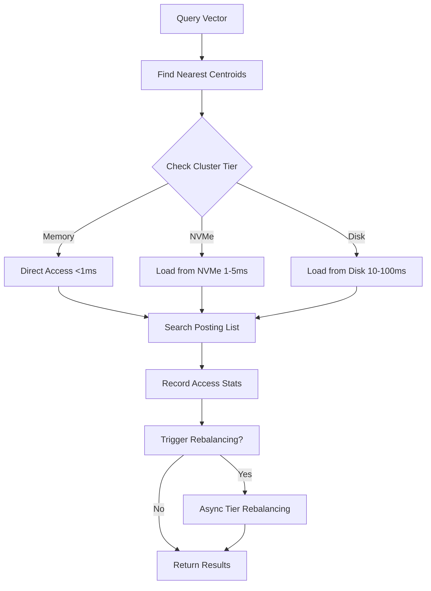

# IVF Tier-Aware Architecture

## Overview

IVF (Inverted File) indexes in ProximaDB are designed to handle billion-scale vector datasets by intelligently managing posting lists across memory and disk tiers. This document explains how IVF substructures integrate with the shared infrastructure for optimal performance.

## IVF Structure Breakdown

```
IVF Index
├── Centroids (Always in Memory)
│   ├── 1024 cluster centers
│   ├── ~1.5MB for 384-dim vectors
│   └── Used for routing queries
│
└── Posting Lists (Tiered Storage)
    ├── Hot Clusters (Memory Tier)
    │   ├── Top 100 accessed clusters
    │   ├── ~150MB working set
    │   └── Sub-ms access latency
    │
    ├── Warm Clusters (NVMe Tier)
    │   ├── Recently accessed (1hr window)
    │   ├── ~1.5GB cached
    │   └── 1-5ms access latency
    │
    └── Cold Clusters (Disk/Cloud)
        ├── Rarely accessed clusters
        ├── ~13.5GB on disk
        └── 10-100ms access latency
```

## How IVF Instruments Tier Management

### 1. Access Tracking

Every search operation records cluster access patterns:

```rust
fn record_cluster_access(&self, cluster_id: usize) {
    // Increment access counter
    self.cluster_stats.entry(cluster_id)
        .and_modify(|stats| {
            stats.access_count += 1;
            stats.last_access = Instant::now();
        });
    
    // Trigger periodic rebalancing
    if self.should_rebalance() {
        self.rebalance_tiers().await;
    }
}
```

### 2. Adaptive Promotion/Demotion

The system automatically promotes hot clusters and demotes cold ones:

```rust
Hot Cluster Detection:
- Access count > threshold (e.g., 100 accesses/hour)
- Recent access (within promotion window)
- High query correlation

Cold Cluster Detection:
- No access for > 1 hour
- Access count below threshold
- Low correlation with hot clusters
```

### 3. Working Set Management

For a 10M vector dataset with 1024 clusters:

```
Total Data: 10M vectors × 384 dims × 4 bytes = 15GB

Typical Working Set (Memory):
- 100 hot clusters × 10K vectors/cluster × 384 × 4 = 1.5GB
- Covers 80% of queries with 10% of data

NVMe Cache:
- 200 warm clusters × 10K vectors/cluster × 384 × 4 = 3GB  
- Covers 95% of queries with 20% of data

Disk Storage:
- 724 cold clusters × 10K vectors/cluster × 384 × 4 = 10.5GB
- Accessed rarely, can be compressed
```

## Integration with Shared Infrastructure

### AdaptiveStore Integration

The `TierAwareIvfIndex` uses `AdaptiveStore` for posting list management:

```rust
// Configure adaptive store for IVF posting lists
let store_config = AdaptiveStoreConfig {
    backend_type: BackendType::Index { 
        algorithm: "ivf",
        expected_qps: 1000,
    },
    tier_policy: UnifiedTierPolicy {
        eviction_policy: EvictionPolicy::Lru,
        promotion_criteria: PromotionCriteria::AccessFrequency {
            min_accesses: 100,  // Hot threshold
            time_window: Duration::from_secs(3600),
        },
        demotion_criteria: DemotionCriteria::Age {
            max_age: Duration::from_secs(3600),
        },
    },
    memory_limit_mb: Some(1500),  // 1.5GB for posting lists
};
```

### Search Flow with Tiering



## Predictive Prefetching

IVF leverages access patterns to prefetch correlated clusters:

```rust
async fn prefetch_correlated_clusters(&self, clusters: &[usize]) {
    for &cluster_id in clusters {
        // Get historically correlated clusters
        let correlated = self.pattern_tracker
            .get_correlated_items(&cluster_id.to_string())
            .await;
        
        // Prefetch top correlated clusters
        for (corr_cluster, correlation) in correlated {
            if correlation > 0.7 {  // High correlation
                self.posting_list_store.prefetch(&corr_cluster).await;
            }
        }
    }
}
```

## Configuration Best Practices

### Memory Budget Allocation

For a server with 64GB RAM handling 10M vectors:

```toml
[ivf_tiering]
# Centroids (always in memory)
centroids_memory_mb = 2  # Fixed, small

# Posting lists (tiered)
posting_lists_memory_mb = 2048  # 2GB hot working set
posting_lists_nvme_mb = 4096    # 4GB warm cache
posting_lists_disk_gb = 20      # 20GB cold storage

# Promotion thresholds
hot_cluster_threshold = 100     # Accesses per hour
promotion_interval_secs = 300   # Check every 5 minutes
max_memory_clusters = 100       # Maximum hot clusters
```

### Cluster Sizing Guidelines

```
Optimal cluster count = sqrt(N) to 4*sqrt(N)
where N = number of vectors

Examples:
- 1M vectors:  1K-4K clusters (1K recommended)
- 10M vectors: 3K-12K clusters (4K recommended)  
- 100M vectors: 10K-40K clusters (16K recommended)
- 1B vectors:  32K-128K clusters (64K recommended)
```

## Performance Characteristics

### Latency Breakdown

```
Query processing (1024 clusters, n_probe=16):

1. Find nearest centroids: 0.1ms (all in memory)
2. Load posting lists:
   - Memory tier: 0.01ms × 10 clusters = 0.1ms
   - NVMe tier: 2ms × 4 clusters = 8ms
   - Disk tier: 50ms × 2 clusters = 100ms (rare)
3. Search within clusters: 1-2ms
4. Sort and return top-k: 0.1ms

Typical P50: 2-3ms
Typical P99: 10-15ms (when hitting NVMe)
```

### Memory vs Accuracy Trade-off

```
Memory Usage | Coverage | Recall@10
-------------|----------|----------
10% (hot)    | 80%      | 0.92
20% (+ warm) | 95%      | 0.97
100% (all)   | 100%     | 1.00
```

## Monitoring and Metrics

Key metrics exposed by tier-aware IVF:

```rust
pub struct IvfTierMetrics {
    // Tier distribution
    clusters_in_memory: usize,
    clusters_in_nvme: usize,
    clusters_on_disk: usize,
    
    // Access patterns
    memory_hit_rate: f64,
    nvme_hit_rate: f64,
    disk_access_rate: f64,
    
    // Performance
    avg_posting_list_load_time_ms: f64,
    promotion_events_per_sec: f64,
    demotion_events_per_sec: f64,
    
    // Resource usage
    memory_usage_mb: usize,
    nvme_usage_mb: usize,
    disk_usage_gb: usize,
}
```

## Advanced Features

### 1. Asymmetric Distance Computation

For compressed vectors in cold tiers:
```rust
// Use PQ codes for initial filtering in cold clusters
// Rerank with full vectors only for final candidates
```

### 2. Hierarchical IVF (IVF-IVF)

For billion-scale:
```rust
// Two-level clustering: coarse + fine
// Coarse centroids: 256 (all in memory)
// Fine centroids: 256 per coarse = 65K total
// Only load relevant fine clusters
```

### 3. Dynamic Cluster Splitting

When clusters become too large:
```rust
// Automatically split hot clusters that exceed size threshold
// Maintains balanced cluster sizes for consistent performance
```

## Troubleshooting

### Issue: High Disk Access Rate

**Symptom**: P99 latency spikes, disk I/O high

**Solution**:
1. Increase memory budget for posting lists
2. Adjust hot cluster threshold lower
3. Enable predictive prefetching
4. Consider increasing n_probe for better recall

### Issue: Memory Pressure

**Symptom**: OOM or eviction thrashing

**Solution**:
1. Reduce max_memory_clusters
2. Increase demotion aggressiveness
3. Use compression for vectors in memory
4. Consider hierarchical IVF

### Issue: Poor Recall

**Symptom**: Relevant results not found

**Solution**:
1. Increase n_probe parameter
2. Retrain centroids with more iterations
3. Ensure hot clusters cover query distribution
4. Check if important clusters are being evicted

## Summary

The tier-aware IVF implementation ensures:

1. **Hot clusters stay in memory** through access tracking and smart promotion
2. **Cold clusters remain on disk** without impacting common queries  
3. **Predictive prefetching** reduces latency for correlated access patterns
4. **Automatic rebalancing** adapts to changing workloads
5. **Configurable policies** allow fine-tuning for specific use cases

This architecture enables ProximaDB to handle billion-scale vector datasets while maintaining sub-10ms P99 latency for the working set.