= ProximaDB SDK-Driven Compression Guide
:toc:
:toc-placement: preamble
:toclevels: 3
:icons: font
:source-highlighter: rouge

== Overview

ProximaDB implements a sophisticated SDK-driven compression system that gives clients complete control over compression settings without any server-side defaults. This guide covers the compression architecture, configuration options, and best practices.

== Key Features

* **SDK-Driven Configuration**: All compression settings are controlled from the client SDK
* **No Server Defaults**: Server never applies compression without explicit SDK configuration
* **Storage Engine Specific**: Different compression strategies for SST and VIPER engines
* **Compression-Aware Search**: Query planner optimizes based on compression status
* **Decompression Cache**: LRU cache with automatic invalidation
* **SST1 Format**: Clean, modern SSTable format with magic bytes

== Architecture

=== Compression Flow

_link:diagrams/compression-architecture.mmd[View source diagram]_

The compression flow shows how SDK configuration drives compression through the system:

=== Key Components

==== 1. SDK CompressionConfig
Python model that encapsulates all compression settings:

[source,python]
----
class CompressionConfig(BaseModel):
    # SST compression settings
    sst_block_size: Optional[int] = 16384
    sst_compression_algorithm: Optional[CompressionAlgorithm] = None
    sst_compression_level: Optional[int] = None
    
    # VIPER compression settings  
    viper_compression_algorithm: Optional[CompressionAlgorithm] = None
    viper_compression_level: Optional[int] = None
    viper_enable_dual_columns: Optional[bool] = False
    
    # Global settings
    adaptive_compression: Optional[bool] = False
    compression_threshold_kb: Optional[int] = 100
----

==== 2. UnifiedQueryPlanner
Centralized query planning that considers compression:

* Analyzes file metadata for compression status
* Routes queries to optimal data format
* Manages two-stage search for quantized data
* Estimates decompression costs

==== 3. Decompression Cache
LRU cache for decompressed blocks:

* Configurable size (default 512MB)
* Automatic invalidation on data changes
* Prefetching support for sequential access
* Per-algorithm sub-caches for better locality

==== 4. SST1 Format

_link:diagrams/sst1-format.mmd[View source diagram]_

Modern SSTable format with version identification:

[source]
----
[SST1 Magic - 4 bytes]["SST1"]
[Header Length - 4 bytes]
[Header Data - variable]
[Bloom Filter Length - 4 bytes]
[Bloom Filter Data - variable]
[Index Length - 4 bytes]
[Index Data - variable]
[Data Blocks - variable]
----

== Configuration Guide

=== SST Compression

SST engine supports block-level compression with configurable block sizes:

[source,python]
----
from proximadb import ProximaDBClient
from proximadb.models import (
    CollectionConfig,
    CompressionConfig,
    CompressionAlgorithm,
    StorageEngine
)

client = ProximaDBClient()

# Configure SST with ZSTD compression
compression_config = CompressionConfig(
    sst_compression_algorithm=CompressionAlgorithm.ZSTD,
    sst_compression_level=6,  # Balanced (1-9)
    sst_block_size=32768,      # 32KB blocks
    adaptive_compression=True,
    compression_threshold_kb=50
)

collection_config = CollectionConfig(
    name="my_sst_collection",
    dimension=1536,
    storage_engine=StorageEngine.SST,
    compression_config=compression_config
)

collection = client.create_collection(collection_config)
----

=== VIPER Compression

VIPER engine uses Parquet compression with optional dual columns:

[source,python]
----
# Configure VIPER with LZ4 and dual columns
compression_config = CompressionConfig(
    viper_compression_algorithm=CompressionAlgorithm.LZ4,
    viper_compression_level=1,  # Fast compression
    viper_enable_dual_columns=True  # Store both FP32 and INT8
)

collection_config = CollectionConfig(
    name="my_viper_collection",
    dimension=768,
    storage_engine=StorageEngine.VIPER,
    compression_config=compression_config
)

collection = client.create_collection(collection_config)
----

=== Compression-Aware Search

Optimize searches with compression hints:

[source,python]
----
from proximadb.models import SearchOptimization

# Configure compression-aware search
optimization = SearchOptimization(
    enable_two_stage=True,              # Use quantized first pass
    prefer_compressed_search=True,      # Prefer compressed data
    decompression_budget_ms=100,        # Max decompression time
    use_decompression_cache=True,       # Use cache (default)
    compression_aware_routing=True      # Smart query routing
)

results = client.search_vectors(
    collection_id="my_collection",
    query_vector=query_vector,
    top_k=10,
    search_optimization=optimization
)
----

== Compression Algorithms

=== Supported Algorithms

[cols="2,3,2,2", options="header"]
|===
| Algorithm | Best For | Compression Ratio | Speed

| **NONE**
| Low-latency queries
| 1:1
| Fastest

| **ZSTD**
| Balanced performance
| 2-10x
| Moderate

| **LZ4**
| Fast compression
| 1.5-3x
| Fast

| **SNAPPY**
| Real-time systems
| 1.5-2x
| Very Fast
|===

=== Algorithm Selection Guide

==== Choose ZSTD when:
* Storage cost is a concern
* Compression ratio is important
* Can tolerate moderate CPU overhead
* Using levels 3-6 for balance

==== Choose LZ4 when:
* Need fast compression/decompression
* Real-time ingestion is critical
* Moderate compression is acceptable

==== Choose SNAPPY when:
* Ultra-low latency is required
* CPU resources are limited
* Basic compression is sufficient

==== Choose NONE when:
* Maximum query performance needed
* Storage is not a constraint
* Data doesn't compress well

== Best Practices

=== 1. Data-Aware Configuration

Different data types compress differently:

[source,python]
----
# Sparse embeddings (high compressibility)
sparse_config = CompressionConfig(
    sst_compression_algorithm=CompressionAlgorithm.ZSTD,
    sst_compression_level=9  # Maximum compression
)

# Dense random embeddings (low compressibility)
dense_config = CompressionConfig(
    sst_compression_algorithm=CompressionAlgorithm.LZ4,
    sst_compression_level=1  # Fast, minimal compression
)

# Time-series embeddings (moderate compressibility)
timeseries_config = CompressionConfig(
    sst_compression_algorithm=CompressionAlgorithm.ZSTD,
    sst_compression_level=3,  # Fast compression
    adaptive_compression=True  # Adapt to patterns
)
----

=== 2. Block Size Optimization

Block size affects compression ratio and query performance:

* **Small blocks (4-16KB)**: Better random access, lower compression
* **Medium blocks (32-64KB)**: Balanced performance
* **Large blocks (128KB+)**: Better compression, slower random access

[source,python]
----
# For random access patterns
random_access_config = CompressionConfig(
    sst_block_size=8192  # 8KB blocks
)

# For sequential access patterns
sequential_config = CompressionConfig(
    sst_block_size=131072  # 128KB blocks
)
----

=== 3. Cache Configuration

Server-side cache configuration in TOML:

[source,toml]
----
[storage.sst.decompression_cache]
max_size_mb = 512                         # Cache size
enable_prefetch = true                    # Prefetch related blocks
prefetch_threshold = 3                    # Accesses before prefetch
ttl_seconds = 0                          # No TTL (0 = disabled)
invalidation_check_interval_seconds = 60  # Check interval
----

=== 4. Two-Stage Search Strategy

_link:diagrams/two-stage-search.mmd[View source diagram]_

For VIPER with dual columns:

[source,python]
----
# Enable dual columns during collection creation
compression_config = CompressionConfig(
    viper_enable_dual_columns=True
)

# Use two-stage search
optimization = SearchOptimization(
    enable_two_stage=True,
    accuracy_threshold=0.95  # Rerank if below threshold
)
----

== Performance Considerations

=== Compression Impact

[cols="3,2,2,2", options="header"]
|===
| Operation | No Compression | LZ4 | ZSTD-6

| **Insert (vec/s)**
| 10,000
| 8,500
| 6,000

| **Search (ms)**
| 0.5
| 0.7
| 1.2

| **Storage Size**
| 100GB
| 50GB
| 30GB

| **Cache Hit Rate**
| N/A
| 75%
| 75%
|===

=== Memory Usage

* Decompression cache: 512MB default
* Working buffers: ~100MB per query
* Dual columns: 2x vector storage

=== CPU Overhead

* ZSTD: 20-40% CPU for compression
* LZ4: 5-10% CPU for compression
* Decompression: 2-5% of compression time

== Monitoring and Metrics

=== Compression Metrics

Monitor compression effectiveness:

[source,python]
----
metrics = client.get_collection_metrics("my_collection")

print(f"Compression ratio: {metrics['compression_ratio']}")
print(f"Compressed size: {metrics['compressed_bytes']}")
print(f"Original size: {metrics['original_bytes']}")
print(f"Cache hit rate: {metrics['cache_hit_rate']}")
----

=== Cache Statistics

[source,python]
----
cache_stats = client.get_cache_stats()

print(f"Cache hits: {cache_stats['hits']}")
print(f"Cache misses: {cache_stats['misses']}")
print(f"Hit rate: {cache_stats['hit_rate']}")
print(f"Bytes saved: {cache_stats['bytes_saved']}")
print(f"Time saved: {cache_stats['time_saved_ms']}ms")
----

== Troubleshooting

=== Common Issues

==== 1. High Memory Usage
* Reduce cache size in TOML config
* Use smaller block sizes
* Disable prefetching

==== 2. Slow Queries
* Check cache hit rate
* Increase decompression budget
* Consider using NONE for hot data

==== 3. Poor Compression Ratio
* Verify data compressibility
* Try different algorithms
* Enable adaptive compression

==== 4. SST1 Format Errors
* Ensure all files use SST1 format
* Check for file corruption
* Verify magic bytes: `b"SST1"`

== Migration Guide

=== From Uncompressed Collections

1. Create new collection with compression
2. Copy vectors using batch operations
3. Update application to use new collection
4. Delete old collection

[source,python]
----
# Create compressed version
new_config = CollectionConfig(
    name="collection_v2_compressed",
    dimension=old_collection.dimension,
    compression_config=CompressionConfig(
        sst_compression_algorithm=CompressionAlgorithm.ZSTD,
        sst_compression_level=6
    )
)
new_collection = client.create_collection(new_config)

# Copy vectors in batches
batch_size = 1000
offset = 0
while True:
    vectors = client.get_vectors(old_collection.id, 
                                offset=offset, 
                                limit=batch_size)
    if not vectors:
        break
    
    client.insert_vectors(new_collection.id, vectors)
    offset += batch_size

# Switch application to new collection
# Delete old collection when ready
----

== Conclusion

ProximaDB's SDK-driven compression provides:

* Full client control over compression
* No server-side defaults or surprises
* Optimized query planning
* Effective caching strategies
* Clean, modern SST1 format

Choose compression settings based on your specific use case, data characteristics, and performance requirements. Monitor metrics to optimize configuration over time.

For additional support, see the link:https://github.com/proximadb/proximadb[ProximaDB GitHub repository] or contact the development team.