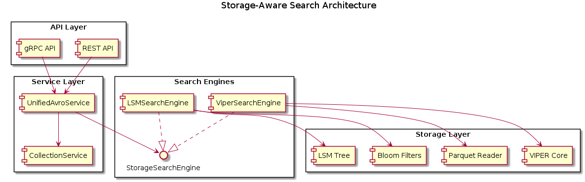

# Storage-Aware Polymorphic Search System Design

## Executive Summary

This document outlines the design and implementation of a storage-aware polymorphic search system for ProximaDB that optimizes vector search operations based on the underlying storage layout (VIPER vs LSM) and leverages format-specific optimizations including predicate pushdown, bloom filters, and quantization strategies.

## Problem Statement

The current search implementation in UnifiedAvroService hardcodes the use of VIPER engine regardless of the collection's actual storage type. This results in:

1. **Inefficient LSM searches**: LSM collections should use memtable + SSTable scanning with bloom filters
2. **Missed optimization opportunities**: No predicate pushdown for Parquet, no bloom filter usage for LSM
3. **No quantization support**: Cannot leverage PQ4, binary quantization, or other compression schemes
4. **Poor scalability**: Single search path doesn't scale to different storage types

## Architecture Overview

### High-Level Design Principles

1. **Storage-Format Awareness**: Search algorithms must understand and optimize for the underlying storage format
2. **Polymorphic Dispatch**: Route search requests to storage-specific implementations
3. **Index Integration**: Deep integration with storage-specific indexing (bloom filters, roaring bitmaps, etc.)
4. **Quantization Support**: Support multiple precision levels (FP32, PQ4, binary)
5. **Performance First**: Prioritize performance optimizations specific to each storage type

### Core Components



The architecture consists of four main layers:

1. **API Layer**: REST and gRPC endpoints for search requests
2. **Service Layer**: UnifiedAvroService for request routing and CollectionService for metadata
3. **Search Engine Layer**: Polymorphic search implementations per storage type
4. **Storage Layer**: Storage-specific optimizations and data structures

## Phase-Wise Implementation Plan

### Phase 1: Foundation and Infrastructure (Weeks 1-2)

**Objectives:**
- Establish core traits and interfaces
- Implement basic polymorphic routing
- Add collection type detection

**Deliverables:**
1. `StorageSearchEngine` trait definition
2. `SearchHints` and `SearchCapabilities` structures
3. Collection type detection in UnifiedAvroService
4. Basic polymorphic dispatch framework

**Success Criteria:**
- Search requests route to correct storage engine
- No regression in existing functionality
- Clean separation of search concerns

### Phase 2: VIPER Search Optimizations (Weeks 3-4)

**Objectives:**
- Implement Parquet-aware search optimizations
- Add predicate pushdown capabilities
- Integrate ML clustering for vector search

**Deliverables:**
1. `ViperSearchEngine` with predicate pushdown
2. Columnar vectorization for Parquet scans
3. ML-driven cluster selection
4. SIMD-optimized vector operations

**Success Criteria:**
- 2-3x improvement in VIPER search performance
- Successful predicate pushdown to Parquet layer
- Reduced I/O through clustering

### Phase 3: LSM Search Optimizations (Weeks 5-6)

**Objectives:**
- Implement LSM-aware search strategies
- Add bloom filter support
- Optimize memtable + SSTable scanning

**Deliverables:**
1. `LSMSearchEngine` with tiered search
2. Bloom filter implementation and integration
3. Tombstone-aware result merging
4. Level-based search prioritization

**Success Criteria:**
- Efficient LSM search with minimal false positives
- Proper handling of deleted vectors
- Performance comparable to dedicated LSM databases

### Phase 4: Advanced Indexing and Quantization (Weeks 7-8)

**Objectives:**
- Add quantization support (PQ4, binary)
- Implement roaring bitmap indexes
- Add compression-aware search

**Deliverables:**
1. VIPER quantization variants (PQ4, binary)
2. Roaring bitmap indexes for categorical filters
3. Compression-aware vector operations
4. Performance benchmarking suite

**Success Criteria:**
- Support for multiple precision levels
- Fast filtering with roaring bitmaps
- Maintained accuracy with quantization

### Phase 5: Production Optimization and Monitoring (Weeks 9-10)

**Objectives:**
- Performance tuning and optimization
- Add comprehensive monitoring
- Production hardening

**Deliverables:**
1. Performance profiling and optimization
2. Search metrics and monitoring
3. Automatic search strategy selection
4. Production deployment procedures

**Success Criteria:**
- Production-ready performance
- Comprehensive observability
- Automatic optimization

## Technical Architecture Details

### Search Engine Trait Design

```rust
pub trait StorageSearchEngine: Send + Sync {
    async fn search_vectors(
        &self,
        collection_id: &str,
        query_vector: &[f32],
        k: usize,
        filters: Option<&MetadataFilter>,
        search_hints: &SearchHints,
    ) -> Result<Vec<SearchResult>>;
    
    fn search_capabilities(&self) -> SearchCapabilities;
    fn engine_type(&self) -> StorageEngineType;
}
```

### VIPER Search Optimizations

**Predicate Pushdown:**
- Push metadata filters down to Parquet column scans
- Reduce data transfer from storage layer
- Leverage Parquet's native filtering

**Clustering Integration:**
- Use ML-driven cluster selection
- Reduce search space before vector operations
- Cache cluster metadata for repeated queries

**Quantization Support:**
- FP32: Full precision for accuracy-critical applications
- PQ4: Product quantization for balanced speed/accuracy
- Binary: Maximum speed for similarity-tolerant searches

### LSM Search Optimizations

**Tiered Search Strategy:**
1. Search active memtable (most recent data)
2. Search Level 0 SSTables (recent flushes)
3. Search higher levels based on key ranges
4. Merge results with tombstone handling

**Bloom Filter Integration:**
- Skip SSTables that definitely don't contain target vectors
- Reduce I/O for negative searches
- Configurable false positive rates

**Level-Aware Optimization:**
- Prioritize recent levels for temporal queries
- Use key range metadata to skip irrelevant SSTables
- Implement efficient merge strategies

## Performance Expectations

### VIPER Improvements
- **Predicate Pushdown**: 50-80% reduction in data scanned
- **Clustering**: 70-90% reduction in vector comparisons
- **Quantization (PQ4)**: 4x faster search with <5% accuracy loss
- **Overall**: 3-5x performance improvement

### LSM Improvements
- **Bloom Filters**: 90-95% reduction in false positive SSTable reads
- **Tiered Search**: 60-80% faster searches through prioritization
- **Tombstone Handling**: Correct results with minimal overhead
- **Overall**: 2-3x performance improvement

## Risk Analysis and Mitigation

### Technical Risks

1. **Complexity Increase**
   - Risk: More complex codebase harder to maintain
   - Mitigation: Clear interfaces, comprehensive testing, documentation

2. **Performance Regression**
   - Risk: New abstractions might reduce performance
   - Mitigation: Benchmarking at each phase, performance monitoring

3. **Quantization Accuracy Loss**
   - Risk: PQ4/binary quantization reduces search quality
   - Mitigation: Configurable precision levels, accuracy monitoring

### Implementation Risks

1. **Integration Complexity**
   - Risk: Deep integration with storage formats is complex
   - Mitigation: Incremental implementation, fallback mechanisms

2. **Testing Challenges**
   - Risk: Hard to test all storage format combinations
   - Mitigation: Comprehensive test matrix, property-based testing

## Success Metrics

### Performance Metrics
- Search latency (p50, p95, p99)
- Throughput (queries per second)
- Resource utilization (CPU, memory, I/O)
- Index efficiency (false positive rates)

### Quality Metrics
- Search accuracy (recall@k)
- Result relevance scores
- Quantization error rates
- System reliability

### Developer Experience
- Code maintainability scores
- Documentation completeness
- Test coverage percentage
- Development velocity

## Conclusion

The storage-aware polymorphic search system will significantly improve ProximaDB's search performance by leveraging storage-specific optimizations. The phased approach ensures manageable complexity while delivering incremental value. The design maintains flexibility for future storage types and optimization strategies.

## Appendix: Implementation Details

See the following sections for detailed implementation specifications:
- PlantUML Architecture Diagrams
- API Specifications
- Performance Benchmarking Plans
- Testing Strategy