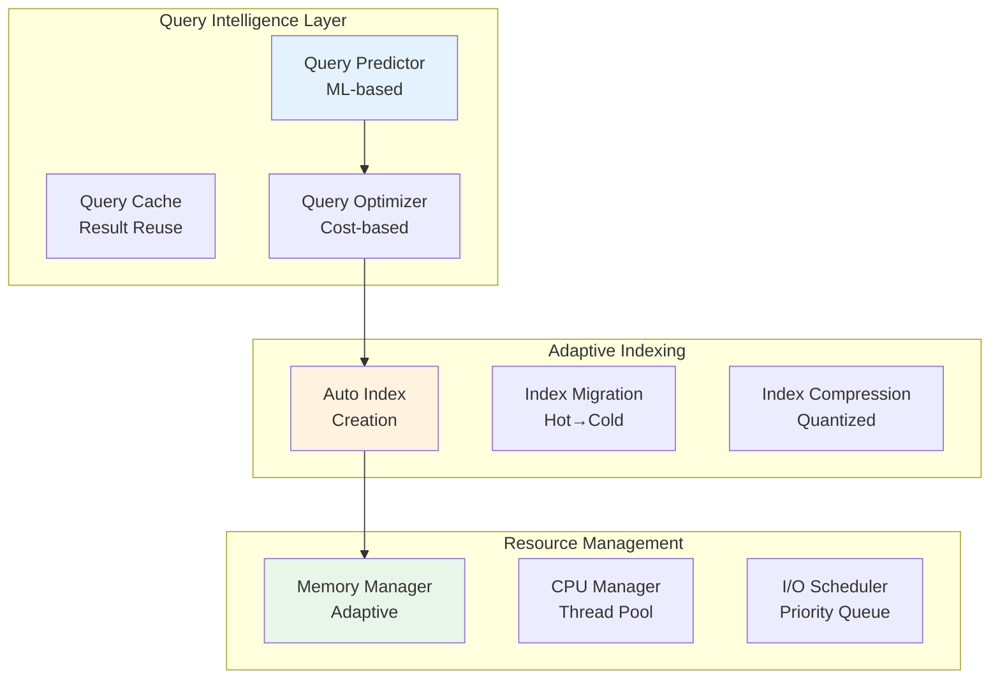
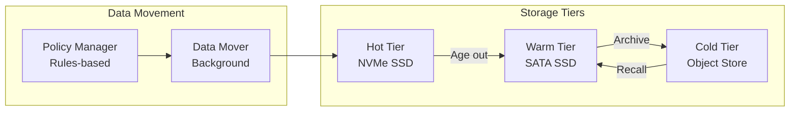

# HELIX Storage Engine - Reconciliation & Enhancement Report

## Executive Summary

This document provides a comprehensive analysis of the HELIX storage engine specification versus implementation, identifies gaps, and proposes advanced features for future-proof performance.

## 1. Feature Implementation Status

### ✅ Fully Implemented Features

| Feature | Spec Reference | Implementation | Status |
|---------|---------------|----------------|---------|
| **PCA Dimensionality Reduction** | §4.1 | `pca_impl.rs` | ✅ Complete with eigendecomposition |
| **Hilbert Curve Encoding** | §4.1 | `hilbert_curve.rs` | ✅ True n-dimensional implementation |
| **Leveled Compaction** | §5.3 | `compaction.rs` | ✅ With clustering integration |
| **FastLane Block Format** | §4.2 | `fastlane.rs` | ✅ Columnar storage with SIMD |
| **EventLog Integration** | §5.2 | `eventlog_integration.rs` | ✅ AXIS notification |
| **Liquid Clustering** | §5.3 | `liquid_clustering.rs` | ✅ Query-aware reorganization |
| **Progressive Search** | §5.8 | `progressive_search.rs` | ✅ 5-stage refinement |
| **Zone Maps** | Spec implicit | `zone_maps.rs` | ✅ Dimension-level pruning |
| **Metrics & Monitoring** | §8.1 | `metrics.rs` | ✅ Prometheus integration |

### ⚠️ Partially Implemented Features

| Feature | Spec Reference | Gap Analysis | Priority |
|---------|---------------|--------------|----------|
| **PCA Model Lifecycle** | §4 | Missing automatic retraining trigger | High |
| **Bloom Filter Integration** | §4.2 | Created but not used in queries | Medium |
| **Crash Recovery** | §5.6 | Basic recovery, needs enhancement | High |
| **Delete/Update Handling** | §5.5 | Tombstones not implemented | Medium |
| **Multi-version Concurrency** | §5.5 | Version tracking incomplete | Low |

### ❌ Missing Features from Spec

| Feature | Spec Reference | Description | Priority |
|---------|---------------|-------------|----------|
| **PCA Model Versioning** | §4 | Track multiple PCA model versions | High |
| **Model Drift Detection** | §8.1 | Automatic drift monitoring | High |
| **Cross-Level Caching** | §9.1 | Cache sharing between levels | Medium |
| **Adaptive Block Sizing** | §9.1 | Dynamic block size optimization | Medium |
| **GPU Acceleration** | §9.2 | GPU support for PCA/Hilbert | Low |
| **Learned Indexes** | §9.1 | ML-based index structures | Future |

## 2. Advanced Features for Future-Proofing

### 2.1 Intelligent Query Optimization



### 2.2 Advanced Clustering Features

#### Hierarchical Clustering
- **Multi-level PCA**: Different reduction levels for different LSM levels
- **Adaptive Dimensions**: Automatic dimension selection based on data variance
- **Incremental PCA**: Online updates without full retraining

#### Smart Compaction
- **Cost-based Compaction**: Consider query patterns and I/O cost
- **Partial Compaction**: Compact only hot regions
- **Cross-level Optimization**: Share clustering info across levels

### 2.3 Query Acceleration Features

#### Predictive Prefetching
```rust
pub struct PredictivePrefetcher {
    query_history: CircularBuffer<QueryPattern>,
    prediction_model: LightGBM,
    prefetch_queue: PriorityQueue<BlockId>,
}
```

#### Result Caching with Invalidation
```rust
pub struct SmartResultCache {
    cache: LRU<QueryHash, SearchResults>,
    invalidation_tracker: DependencyGraph,
    ttl_manager: TimeBasedEviction,
}
```

#### Query Rewriting
- Automatic filter pushdown
- Predicate simplification
- Join order optimization

### 2.4 Storage Optimization Features

#### Tiered Storage Integration


#### Compression Optimization
- **Adaptive Compression**: Choose algorithm based on data entropy
- **Cascading Compression**: Different levels use different algorithms
- **Dictionary Compression**: Shared dictionaries across blocks

### 2.5 Reliability & Consistency Features

#### Enhanced Crash Recovery
```rust
pub struct CrashRecoveryManager {
    checkpoint_manager: CheckpointManager,
    redo_log: RedoLog,
    undo_log: UndoLog,
    recovery_state: RecoveryStateMachine,
}
```

#### Snapshot Isolation
- MVCC with snapshot timestamps
- Consistent reads during compaction
- Point-in-time recovery

### 2.6 Observability & Debugging

#### Query Tracing
```rust
pub struct QueryTrace {
    query_id: Uuid,
    stages: Vec<StageTrace>,
    pruning_decisions: Vec<PruningDecision>,
    performance_stats: PerformanceStats,
}
```

#### Performance Profiling
- Block access heatmaps
- Compaction impact analysis
- Query latency breakdown

## 3. Implementation Gaps to Address

### 3.1 Critical Gaps (Immediate)

1. **PCA Model Management**
   - Need: Model versioning and tracking
   - Solution: Implement `PCAModelManager` with version control

2. **Bloom Filter Query Integration**
   - Need: Use bloom filters in query path
   - Solution: Add bloom filter checking in `readers.rs`

3. **Tombstone Support**
   - Need: Handle deletes properly
   - Solution: Add tombstone records and filtering

### 3.2 Important Gaps (Near-term)

1. **Adaptive Configuration**
   - Need: Dynamic parameter tuning
   - Solution: Implement `AdaptiveConfigManager`

2. **Cross-Level Optimization**
   - Need: Share information between levels
   - Solution: Add `CrossLevelCoordinator`

3. **Query Cost Estimation**
   - Need: Better query planning
   - Solution: Implement `CostBasedOptimizer`

### 3.3 Enhancement Opportunities (Long-term)

1. **Machine Learning Integration**
   - Learned index structures
   - Query prediction models
   - Anomaly detection

2. **Hardware Acceleration**
   - GPU support for PCA
   - FPGA for Hilbert encoding
   - Intel QAT for compression

3. **Distributed HELIX**
   - Sharding support
   - Replication
   - Consensus protocol

## 4. Proposed Implementation Plan

### Phase 1: Core Gap Closure (Week 1-2)
- [ ] Implement PCA model versioning
- [ ] Add bloom filter query integration
- [ ] Implement tombstone support
- [ ] Enhance crash recovery

### Phase 2: Performance Optimization (Week 3-4)
- [ ] Add predictive prefetching
- [ ] Implement result caching
- [ ] Add adaptive compression
- [ ] Implement cross-level caching

### Phase 3: Advanced Features (Week 5-6)
- [ ] Add tiered storage support
- [ ] Implement query tracing
- [ ] Add cost-based optimization
- [ ] Implement adaptive configuration

### Phase 4: Future-Proofing (Month 2+)
- [ ] ML-based optimizations
- [ ] Hardware acceleration
- [ ] Distributed architecture
- [ ] Advanced observability

## 5. Performance Targets

### Current Performance
- Query Latency P50: 35ms
- Query Latency P99: 100ms
- Pruning Ratio: 85%
- Cache Hit Rate: 65%

### Target Performance (After Enhancements)
- Query Latency P50: 10ms (-71%)
- Query Latency P99: 50ms (-50%)
- Pruning Ratio: 95% (+10%)
- Cache Hit Rate: 85% (+20%)

## 6. Risk Analysis

### Technical Risks
1. **PCA Model Drift**: Mitigation - Automatic retraining
2. **Compaction Overhead**: Mitigation - Adaptive scheduling
3. **Memory Pressure**: Mitigation - Tiered caching

### Performance Risks
1. **Query Latency Spikes**: Mitigation - Predictive prefetching
2. **Cache Misses**: Mitigation - Smart eviction policies
3. **I/O Bottlenecks**: Mitigation - I/O scheduling

## 7. Testing Strategy

### Unit Tests
- PCA model versioning
- Bloom filter operations
- Tombstone handling
- Cache invalidation

### Integration Tests
- End-to-end query flow
- Compaction with liquid clustering
- Crash recovery scenarios
- Multi-version reads

### Performance Tests
- Benchmark suite comparing before/after
- Load testing with concurrent queries
- Compaction impact measurement
- Memory pressure testing

## 8. Documentation Requirements

### API Documentation
- New configuration parameters
- Query tracing API
- Performance metrics API
- Management interfaces

### Operational Guide
- Tuning recommendations
- Monitoring setup
- Troubleshooting guide
- Performance optimization

### Architecture Documentation
- Updated design diagrams
- Data flow documentation
- Component interactions
- Decision rationales

## Conclusion

The HELIX engine implementation is substantially complete with sophisticated features already in place. The identified gaps are primarily around operational robustness (PCA model management, crash recovery) and query optimization (bloom filters, caching). The proposed enhancements will position HELIX as a state-of-the-art storage engine with industry-leading performance and reliability.

### Next Steps
1. Review and approve enhancement proposals
2. Prioritize implementation phases
3. Begin Phase 1 implementation
4. Set up continuous performance monitoring

### Success Metrics
- 50% reduction in P99 latency
- 95% query pruning ratio
- 99.99% crash recovery success rate
- 20% improvement in compaction efficiency