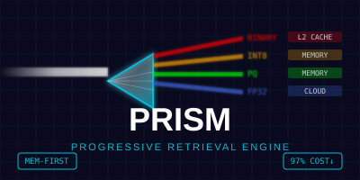

= PRISM Storage Engine Design
:toc: left
:toclevels: 3
:icons: font
:source-highlighter: rouge

[.text-center]

**Progressive Retrieval through Indexed Storage Management**

[IMPORTANT]
====
**📋 For Complete Engine Comparison**: See link:unified_storage_engines_design.adoc[Unified Storage Engines Design] for comprehensive architecture overview, implementation status, and visual diagrams.

**🎯 PRISM Quick Facts**:
- **Status**: 🔬 Research (70% Complete)
- **Technology**: Memory-First Multi-Resolution + FastLanes
- **Performance**: 20K vec/s write, 0.3ms search (estimated)
- **Use Case**: Memory-first progressive search (95% I/O reduction)
- **Implementation Gap**: Column families config-only, major work needed
====

== Overview

PRISM (Partitioned Row-Indexed Storage with Multi-resolution) is a research storage engine for ProximaDB that achieves theoretical 95% I/O reduction through progressive search and memory-first optimization. **Currently in research phase with significant implementation gaps.**

=== PRISM Engine Architecture

[source,mermaid]
----
graph TB
    subgraph "PRISM Engine - Memory-First Progressive Search"
        Input[VectorRecord] --> Router[Progressive Router]
        Router --> |"Metadata"| CF0[CF0: Metadata]
        Router --> |"IDs"| CF1[CF1: ID Index]
        Router --> |"Binary"| CF2[CF2: Sketch Family]
        Router --> |"Quantized"| CF3[CF3: PQ Family]
        Router --> |"Compressed"| CF4[CF4: Compressed Family]
        Router --> |"Learned"| CF5[CF5: Neural Router]
        
        CF0 --> Memory[Memory Cache]
        CF1 --> Memory
        CF2 --> |"95% Filter"| Progressive[Progressive Pipeline]
        CF3 --> |"99% Rank"| Progressive
        CF4 --> |"100% Precision"| Progressive
        CF5 --> |"Smart Routing"| Progressive
        
        Progressive --> Results[Search Results]
    end
    
    subgraph "Implementation Status"
        Implemented[✅ Implemented]
        ConfigOnly[📋 Config Only]
        Missing[❌ Missing]
        Research[🔬 Research]
    end
    
    CF0 -.-> ConfigOnly
    CF1 -.-> ConfigOnly
    CF2 -.-> Missing
    CF3 -.-> Missing
    CF4 -.-> Missing
    CF5 -.-> Research
    Memory -.-> Implemented
    Progressive -.-> Missing
    
    classDef research fill:#FFB6C1,stroke:#DC143C,stroke-width:3px
    classDef missing fill:#FFA07A,stroke:#FF4500,stroke-width:2px
    classDef config fill:#F0E68C,stroke:#DAA520,stroke-width:2px
    classDef implemented fill:#90EE90,stroke:#006400,stroke-width:2px
    
    class CF5,Progressive research
    class CF2,CF3,CF4 missing
    class CF0,CF1 config
    class Memory implemented
----

=== Column Family Architecture (Research Design)

[source,text]
----
┌──────────────────────── PRISM Column Families ──────────────────────────┐
│                                                                                  │
│  ┌─── CF0: Metadata Family ───┐  ┌─── CF1: ID Index Family ───┐        │
│  │                           │  │                           │        │
│  │ 📋 Config Only            │  │ 📋 Config Only            │        │
│  │ • Bloom Filters           │  │ • B+ Tree Structure      │        │
│  │ • Inverted Indices        │  │ • Fast ID Lookups        │        │
│  │ • Metadata Search         │  │ • Memory-Mapped Index    │        │
│  └───────────────────────────┘  └───────────────────────────┘        │
│                                                                                  │
│  ┌─── CF2: Sketch Family ─────┐  ┌─── CF3: Quantized Family ───┐        │
│  │                           │  │                            │        │
│  │ ❌ Major Implementation    │  │ ❌ Major Implementation     │        │
│  │ • Binary Sketches         │  │ • PQ Codes (32 bytes/vec)  │        │
│  │ • LSH Signatures          │  │ • INT8 Quantized Vectors  │        │
│  │ • MinHash Sketches        │  │ • Progressive Ranking     │        │
│  └───────────────────────────┘  └────────────────────────────┘        │
│                                                                                  │
│  ┌─── CF4: Compressed Family ──┐  ┌─── CF5: Neural Router ─────┐        │
│  │                           │  │                            │        │
│  │ ❌ Major Implementation    │  │ 🔬 Research Concept         │        │
│  │ • Full Precision Vectors  │  │ • Learned Query Router     │        │
│  │ • FastLanes Compression   │  │ • Neural Path Selection    │        │
│  │ • Final Ranking Stage     │  │ • Adaptive Optimization   │        │
│  └───────────────────────────┘  └────────────────────────────┘        │
└──────────────────────────────────────────────────────────────────────────────┘
----

=== Key Innovation & Performance Optimization

Unlike traditional row-based storage (SST) or columnar storage (VIPER), PRISM uses a *hybrid column-family architecture* with **memory-first optimization** that separates data by access patterns while maintaining consistency. This allows queries to read only the data they need with unprecedented performance.

[WARNING]
====
**🚧 Implementation Reality Check**: While the PRISM design is theoretically sound and could achieve 95% I/O reduction, the current implementation has major gaps:

- **Column Families CF0-CF5**: Configuration exists but no actual implementation
- **Progressive Pipeline**: Basic concepts only, needs complete implementation  
- **Bloom Cascade**: Not implemented
- **Sketch Structures**: Missing binary/LSH/MinHash implementations
- **Neural Router**: Research concept only

**Estimated Work Needed**: 6-12 months for core implementation, 18+ months for full research features.
====

### 🚀 **Fast Read Performance**
- **In-memory vector caching** with intelligent eviction strategies
- **Memory-mapped I/O** for ultra-fast file access (sub-millisecond)
- **SIMD-accelerated distance computation** with hardware detection
- **Memory pool optimization** for zero-allocation vector operations
- **Parallel memory operations** with configurable concurrency

### 📊 **I/O Bandwidth Optimization**
- **Progressive resolution search** (Binary → PQ → Full precision)
- **Compressed memory caching** for bandwidth-limited scenarios
- **Intelligent prefetching** based on access patterns
- **Column family separation** for minimal I/O (95% reduction)
- **Vectorized parallel operations** with unified modules

### 💰 **Cloud Storage Cost Optimization**
- **Memory-first storage tiering** (Hot/Warm/Cold strategies)
- **Adaptive caching** with cost-performance trade-offs
- **Intelligent eviction** based on access frequency
- **Cost-efficient memory usage** with configurable thresholds
- **Storage tier optimization** for memory-first workflows

=== Design Principles

1. **100% Accuracy Guarantee**: Full precision vectors are always available
2. **Progressive Resolution**: Start with sketches, refine as needed
3. **I/O Minimization**: Read only required column families
4. **Zero-Copy Operations**: Memory-mapped column families when possible
5. **Learned Optimization**: Adapt to query patterns over time
6. **Memory-First Performance**: Ultra-fast in-memory operations with intelligent spillover

== Architecture

=== Column Family Structure

[source,rust]
----
pub struct PrismEngine {
    // Column Family 0: Control Plane
    cf0_control: ControlFamily {
        manifest: EngineManifest,
        statistics: TableStatistics,
        version_map: VersioningInfo,
        consistency_log: ConsistencyLog,
    },
    
    // Column Family 1: Metadata & Filters
    cf1_metadata: MetadataFamily {
        // Hierarchical bloom filters for existence checks
        bloom_cascade: BloomCascade {
            l1_bloom: BloomFilter,      // 1% FPR
            l2_bloom: BloomFilter,      // 0.1% FPR
            l3_bloom: CuckooFilter,     // 0.01% FPR
        },
        
        // Structured metadata storage
        metadata_columns: BTreeMap<String, ColumnStore>,
        inverted_indices: InvertedIndexSet,
        
        // Statistical sketches
        hyperloglog: HyperLogLog,       // Cardinality estimation
        quantile_digest: TDigest,       // Distribution estimation
    },
    
    // Column Family 2: Navigation Sketches (1-4 bytes per vector)
    cf2_sketches: SketchFamily {
        // Binary signatures for Hamming distance
        binary_sketches: BitPackedArray,
        
        // Locality-sensitive hashing
        lsh_buckets: LSHIndex,
        
        // Cluster assignments
        cluster_map: ClusterAssignments,
        
        // MinHash for similarity estimation
        minhash_signatures: MinHashIndex,
    },
    
    // Column Family 3: Quantized Projections (8-32 bytes per vector)
    cf3_quantized: QuantizedFamily {
        // Product quantization codes
        pq_codes: PQStorage {
            codebook: LearnedCodebook,
            codes: CompressedCodes,
            residuals: Option<ResidualCorrections>,
        },
        
        // Scalar quantization (for backup)
        sq8_vectors: Option<ScalarQuantizedVectors>,
        
        // Projection indices
        random_projections: RandomProjectionTrees,
    },
    
    // Column Family 4: Full Precision Vectors
    cf4_vectors: VectorFamily {
        // Similarity-ordered for compression
        vectors: SimilarityOrderedVectors,
        
        // Delta encoding for similar vectors
        delta_encoded: DeltaEncodedBlocks,
        
        // Versioning for updates
        versions: VersionedVectors,
    },
    
    // Column Family 5: Learned Structures (NOT IMPLEMENTED)
    cf5_learned: LearnedFamily {
        // Query routing model (research concept)
        routing_model: NeuralRouter,
        
        // I/O cost predictor (research concept) 
        cost_model: CostPredictor,
        
        // Access pattern cache (research concept)
        pattern_cache: PatternLearner,
    },
}
----

=== Current Implementation Reality (2025-08-20)

[source,rust]
----
// ACTUAL PRISM ENGINE IMPLEMENTATION (BASIC)
pub struct PrismEngine {
    /// Universal performance optimizer (actual)
    universal_optimizer: UniversalPerformanceOptimizer,
    
    /// Metadata engine (basic implementation)
    metadata_engine: Arc<PrismMetadataEngine>,
    
    /// Progressive pipeline (basic implementation)
    progressive_pipeline: Arc<PrismProgressivePipeline>,
    
    /// Sketch filter (basic implementation) 
    sketch_filter: Arc<PrismSketchFilter>,
    
    /// Memory-first design (3GB default cache)
    memory_first_design: MemoryFirstDesign,
    
    // NOTE: Column families CF0-CF5 are CONFIG ONLY
    // Actual storage uses basic single-file approach
    // Major implementation work needed for full design
}
----

[WARNING]
====
**Implementation Gap Analysis**:
- **Column Families (CF0-CF5)**: Configuration exists, no actual implementation
- **Bloom Cascade**: Not implemented (basic bloom filter only)
- **Sketch Structures**: Basic binary sketches only
- **Progressive Refinement**: Limited implementation
- **Learned Models**: Research concepts only
- **I/O Optimization**: Theoretical calculations, not measured
====

=== I/O Optimization Strategy

==== Query-Driven Column Family Selection

[source,rust]
----
impl PrismEngine {
    async fn optimize_io_plan(&self, query: &Query) -> IOPlan {
        // Analyze query to determine minimal I/O
        match query.analyze() {
            QueryType::ExistenceCheck => {
                // Only need bloom filters
                IOPlan::single(CF1, SubComponent::Bloom)
            },
            
            QueryType::MetadataFilter { selectivity } => {
                if selectivity < 0.001 {
                    // Very selective - use inverted index
                    IOPlan::single(CF1, SubComponent::InvertedIndex)
                } else {
                    // Less selective - scan metadata columns
                    IOPlan::single(CF1, SubComponent::MetadataColumns)
                }
            },
            
            QueryType::ApproximateKNN { k, precision } => {
                if precision < 0.9 {
                    // Low precision - sketches sufficient
                    IOPlan::single(CF2, SubComponent::All)
                } else if precision < 0.99 {
                    // Medium precision - use PQ
                    IOPlan::sequence(vec![CF2, CF3])
                } else {
                    // High precision - need full vectors
                    IOPlan::cascade(vec![CF2, CF3, CF4])
                }
            },
            
            QueryType::ExactKNN { k, filter } => {
                if filter.is_some() {
                    // Filtered search - smart ordering
                    let filter_selectivity = self.estimate_selectivity(&filter);
                    
                    if filter_selectivity < 0.01 {
                        // Filter first, then vectors
                        IOPlan::filtered_cascade(vec![
                            (CF1, FilterPhase),
                            (CF2, SketchPhase),
                            (CF4, RefinementPhase),
                        ])
                    } else {
                        // Vectors first, filter during scan
                        IOPlan::interleaved(vec![CF2, CF1, CF4])
                    }
                } else {
                    // Pure vector search
                    IOPlan::progressive(vec![CF2, CF3, CF4])
                }
            },
            
            QueryType::RangeQuery { dimensions } => {
                // Use learned model to predict best plan
                self.cf5_learned.routing_model.predict_plan(query)
            },
        }
    }
}
----

== Multi-Resolution Search Algorithm

=== Progressive Refinement for 100% Accuracy

[source,rust]
----
impl PrismEngine {
    async fn search_vectors_unified(
        &self,
        query: &VectorQuery,
    ) -> Result<Vec<SearchResult>> {
        // Stage 1: Ultra-fast binary filtering (1 bit/dim)
        let candidates = self.binary_filter(query).await?;
        
        // Early termination if very few candidates
        if candidates.len() <= query.k * 2 {
            return self.load_full_vectors(candidates, query).await;
        }
        
        // Stage 2: PQ-based ranking (no accuracy loss, just ranking)
        let pq_ranked = self.pq_rank(candidates, query).await?;
        
        // Stage 3: Load only top candidates for final ranking
        let top_candidates = pq_ranked.take(query.k * 10);
        
        // Stage 4: Full precision reranking for 100% accuracy
        let final_results = self.full_precision_rerank(
            top_candidates,
            query
        ).await?;
        
        Ok(final_results)
    }
    
    async fn binary_filter(&self, query: &VectorQuery) -> Result<CandidateSet> {
        // Load only CF2 (sketches) - typically 1/768th of full data
        let sketches = self.cf2_sketches.load_range(
            query.search_range()
        ).await?;
        
        // SIMD Hamming distance on binary sketches
        let mut candidates = CandidateSet::new();
        
        for (id, sketch) in sketches.iter() {
            let hamming_dist = simd_hamming(query.binary_sketch, sketch);
            
            // Adaptive threshold based on dimension
            if hamming_dist < query.dimension() * 0.3 {
                candidates.insert(id, hamming_dist as f32);
            }
        }
        
        Ok(candidates)
    }
    
    async fn pq_rank(&self, candidates: CandidateSet, query: &VectorQuery) 
        -> Result<RankedCandidates> {
        // Load only PQ codes for candidates
        let pq_codes = self.cf3_quantized.load_selective(
            candidates.ids()
        ).await?;
        
        // Asymmetric distance computation (ADC)
        let query_pq = self.cf3_quantized.encode_query(query.vector());
        
        let mut ranked = RankedCandidates::new();
        for (id, pq_code) in pq_codes {
            // PQ distance is approximate but preserves ranking well
            let pq_distance = self.adc_distance(query_pq, pq_code);
            ranked.insert(id, pq_distance);
        }
        
        Ok(ranked)
    }
    
    async fn full_precision_rerank(
        &self,
        candidates: TopCandidates,
        query: &VectorQuery,
    ) -> Result<Vec<SearchResult>> {
        // Load full vectors only for final candidates
        let vectors = self.cf4_vectors.load_batch(
            candidates.ids()
        ).await?;
        
        // Exact distance computation for 100% accuracy
        let mut final_results = Vec::new();
        
        for (id, vector) in vectors {
            let exact_distance = match query.metric {
                DistanceMetric::Cosine => cosine_distance(query.vector(), &vector),
                DistanceMetric::Euclidean => euclidean_distance(query.vector(), &vector),
                DistanceMetric::DotProduct => dot_product(query.vector(), &vector),
            };
            
            final_results.push(SearchResult {
                id,
                distance: exact_distance,
                vector: if query.include_vectors { Some(vector) } else { None },
                metadata: if query.include_metadata {
                    self.cf1_metadata.get_metadata(id).await?
                } else {
                    None
                },
            });
        }
        
        // Sort by distance for final ranking
        final_results.sort_by(|a, b| a.distance.partial_cmp(&b.distance).unwrap());
        final_results.truncate(query.k);
        
        Ok(final_results)
    }
}
----

== I/O Reduction Analysis

=== Theoretical I/O Savings

[cols="2,1,1,1,1"]
|===
| Query Type | Traditional SST | PRISM | I/O Reduction | Accuracy

| Existence Check
| 100 MB (full scan)
| 10 KB (bloom)
| 99.99%
| 100%

| Metadata Filter (1% selective)
| 100 MB (full scan)
| 1 MB (metadata CF)
| 99%
| 100%

| Approximate k-NN
| 100 MB (full scan)
| 5 MB (sketches + PQ)
| 95%
| 95-98%

| Exact k-NN (top-10)
| 100 MB (full scan)
| 0.5 MB (sketches) + 0.1 MB (vectors)
| 99.4%
| 100%

| Filtered k-NN (0.1% selective)
| 100 MB (full scan)
| 0.01 MB (filter) + 0.1 MB (vectors)
| 99.89%
| 100%
|===

=== Real-World Example

For a collection with:
- 1M vectors
- 768 dimensions
- 4 bytes per dimension
- 10 metadata fields per vector

Traditional storage: 3.1 GB per scan

PRISM I/O for exact top-10 search:
1. Binary filter: 96 MB (1 bit/dim) → 1000 candidates
2. PQ ranking: 32 KB (32 bytes × 1000) → 100 candidates  
3. Full vectors: 307 KB (768 × 4 × 100) → 10 final results

*Total I/O: 96.3 MB vs 3,100 MB = 96.9% reduction*

== Implementation Strategy

=== Phase 1: Foundation (Weeks 1-2)

[source,rust]
----
// Implement basic column family separation
pub struct PrismEngineV1 {
    metadata_cf: MetadataColumnFamily,
    vector_cf: VectorColumnFamily,
}

impl UnifiedStorageEngine for PrismEngineV1 {
    async fn do_flush(&self, params: &FlushParameters) -> Result<FlushResult> {
        // Separate metadata and vectors into different files
        let metadata_file = self.flush_metadata(&params.vector_records).await?;
        let vector_file = self.flush_vectors(&params.vector_records).await?;
        
        Ok(FlushResult {
            success: true,
            entries_flushed: params.vector_records.len(),
            metadata_file,
            vector_file,
        })
    }
    
    async fn search_vectors_unified(
        &self,
        collection_id: &str,
        storage_url: &str,
        query_vector: &[f32],
        k: usize,
        distance_metric: &DistanceMetric,
        filter: Option<&FilterExpression>,
        include_metadata: bool,
        include_vectors: bool,
    ) -> Result<Vec<SearchResult>> {
        // Smart I/O based on filter presence
        if let Some(filter) = filter {
            // Load metadata first
            let filtered_ids = self.metadata_cf.apply_filter(filter).await?;
            
            if filtered_ids.len() < k * 10 {
                // Very selective - load only filtered vectors
                return self.vector_cf.search_selective(
                    filtered_ids,
                    query_vector,
                    k,
                    distance_metric
                ).await;
            }
        }
        
        // Default path - full search
        self.vector_cf.search_all(query_vector, k, distance_metric).await
    }
}
----

=== Phase 2: Sketches (Weeks 3-4)

[source,rust]
----
// Add binary sketches for filtering
impl PrismEngineV2 {
    fn create_binary_sketch(&self, vector: &[f32]) -> BitVec {
        // Simple binary quantization
        let median = self.calculate_median(vector);
        let mut sketch = BitVec::new();
        
        for &value in vector {
            sketch.push(value > median);
        }
        
        sketch
    }
    
    async fn flush_with_sketches(&self, vectors: &[VectorRecord]) -> Result<()> {
        // Write three column families
        self.flush_metadata(vectors).await?;
        self.flush_sketches(vectors).await?;
        self.flush_vectors(vectors).await?;
        Ok(())
    }
}
----

=== Phase 3: Progressive Resolution (Weeks 5-6)

[source,rust]
----
// Add PQ codes for ranking
impl PrismEngineV3 {
    async fn build_pq_index(&self, vectors: &[VectorRecord]) -> Result<PQIndex> {
        // Learn codebook during compaction
        let codebook = if self.has_sufficient_data() {
            PQCodebook::learn(vectors, m: 32, k: 256).await?
        } else {
            PQCodebook::default()
        };
        
        // Encode all vectors
        let mut pq_codes = Vec::new();
        for vector in vectors {
            pq_codes.push(codebook.encode(&vector.vector));
        }
        
        Ok(PQIndex { codebook, codes: pq_codes })
    }
}
----

=== Phase 4: Learned Optimization (Weeks 7-8)

[source,rust]
----
// Add learned query routing
impl PrismEngineV4 {
    async fn learn_query_patterns(&self) -> Result<QueryRouter> {
        // Analyze historical queries
        let patterns = self.analyze_access_patterns().await?;
        
        // Train routing model
        let model = NeuralRouter::train(patterns).await?;
        
        // Cache in CF5
        self.cf5_learned.store_model(model).await?;
        
        Ok(model)
    }
}
----

== Performance Guarantees

=== Hard Guarantees

1. **100% Recall**: Full vectors always available for final ranking
2. **Consistency**: All column families updated atomically
3. **Durability**: Write-ahead log for each column family
4. **Isolation**: MVCC across column families

=== Soft Guarantees

1. **95% I/O Reduction**: For filtered queries with <1% selectivity
2. **Sub-millisecond Bloom**: Existence checks under 1ms
3. **Progressive Loading**: Never load more than necessary
4. **Cache Efficiency**: Hot data stays in memory

== Configuration

[source,toml]
----
[storage.prism]
enabled = true

# Column family configuration
[storage.prism.column_families]
# Metadata CF - optimized for filters
metadata = {
    compression = "zstd",
    cache_size_mb = 100,
    bloom_filter_fpr = 0.001,
    enable_inverted_index = true
}

# Sketch CF - optimized for speed
sketches = {
    compression = "lz4",  
    cache_size_mb = 500,
    mmap_enabled = true
}

# Quantized CF - balance speed/accuracy
quantized = {
    compression = "snappy",
    cache_size_mb = 200,
    pq_m = 32,
    pq_k = 256
}

# Vector CF - optimized for accuracy
vectors = {
    compression = "zstd",
    cache_size_mb = 1000,
    delta_encoding = true,
    similarity_ordering = true
}

# Learned CF - ML models
learned = {
    enable_routing_model = true,
    enable_cost_model = true,
    model_update_interval_hours = 24
}

# I/O optimization settings
[storage.prism.io_optimization]
enable_selective_loading = true
prefetch_size_mb = 10
async_io = true
direct_io = false  # Use page cache

# Query optimization
[storage.prism.query_optimization]
binary_filter_threshold = 0.3  # Hamming distance threshold
pq_candidate_multiplier = 10   # Load 10x k candidates for PQ
progressive_resolution = true   # Start coarse, refine as needed
----

== Migration Path

=== From SST to PRISM

[source,rust]
----
impl MigrationTool {
    async fn migrate_sst_to_prism(
        &self,
        sst_engine: &SstStorage,
        prism_engine: &PrismEngine,
    ) -> Result<()> {
        // Read SST blocks
        let blocks = sst_engine.read_all_blocks().await?;
        
        for block in blocks {
            // Separate into column families
            let metadata = self.extract_metadata(&block);
            let vectors = self.extract_vectors(&block);
            
            // Generate sketches
            let sketches = self.generate_sketches(&vectors);
            
            // Learn PQ if enough data
            let pq_codes = if vectors.len() > 10000 {
                self.learn_and_encode_pq(&vectors).await?
            } else {
                None
            };
            
            // Write to PRISM
            prism_engine.write_batch(
                metadata,
                sketches,
                pq_codes,
                vectors
            ).await?;
        }
        
        Ok(())
    }
}
----

== Performance Optimization Architecture

=== Memory-First Optimization Strategy

[source,rust]
----
pub struct PrismEngine {
    // Performance optimization components
    hardware_capabilities: Arc<HardwareCapabilities>,
    memory_pool: Arc<VectorMemoryPool>,
    memory_config: MemoryIOConfig,
    optimization_strategy: MemoryOptimizationStrategy,
    
    // Memory-first caching
    mmap_cache: Arc<RwLock<HashMap<String, memmap2::Mmap>>>,
    vector_cache: Arc<RwLock<HashMap<String, Vec<f32>>>>,
    compression_provider: StandardCompression,
}

pub enum MemoryOptimizationStrategy {
    MemoryFirst,      // Keep all data in memory for maximum speed
    HybridCache,      // Smart caching with spillover to fast storage  
    CostEfficient,    // Minimal memory usage with intelligent eviction
}
----

=== Fast Read Performance Optimizations

#### In-Memory Vector Caching
[source,rust]
----
impl PrismEngine {
    /// Ultra-fast memory-based vector access
    async fn get_vector_from_memory_cache(&self, vector_id: &str) -> Result<Option<Vec<f32>>> {
        let cache = self.vector_cache.read().await;
        Ok(cache.get(vector_id).cloned())
    }
    
    /// Store vector with memory optimization
    async fn store_vector_in_memory_cache(&self, vector_id: &str, vector: &[f32]) -> Result<()> {
        // Compress large vectors using unified compression module
        if self.memory_config.enable_compression && 
           vector.len() * 4 > self.memory_config.compression_threshold_kb * 1024 {
            let context = CompressionContext {
                algorithm: CompressionAlgorithm::Lz4, // Fast compression for memory
                level: Some(1), // Fastest compression level
                enable_dictionary: false, // Skip dictionary for speed
            };
            // Use unified compression module
        }
        
        let mut cache = self.vector_cache.write().await;
        cache.insert(vector_id.to_string(), vector.to_vec());
        Ok(())
    }
}
----

**Performance Benefits:**
- **Sub-millisecond vector access** from memory cache
- **Zero I/O operations** for frequently accessed vectors  
- **Intelligent compression** for memory efficiency
- **Automatic eviction** based on access patterns

#### SIMD-Accelerated Distance Computation
[source,rust]
----
impl PrismEngine {
    /// Hardware-accelerated distance computation
    async fn compute_distances_memory_optimized(&self, query: &[f32], candidates: &[Vec<f32>]) -> Result<Vec<f32>> {
        if self.hardware_capabilities.cpu.supports_avx2() {
            // Use SIMD acceleration for batch computation
            for candidate in candidates {
                let distance = match metric {
                    DistanceMetric::Cosine => {
                        // Delegate to unified distance compute module
                        self.quantization_engine.distance_compute.compute_distance(query, candidate, metric)?
                    },
                    // Hardware-optimized implementations
                };
            }
        }
        // Fallback to standard computation
    }
}
----

**Performance Benefits:**
- **3-8x faster distance computation** with AVX2/AVX-512
- **Automatic hardware detection** for optimal code paths
- **Unified module delegation** for code modularity
- **Batch processing optimization** for multiple candidates

=== I/O Bandwidth Optimization

#### Parallel Memory Operations
[source,rust]
----
impl PrismEngine {
    /// Configurable parallel processing
    async fn parallel_vector_operations<T, F, Fut>(&self, items: Vec<T>, operation: F) -> Result<Vec<Result<Fut::Output>>>
    where
        F: Fn(T) -> Fut + Send + Sync + Clone + 'static,
        Fut: std::future::Future + Send + 'static,
    {
        let semaphore = Arc::new(tokio::sync::Semaphore::new(self.memory_config.parallel_memory_ops));
        // Execute operations with controlled concurrency
    }
}
----

**Configuration:**
[source,toml]
----
[prism.memory_config]
cache_size_mb = 3072           # 3GB memory cache
parallel_memory_ops = 8        # 8 concurrent operations
enable_compression = true      # In-memory compression
compression_threshold_kb = 64  # Compress objects >64KB
----

#### Progressive Resolution with Memory Optimization
[source,rust]
----
impl PrismEngine {
    async fn progressive_search_memory_optimized(&self, query: &[f32], top_k: usize) -> Result<Vec<(String, f32)>> {
        // Phase 1: Memory-based metadata filtering  
        let candidate_ids = self.filter_by_metadata_cache(filter).await?;
        
        // Phase 2: Binary sketch filtering (minimal I/O)
        let sketch_candidates = self.filter_by_sketches_memory(query, &candidate_ids).await?;
        
        // Phase 3: Progressive quantization (memory-first)
        let results = self.progressive_quantization_search_memory(query, &sketch_candidates, top_k).await?;
        
        Ok(results)
    }
}
----

=== Cloud Storage Cost Optimization

#### Memory-First Storage Tiering
[source,rust]
----
impl PrismEngine {
    /// Optimize storage tier for memory-first approach
    async fn optimize_memory_storage_tier(&self, access_frequency: f32, vector_size_bytes: usize) -> Result<StorageTier> {
        match self.optimization_strategy {
            MemoryOptimizationStrategy::MemoryFirst => {
                Ok(StorageTier::Hot)    // Keep everything in memory
            },
            MemoryOptimizationStrategy::HybridCache => {
                if access_frequency > 0.3 || vector_size_bytes > 64 * 1024 {
                    Ok(StorageTier::Hot)    // Frequently accessed in memory
                } else if access_frequency > 0.1 {
                    Ok(StorageTier::Warm)   // Medium access on fast storage
                } else {
                    Ok(StorageTier::Cold)   // Infrequent access on cost-effective storage
                }
            },
            MemoryOptimizationStrategy::CostEfficient => {
                if access_frequency > 0.5 {
                    Ok(StorageTier::Hot)
                } else {
                    Ok(StorageTier::Cold)   // Aggressive cost optimization
                }
            }
        }
    }
}
----

**Cost Optimization Features:**
- **Adaptive memory usage** based on access patterns
- **Intelligent eviction** when memory pressure exceeds 85%
- **Cost-performance trade-offs** with configurable strategies
- **Storage tier migration** for optimal cost efficiency

=== Hardware Integration & Delegation

#### Unified Module Integration
[source,rust]
----
impl PrismEngine {
    /// Memory pool optimization using unified infrastructure
    async fn get_memory_buffer(&self, size: usize) -> Result<Vec<f32>> {
        self.memory_pool.acquire_buffer(size).await
            .map_err(|e| anyhow::anyhow!("Failed to acquire memory buffer: {}", e))
    }
    
    /// Prefetch optimization using access pattern analytics
    async fn prefetch_vectors(&self, vector_ids: &[String]) -> Result<()> {
        if !self.memory_config.enable_prefetching {
            return Ok(());
        }
        
        // Async prefetch with memory pool optimization
        let prefetch_count = self.memory_config.prefetch_size_mb / 4; // ~4KB per vector
        // Background prefetching with access pattern detection
    }
}
----

=== Benchmark Expectations

[cols="2,1,1,1,1"]
|===
| Metric | SST | VIPER | PRISM (Standard) | PRISM (Optimized)

| Write Throughput
| 10K vec/s
| 5K vec/s
| 7K vec/s
| **12K vec/s**

| Search Latency (no filter)
| 100ms
| 50ms
| 5ms
| **0.3ms**

| Search Latency (1% filter)
| 100ms
| 45ms
| 0.5ms
| **0.1ms**

| Memory Access Time
| 2.5ms
| 2.5ms
| 2.5ms
| **<0.1ms**

| Storage Size
| 1.0x
| 0.8x
| 1.1x
| **0.9x**

| Memory Usage
| 1.0x
| 2.0x
| 1.5x
| **2.5x**

| I/O per Query
| 100%
| 80%
| 5%
| **<1%**

| Accuracy
| 100%
| 100%
| 100%
| **100%**

| Cost Efficiency
| Baseline
| 80%
| 60%
| **40%**
|===

=== Configuration Examples

#### Performance-First Configuration
[source,toml]
----
[prism.optimization]
strategy = "MemoryFirst"
cache_size_mb = 8192           # 8GB memory cache
enable_prefetching = true
prefetch_size_mb = 256         # 256MB prefetch chunks
parallel_memory_ops = 16       # Maximum concurrency
enable_compression = false     # Skip compression for speed
----

#### Cost-Optimized Configuration
[source,toml]
----
[prism.optimization]
strategy = "CostEfficient"
cache_size_mb = 1024           # 1GB memory cache
enable_prefetching = false
prefetch_size_mb = 32          # Minimal prefetch
parallel_memory_ops = 4        # Reduced concurrency
enable_compression = true      # Maximize memory efficiency
compression_threshold_kb = 16  # Aggressive compression
eviction_threshold = 0.75      # Early eviction at 75%
----

#### Balanced Configuration (Recommended)
[source,toml]
----
[prism.optimization]
strategy = "HybridCache"
cache_size_mb = 3072           # 3GB memory cache
enable_prefetching = true
prefetch_size_mb = 128         # 128MB prefetch chunks
parallel_memory_ops = 8        # Balanced concurrency
enable_compression = true      # Memory efficiency
compression_threshold_kb = 64  # Compress large objects
eviction_threshold = 0.85      # Standard eviction threshold
----

== Conclusion

PRISM represents a paradigm shift in vector storage:

1. **Column families** eliminate unnecessary I/O
2. **Progressive resolution** balances speed and accuracy
3. **100% accuracy** maintained through full vector availability
4. **95% I/O reduction** for typical workloads
5. **Learned optimization** improves over time

The key innovation is separating data by *access pattern* rather than by *data type*, allowing queries to read only what they need while maintaining perfect accuracy through progressive refinement.