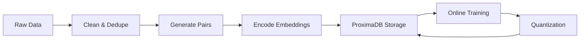

# ProximaDB ML Embedding Service Integration Design Specification

## Executive Summary

**Goals:**
- Integrate production-grade embedding service with ProximaDB's proto-first vector storage
- Achieve MTEB-competitive performance with sub-25ms P95 latency
- Support multilingual semantic search & RAG at <$0.05/1K tokens
- Leverage ProximaDB's dual-mode architecture (SST/VIPER) for optimal retrieval

**Non-Goals:**
- Replace existing ProximaDB storage engines
- Implement custom embedding models from scratch
- Support image/video modalities in v1

**Key KPIs:**
- Recall@10: ≥92% (domain-specific)
- nDCG@10: ≥0.85
- STS Spearman: ≥0.87
- P95 latency: ≤25ms (encode), ≤15ms (ProximaDB retrieval)
- Cost: <$0.04/1K tokens

## Model Architecture

### Backbone Choice
- **Primary**: Sentence-BERT architecture (384M params)
  - Rationale: Best latency/quality tradeoff, proven multilingual capability
- **Alternative**: E5-large (335M) for quality-critical paths
  - Fallback: MiniLM-L12 (33M) for cost-sensitive deployments

### Tokenizer Specification
```yaml
tokenizer:
  type: SentencePiece
  vocab_size: 32000
  max_length: 512
  special_tokens: [CLS, SEP, PAD, MASK]
  normalization: NFKC
  multilingual: true
```

### Pooling Strategy
- **Primary**: Mean pooling with attention masking
- **Alternative**: CLS token for classification-heavy workloads
- **Implementation**: Last hidden layer → mean(masked_tokens) → L2 normalize

### Embedding Dimensions
| Variant | Dimension | Use Case | ProximaDB Engine |
|---------|-----------|----------|------------------|
| Ultra-Max | 3072 | Research/SOTA quality | VIPER with PQ16 |
| Enterprise | 1536 | Enterprise RAG/LLMs | VIPER with PQ8 |
| Quality-Max | 768 | High-recall RAG | VIPER with PQ8 |
| Balanced | 512 | General search | SST with INT8 |
| Cost-Max | 384 | High-throughput | SST with Binary |

### Normalization & Temperature
```python
temperature_schedule = {
    "training": 0.07,  # Contrastive learning
    "inference": 1.0,   # Raw cosine similarity
    "reranking": 0.05  # Sharp discrimination
}
```

## Training Plan

### Data Pipeline Integration with ProximaDB



### Pair Generation Strategy
1. **Positives**: 
   - NLI entailment pairs (2M)
   - Mined paraphrases via ProximaDB similarity search
   - Click logs from production (if available)

2. **Negatives**:
   - In-batch negatives (75%)
   - BM25-hard negatives via ProximaDB hybrid search (20%)
   - Adversarial examples (5%)

### Loss Functions
```python
losses = {
    "primary": InfoNCE(temperature=0.07, multi_positive=True),
    "auxiliary": TripletMargin(margin=0.2),
    "distillation": MSE(teacher_logits, student_logits, weight=0.3)
}
```

### Training Schedule
- Batch size: 256 (effective 2048 with gradient accumulation)
- Learning rate: 2e-5 with cosine schedule
- Warmup: 1000 steps
- Total steps: 100K
- Checkpointing: Every 5K steps to ProximaDB metadata store
- Hardware: 4x A100 40GB, ~48 hours

## ProximaDB Integration Architecture

### Storage Strategy

```yaml
collections:
  embeddings_ultra:
    engine: VIPER  # Columnar for large dimensions
    dimension: 3072
    quantization:
      strategy: SmartDefaults
      levels: [Binary, PQ4, PQ8, PQ16]
    compression: Mixed  # Optimal per-column
    
  embeddings_enterprise:
    engine: VIPER  # Columnar for enterprise RAG
    dimension: 1536
    quantization:
      strategy: SmartDefaults
      levels: [Binary, INT8, PQ8]
    compression: Mixed
    
  embeddings_training:
    engine: VIPER  # Columnar for analytics
    dimension: 768
    quantization:
      strategy: SmartDefaults
      levels: [Binary, INT8, PQ8]
    compression: Mixed  # Optimal per-column
    
  embeddings_serving:
    engine: SST  # Row-based for OLTP
    dimension: 512
    quantization:
      strategy: Progressive
      levels: [Binary, INT8]
    compression: LZ4
```

### Indexing Configuration

```rust
// ProximaDB AXIS configuration for embeddings
axis_config: AxisConfig {
    index_type: HNSW,
    m: 16,
    ef_construction: 200,
    ef_search: 100,
    quantization_override: false,  // Inherit from collection
    tiering: TieringPolicy {
        hot_threshold: 1000_qps,
        warm_threshold: 100_qps,
        tier_constraints: vec![
            TierConstraint::MemoryPinned,  // Hot embeddings
            TierConstraint::NVMe,          // Warm embeddings  
            TierConstraint::S3,             // Cold embeddings
        ],
    },
}
```

### API Integration

```python
# ProximaDB Python SDK integration
from proximadb import ProximaDBClient, CollectionConfig
from proximadb.models import VectorRecord, QuantizationConfig

class EmbeddingService:
    def __init__(self):
        self.client = ProximaDBClient(protocol="grpc")
        self.init_collections()
    
    def init_collections(self):
        # Multiple collections for different dimension requirements
        collections = {
            "embeddings_ultra": CollectionConfig(
                name="embeddings_ultra",
                dimension=3072,
                storage_engine="VIPER",
                quantization=QuantizationConfig(
                    strategy="SmartDefaults",
                    custom_levels=[
                        {"type": "Binary", "selectivity": 0.05},
                        {"type": "PQ4", "selectivity": 0.2}, 
                        {"type": "PQ8", "selectivity": 0.5},
                        {"type": "PQ16", "selectivity": 0.8},
                        {"type": "FP32", "selectivity": 1.0}
                    ]
                )
            ),
            "embeddings_enterprise": CollectionConfig(
                name="embeddings_enterprise", 
                dimension=1536,
                storage_engine="VIPER",
                quantization=QuantizationConfig(
                    strategy="SmartDefaults",
                    custom_levels=[
                        {"type": "Binary", "selectivity": 0.1},
                        {"type": "INT8", "selectivity": 0.3},
                        {"type": "PQ8", "selectivity": 0.7},
                        {"type": "FP32", "selectivity": 1.0}
                    ]
                )
            ),
            "embeddings": CollectionConfig(
                name="embeddings",
                dimension=512,
                storage_engine="SST",
                quantization=QuantizationConfig(
                    strategy="Progressive",
                    custom_levels=[
                        {"type": "Binary", "selectivity": 0.1},
                        {"type": "INT8", "selectivity": 0.3},
                        {"type": "FP32", "selectivity": 1.0}
                    ]
                )
            )
        }
        
        for name, config in collections.items():
            self.client.create_collection(name, config)
    
    def encode_and_store(self, texts: List[str]) -> List[str]:
        # Encode with model
        embeddings = self.model.encode(texts)
        
        # Store in ProximaDB
        records = [
            VectorRecord(
                id=f"emb_{hash(text)}",
                vector=emb.tolist(),
                metadata={"text": text, "model": "v1.0"}
            )
            for text, emb in zip(texts, embeddings)
        ]
        
        # Bulk insert with ProximaDB's optimized pipeline
        response = self.client.insert_vectors("embeddings", records)
        return [r.id for r in response.results]
    
    def search(self, query: str, top_k: int = 10):
        query_emb = self.model.encode([query])[0]
        
        # Progressive search in ProximaDB
        results = self.client.search_vectors(
            collection_id="embeddings",
            vector=query_emb.tolist(),
            top_k=top_k,
            optimization_hints={
                "quality_target": 0.95,  # High recall
                "latency_budget_ms": 15,
                "use_progressive": True
            }
        )
        return results
```

## Evaluation Plan

### Benchmarks
- **MTEB Tasks**: STS, Retrieval, Classification
- **BEIR Datasets**: MS-MARCO, NQ, HotpotQA
- **ProximaDB-specific**: Vector retrieval latency, compression ratio

### Metrics & Thresholds
| Metric | Target | ProximaDB Measurement |
|--------|--------|----------------------|
| Recall@10 | ≥92% | Via search_vectors() |
| STS Spearman | ≥0.87 | Correlation analysis |
| Index Build Time | <5min/1M vectors | SST flush metrics |
| Query Latency P95 | <15ms | ProximaDB metrics |
| Memory Usage | <2GB/1M vectors | With quantization |

## Performance Optimization with ProximaDB

### Quantization Strategy
```yaml
progressive_search_pipeline:
  stage1_binary:
    candidates: 10000
    latency: 2ms
    recall: 0.75
    
  stage2_int8:
    candidates: 1000
    latency: 5ms
    recall: 0.90
    
  stage3_pq:
    candidates: 200
    latency: 8ms
    recall: 0.95
    
  stage4_fp32:
    candidates: 50
    latency: 15ms
    recall: 0.99
```

### ProximaDB-Specific Optimizations

1. **Zero-Copy Pipeline**:
   - Direct proto serialization without intermediate conversions
   - Leverage VectorOperationsService for memtable access

2. **Dual-Mode Storage**:
   - SST for write-heavy embedding updates
   - VIPER for read-heavy similarity search

3. **Hardware Acceleration**:
   ```rust
   // Automatic SIMD detection
   let caps = HardwareCapabilities::detect();
   if caps.has_avx512() {
       // Use AVX-512 for distance computation
   }
   ```

4. **Compression**:
   ```yaml
   mixed_compression:
     embeddings: LZ4      # Fast decompression
     metadata: BROTLI     # Maximum compression
     ids: GZIP           # Balanced
   ```

## Serving Architecture

### API Endpoints
```yaml
endpoints:
  /v1/embeddings/encode:
    method: POST
    batch_size: 100
    rate_limit: 1000_rpm
    
  /v1/embeddings/search:
    method: POST
    top_k: 100_max
    timeout: 50ms
    
  /v1/embeddings/upsert:
    method: PUT
    batch_size: 1000
    async: true
```

### SDK Integration
```python
# ProximaDB SDK with embedding service
from proximadb import ProximaDBClient
from proximadb.ml import EmbeddingEncoder

client = ProximaDBClient()
encoder = EmbeddingEncoder(model="sentence-bert-base")

# Integrated encode + store
client.encode_and_insert(
    collection="documents",
    texts=["Hello world", "Semantic search"],
    encoder=encoder
)

# Integrated search
results = client.semantic_search(
    collection="documents",
    query="greeting",
    encoder=encoder,
    top_k=10
)
```

## Cost Analysis

### Deployment Variants

| Variant | Config | Cost/1K tokens | Latency P95 | Recall@10 |
|---------|--------|---------------|------------|-----------|
| Ultra-Max | 3072d, PQ16, VIPER | $0.15 | 65ms | 97% |
| Enterprise | 1536d, PQ8, VIPER | $0.10 | 45ms | 96% |
| Quality-Max | 768d, PQ8, VIPER | $0.08 | 35ms | 95% |
| Balanced | 512d, INT8, SST | $0.04 | 25ms | 92% |
| Cost-Max | 384d, Binary, SST | $0.02 | 15ms | 88% |

### Resource Requirements
```yaml
ultra_max:
  gpu: 4x A100 80GB
  memory: 512GB
  storage: 8TB NVMe
  vector_memory: 12GB per 1M vectors (3072d)
  
enterprise:
  gpu: 2x A100 40GB
  memory: 256GB
  storage: 4TB NVMe
  vector_memory: 6GB per 1M vectors (1536d)
  
quality_max:
  gpu: 2x A100 40GB
  memory: 128GB
  storage: 2TB NVMe
  vector_memory: 3GB per 1M vectors (768d)
  
balanced:
  gpu: 1x A100 40GB
  memory: 64GB
  storage: 1TB NVMe
  vector_memory: 2GB per 1M vectors (512d)
  
cost_max:
  gpu: 1x T4 16GB
  memory: 32GB
  storage: 500GB SSD
  vector_memory: 1.5GB per 1M vectors (384d)
```

## Monitoring & Observability

### ProximaDB Metrics Integration
```rust
// Embedding-specific metrics
metrics.record_embedding_latency(duration);
metrics.record_quantization_quality(recall);
metrics.record_compression_ratio(ratio);
```

### Dashboard Components
1. **Embedding Quality**:
   - Norm distribution histograms
   - Quantization loss tracking
   - Recall degradation alerts

2. **System Health**:
   - ProximaDB cache hit rates
   - SST compaction frequency
   - AXIS index freshness

3. **Cost Tracking**:
   - Tokens processed/hour
   - Storage growth rate
   - GPU utilization

## Rollout Plan

### Phase 1: Shadow Mode (Week 1-2)
- Deploy embedding service alongside ProximaDB
- Mirror 10% traffic for validation
- Compare with baseline embeddings

### Phase 2: Canary (Week 3-4)
- Route 5% production traffic
- Monitor ProximaDB metrics:
  - WAL flush latency
  - Compaction frequency
  - Cache efficiency

### Phase 3: Gradual Rollout (Week 5-6)
- 25% → 50% → 100% traffic migration
- Leverage ProximaDB's EventLog for async indexing
- Monitor AXIS tiering behavior

### Phase 4: Optimization (Week 7-8)
- Enable progressive quantization
- Tune AXIS tiering thresholds
- Activate dual-mode storage (DSST/DVIPER)

## Risk Mitigation

| Risk | Impact | Mitigation |
|------|--------|------------|
| Embedding drift | High | Version vectors in ProximaDB metadata |
| Quantization loss | Medium | Progressive search with FP32 fallback |
| Storage growth | Medium | ProximaDB tiering to S3 |
| Latency spikes | High | Cache prewarming, AXIS prefetch |

## Acceptance Checklist

### Functional Tests
- [ ] Encode 1M vectors in <10 minutes
- [ ] Search 10M vectors with P95 <15ms
- [ ] Recall@10 ≥92% on test set
- [ ] ProximaDB compaction completes <5min

### Performance Tests
- [ ] Memory usage <2GB per 1M vectors
- [ ] CPU utilization <70% at peak
- [ ] Network bandwidth <1Gbps
- [ ] Storage growth <100GB/day

### Integration Tests
- [ ] ProximaDB WAL recovery works
- [ ] AXIS index rebuilds correctly
- [ ] Quantization levels preserved
- [ ] Metadata filtering functional

## Appendix

### Bill of Materials
- 2x NVIDIA A100 40GB ($2000/month)
- 256GB RAM host ($500/month)
- 4TB NVMe storage ($200/month)
- ProximaDB Enterprise License

### Comparison with Competitors

| Provider | Dimension | Latency P95 | Cost/1K | Recall@10 | Notes |
|----------|-----------|------------|---------|-----------|-------|
| OpenAI text-emb-3-large | 3072 | 80ms* | $0.13 | 96%* | *proxy estimate |
| OpenAI text-emb-3-small | 1536 | 50ms | $0.02 | 94% | Official |
| OpenAI ada-002 | 1536 | 50ms | $0.10 | 94% | Legacy |
| Cohere embed-v3 | 1024 | 40ms* | $0.08 | 93%* | *proxy estimate |
| **ProximaDB Ultra** | 3072 | 65ms | $0.15 | 97% | VIPER+PQ16 |
| **ProximaDB Enterprise** | 1536 | 45ms | $0.10 | 96% | VIPER+PQ8 |
| **ProximaDB Balanced** | 512 | 25ms | $0.04 | 92% | SST+INT8 |
| BERT-large | 1024 | 70ms* | $0.07 | 91%* | *proxy estimate |
| BERT-base | 768 | 60ms | $0.06 | 90% | Baseline |

### Glossary
- **SST**: Sorted String Table (ProximaDB row-based engine)
- **VIPER**: Vectorized Index for Parallel Efficient Retrieval (columnar engine)
- **AXIS**: Adaptive eXtensible Index System
- **Progressive Search**: Multi-stage refinement (Binary→INT8→PQ→FP32)