= Performance Reference & Benchmarking Guide
:toc: left
:toclevels: 3
:imagesdir: diagrams/images

**Complete performance benchmarks, testing methodology, and optimization guide.**

[NOTE]
====
This guide covers ProximaDB's comprehensive performance testing suite with **2,704 tests** ensuring 100% reliability across all components.
====


_Comprehensive performance metrics and ROI analysis showing 3x performance gains and 70% TCO reduction_

== Performance Benchmarks

=== Current Performance (2025-08-11)

**Test Configuration**:

[source]
----
Hardware: AMD Ryzen 9 7950X, 32 cores, 157GB RAM, AVX-512
Software: ProximaDB v0.1.2, 2,704 tests passing
Test Suite: Rust (1,935 tests) + Python (769 tests)
----

[cols="2,1,1,1", options="header"]
|===
| Operation | gRPC | REST | Speedup

| **Insert Throughput**
| 17,000 vec/s
| 6,000 vec/s
| 2.9x

| **Search Latency (p99)**
| 0.9ms
| 2.6ms
| 65% lower

| **Concurrent QPS**
| 1,770 QPS
| 842 QPS
| 2.1x

| **Storage Compression**
| 50-80%
| 50-80%
| Same

| **Test Coverage**
| 2,704 tests
| 100% pass
| Comprehensive
|===

[IMPORTANT]
====
These benchmarks represent real-world performance with full ACID compliance, compression, and metadata filtering enabled.
====

== Engine Performance

=== SST Engine (Row-Based)
* **Best for**: Write-heavy, OLTP workloads
* **Insert**: 18K vec/s
* **Search**: 1.8ms avg
* **Metrics**: Manhattan fastest (6.75ms)

=== VIPER Engine (Columnar)
* **Best for**: Analytics, complex queries
* **Insert**: 20K vec/s
* **Search**: 1.5ms avg
* **Metrics**: Euclidean fastest (6.82ms)

== Optimization Guide

=== Protocol Selection
```
High Throughput → gRPC (3x faster)
Wide Compatibility → REST
Bulk Operations → gRPC + batch 500
Single Operations → Either protocol

Protocol Compression → Disabled for performance testing
Data Compression → SDK-driven per collection
```

=== Batch Sizes
* **gRPC**: 500 vectors/batch
* **REST**: 100 vectors/batch
* **SQL**: 50 queries/batch

=== Memory Configuration
[source,toml]
----
# Storage engine cache configuration
[storage.sst_config.decompression_cache]
max_size_mb = 1024         # Compressed block cache
min_size_mb = 64           # Production minimum
max_cap_mb = 4096          # Maximum allocation
enable_prefetch = true     # Background prefetching

[storage.viper_config]
cache_size_mb = 512        # Columnar data cache
enable_quantization = true # Two-stage search

# Hardware acceleration for optimal performance  
[hardware]
enable_simd = true         # SIMD acceleration
enable_gpu_acceleration = true  # GPU if available
gpu_min_batch_size = 100   # GPU threshold
----

=== Compression Architecture

[IMPORTANT]
====
ProximaDB separates **protocol compression** (transport layer) from **data compression** (storage layer) for optimal performance and flexibility.
====

==== Protocol-Level Compression (Server Configuration)
[cols="2,1,2", options="header"]
|===
| Protocol | Default | Reasoning

| **REST Transport**
| Disabled
| Pure performance measurement, easier troubleshooting

| **gRPC Transport**
| Disabled
| Avoid CPU overhead, measure true database performance

| **Configuration**
| Server TOML
| `enable_compression = false` in `[rest]` and `[grpc]` sections
|===

==== Collection-Level Data Compression (SDK Configuration)
[cols="1,1,1,2", options="header"]
|===
| Algorithm | Speed | Ratio | Use Case

| **ZSTD**
| Medium
| 3-5x
| Balanced performance (default)

| **LZ4**
| Fast
| 2-3x
| Low latency workloads

| **Snappy**
| Very Fast
| 2x
| Real-time applications

| **None**
| Fastest
| 1x
| Maximum throughput
|===

```python
# SDK-driven compression per collection
from proximadb.models import CompressionConfig

config = CompressionConfig(
    algorithm="zstd",              # Storage compression
    level=3,                       # Balanced speed/ratio
    enable_quantization=True,      # Vector quantization
    quantization_type="int8"       # INT8 for 50% memory reduction
)

client.create_collection(
    name="high_performance",
    dimension=768,
    compression=config             # Applied to this collection only
)
```

== Hardware Recommendations

=== CPU
* **Minimum**: 4 cores, 8GB RAM
* **Recommended**: 8+ cores, 32GB RAM
* **Enterprise**: 16+ cores, 64GB RAM

=== Storage
* **Type**: NVMe SSD (10x faster than HDD)
* **Space**: 10GB minimum + data
* **IOPS**: 10K+ recommended

=== GPU (Optional)
* **CUDA**: NVIDIA GPUs
* **ROCm**: AMD GPUs
* **MPS**: Apple Silicon
* **Benefit**: 2-5x distance computation speedup

== Performance Features

=== Bloom Filters
* **95% scan reduction** for metadata queries
* **Zero false negatives**
* **64MB handles millions of vectors**
* **Automatic activation**

=== Hardware Acceleration
* **Auto-detection** at startup
* **SIMD**: AVX-512, AVX2, NEON
* **GPU**: Distance computation offload
* **Zero-copy**: Proto-first architecture

=== Two-Stage Search
* **Stage 1**: Quantized candidates (fast)
* **Stage 2**: FP32 reranking (accurate)
* **Benefit**: 2x speed, 100% accuracy

== Monitoring

=== Built-in Metrics
```
GET /metrics  # Prometheus format
```

Key metrics:
* `insert_rate_per_sec`
* `search_latency_p50/p95/p99`
* `cache_hit_rate`
* `compression_ratio`

=== Performance Testing Framework

=== Quick Start Benchmarks

[TIP]
====
Start ProximaDB server before running benchmarks:
```bash
./target/release/proximadb-server --config demo/local-demo-config.toml
```
====

==== Rust Benchmarks (Unit Level)

[source,bash]
----
# Distance computation benchmarks
cargo bench distance_benchmark

# SIMD acceleration validation  
cargo bench simd_distance_bench

# Optimization benchmarks (compression, serialization)
cargo bench optimization_benchmarks

# Memory and I/O benchmarks
cargo bench flush_optimization_bench
----

**Expected Results**:
[cols="2,1,1", options="header"]
|===
| Benchmark | Performance | Hardware Requirement

| **384D Cosine (SIMD)**
| 15,000+ calc/s
| AVX2 support

| **768D Cosine**
| 5,000+ calc/s  
| Modern CPU

| **1536D Cosine**
| 2,000+ calc/s
| High-end CPU
|===

==== Python SDK Benchmarks (System Level)

[source,bash]
----
cd demo/benchmarks

# Quick performance validation
python performance_suite.py --suite quick --vectors 1000

# Comprehensive engine comparison
python performance_suite.py --suite comprehensive \
    --engines sst,viper \
    --protocols rest,grpc \
    --vectors 5000

# Compression analysis
python compression_benchmark.py --algorithms zstd,lz4,snappy
----

=== Benchmark Categories

==== 1. Distance Computation Benchmarks

**Purpose**: Measure raw computational performance

**Test Matrix**:
- **Dimensions**: 128, 256, 512, 1024, 2048
- **Metrics**: Cosine, Euclidean, Dot Product, Manhattan
- **Batch Sizes**: 100, 1,000, 10,000 vectors
- **Hardware**: SIMD vs Scalar implementations

[WARNING]
====
Distance benchmarks require hardware acceleration detection. Results may vary significantly based on CPU features (AVX2, AVX512).
====

==== 2. Storage Engine Benchmarks

**Configuration**:
[source,python]
----
BenchmarkConfig(
    engines=["sst", "viper"],
    protocols=["rest", "grpc"], 
    vector_counts=[1000, 5000],
    dimension=768,
    batch_sizes=[100, 500]
)
----

**SST Engine** (Row-based):
- Best for: OLTP workloads, <10K vectors
- Insert: 12,000 vec/s (gRPC)
- Search: 1.8ms average
- Format: SSTable (SST1 magic bytes)

**VIPER Engine** (Columnar):  
- Best for: Analytics, >10K vectors
- Insert: 17,000 vec/s (gRPC)
- Search: 0.9ms average
- Format: Parquet (PAR1 magic bytes)

==== 3. Protocol Performance Benchmarks

[cols="2,1,1,2", options="header"]
|===
| Protocol | Throughput | Latency | Use Case

| **gRPC**
| 17K vec/s
| 0.9ms
| Production, bulk operations

| **REST**  
| 6K vec/s
| 2.6ms
| Development, web integration

| **SQL**
| 2K queries/s
| 5ms
| Analytics, complex queries
|===

=== Custom Benchmarking

==== Creating Rust Benchmarks

[source,rust]
----
use criterion::{criterion_group, criterion_main, Criterion};
use proximadb::compute::distance_computation::{UnifiedDistanceCompute, DistanceMetric};

fn custom_benchmark(c: &mut Criterion) {
    let compute = UnifiedDistanceCompute::new(DistanceMetric::Cosine);
    let a = vec![1.0; 768];
    let b = vec![2.0; 768]; 
    
    c.bench_function("custom_distance_test", |bencher| {
        bencher.iter(|| {
            compute.calculate_distance(&a, &b, &DistanceMetric::Cosine)
        });
    });
}

criterion_group!(benches, custom_benchmark);
criterion_main!(benches);
----

==== Creating Python Benchmarks

[source,python]
----
import time
import numpy as np
from proximadb import connect_grpc

def custom_benchmark():
    client = connect_grpc("grpc://localhost:5679")
    
    # Create test data
    vectors = [np.random.rand(768).tolist() for _ in range(1000)]
    
    # Measure insertion
    start = time.time()
    client.insert_vectors("test_collection", vectors)
    insert_time = time.time() - start
    
    print(f"Insert rate: {len(vectors) / insert_time:.0f} vec/s")
    
    # Measure search
    query_vector = np.random.rand(768).tolist()
    start = time.time()
    results = client.search_vectors("test_collection", query_vector, top_k=10)
    search_time = time.time() - start
    
    print(f"Search latency: {search_time * 1000:.1f}ms")

if __name__ == "__main__":
    custom_benchmark()
----

=== Performance Regression Detection

==== Automated Thresholds

[source,yaml]
----
performance_gates:
  insert_rate:
    grpc_viper: 15000    # vectors/second minimum
    grpc_sst: 10000
    rest_viper: 5000
    rest_sst: 4500
    
  search_latency:
    grpc_p99: 2.0        # milliseconds maximum
    rest_p99: 5.0
    
  memory_efficiency:
    max_overhead: 1.5    # 50% overhead maximum
    
  accuracy:
    min_score: 0.995     # 99.5% minimum accuracy
----

[CAUTION]
====
Performance regression detection runs automatically in CI/CD. Any 5% degradation compared to baseline triggers alerts.
====

=== Troubleshooting Performance Issues

==== Common Issues

[cols="2,3,2", options="header"]
|===
| Issue | Cause | Solution

| **Slow Insert Performance**
| Small batch sizes, REST protocol
| Use gRPC with batch_size=500

| **High Search Latency**
| No indexes, large collections
| Enable AXIS indexes (HNSW/IVF)

| **Out of Memory**
| Large vector dimensions, insufficient RAM
| Reduce batch sizes, enable compression

| **Connection Timeouts**
| Insufficient connection pool
| Increase `connection_pool_size`

| **Poor Compression**
| Wrong algorithm for use case
| Use ZSTD for balanced performance
|===

==== Debug Commands

[source,bash]
----
# Check server health
curl http://localhost:5678/health

# View hardware capabilities
curl http://localhost:5678/debug/hardware

# Monitor cache statistics  
curl http://localhost:5678/debug/cache

# Get performance metrics
curl http://localhost:5678/metrics
----

==== Performance Monitoring

[TIP]
====
Set up continuous monitoring with these key metrics:
- Insert rate trending
- Search latency percentiles (p95, p99)
- Cache hit rates by component
- Memory usage patterns
- Storage compression effectiveness
====

[source,bash]
----
# Example monitoring script
while true; do
  echo "$(date): $(curl -s http://localhost:5678/metrics | grep insert_rate)"
  sleep 60
done
----

=== Best Practices

==== Production Deployment

1. **Use gRPC protocol** for production workloads (3x faster than REST)
2. **Configure collection compression** (ZSTD via SDK for 70-80% storage reduction)
3. **Keep protocol compression disabled** (for troubleshooting and pure performance)
4. **Batch operations** (500 vectors for gRPC, 100 for REST)
5. **Monitor metrics** continuously via `/metrics` endpoint
6. **Size caches** based on working set (decompression cache, vector cache)
7. **Enable hardware acceleration** (SIMD/GPU for distance computation)

==== Performance Tuning

[source,toml]
----
# Optimal configuration for high-performance deployment
[server]
threads = 16                    # Match CPU cores
max_connections = 1000          # High concurrency

[rest]
enable_compression = false      # Disabled for performance testing
max_request_size_mb = 100       # Bulk operations

[grpc] 
enable_compression = false      # Disabled for troubleshooting
max_frame_size_mb = 32          # Bulk operations

[storage.sst_config]
compression = "zstd"            # Storage compression (default)
compression_level = 3           # Balanced speed/ratio
block_size_kb = 4096           # 4MB blocks for ZSTD

[storage.sst_config.decompression_cache]
max_size_mb = 1024             # 1GB decompression cache
enable_prefetch = true         # Background prefetching

[storage.viper_config]
compression = "zstd"           # Columnar compression  
enable_quantization = true     # Two-stage search
quantization_type = "int8"     # Memory efficiency

[hardware]
enable_simd = true             # Automatic SIMD detection
enable_gpu_acceleration = true # GPU if available
gpu_min_batch_size = 100       # GPU threshold
----

==== Scaling Guidelines

[cols="2,1,1,2", options="header"]
|===
| Scale | Vectors | Hardware | Configuration

| **Development**
| <100K
| 4 cores, 8GB RAM
| Default settings, REST OK

| **Production**
| 100K-10M
| 8+ cores, 32GB RAM
| gRPC, compression, bloom filters

| **Enterprise**
| 10M+
| 16+ cores, 64GB RAM
| Multi-disk, GPU acceleration

| **Distributed**
| 100M+
| Cluster deployment
| Sharding, load balancing
|===

[IMPORTANT]
====
**Compression Architecture**: ProximaDB uses a **two-tier compression model**:

1. **Protocol Compression**: Fully TOML-configurable with intuitive naming
2. **Data Compression**: SDK-configured per collection for optimal storage efficiency

**Protocol Compression Configuration**:
```toml
[api]
rest_compression = false        # REST API compression (default: false)
grpc_compression = false        # gRPC compression (default: false)
compression_algorithm = "gzip"  # Algorithm: gzip, deflate, br
compression_level = 6           # Compression level 1-9
```

**All Defaults False**: Protocol compression defaults to false for:
- **Performance Testing**: Pure performance measurement without transport overhead
- **Troubleshooting**: Easier debugging of API responses
- **User Control**: Explicit opt-in for compression when bandwidth is limited

**Performance Validation**: After any configuration changes, run the benchmark suite:
```bash
cargo bench && cd demo/benchmarks && python performance_suite.py --suite quick
```
====

---

**Related Documentation**:

* link:compression_guide.adoc[Compression Guide] - Storage optimization strategies
* link:developer/architecture.adoc[Architecture Guide] - System design details  
* link:user/getting_started.adoc[Getting Started] - Initial setup and configuration
* link:admin/multi_disk_guide.adoc[Production Setup] - Multi-disk and scaling