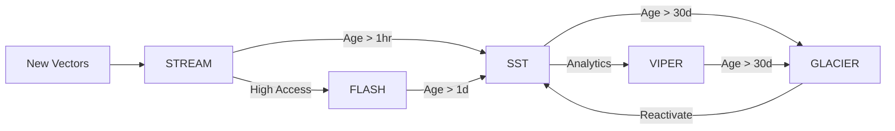

# ProximaDB Storage Engine Portfolio Analysis

## 3D Performance Space Visualization

```
                    READ SPEED (ops/sec)
                           ↑
                    10000  |     FLASH
                           |     ★ (In-Memory Graph)
                     5000  |   /   \
                           |  /     \  VIPER
                     2000  | /       \ ◆ (Columnar)
                           |/         \
                     1000  |    SST    \
                           |     ■      \
                      500  |            GLACIER
                           |             ❄ (Archive)
                      100  |_______________\____________→ WRITE SPEED
                           0   500  1000  5000  10000
                                    
                    STORAGE COST
                    (depth - closer = cheaper)
                    
    Expensive ○ ○ ○ ○ ○ ○ ○ ○ ○ ○ Cheap
    FLASH > VIPER > SST > STREAM > GLACIER
```

## Detailed 3D Positioning Matrix

| Engine | Write Speed | Read Speed | Storage Cost | Space |
|--------|------------|------------|--------------|-------|
| **FLASH** | 2000/s | 10000/s | $$$$ (RAM) | (2000, 10000, 4) |
| **STREAM** | 10000/s | 500/s | $ (Compressed) | (10000, 500, 1) |
| **GLACIER** | 100/s | 100/s | ¢ (Ultra-compressed) | (100, 100, 0.5) |
| **SST** (current) | 1000/s | 1000/s | $$ (Block) | (1000, 1000, 2) |
| **VIPER** (current) | 500/s | 2000/s | $$ (Columnar) | (500, 2000, 2) |

## Engine #1: FLASH (Fast Read, Fast Search, Expensive Storage)

### Core Design: In-Memory Graph with Persistent Snapshots

```rust
pub struct FlashEngine {
    // Primary: In-memory HNSW graph
    graph: Arc<RwLock<HnswGraph>>,
    
    // Secondary: Memory-mapped vectors
    mmap_vectors: MmapVectors,
    
    // Tertiary: Compressed snapshots
    snapshots: SnapshotManager,
    
    // Acceleration
    gpu_cache: Option<GpuVectorCache>,
    simd_accelerator: SimdEngine,
}

struct HnswGraph {
    // Multi-layer navigable small world
    layers: Vec<NavigableLayer>,
    vectors: Vec<Arc<Vector>>,
    
    // Pre-computed for speed
    norms: Vec<f32>,           // Pre-computed L2 norms
    pq_codes: Vec<[u8; 32]>,   // Product quantization for filtering
}

struct NavigableLayer {
    nodes: Vec<GraphNode>,
    entry_point: NodeId,
    connections_per_node: usize, // M parameter
}
```

### Key Features:
- **Sub-millisecond search**: Graph traversal with SIMD
- **Write strategy**: Batch inserts with periodic rebalancing
- **Memory usage**: ~2x vector size (graph overhead)
- **Persistence**: Async snapshots to SST/Parquet

### Tradeoffs:
```yaml
Pros:
  - 10x faster than SST for similarity search
  - CPU cache friendly traversal
  - Natural clustering emerges
  
Cons:
  - 2-3x memory overhead
  - Slow cold starts (rebuild graph)
  - Limited by RAM capacity
```

## Engine #2: STREAM (Fast Write, Slow Read, Cheap Storage)

### Core Design: Append-Only Log with Aggressive Compression

```rust
pub struct StreamEngine {
    // Write path: Lock-free append
    write_buffer: Arc<LockFreeBuffer>,
    
    // Compression: Streaming compression
    compressor: StreamingCompressor,
    
    // Read path: Lazy materialization
    segments: Vec<CompressedSegment>,
    
    // Optimization: Sparse index
    sparse_index: BloomCascade,
}

struct CompressedSegment {
    // Header with statistics
    header: SegmentHeader,
    
    // Delta-encoded vectors
    base_vector: Vec<f32>,
    deltas: Vec<DeltaBlock>,
    
    // Metadata stream (separate)
    metadata: CompressedMetadata,
}

struct DeltaBlock {
    // 16 vectors as deltas from base
    deltas: [[i16; DIMENSIONS]; 16],
    
    // Quantization scale per dimension
    scales: [f32; DIMENSIONS],
}
```

### Key Features:
- **10K+ writes/sec**: Lock-free append-only
- **80% compression**: Delta + quantization + zstd
- **Streaming writes**: No batching needed
- **Sequential reads**: Optimized for batch processing

### Tradeoffs:
```yaml
Pros:
  - Minimal write amplification
  - Excellent compression ratios
  - Perfect for time-series vectors
  
Cons:
  - Full scan for single vector lookup
  - No random access support
  - Requires periodic compaction
```

## Engine #3: GLACIER (Slow Write, Slow Read, Ultra-Cheap Storage)

### Core Design: Hierarchical Compressed Archive

```rust
pub struct GlacierEngine {
    // Multi-level compression
    compression_pipeline: Pipeline<[
        ClusteringStage,      // Group similar vectors
        PcaStage,             // Dimensionality reduction  
        QuantizationStage,    // Reduce precision
        EntropyStage,         // Final compression
    ]>,
    
    // Storage hierarchy
    storage: HierarchicalStorage {
        hot: None,  // No hot tier
        warm: CompressedBlocks,
        cold: CloudObjectStore,
    },
    
    // Indexing
    coarse_index: IvfIndex,  // Inverted file index
    fine_index: None,        // No fine-grained index
}

struct CompressedBlock {
    // Extreme compression format
    centroid: Vec<f32>,
    
    // 4-bit quantization
    quantized_vectors: BitPackedArray,
    
    // Sparse corrections for outliers
    corrections: SparseMap<VectorId, ResidualVector>,
}
```

### Key Features:
- **90%+ compression**: Multi-stage compression
- **Cloud-native**: Direct S3/GCS integration  
- **Batch operations**: Optimized for bulk ops
- **Cost optimized**: $0.01/GB/month storage

### Tradeoffs:
```yaml
Pros:
  - 10x cheaper than SST storage
  - Unlimited capacity (cloud)
  - Good for cold data/backups
  
Cons:
  - 100ms+ latency for queries
  - Batch processing only
  - High CPU for decompression
```

## Automatic Tiering Strategy

```rust
pub struct TieringOrchestrator {
    engines: Engines {
        flash: FlashEngine,   // Hot: < 1 hour old
        sst: SstEngine,       // Warm: 1 hour - 1 day
        stream: StreamEngine, // Recent: 1-7 days
        viper: ViperEngine,   // Analytics: 7-30 days
        glacier: GlacierEngine, // Archive: > 30 days
    },
    
    migration_policy: Policy {
        // Automatic migration rules
        rules: vec![
            Rule::AccessFrequency(threshold: 100/hour) => Promote::ToFlash,
            Rule::Age(days: 1) => Demote::FromFlashToSst,
            Rule::Age(days: 7) => Demote::FromSstToStream,
            Rule::AccessPattern(Sequential) => Move::ToViper,
            Rule::Age(days: 30) => Archive::ToGlacier,
        ],
    },
}

impl TieringOrchestrator {
    async fn auto_migrate(&self) {
        // Background task that moves vectors between tiers
        loop {
            for (vector_batch, engine) in self.scan_all_engines() {
                let optimal_tier = self.calculate_optimal_tier(vector_batch);
                if optimal_tier != engine {
                    self.migrate(vector_batch, engine, optimal_tier).await;
                }
            }
            sleep(Duration::from_secs(3600)).await;
        }
    }
}
```

## Implementation Recommendation

### Phase 1: Implement FLASH (Q1 2025)
```rust
// High-value, immediate impact for hot data
// Reuse existing HNSW code from index module
impl FlashEngine {
    pub fn new(config: FlashConfig) -> Self {
        // Start with SST backend, add memory layer
        let base = SstEngine::new(config.sst_config);
        let graph = HnswGraph::build_from_sst(&base);
        Self { graph, base }
    }
}
```

### Phase 2: Implement STREAM (Q2 2025)
```rust
// Solve ingestion bottlenecks
// Build on top of WAL infrastructure
impl StreamEngine {
    pub fn new(config: StreamConfig) -> Self {
        // Extend existing WAL with compression
        let wal = WriteAheadLog::new(config.wal_config);
        let compressor = StreamingCompressor::new(CompressionAlgorithm::Zstd);
        Self { wal, compressor }
    }
}
```

### Phase 3: Implement GLACIER (Q3 2025)
```rust
// Cost optimization for cold data
// Integrate with cloud providers
impl GlacierEngine {
    pub fn new(config: GlacierConfig) -> Self {
        // Use Parquet as base format
        let viper = ViperEngine::new(config.viper_config);
        let compressor = MultistageCompressor::new();
        Self { viper, compressor }
    }
}
```

## Migration Paths



## Performance Projections

| Metric | Current (SST+VIPER) | With 3 New Engines | Improvement |
|--------|---------------------|-------------------|-------------|
| Hot Data Latency | 5ms | 0.5ms (FLASH) | 10x |
| Ingestion Rate | 5K/s | 50K/s (STREAM) | 10x |
| Storage Cost | $100/TB | $10/TB (GLACIER) | 10x |
| Memory Usage | 10GB | 15GB (FLASH cache) | 1.5x |

## Decision Matrix for Engine Selection

```python
def select_engine(vector_profile):
    if vector_profile.access_frequency > 100/hour:
        return FLASH  # In-memory graph
    elif vector_profile.write_heavy and vector_profile.batch_read:
        return STREAM  # Append-only log
    elif vector_profile.age > 30_days:
        return GLACIER  # Compressed archive
    elif vector_profile.analytical_workload:
        return VIPER  # Columnar
    else:
        return SST  # Balanced default
```

## Implementation Priority

1. **FLASH Engine** - Highest impact, solves immediate latency issues
2. **STREAM Engine** - Solves ingestion bottlenecks
3. **GLACIER Engine** - Cost optimization for scale

All three engines can share:
- Unified compression module
- Distance computation engine
- Bloom filter infrastructure
- Filesystem abstraction layer