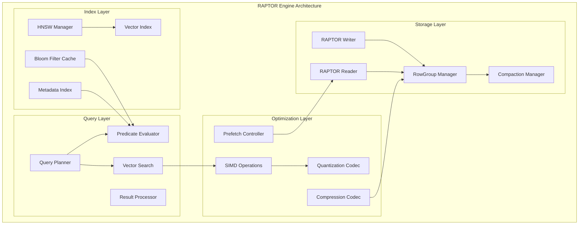
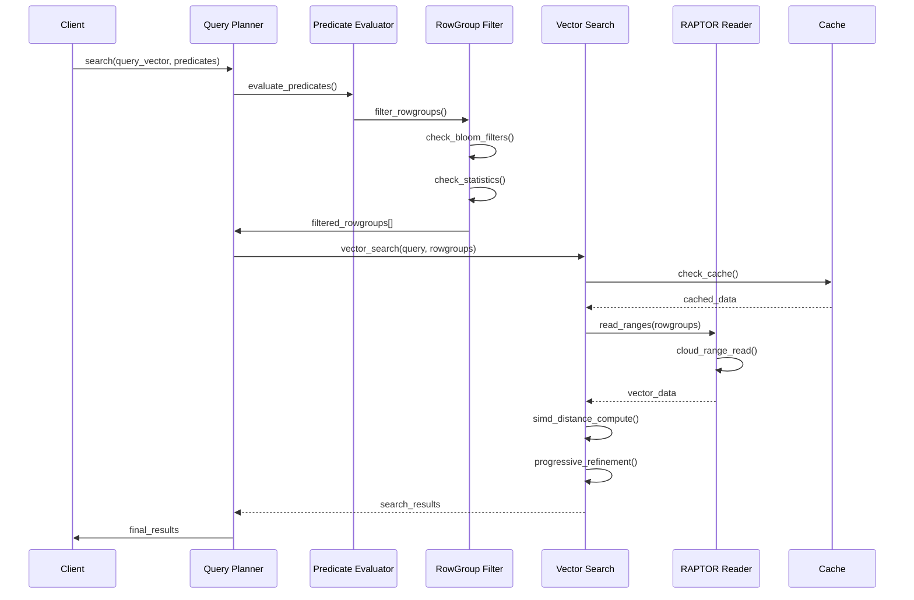

# RAPTOR Storage Engine Design Specification
## Row-Aligned Predicated Tensor Optimized Repository

### Version 1.0 - ProximaDB Storage Engine

---

## Executive Summary

RAPTOR (Row-Aligned Predicated Tensor Optimized Repository) is a next-generation storage engine for ProximaDB that combines the best of Google's Artus filesystem concepts with advanced vector database requirements. It provides:

- **SIMD-optimized columnar storage** with Arrow IPC format
- **Cloud-native range-based reading** for bandwidth optimization
- **Integrated HNSW graph management** with compaction-aware updates
- **Multi-level metadata indexing** for aggressive pruning
- **Zero-copy vector operations** with hardware acceleration
- **Complex metadata support** including nested maps and lists

## Core Architecture

### 1. Storage Format

```
┌─────────────────────────────────────────────────────────┐
│                    RAPTOR File Layout                    │
├─────────────────────────────────────────────────────────┤
│  Header (8KB)                                           │
│  ├── Magic Number: "RAPT0001"                          │
│  ├── Schema (Arrow Schema)                             │
│  ├── Global Metadata (JSON)                            │
│  └── RowGroup Index                                    │
├─────────────────────────────────────────────────────────┤
│  RowGroup 0 (Default: 10K vectors)                     │
│  ├── RG Header (metadata, offsets, stats)              │
│  ├── Vector Column (compressed, SIMD-aligned)          │
│  ├── Metadata Columns (complex types supported)        │
│  ├── Bloom Filter (serialized)                         │
│  └── Local HNSW Graph Segment                          │
├─────────────────────────────────────────────────────────┤
│  RowGroup 1                                            │
│  └── ...                                               │
├─────────────────────────────────────────────────────────┤
│  ...                                                    │
├─────────────────────────────────────────────────────────┤
│  Footer (4KB)                                          │
│  ├── RowGroup Summary Index                            │
│  ├── Global HNSW Entry Points                          │
│  └── Checksum                                          │
└─────────────────────────────────────────────────────────┘
```

### 2. Key Components

#### 2.1 RowGroup Structure
```rust
pub struct RowGroup {
    pub id: u32,
    pub offset: u64,
    pub compressed_size: u64,
    pub uncompressed_size: u64,
    pub row_count: usize,
    pub vector_stats: VectorStats,
    pub metadata_stats: HashMap<String, ColumnStats>,
    pub bloom_filter_offset: u64,
    pub hnsw_segment_offset: Option<u64>,
    pub centroid: Option<Vec<f32>>,  // For pruning
    pub compression_codec: CompressionCodec,
}

pub struct VectorStats {
    pub dimension: usize,
    pub min_norm: f32,
    pub max_norm: f32,
    pub centroid: Vec<f32>,
    pub quantization_error: Option<f32>,
}
```

#### 2.2 Metadata Support
```rust
pub enum MetadataValue {
    Null,
    Bool(bool),
    Int32(i32),
    Int64(i64),
    Float32(f32),
    Float64(f64),
    String(String),
    Binary(Vec<u8>),
    List(Vec<MetadataValue>),
    Map(HashMap<String, MetadataValue>),
}
```

### 3. Core Features

#### 3.1 SIMD-Optimized Encodings
- **Dictionary Encoding**: For high-cardinality string columns
- **Delta Encoding**: For sorted numeric columns
- **Bit-Packing**: For low-cardinality integers
- **Vector Quantization**: PQ, SQ, Binary for vectors

#### 3.2 Cloud-Optimized I/O
- **Range-based reads**: HTTP Range headers for S3/GCS
- **Prefetching**: Predictive rowgroup loading
- **Adaptive caching**: LRU with cost-aware eviction
- **Compression**: Per-rowgroup Zstd/LZ4

#### 3.3 Advanced Pruning
- **Rowgroup-level statistics**: Min/max, bloom filters
- **Centroid-based pruning**: For vector similarity
- **Predicate pushdown**: Complex filter evaluation
- **Metadata indexing**: B-tree for sorted columns

## Key Differences from VIPER

| Feature | VIPER | RAPTOR |
|---------|-------|---------|
| **Storage Model** | Pure columnar (Parquet) | Hybrid row-columnar with Arrow IPC |
| **Vector Layout** | Column-based | RowGroup-aligned for locality |
| **SIMD Support** | Limited | Native SIMD for all operations |
| **Cloud I/O** | File-level | RowGroup-level range reads |
| **Graph Integration** | External | Embedded HNSW segments |
| **Metadata** | Simple key-value | Complex nested types |
| **Compaction** | File merging | HNSW-aware with ID stability |
| **Query Processing** | Single-stage | Multi-stage with progressive refinement |
| **Memory Model** | Copy-based | Zero-copy with Arrow buffers |
| **Quantization** | Post-processing | Inline with storage |

## Implementation Architecture

### 4. Engine Components



### 5. Query Execution Pipeline



### 6. Compaction Strategy

The RAPTOR engine implements HNSW-aware compaction with:

1. **Stable Vector IDs**: Maintained across compaction cycles
2. **Dual-Phase Process**: 
   - Phase 1: Write new file with merged data
   - Phase 2: Atomic HNSW update with connection remapping
3. **Query Consistency**: Dual-file queries during compaction
4. **Background Maintenance**: Prioritized graph optimization

### 7. Performance Optimizations

#### 7.1 SIMD Acceleration
- AVX-512 for vector operations
- Vectorized distance computation
- Parallel encoding/decoding
- Batch predicate evaluation

#### 7.2 Memory Management
- Arrow memory pools
- Zero-copy buffer sharing
- Columnar batch processing
- Adaptive buffer sizing

#### 7.3 I/O Optimization
- Async I/O with tokio
- Parallel rowgroup reading
- Compression at rowgroup level
- Smart prefetching

## API Design

### 8. Core Interfaces

```rust
#[async_trait]
pub trait RaptorEngine: UnifiedStorageEngine {
    // Vector operations
    async fn insert_vectors_batch(&self, vectors: ArrowBatch) -> Result<()>;
    async fn search_vectors(&self, query: &[f32], options: SearchOptions) -> Result<SearchResults>;
    
    // Metadata operations
    async fn query_metadata(&self, predicates: &[Predicate]) -> Result<RecordBatch>;
    async fn update_metadata(&self, id: &str, metadata: MetadataValue) -> Result<()>;
    
    // Index operations
    async fn build_hnsw_index(&self, params: HnswParams) -> Result<()>;
    async fn optimize_index(&self, strategy: OptimizationStrategy) -> Result<()>;
    
    // Compaction
    async fn compact_files(&self, files: Vec<FileId>) -> Result<FileId>;
    async fn vacuum(&self, retention_hours: u32) -> Result<()>;
}
```

### 9. Configuration

```toml
[raptor]
# Storage settings
rowgroup_size = 10000
compression = "zstd"
compression_level = 3

# SIMD settings
enable_simd = true
simd_lanes = 16

# Cloud I/O settings
enable_range_reads = true
prefetch_size_mb = 32
cache_size_mb = 1024

# Index settings
enable_hnsw = true
hnsw_m = 16
hnsw_ef_construction = 200

# Metadata settings
enable_complex_types = true
enable_bloom_filters = true
bloom_fpp = 0.01
```

## Deployment Considerations

### 10. Resource Requirements

- **Memory**: Minimum 8GB for rowgroup caching
- **CPU**: AVX2 or higher for SIMD operations
- **Storage**: NVMe SSD recommended for local cache
- **Network**: 10Gbps+ for cloud storage access

### 11. Monitoring Metrics

- `raptor_rowgroups_read_total`
- `raptor_cache_hit_ratio`
- `raptor_simd_operations_per_sec`
- `raptor_compaction_duration_seconds`
- `raptor_hnsw_update_latency_ms`
- `raptor_cloud_io_bytes_total`

## Migration Path

### From VIPER to RAPTOR

1. **Data Export**: Export VIPER data as Arrow batches
2. **Schema Mapping**: Convert Parquet schema to Arrow schema
3. **Index Rebuild**: Reconstruct HNSW with new format
4. **Validation**: Verify data integrity and query results
5. **Cutover**: Atomic switch with dual-read period

## Future Enhancements

1. **GPU Acceleration**: CUDA kernels for distance computation
2. **Distributed HNSW**: Cross-node graph navigation
3. **Incremental Indexing**: Real-time index updates
4. **Adaptive Compression**: ML-based codec selection
5. **Query Caching**: Result-level caching with invalidation

---

## Conclusion

RAPTOR represents a significant evolution in vector storage technology, combining the best practices from modern columnar databases with vector-specific optimizations. Its tight integration with hardware acceleration, cloud-native I/O patterns, and sophisticated indexing makes it ideal for high-performance vector similarity search at scale.