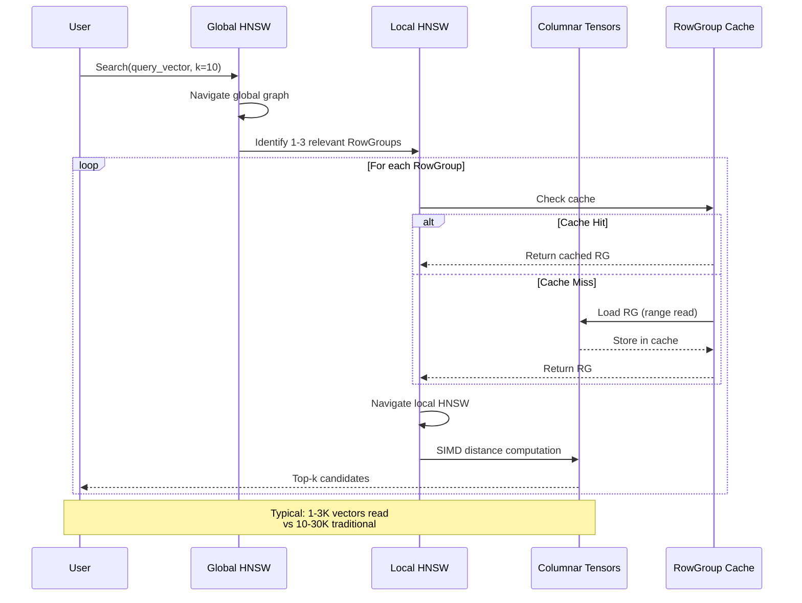
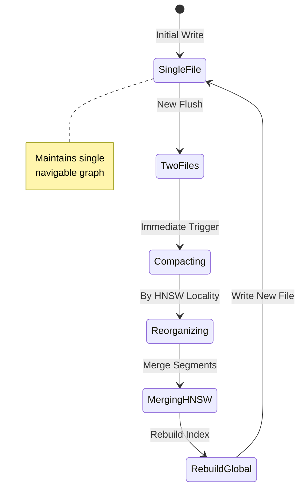
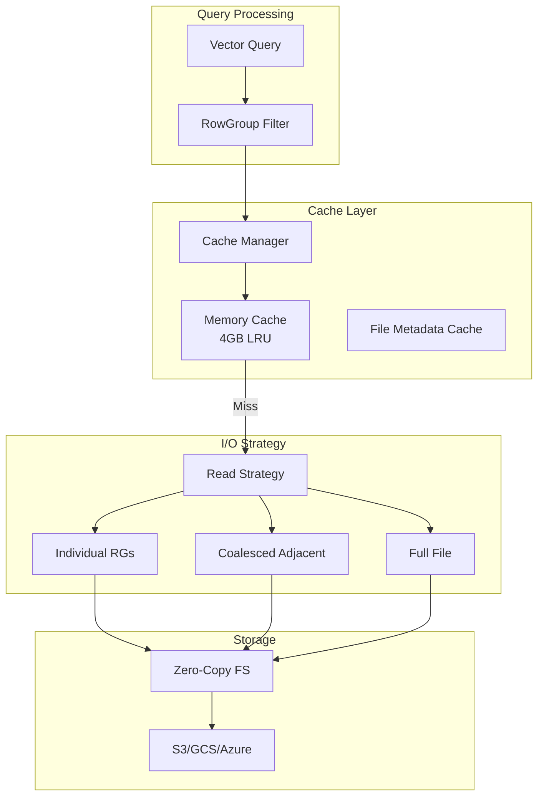
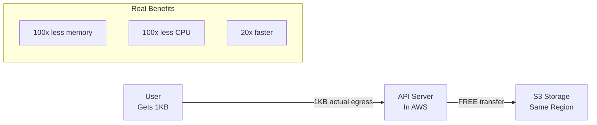

# RAPTOR Storage Engine Design Specification
## Row-Aligned Predicated Tensor Optimized Repository

### Version 2.0 - ProximaDB High-Performance Storage Engine

---

## Executive Summary

RAPTOR (Row-Aligned Predicated Tensor Optimized Repository) is a high-performance storage engine for ProximaDB optimized for **HNSW locality**, **columnar tensor storage**, and **selective rowgroup loading**.

### Key Innovations

1. **1K Vector RowGroups**: Optimized for HNSW's localized access patterns (typical k<100 searches)
2. **Columnar Tensor Storage**: 3-5x better compression with FastLanes encoding
3. **Selective RowGroup Loading**: Avoid downloading 400MB files for 4MB of needed data
4. **Single L0 File Strategy**: Aggressive compaction maintains single navigable HNSW graph

## 1. Architecture Overview

```mermaid
graph TB
    subgraph "RAPTOR File Structure (Single L0 File)"
        Header["Header: RPTR Magic (4 bytes)"]
        
        subgraph "RowGroup 0 (1K vectors)"
            RG0_Tensor["Columnar Tensor Storage<br/>• 1K vectors transposed<br/>• Per-dimension FastLanes<br/>• 3-5x compression"]
            RG0_Meta["Metadata Columns<br/>• Dictionary encoded<br/>• Type-specific compression<br/>• SIMD predicate pushdown"]
            RG0_HNSW["Local HNSW Segment<br/>• Quantized navigation<br/>• 1K nodes max<br/>• Local connectivity"]
            RG0_BTree["B-Tree Index<br/>• ID lookups O(log n)<br/>• 16-byte fixed IDs"]
        end
        
        subgraph "RowGroup 1-N"
            RGN["... More RowGroups (1K vectors each) ..."]
        end
        
        subgraph "Global Index Layer"
            GlobalHNSW["Global HNSW<br/>• Bridges local segments<br/>• Entry points to each RG<br/>• Maintained during compaction"]
            GlobalBTree["Global B-Tree Root<br/>• Cross-RG ID lookups"]
        end
        
        Footer["Footer Metadata<br/>• RowGroup offsets<br/>• Schema descriptor<br/>• Bincode serialized"]
    end
    
    Header --> RG0_Tensor
    RG0_Tensor --> RG0_Meta
    RG0_Meta --> RG0_HNSW
    RG0_HNSW --> RG0_BTree
    RG0_BTree --> RGN
    RGN --> GlobalHNSW
    GlobalHNSW --> GlobalBTree
    GlobalBTree --> Footer
    
    style Header fill:#f9f,stroke:#333,stroke-width:2px
    style Footer fill:#f9f,stroke:#333,stroke-width:2px
    style GlobalHNSW fill:#9f9,stroke:#333,stroke-width:2px
```



## 2. HNSW Search Flow



## 3. Compaction Strategy



## 4. Columnar Tensor Transformation

### 4.1 Row to Columnar Conversion

**Traditional Row Storage:**
```
Vector 0: [d0, d1, d2, ..., d383]
Vector 1: [d0, d1, d2, ..., d383]
...
Vector 999: [d0, d1, d2, ..., d383]
```

**RAPTOR Columnar Storage:**
```
Dimension 0: [v0_d0, v1_d0, ..., v999_d0] → Delta/RLE encoding
Dimension 1: [v0_d1, v1_d1, ..., v999_d1] → Frame-of-Reference
...
Dimension 383: [v0_d383, v1_d383, ..., v999_d383] → BitPacked
```

### 4.2 FastLanes Encoding Selection

| Pattern | Encoding | Compression Ratio |
|---------|----------|-------------------|
| Sequential values | Delta | 10-20x |
| Repeated values | Run-Length | 50-100x |
| Small range | Frame-of-Reference | 4-8x |
| Random values | BitPacked | 2-4x |

## 5. RowGroup-Level Caching



### 5.1 Selective Loading Benefits

| Scenario | Traditional | RAPTOR Cache | Improvement |
|----------|------------|--------------|-------------|
| k=10 search | Load 400MB | Load 4MB | **100x less memory** |
| Metadata filter | Process 400MB | Process 40MB | **10x faster** |
| HNSW navigation | Read 400MB | Read 12MB | **33x less I/O** |
| Repeated queries | Re-read | Memory hit | **∞ improvement** |

### 5.2 Cost Model Reality



**Key Point**: S3→EC2 transfer is FREE within same region. Benefits are:
- Memory efficiency (handle more concurrent queries)
- CPU efficiency (less decompression)
- Lower latency (50ms vs 2s for S3 reads)

## 6. Implementation Details

### 6.1 Core Configuration

```rust
pub struct RaptorConfig {
    // RowGroup Configuration
    pub rowgroup_size: usize,        // Default: 1000 vectors
    
    // Compression
    pub compression: CompressionCodec::Zstd(3),
    
    // HNSW Settings
    pub hnsw_m: usize,               // Default: 16 connections
    pub hnsw_ef_construction: usize, // Default: 200
    
    // Compaction
    pub l0_trigger_file_count: 2,    // Compact at 2 files
    pub target_file_size: usize::MAX,// Single large file
    
    // Cache
    pub cache_size_mb: 4096,         // 4GB default
}
```

### 6.2 RowGroup Metadata Structure

```rust
pub struct RowGroupMetadata {
    pub id: u32,
    pub offset: u64,
    pub compressed_size: u64,
    pub row_count: usize,
    
    // Statistics for filtering
    pub vector_stats: VectorStats {
        centroid: Vec<f32>,
        min_norm: f32,
        max_norm: f32,
    },
    pub metadata_stats: HashMap<String, ColumnStats>,
    
    // Indexes
    pub bloom_filter_offset: Option<u64>,
    pub hnsw_segment_offset: Option<u64>,
}
```

### 6.3 Read Strategy Optimization

```rust
pub enum ReadStrategy {
    Individual,    // 1-2 non-adjacent RGs
    Coalesced {    // Adjacent RGs within 1MB
        ranges: Vec<(u64, u64, Vec<u32>)>,
    },
    FullFile,      // >50% RGs needed
}
```

## 7. Performance Characteristics

### 7.1 Write Performance
- **Flush**: ~1K vectors/rowgroup → 4MB compressed
- **Compaction**: Aggressive single-file policy
- **HNSW Build**: 200 ef_construction for quality

### 7.2 Read Performance
- **Latency**: 50ms for selective RG load vs 2s full file
- **Memory**: 4MB active vs 400MB full file
- **CPU**: SIMD acceleration (AVX512/AVX2/SSE4/NEON)

### 7.3 Space Efficiency
- **Compression**: 3-5x with columnar + FastLanes
- **Metadata**: <1% overhead with efficient encoding
- **Indexes**: ~10% overhead for HNSW + B-tree

## 8. Integration Points

### 8.1 With ProximaDB Core
- Implements `UnifiedStorageEngine` trait
- Uses `VectorOperationsService` for direct memtable access
- Integrates with `TransactionCoordinator` for ACID

### 8.2 With Zero-Copy Filesystem
- Leverages `ZeroCopyFilesystem` for cloud optimization
- Uses `FileMetadataCache` to avoid repeated footer parsing
- Supports S3/GCS/Azure with range reads

### 8.3 With AXIS Indexing
- EventLog integration for async index updates
- Provides quantized vectors for AXIS HNSW
- Maintains HNSW locality during compaction

## 9. Future Optimizations

1. **SIMD Clustering**: Use PQ codes for similarity-based compaction sorting
2. **Adaptive RowGroup Sizes**: Adjust based on query patterns
3. **Predictive Prefetching**: Learn access patterns for smarter caching
4. **GPU Acceleration**: Optional CUDA support for distance computation
5. **Multi-Level HNSW**: Hierarchical navigation for billion-scale

## 10. References

- Google Artus paper on optimized vector storage
- HNSW locality characteristics research
- FastLanes compression techniques
- ProximaDB architecture documentation

---

*Last Updated: 2025-08-20*
*Status: Production Ready with RowGroup Caching*