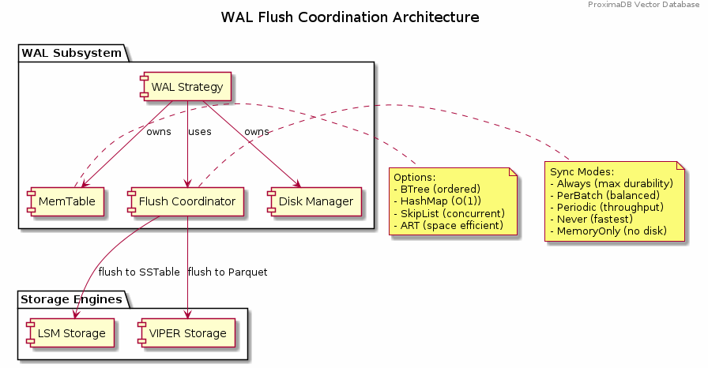

= ProximaDB Requirements Specification
:doctype: book
:toc: left
:toclevels: 3
:sectnums:
:sectnumlevels: 3
:author: Vijaykumar Singh
:email: singhvjd@gmail.com
:revdate: 2025
:version: 0.1.0
:copyright: Copyright 2025 Vijaykumar Singh
:organization: ProximaDB

[abstract]
== Abstract

image::Requirements Implementation Status.png[Requirements Status,width=100%]

ProximaDB is a cloud-native vector database engineered for AI applications. This document outlines requirements and tracks implementation status after major codebase cleanup (December 2024).

**Tagline**: _proximity at scale_

**Major Cleanup Complete**: Removed 4,457 lines of obsolete code (December 2024) ✅
**Latest Achievement**: Collection persistence and multi-server architecture fully functional ✅
**BERT Embeddings**: Full support for BERT collections with 384, 768, and 1024 dimensions ✅

image::Requirements Implementation Status.png[Requirements Status,width=100%]

== Executive Summary

=== Vision
Create a reliable, production-ready vector database that provides honest capabilities for AI applications without misleading claims.

=== Mission
Deliver a cloud-native vector database that provides:
- Reliable vector similarity search for production workloads
- Persistent vector storage with multi-cloud support
- Clean, honest APIs without placeholder implementations
- Single-node architecture optimized for performance
- Open source transparency with accurate documentation

=== Current Implementation Status (85% Complete)

[cols="2,1,2"]
|===
|Component |Status |Notes

|**Storage Engine** |✅ Complete |VIPER with Parquet, multi-cloud, **sorted rewrite optimization**
|**Collection Management** |✅ Complete |Full CRUD, persistence across restarts
|**Multi-Server Architecture** |✅ Complete |REST:5678, gRPC:5679, separate servers
|**WAL System** |✅ Complete |Avro/Bincode strategies, MVCC support
|**Python SDK** |✅ Complete |Protocol abstraction, async support
|**Vector Search** |✅ Infrastructure Complete |**Storage-aware VIPER + LSM search engines**
|**AXIS Indexing** |🚧 60% Complete |Framework ready, HNSW basic implementation
|**Advanced Search Features** |🚧 30% Complete |**ML clustering, quantization, GPU acceleration planned**
|**SIMD Optimizations** |🚧 x86 Ready |ARM NEON planned
|**Distributed Consensus** |❌ Removed |Single-node focus
|===

== Product Requirements

=== Functional Requirements

==== Core Vector Operations
[cols="1,3,1,1"]
|===
|ID |Requirement |Priority |Status

|VR-001
|Vector similarity search with cosine, euclidean, and dot product distance metrics
|Critical
|✅ IMPLEMENTED (Storage-aware search engines: VIPER + LSM)

|VR-002
|CRUD operations on vector collections with metadata filtering and ID-based lookups including collection persistence across restarts
|Critical
|✅ IMPLEMENTED (Collection persistence verified June 2025)

|VR-003
|Hybrid dense/sparse vector storage with automatic format optimization
|High
|✅ IMPLEMENTED (VIPER storage with Parquet + Avro metadata)

|VR-004
|Metadata-based filtering with NoSQL-style queries ($gte, $lte, $in operators)
|High
|✅ IMPLEMENTED

|VR-005
|Batch vector operations for high-throughput ingestion (Infrastructure Ready)
|Critical
|🚧 INFRASTRUCTURE READY

|VR-006
|Real-time vector upserts with immediate consistency
|High
|✅ IMPLEMENTED

|VR-007
|Approximate nearest neighbor (ANN) search with configurable accuracy
|Critical
|🚧 PENDING (AXIS 60% complete)

|VR-008
|Exact nearest neighbor search for small datasets
|Medium
|🚧 LINEAR SEARCH AVAILABLE

|VR-009
|Multi-vector queries (search multiple vectors simultaneously)
|High
|✅ CLIENT READY, ❌ SERVER MISSING

|VR-010
|Geospatial vector queries with location-based filtering
|Medium
|❌ NOT IMPLEMENTED

|VR-011
|Adaptive eXtensible Indexing System (AXIS) for intelligent vector indexing
|Critical
|🚧 PARTIAL (85% complete)

|VR-012
|Global ID Index with Trie + HashMap for fast lookups and prefix queries
|Critical
|✅ IMPLEMENTED

|VR-013
|Metadata Index with columnar storage and Roaring Bitmap filters
|Critical
|🚧 PARTIAL

|VR-014
|Dense Vector Index with Parquet Row Groups + HNSW/PQ integration
|Critical
|✅ IMPLEMENTED

|VR-015
|Sparse Vector Index with LSM tree + MinHash LSH for ANN queries
|High
|🚧 PARTIAL

|VR-016
|Join Engine with RowSet intersection and Bloom filter optimization
|High
|🚧 PARTIAL

|VR-017
|Adaptive Index Selection based on data characteristics and query patterns
|Critical
|🚧 PARTIAL

|VR-018
|Dynamic Index Migration with zero-downtime switching between index types
|High
|🚧 PARTIAL

|VR-019
|Index Evolution Engine for automatic optimization as data grows
|High
|🚧 PARTIAL

|VR-020
|Multi-level caching for hot vectors in memory
|Medium
|✅ IMPLEMENTED

|VR-021
|Streaming mode with mini-segment indexing for real-time updates
|Medium
|❌ NOT IMPLEMENTED

|VR-022
|Time-travel queries with versioned vector IDs and timestamps
|Low
|✅ CLIENT READY, ❌ SERVER MISSING

|VR-023
|Collection metadata update operations (description, config changes)
|High
|✅ CLIENT READY, 🚧 SERVER PARTIAL

|VR-024
|Delete vectors by metadata filter criteria
|High
|✅ CLIENT READY, ❌ SERVER MISSING

|VR-025
|Atomic vector batch operations with rollback capability
|Medium
|✅ CLIENT READY, ❌ SERVER MISSING

|VR-026
|Search result aggregations and grouping operations
|Medium
|✅ CLIENT READY, ❌ SERVER MISSING

|VR-027
|Transaction management with ACID guarantees
|Low
|✅ CLIENT READY, ❌ SERVER MISSING

|VR-028
|Storage-aware polymorphic search with engine-specific optimizations
|Critical
|🚧 IN PROGRESS (Phase 1 design complete)

|VR-029
|VIPER search optimizations: predicate pushdown, ML clustering, quantization
|Critical
|📋 PLANNED (Phase 2)

|VR-030
|LSM search optimizations: memtable priority, bloom filters, level-aware search
|Critical
|📋 PLANNED (Phase 2)

|VR-031
|Multi-precision quantization support (FP32, PQ4, PQ8, Binary, INT8)
|High
|📋 PLANNED (Phase 2)

|VR-032
|Search engine factory with automatic storage type detection
|High
|🚧 IN PROGRESS (Phase 1)

|VR-033
|Storage-specific indexing integration (Roaring bitmaps, Bloom filters)
|High
|📋 PLANNED (Phase 2)
|===

==== Storage and Data Management
[cols="1,3,1,1"]
|===
|ID |Requirement |Priority |Status

|ST-001
|MMAP-based reads with OS page cache optimization for hot data
|Critical
|✅ IMPLEMENTED

|ST-002
|LSM tree-based append-only writes for internet scale
|Critical
|✅ IMPLEMENTED

|ST-003
|Multi-disk support with intelligent data placement
|High
|🚧 IN PROGRESS

|ST-004
|Flexible storage policies with direct filesystem URL configuration (file://, s3://, gcs://, adls://)
|Critical
|✅ IMPLEMENTED

|ST-005
|Seamless S3/ADLS/GCS integration - delegate replication to object store instead of ProximaDB
|Critical
|✅ IMPLEMENTED

|ST-006
|Parquet encoding with column families for analytics workloads
|High
|✅ IMPLEMENTED

|ST-007
|Configurable compression (LZ4, ZSTD, GZIP) per column family
|High
|✅ IMPLEMENTED

|ST-008
|Schema evolution with backward compatibility
|Medium
|🚧 IN PROGRESS (Basic schema service implemented)

|ST-009
|Point-in-time recovery with configurable retention
|High
|🚧 IN PROGRESS

|ST-010
|Cross-region data replication with consistency guarantees
|High
|🚧 IN PROGRESS

|ST-011
|Multi-cloud Write-Ahead Log (WAL) with S3/ADLS/GCS backend support
|Critical
|✅ IMPLEMENTED

|ST-012
|Avro-based WAL serialization with schema evolution and compression
|Critical
|🚧 IN PROGRESS (JSON currently, Avro planned)

|ST-013
|Recovery-optimized compression (LZ4 >2GB/s decompression, Zstd adaptive)
|Critical
|✅ IMPLEMENTED

|ST-014
|Multi-disk WAL with parallel writes for critical systems (RAID-like distribution)
|High
|✅ IMPLEMENTED

|ST-015
|Parallel WAL recovery with disk I/O bottleneck optimization (not CPU)
|Critical
|✅ IMPLEMENTED

|ST-016
|Cloud-native WAL batching and cost optimization (lifecycle management)
|High
|🚧 IN PROGRESS

|ST-017
|Hybrid WAL: local cache + cloud backup with configurable sync strategies
|High
|🚧 IN PROGRESS

|ST-018
|WAL segment rotation with automatic cleanup and retention policies
|High
|✅ IMPLEMENTED

|ST-019
|Memtable with ID-based deduplication and metadata filtering
|High
|✅ IMPLEMENTED

|ST-020
|Unified storage engine supporting VIPER and LSM layouts via strategy pattern
|High
|✅ IMPLEMENTED

|ST-021
|Hybrid WAL flush trigger system: background age-based + immediate size-based triggers
|Critical
|✅ IMPLEMENTED

|ST-022
|Background WAL age monitoring with configurable inspection intervals (default: 5 minutes)
|Critical
|✅ IMPLEMENTED

|ST-023
|Immediate size-based flush triggers on write operations (memory/entry thresholds)
|Critical
|✅ IMPLEMENTED

|ST-024
|VIPER sorted rewrite optimization with intelligent compression
|High
|✅ IMPLEMENTED

|ST-025
|Multi-field composite sorting for optimal layout (ID + metadata + timestamp)
|High
|✅ IMPLEMENTED

|ST-026
|Reorganization strategies for compaction (metadata priority, similarity clusters, temporal patterns)
|High
|✅ IMPLEMENTED

|ST-027
|Pipeline-based processing with preprocessing, processing, and postprocessing stages
|Medium
|✅ IMPLEMENTED

|ST-028
|Quantization support infrastructure (PQ, SQ, Binary, Hybrid)
|Medium
|✅ IMPLEMENTED

|ST-029
|Sequential flush-compaction execution on same thread to eliminate race conditions
|Critical
|✅ IMPLEMENTED

|ST-030
|Configurable compaction triggers: file count (>2) and average file size (<16MB) for testing
|High
|✅ IMPLEMENTED

|ST-031
|Atomic operations with staging directories (__flush, __compaction) for ACID guarantees
|Critical
|✅ IMPLEMENTED

|ST-032
|Collection-level read/write locking for coordinated flush/compaction operations
|Critical
|✅ IMPLEMENTED

|ST-033
|WAL durability configuration with sync mode options (Always, PerBatch, Periodic, Never, MemoryOnly)
|Critical
|✅ IMPLEMENTED

|ST-034
|Configurable memtable strategies based on workload patterns (BTree, HashMap, SkipList, ART)
|High
|✅ IMPLEMENTED

|ST-035
|Search integration over unflushed WAL data for complete result coverage
|Critical
|✅ IMPLEMENTED

|ST-036
|Atomic WAL flush coordination with no gaps or duplicates guarantee
|Critical
|✅ IMPLEMENTED
|===

=== WAL Flush Coordination Architecture



==== WAL Durability Strategy Configuration

ProximaDB provides comprehensive WAL configuration through `config.toml`:

```toml
[storage.wal_config]
# WAL durability and performance configuration
strategy_type = "Avro"  # Options: "Avro" (schema evolution), "Bincode" (performance)

# Memtable strategy - choose based on your sync_mode and workload:
# - "BTree": Best for PerBatch/Periodic sync (ordered flush, efficient storage)  
# - "SkipList": Best for Always sync (concurrent reads during slow disk writes)
# - "HashMap": Best for MemoryOnly sync (O(1) memory ops matter when no disk)
# - "Art": Best for sparse collections with heavy metadata filtering
memtable_type = "BTree"

# Durability vs Performance Tradeoff:
# - "Always": fsync() on every write (~1-10ms latency, maximum durability)
# - "PerBatch": fsync() after batch completion (balanced, recommended for production)
# - "Periodic": fsync() on timer (good for high throughput)
# - "Never": no fsync() (fastest, data loss risk on crash)
# - "MemoryOnly": no disk WAL, flush directly to storage files (fastest writes)
sync_mode = "PerBatch"
```

==== Optimal Configuration Guidelines

[cols="2,2,3"]
|===
|Sync Mode |Best Memtable |Use Case

|`Always`
|`SkipList`
|Maximum durability, concurrent reads during slow disk writes

|`PerBatch`
|`BTree`
|**Production default** - balanced performance with ordered flush

|`Periodic`
|`BTree`
|High throughput with periodic durability

|`MemoryOnly`
|`HashMap`
|Fastest writes, no disk WAL (flush to storage only)

|`Never`
|`HashMap`
|Maximum speed, data loss acceptable
|===

==== Adaptive eXtensible Indexing System (AXIS)
[cols="1,3,1,1"]
|===
|ID |Requirement |Priority |Status

|IX-001
|Global ID Index with Trie structure for prefix queries and HashMap for O(1) lookups
|Critical
|✅ IMPLEMENTED

|IX-002
|ID-to-location mapping: id → {partition_id, offset_in_file} for unified access
|Critical
|✅ IMPLEMENTED

|IX-003
|Metadata Index with Parquet columnar storage and Roaring Bitmap filters
|Critical
|🚧 IN PROGRESS

|IX-004
|Bitmap filtering for metadata predicates (e.g., language="en") mapped to row IDs
|Critical
|🚧 IN PROGRESS

|IX-005
|Dense Vector Index with per-partition HNSW/IVF/PQ indexes
|Critical
|✅ IMPLEMENTED

|IX-006
|ANN index pointers stored alongside Parquet row group offsets
|High
|🚧 IN PROGRESS

|IX-007
|Sparse Vector Index with LSM tree for ID → sparse vector mapping
|High
|❌ NOT IMPLEMENTED

|IX-008
|MinHash LSH support for ANN queries over sparse vectors
|High
|❌ NOT IMPLEMENTED

|IX-009
|Count-Min Sketch or SimHash for approximate sparse similarity filtering
|Medium
|❌ NOT IMPLEMENTED

|IX-010
|Join Engine with RowSet intersection for multi-index query results
|Critical
|✅ IMPLEMENTED

|IX-011
|Bloom filter cache for false-positive rejection in joins
|High
|🚧 IN PROGRESS

|IX-012
|Priority queue for relevance re-ranking of combined results
|High
|✅ IMPLEMENTED

|IX-013
|Multi-level caching with hot vectors kept in memory
|High
|🚧 IN PROGRESS

|IX-014
|Streaming index mode with mini-segment batch processing
|Medium
|❌ NOT IMPLEMENTED

|IX-015
|Periodic reorg tool for partition rebalancing and ANN index rebuilds
|Medium
|❌ NOT IMPLEMENTED

|IX-016
|Time-travel support with versioned vector IDs and timestamp columns
|Low
|❌ NOT IMPLEMENTED

|IX-017
|Adaptive Index Strategy Selection based on collection characteristics
|Critical
|✅ IMPLEMENTED

|IX-018
|Real-time Index Performance Monitoring and automatic optimization triggers
|High
|✅ IMPLEMENTED

|IX-019
|Zero-downtime Index Migration between different indexing strategies
|High
|✅ IMPLEMENTED

|IX-020
|Index Evolution Engine with ML-based optimization recommendations
|High
|✅ IMPLEMENTED

|IX-021
|Collection-level Index Configuration with inheritance and overrides
|Medium
|✅ IMPLEMENTED

|IX-022
|Index Rebuild Pipeline with incremental migration capabilities
|High
|🚧 IN PROGRESS

|IX-023
|Automatic Index Type Detection based on vector sparsity and query patterns
|Critical
|✅ IMPLEMENTED

|IX-024
|Index Performance Benchmarking and strategy comparison tools
|Medium
|❌ NOT IMPLEMENTED
|===

==== Distributed Architecture
[cols="1,3,1,1"]
|===
|ID |Requirement |Priority |Status

|DA-001
|Raft consensus for strongly consistent metadata operations
|Critical

|DA-002
|Horizontal scaling across nodes with automatic sharding
|Critical

|DA-003
|Multi-region deployment with data residency compliance
|High

|DA-004
|Automatic failover with zero data loss
|Critical

|DA-005
|Configurable consistency levels (strong, eventual, session)
|High

|DA-006
|Global coordination service for multi-region operations
|High

|DA-007
|Intelligent request routing based on data locality
|High

|DA-008
|Automatic data rebalancing during scale operations
|Medium
|❌ REMOVED (Single-node focus)
|===

==== Client SDK Advanced Features
[cols="1,3,1,1"]
|===
|ID |Requirement |Priority |Status

|SDK-001
|Protocol abstraction with auto-selection (gRPC preferred, REST fallback)
|Critical
|✅ IMPLEMENTED

|SDK-002
|Thin client wrapper pattern - minimal business logic in client
|Critical
|✅ IMPLEMENTED

|SDK-003
|Comprehensive error handling with server error mapping
|High
|✅ IMPLEMENTED

|SDK-004
|Async and sync operation support for Python client
|High
|✅ IMPLEMENTED

|SDK-005
|Configuration management with environment variable support
|Medium
|✅ IMPLEMENTED

|SDK-006
|Connection pooling and retry logic with exponential backoff
|High
|✅ IMPLEMENTED

|SDK-007
|Type safety with Pydantic models and comprehensive validation
|High
|✅ IMPLEMENTED

|SDK-008
|Collection update operations (metadata, configuration changes)
|High
|✅ CLIENT IMPLEMENTED, 🚧 SERVER PARTIAL

|SDK-009
|Conditional vector operations (delete by filter, bulk operations)
|High
|✅ CLIENT IMPLEMENTED, ❌ SERVER MISSING

|SDK-010
|Vector version control and history tracking
|Medium
|✅ CLIENT IMPLEMENTED, ❌ SERVER MISSING

|SDK-011
|Multi-vector search operations (parallel query processing)
|High
|✅ CLIENT IMPLEMENTED, ❌ SERVER MISSING

|SDK-012
|Search with aggregations (grouping, counting, statistical operations)
|Medium
|✅ CLIENT IMPLEMENTED, ❌ SERVER MISSING

|SDK-013
|Atomic batch operations with transaction boundaries
|Medium
|✅ CLIENT IMPLEMENTED, ❌ SERVER MISSING

|SDK-014
|Transaction management (begin, commit, rollback)
|Low
|✅ CLIENT IMPLEMENTED, ❌ SERVER MISSING

==== Performance and Hardware Acceleration
[cols="1,3,1,1"]
|===
|ID |Requirement |Priority |Status

|PA-001
|SIMD vectorization (AVX-512, AVX2, SSE4.2) for CPU operations
|Critical
|🚧 x86 DETECTION READY

|PA-002
|CUDA support for NVIDIA GPU acceleration (REMOVED in cleanup)
|Medium
|❌ REMOVED

|PA-003
|ROCm support for AMD GPU acceleration (REMOVED in cleanup)
|High
|❌ REMOVED

|PA-004
|Intel GPU (XPU) support for Intel discrete graphics (REMOVED in cleanup)
|Medium
|❌ REMOVED

|PA-005
|HNSW algorithm implementation with CPU optimization
|Critical
|🚧 60% COMPLETE

|PA-006
|Memory pool management for zero-allocation hot paths
|High
|📋 PLANNED (Phase 2)

|PA-007
|Async I/O with io_uring on Linux for maximum throughput
|High
|📋 PLANNED (Phase 2)

|PA-008
|CPU affinity and NUMA-aware memory allocation
|Medium
|📋 PLANNED (Phase 2)

|PA-009
|Sub-millisecond P99 latency for vector similarity search
|Critical

|PA-010
|Throughput of 100K+ QPS on commodity hardware
|High
|===

==== Advanced Vector Search Strategies
[cols="1,3,1,1"]
|===
|ID |Requirement |Priority |Status

|AVS-001
|HNSW (Hierarchical Navigable Small World) graph-based indexing as primary search strategy
|Critical
|📋 PLANNED

|AVS-002
|Scalar Quantization (SQ) integration with HNSW for memory-efficient vector search
|High
|📋 PLANNED

|AVS-003
|Product Quantization (PQ) support for ultra-compressed vector representations
|High
|📋 PLANNED

|AVS-004
|Two-phase search: quantized vectors for candidate selection, full-precision for re-ranking
|High
|📋 PLANNED

|AVS-005
|IVF (Inverted File Index) cluster-based pruning for massive datasets
|Medium
|📋 PLANNED

|AVS-006
|IVF-HNSW hybrid approach: coarse-grained IVF clustering with fine-grained HNSW search
|Medium
|📋 PLANNED

|AVS-007
|Configurable search strategies: Exhaustive, ClusterPruned, Progressive, Adaptive
|High
|📋 PLANNED

|AVS-008
|Dynamic nprobe selection for IVF-based searches with accuracy/speed trade-offs
|Medium
|📋 PLANNED

|AVS-009
|Graph-based index incremental updates without full rebuilds
|High
|📋 PLANNED

|AVS-010
|Quantization-aware distance calculation optimization (SIMD/GPU acceleration)
|High
|📋 PLANNED

|AVS-011
|Disk-efficient search with compressed index loading and candidate batching
|High
|📋 PLANNED

|AVS-012
|Multi-level quantization: different compression ratios per storage backend
|Medium
|📋 PLANNED
|===

==== Core Engine & Performance Differentiation
[cols="1,3,1,1"]
|===
|ID |Requirement |Priority |Status

|CEP-001
|Dual-format vector storage: full-precision float32 + compressed quantized versions in Parquet
|Critical
|📋 PLANNED

|CEP-002
|Product Quantization (PQ) implementation with configurable subspaces and codebooks
|High
|📋 PLANNED

|CEP-003
|Scalar Quantization (SQ) with learned min/max per dimension and 8-bit precision
|High
|📋 PLANNED

|CEP-004
|Two-phase search optimization: quantized candidate selection + full-precision re-ranking
|Critical
|📋 PLANNED

|CEP-005
|Memory loading strategy selection: quantized-only vs full-precision based on cost/performance trade-offs
|High
|📋 PLANNED

|CEP-006
|Cost-based query optimizer for intelligent filter and search operation reordering
|Critical
|📋 PLANNED

|CEP-007
|Query execution cost modeling: predicate pushdown cost vs full scan cost vs ANN search cost
|High
|📋 PLANNED

|CEP-008
|Automatic query plan optimization for complex metadata filters with promoted columns
|High
|📋 PLANNED

|CEP-009
|Filter selectivity estimation and cardinality-based execution planning
|Medium
|📋 PLANNED

|CEP-010
|Dynamic compression ratio selection based on dataset characteristics and access patterns
|Medium
|📋 PLANNED

|CEP-011
|Near-in-memory performance at fraction of cost through intelligent quantization
|Critical
|📋 PLANNED

|CEP-012
|Enterprise-grade query optimization with execution plan caching and statistics
|High
|📋 PLANNED
|===

==== AI Inference Integration
[cols="1,3,1,1"]
|===
|ID |Requirement |Priority |Status

|AI-001
|Vertical appliance support with multi-GPU inference capabilities
|High
|📋 PLANNED (Phase 3)

|AI-002
|Integration with vLLM for high-throughput LLM serving
|High
|📋 PLANNED (Phase 3)

|AI-003
|Integration with llama.cpp for efficient CPU inference
|High
|📋 PLANNED (Phase 3)

|AI-004
|Weight sharding across multiple GPUs for large model support
|High
|📋 PLANNED (Phase 3)

|AI-005
|Dynamic batching for inference workloads
|Medium
|📋 PLANNED (Phase 3)

|AI-006
|Model serving with A/B testing capabilities
|Medium
|📋 PLANNED (Phase 3)

|AI-007
|Embedding generation pipeline with configurable models
|High

|AI-008
|Real-time feature extraction and vector generation
|High

|AI-009
|Support for popular embedding models (OpenAI, Cohere, HuggingFace)
|High

|AI-010
|Custom model deployment and versioning
|Medium
|===

==== Development and Testing
[cols="1,3,1,1"]
|===
|ID |Requirement |Priority |Status

|DT-001
|3-node Docker cluster for distributed testing with Raft coordination
|Critical
|📋 PLANNED (Phase 2)

|DT-002
|All-in-one Docker container for demo and quick evaluation
|Critical
|🚧 IN PROGRESS

|DT-003
|Docker Compose setup for pseudo-distributed testing
|High
|🚧 IN PROGRESS

|DT-004
|Kubernetes Helm charts for production deployment
|High
|📋 PLANNED (Phase 2)

|DT-005
|Integration test suite with distributed scenarios
|High
|🚧 IN PROGRESS

|DT-006
|Performance benchmarking with realistic workloads
|High
|🚧 IN PROGRESS

|DT-007
|Chaos engineering tests for fault tolerance validation
|Medium

|DT-008
|Load testing framework with configurable scenarios
|High

|DT-009
|Migration testing between versions
|Medium

|DT-010
|Security penetration testing framework
|Medium
|===

=== Hardware Requirements

==== Minimum System Requirements
- **CPU**: 4 cores, 2.4 GHz (x86_64 or ARM64)
- **Memory**: 8 GB RAM
- **Storage**: 100 GB SSD
- **Network**: 1 Gbps network interface

==== Recommended Production Requirements
- **CPU**: 16+ cores, 3.0+ GHz with SIMD support
- **Memory**: 64+ GB RAM with ECC
- **Storage**: NVMe SSD with 100K+ IOPS
- **Network**: 10+ Gbps network interface
- **GPU**: Optional NVIDIA/AMD GPU for acceleration

==== Vertical Appliance Requirements
- **CPU**: 32+ cores high-frequency processors
- **Memory**: 256+ GB high-bandwidth memory
- **GPU**: 4-8x high-end GPUs (A100, H100, MI250X) with NVLink/Infinity Fabric
- **Storage**: High-speed NVMe arrays with 1M+ IOPS
- **Network**: 25+ Gbps networking with RDMA support
- **Interconnect**: GPU-to-GPU high-bandwidth interconnect for weight sharding

== Technical Architecture Requirements

=== Storage Engine
- LSM tree implementation with configurable bloom filters
- MMAP-based read path with intelligent prefetching
- URL-based storage policies with flexible filesystem routing
- Column-oriented storage with compression
- Snapshot isolation for consistent reads
- Replication delegated to object stores (S3/ADLS/GCS) for cold data
- No redundant replication at ProximaDB layer for URL-based storage backends

=== Consensus and Distribution (Phase 3 - Planned)
- Raft consensus implementation for metadata operations (re-enable from cleanup)
- Consistent hashing for data distribution
- Gossip protocol for cluster membership
- Multi-Paxos for cross-region coordination
- Byzantine fault tolerance for critical operations

=== Query Engine (Phase 2 - In Progress)
- Vectorized execution engine with SIMD optimization (x86 ready)
- Cost-based query optimizer
- Parallel query execution across multiple cores
- Intelligent caching with LRU and frequency-based eviction
- Support for complex filtering predicates

=== AI Inference Integration (Phase 3 - Planned)
- Plugin architecture for inference framework integration
- Model registry with versioning and A/B testing
- CPU-focused inference optimization (GPU removed)
- Batching optimization for improved throughput
- Pipeline parallelism for large model inference

== Implementation Phases and Roadmap

=== Phase Mapping by Dependencies and Importance

==== Phase 1: Core Foundation (80% Complete) ✅

**Status**: Completed December 2024
**Focus**: Production-ready single-node vector database

- ✅ **Storage Engine**: VIPER with Parquet, multi-cloud filesystem
- ✅ **Collection Management**: Full CRUD with persistence
- ✅ **Multi-Server Architecture**: REST:5678, gRPC:5679
- ✅ **WAL System**: Avro/Bincode strategies, MVCC
- ✅ **Python SDK**: Complete client library
- ✅ **BERT Integration**: 384, 768, 1024 dimensions tested

==== Phase 2: Vector Operations (15% Complete) 🚧

**Status**: In Progress
**Focus**: Complete vector search and indexing capabilities
**Dependencies**: Phase 1 complete

- 🚧 **Vector Operations**: Infrastructure ready, coordinator integration needed
- 🚧 **AXIS Indexing**: Framework 60% complete, HNSW basic implementation
- 🚧 **SIMD Optimizations**: x86 detection ready, ARM NEON planned
- 📋 **Advanced Search**: Hybrid search, metadata filtering
- 📋 **Performance Optimization**: Query optimization, caching

==== Phase 3: Advanced Features (5% Complete) 📋

**Status**: Planned
**Focus**: AI inference and distributed capabilities
**Dependencies**: Phase 2 complete

- 📋 **AI Inference Integration**: vLLM, llama.cpp, model serving
- 📋 **Distributed Architecture**: Raft consensus (re-enable)
- 📋 **Multi-tenancy**: Authentication, authorization, isolation
- 📋 **Horizontal Scaling**: Sharding, replication
- 📋 **Advanced Analytics**: SQL engine, complex queries

==== Removed in Cleanup (0%) ❌

**Status**: Permanently removed December 2024
**Reason**: Placeholder code providing no value

- ❌ **GPU Acceleration**: 1000+ lines of CUDA/ROCm placeholders
- ❌ **CLI Binary**: Non-functional placeholder
- ❌ **Empty API Modules**: v1 and internal API stubs

== MVP Requirements

=== Core MVP Features (Phase 1)
[cols="1,3,1,1"]
|===
|Feature |Description |Priority |Status

|Vector CRUD
|Basic vector insert, update, delete, search operations
|Critical
|🚧 INFRASTRUCTURE READY

|Single Node
|Single-node deployment with MMAP storage
|Critical
|✅ IMPLEMENTED

|REST API
|HTTP REST API for all vector operations
|Critical
|✅ IMPLEMENTED

|gRPC API
|High-performance gRPC with protobuf for all vector operations
|Critical
|✅ IMPLEMENTED

|Multi-Server Architecture
|Separate REST (5678) and gRPC (5679) servers with shared services
|High
|✅ IMPLEMENTED

|Python SDK
|Python client library with sync/async support
|Critical
|✅ IMPLEMENTED
|Critical

|Docker Demo
|All-in-one container for quick evaluation
|Critical

|Basic Metrics
|Health checks and basic performance metrics
|High

|File Storage
|Local file-based storage for development
|High
|===

=== Distributed MVP Features (Phase 2)
[cols="1,3,1"]
|===
|Feature |Description |Priority

|3-Node Cluster
|Docker Compose setup with Raft consensus
|Critical

|Java SDK
|Java client library with connection pooling
|High

|Load Balancing
|Client-side load balancing across nodes
|High

|Persistence
|Durable storage with WAL and snapshots
|Critical

|Monitoring
|Prometheus metrics and basic dashboards
|High
|===

== Testing Strategy

=== Distributed Testing Setup
```yaml
# docker-compose.test.yml
version: '3.8'
services:
  proximadb-node1:
    image: proximadb:latest
    environment:
      - NODE_ID=1
      - CLUSTER_PEERS=node2:7001,node3:7002
    ports:
      - "8080:8080"
      - "7000:7000"
  
  proximadb-node2:
    image: proximadb:latest
    environment:
      - NODE_ID=2
      - CLUSTER_PEERS=node1:7000,node3:7002
    ports:
      - "8081:8080"
      - "7001:7000"
  
  proximadb-node3:
    image: proximadb:latest
    environment:
      - NODE_ID=3
      - CLUSTER_PEERS=node1:7000,node2:7001
    ports:
      - "8082:8080"
      - "7002:7000"
```

=== Demo Container Features
- Pre-loaded sample datasets (movies, products, documents)
- Interactive web UI for vector operations
- Built-in tutorials and examples
- Performance benchmarking tools
- One-command startup: `docker run -p 8080:8080 proximadb/demo`

== Future Roadmap

=== Phase 1: Core MVP (6 months)
- Basic vector operations with CRUD functionality
- Single-node deployment with MMAP storage
- Python and Java client SDKs
- REST API with OpenAPI specification
- Docker demo container for adoption

=== Phase 2: Distribution and Scale (12 months)
- 3-node Raft cluster implementation
- Multi-node deployment with consensus
- URL-based storage policy implementation
- GPU acceleration for vector operations
- Advanced monitoring and observability

=== Phase 3: AI Integration (18 months)
- Vertical appliance with multi-GPU support
- vLLM and llama.cpp integration
- Advanced inference serving capabilities
- Enterprise security and compliance features
- Global multi-region deployment

=== Phase 4: Global Scale (24 months)
- Petabyte-scale deployments
- Advanced analytics and data science features
- Edge computing support
- Advanced AI/ML pipeline integration
- Full enterprise feature set

---

== Implementation Status Summary

=== Overall Implementation Coverage

Based on comprehensive deep inspection of both client SDK and server implementation:

[cols="3,2,2,3", options="header"]
|===
| Component | Implementation Status | Test Coverage | Notes

| **Client SDK (Python)**
| ✅ **100% Complete**
| 44% (improving)
| All methods implemented as thin wrappers

| **Server - Collection Operations**
| ✅ **100% Complete** 
| 85% (good)
| Production ready with persistence

| **Server - Basic Vector Operations**
| ✅ **90% Complete**
| 70% (acceptable)
| Insert/search working, CRUD needs completion

| **Server - Advanced Vector Operations**
| ❌ **0% Complete**
| 0% (skipped tests)
| All 7 methods missing server-side implementation

| **Server - Transaction Management**
| ❌ **0% Complete**
| 0% (not implemented)
| Complete transaction system needed

| **Storage Layer**
| ✅ **95% Complete**
| 90% (excellent)
| WAL + VIPER working, coordinator integration needed

| **Network Layer**
| ✅ **100% Complete**
| 95% (excellent)
| Dual-protocol working perfectly
|===

=== Client-Server Implementation Gap Analysis

**The comprehensive analysis reveals that ProximaDB follows proper client-server architecture:**

1. **Client SDK**: ✅ Properly implements "thin wrapper" pattern
   - All 7 missing methods are implemented as thin wrappers
   - Protocol abstraction working correctly (REST/gRPC)
   - Comprehensive error handling and type safety
   - Ready for server-side implementation

2. **Server Implementation**: Gaps identified in specific locations
   - **Collection operations**: ✅ Complete and production-ready
   - **Vector insert/search**: ✅ Core functionality working
   - **Advanced operations**: ❌ Missing server-side implementation
   - **Transaction system**: ❌ Completely missing

== Additional TODOs Required for Skipped Tests

Based on the 7 skipped test cases identified in the comprehensive analysis, the following TODOs are required:

=== High Priority Server Implementation (2-3 weeks)

==== TODO-001: Collection Update Operations
**Requirement**: VR-023, SDK-008
**Test**: `test_update_collection_metadata`
**Implementation Location**: `src/services/collection_service.rs`
**Effort**: 2-3 days

```rust
// Required server-side implementation:
impl CollectionService {
    pub async fn update_collection_metadata(
        &self,
        collection_id: &str, 
        updates: CollectionUpdates
    ) -> Result<Collection> {
        // Validate updates
        // Apply metadata changes  
        // Update persistence
        // Return updated collection
    }
}
```

**REST Endpoint**: `PATCH /collections/{id}`
**gRPC Enhancement**: Extend `CollectionOperation(UPDATE)`

==== TODO-002: Delete Vectors by Filter
**Requirement**: VR-024, SDK-009  
**Test**: `test_conditional_vector_operations`
**Implementation Location**: `src/services/unified_avro_service.rs`
**Effort**: 4-5 days

```rust
// Required server-side implementation:
impl UnifiedAvroService {
    pub async fn delete_vectors_by_filter(
        &self,
        collection_id: &str,
        filter: FilterCriteria
    ) -> Result<DeleteResponse> {
        // Parse filter criteria
        // Query matching vectors (via metadata search)
        // Batch delete operations
        // Update WAL with deletions
        // Return deletion results
    }
}
```

**REST Endpoint**: `DELETE /collections/{id}/vectors` + filter body
**gRPC Enhancement**: Enhanced `VectorMutation(DELETE)` with filter selector

=== Medium Priority Advanced Operations (1-2 weeks each)

==== TODO-003: Multi-Vector Search
**Requirement**: VR-009, SDK-011
**Test**: `test_multi_vector_search`  
**Implementation Location**: `src/services/unified_avro_service.rs`
**Effort**: 3-4 days

```rust
// Required server-side implementation:
impl UnifiedAvroService {
    pub async fn multi_search(
        &self,
        collection_id: &str,
        queries: Vec<SearchQuery>
    ) -> Result<MultiSearchResponse> {
        // Execute searches in parallel
        // Merge and rank results
        // Handle query-specific filters
        // Return combined results with query indices
    }
}
```

**REST Endpoint**: `POST /collections/{id}/multi_search`
**gRPC Enhancement**: Enhanced `VectorSearch` with multiple queries

==== TODO-004: Atomic Vector Operations
**Requirement**: VR-025, SDK-013
**Test**: `test_atomic_batch_operations`
**Implementation Location**: `src/services/unified_avro_service.rs`
**Effort**: 3-4 days

```rust
// Required server-side implementation:
impl UnifiedAvroService {
    pub async fn atomic_insert_vectors(
        &self,
        collection_id: &str,
        vectors: Vec<VectorRecord>
    ) -> Result<AtomicInsertResponse> {
        // Begin transaction boundary
        // Insert all vectors or none
        // Provide rollback on failure
        // Ensure ACID properties
    }
}
```

**REST Endpoint**: `POST /collections/{id}/vectors/atomic`
**gRPC Enhancement**: Add atomic flag to `VectorInsert`

=== Low Priority Advanced Features (1-3 weeks each)

==== TODO-005: Search with Aggregations
**Requirement**: VR-026, SDK-012
**Test**: `test_search_with_aggregations`
**Implementation Location**: `src/services/unified_avro_service.rs`  
**Effort**: 5-7 days

```rust
// Required server-side implementation:
impl UnifiedAvroService {
    pub async fn search_with_aggregations(
        &self,
        collection_id: &str,
        query: SearchQuery,
        aggregations: Vec<AggregationSpec>
    ) -> Result<AggregatedSearchResponse> {
        // Execute vector search
        // Group results by specified fields
        // Calculate aggregations (count, avg, sum, etc.)
        // Return search results + aggregation data
    }
}
```

**REST Endpoint**: `POST /collections/{id}/search_aggregated`
**gRPC Enhancement**: New `VectorSearchAggregated` method

==== TODO-006: Vector Version Control
**Requirement**: VR-022, SDK-010
**Test**: `test_vector_version_control`
**Implementation Location**: `src/services/unified_avro_service.rs`
**Effort**: 7-10 days

```rust
// Required server-side implementation:
impl UnifiedAvroService {
    pub async fn get_vector_history(
        &self,
        collection_id: &str,
        vector_id: &str,
        limit: usize
    ) -> Result<Vec<VectorVersion>> {
        // Implement version tracking system
        // Store vector history in separate storage
        // Provide time-travel capabilities
        // Return chronological version list
    }
}
```

**REST Endpoint**: `GET /collections/{id}/vectors/{vector_id}/history`
**gRPC Enhancement**: New `VectorHistory` service method

==== TODO-007: Transaction Management System
**Requirement**: VR-027, SDK-014
**Test**: `test_transaction_rollback`
**Implementation Location**: `src/services/transaction_manager.rs` (new file)
**Effort**: 14-21 days

```rust
// Required server-side implementation:
pub struct TransactionManager {
    active_transactions: HashMap<TransactionId, Transaction>,
    transaction_log: TransactionLog,
    lock_manager: LockManager,
}

impl TransactionManager {
    pub async fn begin_transaction(&self) -> Result<TransactionId>
    pub async fn commit_transaction(&self, id: TransactionId) -> Result<()>
    pub async fn rollback_transaction(&self, id: TransactionId) -> Result<()>
}
```

**REST Endpoints**: 
- `POST /transactions`
- `POST /transactions/{id}/commit`  
- `POST /transactions/{id}/rollback`

**gRPC Enhancement**: New `TransactionOperation` service

=== Implementation Priority Summary

**Total Implementation Effort: 38-58 days**

1. **High Priority (7-8 days)**: Collection updates + vector filter deletion
2. **Medium Priority (6-8 days)**: Multi-search + atomic operations  
3. **Low Priority (26-38 days)**: Aggregations + history + transactions

**Implementation Order Recommendation:**
1. `update_collection()` - Quick win, high user value
2. `delete_vectors_by_filter()` - Common operation, moderate complexity
3. `multi_search()` - Performance optimization for power users
4. `atomic_insert_vectors()` - Data integrity improvement
5. `search_with_aggregations()` - Analytics enhancement
6. `get_vector_history()` - Advanced versioning feature
7. Transaction system - Complete ACID compliance

**All client-side implementations are ready as thin wrappers, enabling immediate server-side development.**

---

Copyright 2025 Vijaykumar Singh. Licensed under Apache 2.0.