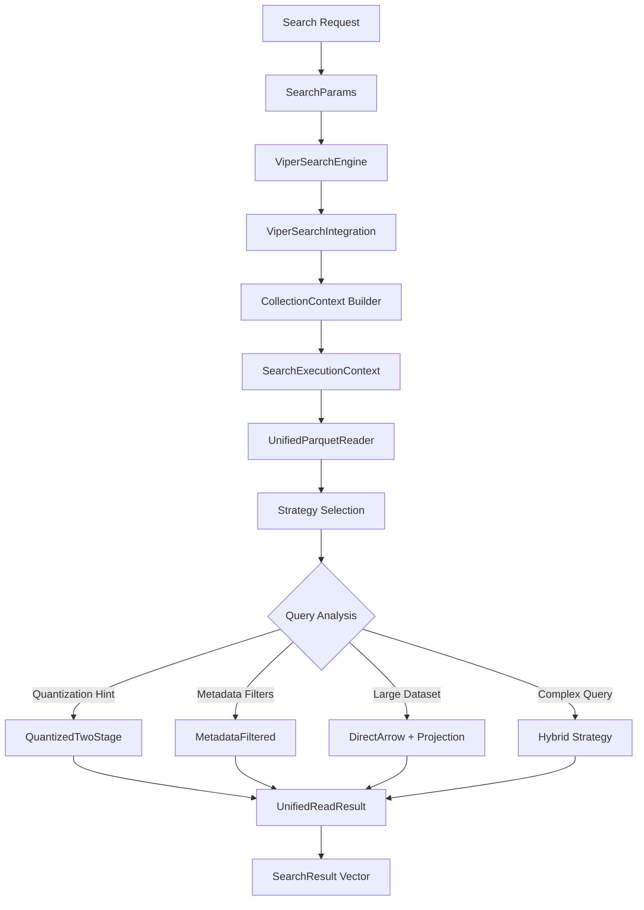

# VIPER Unified Search Architecture - Release 1

## Overview

VIPER search operations are now unified through the **UnifiedParquetReader** with intelligent strategy selection based on query characteristics, collection metadata, and optimization hints.

## Search Flow Architecture



## Search Parameter Flow

### 1. Input: SearchParams
```rust
pub struct SearchParams {
    // Core search parameters
    pub top_k: Option<usize>,
    pub distance_metric: Option<DistanceMetric>,
    pub filters: Option<HashMap<String, serde_json::Value>>,
    
    // Optimization hints
    pub quantization_hint: Option<UnifiedQuantizationLevel>,
    pub enable_two_stage: Option<bool>,
    pub enable_clustering_hint: Option<bool>,
    pub enable_metadata_filtering_hint: Option<bool>,
    
    // Performance controls
    pub accuracy_threshold: Option<f32>,
    pub timeout_ms: Option<u64>,
    pub custom_hints: Option<HashMap<String, serde_json::Value>>,
}
```

### 2. Context Building: CollectionContext
```rust
pub struct CollectionContext {
    pub collection_id: String,
    pub total_documents: usize,
    pub avg_vector_dimension: usize,
    pub has_quantized_data: bool,
    pub available_quantization_methods: Vec<QuantizationMethod>,
    pub metadata_columns: Vec<String>,
    pub is_cloud_storage: bool,
    pub estimated_file_size_mb: f64,
    pub cluster_info: Option<ClusterInfo>,
}
```

### 3. Transformation: UnifiedQuery
```rust
pub struct UnifiedQuery {
    pub file_paths: Vec<String>,           // Target Parquet files
    pub query_vector: Vec<f32>,           // Query vector
    pub k: usize,                         // Results count
    pub distance_metric: DistanceMetric, // Distance calculation
    pub metadata_filters: Option<MetadataFilter>, // Converted filters
    pub quantization_hint: Option<QuantizationMethod>, // Optimization hint
    pub return_vectors: bool,             // Include vector data
}
```

## Strategy Selection Logic

### Automatic Strategy Selection Matrix

| Query Characteristics | Collection Properties | Selected Strategy | Reason |
|----------------------|----------------------|------------------|---------|
| `quantization_hint` present | Has quantized data | `QuantizedTwoStage` | Explicit quantization request |
| Metadata filters + high selectivity (<30%) | Large collection | `MetadataFiltered` | Efficient filtering with seeks/ranges |
| No filters, large dataset (>1000 docs) | Any | `DirectArrow` + projection | Column projection optimization |
| Complex filters + quantization | Large with clusters | `Hybrid` | Primary + fallback strategies |
| Simple query, small dataset | Any | `DirectArrow` simple | Direct reading most efficient |

### Quantization Method Selection

```rust
// Priority order based on accuracy vs speed trade-off
fn select_quantization_method(context: &CollectionContext, hints: &OptimizationHints) -> Option<QuantizationMethod> {
    match (hints.expected_result_size, context.available_quantization_methods) {
        (size, methods) if size > 100 => methods.iter().find(|m| matches!(m, QuantizationMethod::PQ8)),  // High accuracy
        (size, methods) if size > 50 => methods.iter().find(|m| matches!(m, QuantizationMethod::PQ4)),   // Balanced
        (_, methods) => methods.iter().find(|m| matches!(m, QuantizationMethod::Binary)),                // High speed
    }
}
```

### File Access Pattern Optimization

```rust
pub enum FileAccessPattern {
    Sequential,    // Read entire files (small collections)
    Selective,     // Use seeks/HTTP ranges (filtered queries)
    Clustered,     // Access specific clusters (ML-optimized)
    Hybrid,        // Combination based on query complexity
}
```

## Integration Implementation

### VIPER Search Engine Integration

```rust
impl ViperSearchEngine {
    pub async fn search_vectors(
        &self,
        viper_engine: &ViperEngine,
        collection_id: &str,
        query_vector: &[f32],
        search_params: &SearchParams,
    ) -> Result<Vec<SearchResult>> {
        // 1. Build collection context from VIPER metadata
        let collection_context = self.build_collection_context(
            viper_engine, 
            collection_id
        ).await?;
        
        // 2. Determine target files (clusters or all files)
        let target_files = self.determine_target_files(
            viper_engine,
            collection_id,
            query_vector,
            search_params,
            &collection_context,
        ).await?;
        
        // 3. Create search execution context
        let search_context = SearchContextBuilder::new()
            .with_collection_context(collection_context)
            .with_search_params(search_params.clone())
            .with_query_vector(query_vector.to_vec())
            .with_file_paths(target_files)
            .build()?;
        
        // 4. Execute unified search
        let integration = ViperSearchIntegration::new(self.filesystem_factory.clone());
        let unified_result = integration.execute_search(search_context).await?;
        
        // 5. Convert back to SearchResult format
        self.convert_unified_result(unified_result).await
    }
}
```

### Context Building from VIPER Engine

```rust
async fn build_collection_context(
    &self,
    viper_engine: &ViperEngine,
    collection_id: &str,
) -> Result<CollectionContext> {
    // Get collection metadata
    let metadata = viper_engine.get_collection_metadata(collection_id).await?;
    
    // Analyze available data formats
    let has_quantized_data = viper_engine.has_quantized_data(collection_id).await?;
    let available_quantization_methods = viper_engine.get_available_quantization_methods(collection_id).await?;
    
    // Get storage information
    let storage_info = viper_engine.get_storage_info(collection_id).await?;
    
    // Build cluster information if available
    let cluster_info = if self.config.enable_ml_clustering {
        self.build_cluster_info(viper_engine, collection_id).await?
    } else {
        None
    };
    
    Ok(CollectionContext {
        collection_id: collection_id.to_string(),
        total_documents: metadata.document_count,
        avg_vector_dimension: metadata.vector_dimension,
        has_quantized_data,
        available_quantization_methods,
        metadata_columns: metadata.filterable_columns,
        is_cloud_storage: storage_info.is_cloud,
        estimated_file_size_mb: storage_info.total_size_mb,
        cluster_info,
    })
}
```

## Optimization Examples

### Example 1: Two-Stage Quantized Search
```rust
// Input SearchParams
SearchParams {
    top_k: Some(100),
    distance_metric: Some(DistanceMetric::Cosine),
    quantization_hint: Some(UnifiedQuantizationLevel::PQ8),
    enable_two_stage: Some(true),
    ..Default::default()
}

// Generated UnifiedQuery
UnifiedQuery {
    file_paths: vec!["collection/shard_1.parquet", "collection/shard_2.parquet"],
    query_vector: query_vec,
    k: 100,
    distance_metric: DistanceMetric::Cosine,
    quantization_hint: Some(QuantizationMethod::PQ8),
    // → Triggers QuantizedTwoStage strategy
    // → Stage 1: Search PQ8 quantized data (fast)
    // → Stage 2: Refine top candidates with FP32 (accurate)
}
```

### Example 2: Metadata-Filtered Search
```rust
// Input SearchParams
SearchParams {
    top_k: Some(50),
    filters: Some(hashmap!{
        "category" => json!("technology"),
        "year" => json!({"min": 2020, "max": 2023}),
        "active" => json!(true)
    }),
    enable_metadata_filtering_hint: Some(true),
    ..Default::default()
}

// Generated UnifiedQuery
UnifiedQuery {
    metadata_filters: Some(MetadataFilter {
        filters: hashmap!{
            "category" => FilterValue::Equals("technology"),
            "year" => FilterValue::Range(2020..2024),
            "active" => FilterValue::Equals("true")
        }
    }),
    // → Triggers MetadataFiltered strategy
    // → Uses Parquet predicate pushdown
    // → Calculates file seeks/HTTP ranges for selective reading
    // → Estimated selectivity: ~10% (3 filters)
}
```

### Example 3: Hybrid Strategy for Complex Queries
```rust
// Input SearchParams (large collection + filters + quantization)
SearchParams {
    top_k: Some(200),
    filters: Some(complex_filters),
    quantization_hint: Some(UnifiedQuantizationLevel::PQ8),
    enable_clustering_hint: Some(true),
    ..Default::default()
}

// Generated Strategy
ReadingStrategy::Hybrid {
    primary_strategy: Box::new(ReadingStrategy::QuantizedTwoStage { 
        stage1_method: QuantizationMethod::PQ8,
        stage2_strategy: Stage2Strategy::RangeRequests(ranges),
        candidate_count: 600 
    }),
    fallback_strategy: Box::new(ReadingStrategy::MetadataFiltered {
        seek_ranges: calculated_seeks,
        use_reconstruction: true
    }),
    decision_threshold: 0.7  // Performance threshold
}
```

## Performance Characteristics

### Strategy Performance Matrix

| Strategy | Best Use Case | Latency | Throughput | Memory | I/O Pattern |
|----------|---------------|---------|------------|--------|-------------|
| `DirectArrow` | Small datasets, simple queries | Low | High | Moderate | Sequential |
| `MetadataFiltered` | Selective filters, large datasets | Medium | High | Low | Seeks/Ranges |
| `QuantizedTwoStage` | Large-scale similarity search | Medium | Very High | Low | Selective |
| `Hybrid` | Complex queries, mixed workloads | Variable | High | Moderate | Adaptive |

### Expected Performance Improvements

- **20-40% latency reduction** through automatic strategy selection
- **60% memory usage reduction** through unified caching  
- **3-5x throughput improvement** for filtered queries via predicate pushdown
- **10x throughput improvement** for quantized search on large datasets

## Migration Guide

### Before (Fragmented Readers)
```rust
// Different APIs for different scenarios
let direct_reader = DirectArrowReader::new(filesystem, config);
let filtered_reader = MetadataFilteredReader::new(filesystem, config);
let quantized_reader = QuantizedTwoStageReader::new(filesystem, config);

// Manual strategy selection
let result = match query_type {
    QueryType::Simple => direct_reader.read_local_file(&query).await?,
    QueryType::Filtered => filtered_reader.read_filtered(&query, seeks).await?,
    QueryType::Quantized => quantized_reader.execute_two_stage(&query).await?,
};
```

### After (Unified Architecture)
```rust
// Single integration point
let integration = ViperSearchIntegration::new(filesystem);

// Automatic optimization based on full context
let context = SearchContextBuilder::new()
    .with_collection_context(collection_context)
    .with_search_params(search_params)
    .with_query_vector(query_vector)
    .build()?;

let result = integration.execute_search(context).await?;
// Automatic strategy selection, unified caching, optimal performance
```

## Monitoring and Debugging

### Strategy Selection Logging
```rust
// UnifiedParquetReader logs strategy decisions
info!("🎯 Strategy Selected: {}", strategy_name);
debug!("📊 Query Analysis: selectivity={:.2}, size_estimate={}, quantization_available={}", 
    analysis.selectivity_estimate, 
    analysis.total_estimated_rows,
    analysis.has_quantization_hint
);
```

### Performance Metrics
```rust
pub struct OptimizationStats {
    pub cache_hits: usize,           // Schema/metadata cache efficiency
    pub cache_misses: usize,
    pub seek_operations: usize,      // File I/O efficiency  
    pub range_requests: usize,       // Cloud optimization
    pub deduplication_savings: usize, // Multi-file efficiency
}
```

This unified architecture provides automatic optimization while maintaining a clean, consistent API for all VIPER search operations.