= ProximaDB API Reference
:toc: left
:toclevels: 2

**REST and gRPC API documentation.**


_API layer architecture showing REST, gRPC, and SQL interfaces_

== REST API

**Base URL**: `http://localhost:5678`
**Content-Type**: `application/json`

=== Health
```
GET /health
```
Response:
```json
{"status": "healthy", "version": "1.0.0"}
```

=== Collections

==== Create Collection
```
POST /api/v1/collection
```
```json
{
  "operation": "create",
  "config": {
    "name": "vectors",
    "dimension": 384,
    "distance_metric": "cosine",
    "storage_engine": "viper"
  }
}
```

With compression:
```json
{
  "operation": "create",
  "config": {
    "name": "vectors",
    "dimension": 1536,
    "storage_engine": "viper",
    "compression": {
      "algorithm": "zstd",
      "level": 6,
      "enable_quantization": true,
      "quantization_type": "int8"
    }
  }
}
```

==== Get Collection
```
POST /api/v1/collection
```
```json
{
  "operation": "get",
  "collection_id": "collection_name"
}
```

==== List Collections
```
GET /api/v1/collections
```

==== Delete Collection
```
DELETE /api/v1/collection/{name}
```

=== Vectors

==== Insert Vectors
```
POST /api/v1/vector/batch
```
```json
{
  "collection_id": "vectors",
  "vectors": [
    {
      "id": "vec1",
      "vector": [0.1, 0.2, ...],
      "metadata": {"key": "value"}
    }
  ]
}
```

==== Search Vectors
```
POST /api/v1/vector/search
```
```json
{
  "collection_id": "vectors",
  "queries": [{
    "vector": [0.1, 0.2, ...],
    "metadata_filter": {
      "conditions": [{
        "field_name": "category",
        "operation": "equals",
        "value": "A"
      }]
    }
  }],
  "top_k": 10
}
```

==== Get Vector
```
GET /api/v1/vector/{collection_id}/{vector_id}
```

==== Delete Vector
```
DELETE /api/v1/vector/{collection_id}/{vector_id}
```

== gRPC API

**Endpoint**: `localhost:5679`
**Protocol**: Protocol Buffers

=== Service Definition
```proto
service ProximaDB {
  rpc CreateCollection(CreateCollectionRequest) returns (Collection);
  rpc GetCollection(GetCollectionRequest) returns (Collection);
  rpc DeleteCollection(DeleteCollectionRequest) returns (Empty);
  rpc InsertVectors(VectorBatchRequest) returns (VectorBatchResponse);
  rpc SearchVectors(VectorSearchRequest) returns (VectorSearchResponse);
  rpc GetVector(GetVectorRequest) returns (VectorRecord);
  rpc DeleteVector(DeleteVectorRequest) returns (Empty);
}
```

=== Python gRPC Client
```python
import grpc
from proximadb import proximadb_pb2, proximadb_pb2_grpc

# Connect
channel = grpc.insecure_channel('localhost:5679')
stub = proximadb_pb2_grpc.ProximaDBStub(channel)

# Create collection
request = proximadb_pb2.CreateCollectionRequest(
    name="vectors",
    dimension=384,
    engine=proximadb_pb2.VIPER
)
response = stub.CreateCollection(request)
```

== Error Handling

=== Error Response Format
```json
{
  "success": false,
  "error_message": "Collection not found",
  "error_code": "NOT_FOUND"
}
```

=== Status Codes
* **200**: Success
* **400**: Bad Request
* **404**: Not Found
* **429**: Rate Limited
* **500**: Server Error

== Compression Options

=== Algorithms
* **zstd**: Balanced (3-5x compression)
* **lz4**: Fast (2-3x compression)
* **snappy**: Low latency (2x compression)

=== Quantization (VIPER only)
* **int8**: 4:1 compression
* **pq8**: 8-32:1 compression
* **pq4**: 16-64:1 compression

== Distance Metrics

* **cosine**: Semantic similarity
* **euclidean**: L2 distance
* **dot_product**: Inner product
* **manhattan**: L1 distance
* **hamming**: Bit differences
* Plus 8 more specialized metrics

== Rate Limits

* **Inserts**: 10,000 vectors/second
* **Searches**: 1,000 queries/second
* **Collections**: 100 operations/minute

== Examples

=== cURL
```bash
# Create collection
curl -X POST http://localhost:5678/api/v1/collection \
  -H "Content-Type: application/json" \
  -d '{"operation": "create", "config": {"name": "test", "dimension": 128}}'

# Insert vectors
curl -X POST http://localhost:5678/api/v1/vector/batch \
  -H "Content-Type: application/json" \
  -d '{"collection_id": "test", "vectors": [{"id": "1", "vector": [...]}]}'

# Search
curl -X POST http://localhost:5678/api/v1/vector/search \
  -H "Content-Type: application/json" \
  -d '{"collection_id": "test", "queries": [{"vector": [...]}], "top_k": 10}'
```

=== Python
```python
from proximadb import ProximaDBClient

client = ProximaDBClient("http://localhost:5678")
client.create_collection("test", dimension=128)
client.insert_vectors("test", vectors)
results = client.search("test", query_vector, top_k=10)
```

---
**Next**: link:user_guide.adoc[User Guide] | link:../developer/architecture.adoc[Architecture]