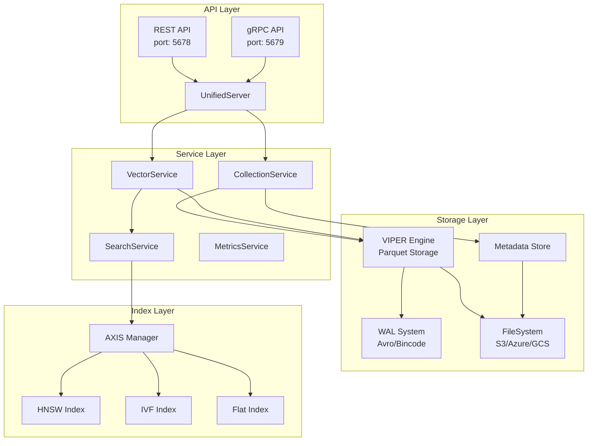
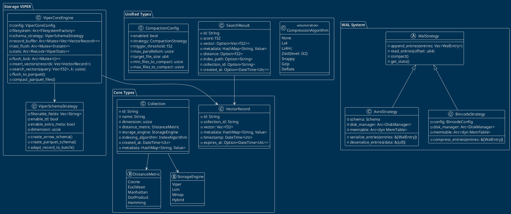
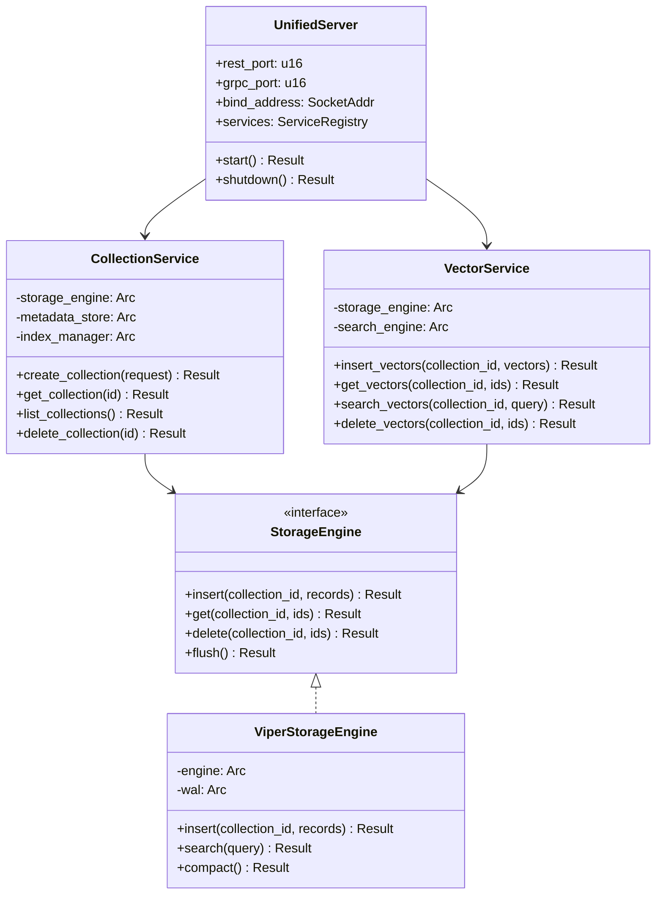
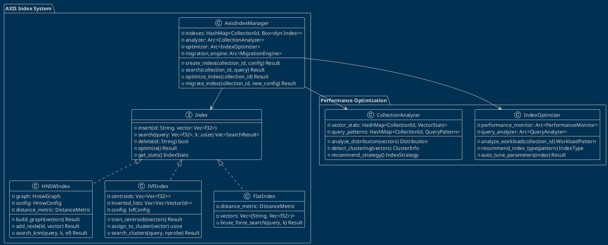
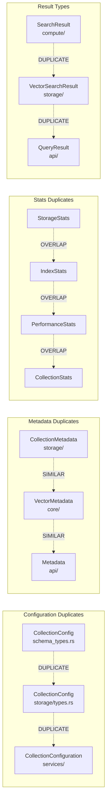
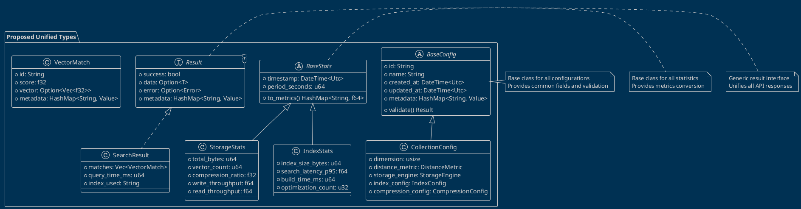

# ProximaDB Architecture UML Diagrams

## 1. High-Level Package Diagram (Mermaid)

## 2. Core Classes Diagram (PlantUML)

## 3. Service Architecture (Mermaid)

## 4. Index Architecture (PlantUML)

## 5. Identified Duplications (Mermaid)

## 6. Consolidation Proposal (PlantUML)

